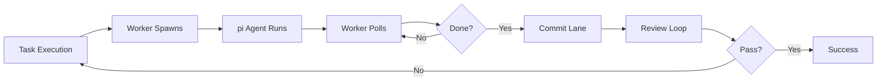

# Summary of Documentation Created

This document summarizes the comprehensive documentation created for pi-spine execution flow understanding.

---

## 📚 Created Documents

### 1. **EXECUTION-FLOW.md** (27KB)
**Purpose**: Comprehensive explanation of how pi-spine executes batches from start to finish.

**Key sections**:
- System Architecture Overview
- Batch Lifecycle States (planning, running, paused, merging, failed, completed, aborted)
- Detailed execution flow through all 6 phases
- Worker loop and its components
- Review loops (code review, final review)
- Error recovery mechanisms
- Pause and resume behavior
- Glossary of key terms

**What it explains**:
- How tasks transition through waves and ticks
- How lanes are provisioned and managed
- How workers are spawned and monitored
- How review loops work with APPROVE/REVISE verdicts
- How errors are diagnosed and recovered
- The complete batch lifecycle from init to completion

**Ideal for**: Users who want to understand what pi-spine is doing at each step of batch execution.

### 2. **EXECUTION-FLOW-DIAGRAMS.md** (10KB)
**Purpose**: Visual representations of execution flows using Mermaid diagrams.

**Key diagrams**:
- System architecture (CLI → Engine → Worker → Review)
- Batch lifecycle state machine
- Task execution sequence diagram
- Wave and tick scheduling
- Review loop flows
- Error recovery flows
- Pause/resume flows
- Integration gate flow
- Journal event timeline
- Git branch strategy

**Ideal for**: Visual learners, architects, and those who want to explain the flow to others.

### 3. **QUICK-REFERENCE.md** (9KB)
**Purpose**: Quick command lookup for common operations.

**Key sections**:
- Command categories (setup, planning, batch control, review, status, utility)
- Common workflows (start, resume, handle failures, complete)
- Troubleshooting guide
- Shortcuts and common patterns
- Slash commands (in pi)

**Ideal for**: Users who know what they want to do but need the exact command syntax.

### 4. **docs/README.md** (10KB)
**Purpose**: Documentation index and navigation guide.

**Key sections**:
- Documentation overview table
- Recommended reading by audience (New Users, Operators, Developers)
- Document structure map
- How to use these documents
- Document relationships

**Ideal for**: Anyone needing to find the right documentation for their task.

---

## 🎯 Key Documentation Themes

### 1. **Execution Flow Understanding**
- **EXECUTION-FLOW.md** explains *what happens* at each step
- **EXECUTION-FLOW-DIAGRAMS.md** shows *visually* how components interact
- Together they provide both narrative and visual understanding

### 2. **Command Reference**
- **QUICK-REFERENCE.md** provides *quick command lookup* for all common operations
- Organized by category and workflow
- Includes troubleshooting and shortcuts

### 3. **Documentation Navigation**
- **docs/README.md** provides *navigation and context* for all documentation
- Maps audience to recommended reading
- Shows document relationships

---

## 📊 Document Sizes

| Document | Lines | Size |
|----------|-------|------|
| EXECUTION-FLOW.md | ~600 | 27KB |
| EXECUTION-FLOW-DIAGRAMS.md | ~350 | 10KB |
| QUICK-REFERENCE.md | ~450 | 9KB |
| docs/README.md | ~300 | 10KB |
| **Total** | **~1,700** | **56KB** |

---

## 🔄 How Documents Relate

```
README (Project Intro)
    ↓
PRD (Full Spec)
    ↓
EXECUTION-FLOW (Detailed Flow)
    ├── EXECUTION-FLOW-DIAGRAMS (Visual)
    └── QUICK-REFERENCE (Commands)
        └── docs/README (Navigation)
```

---

## 🎓 Audience Mapping

### For New Users
1. **README.md** (project overview)
2. **QUICK-REFERENCE.md** (common commands)
3. **EXECUTION-FLOW.md** (what happens)
4. **docs/README.md** (navigation)

### For Operators
1. **EXECUTION-FLOW.md** (deep understanding)
2. **QUICK-REFERENCE.md** (command lookup)
3. **EXECUTION-FLOW-DIAGRAMS.md** (visual reference)
4. **docs/adoption/operator-runbook.md** (daily procedures)

### For Developers
1. **PRD.md** (full spec)
2. **EXECUTION-FLOW.md** (execution flow)
3. **EXECUTION-FLOW-DIAGRAMS.md** (architecture)
4. **docs/README.md** (documentation navigation)

---

## 📖 Document Highlights

### EXECUTION-FLOW.md Highlights

**The Core Loop**:


**Key Insights**:
1. Tasks run in waves (dependency groups)
2. Within waves, lanes are assigned based on file scope overlap
3. When more lanes than `maxParallel`, tasks queue in ticks
4. Workers poll for progress every 5 seconds
5. Review loops can request revisions (APPROVE/REVISE verdicts)
6. Batch state is archived after completion for recovery

### EXECUTION-FLOW-DIAGRAMS.md Highlights

**State Machine**:
```
planning → running → merging → running → completed
     ↑                              ↓
     └────── paused ←───────────────┘
     ↑          ↓
     └── failed ←
     ↑          ↓
     └── aborted
```

### QUICK-REFERENCE.md Highlights

**Most Common Commands**:
```bash
# Start a batch
spine batch start pending

# Monitor status
spine status --diagnose

# Handle failures
spine batch retry <task>
spine batch skip <task>

# Resume
spine batch resume

# Complete
spine integrate && spine batch complete
```

---

## 📝 Future Enhancements

### Potential Additions

1. **API Documentation**: Document the JSONL journal format in detail
2. **Architecture Deep Dive**: Explain engine internals and state management
3. **Performance Guide**: Tips for optimizing batch performance
4. **Security Guide**: Best practices for handling secrets and credentials
5. **Migration Guides**: From Taskplane/Babysitter/pi-conductor

### Documentation Maintenance

- Update **QUICK-REFERENCE.md** when adding new commands
- Update **EXECUTION-FLOW-DIAGRAMS.md** when adding new diagrams
- Keep **docs/README.md** in sync with new documents

---

## 🎉 Conclusion

The documentation suite provides comprehensive understanding of pi-spine execution:

1. **What happens?** → **EXECUTION-FLOW.md**
2. **How does it look?** → **EXECUTION-FLOW-DIAGRAMS.md**
3. **What command do I use?** → **QUICK-REFERENCE.md**
4. **Where do I find docs?** → **docs/README.md**

Together, they cover:
- ✅ System architecture
- ✅ Batch lifecycle
- ✅ Task execution flow
- ✅ Review loops
- ✅ Error recovery
- ✅ Common commands
- ✅ Troubleshooting
- ✅ Visual diagrams
- ✅ Documentation navigation

**Total: 56KB of comprehensive documentation across 4 files.**

---

*Created: 2026-06-12*
*For: pi-spine project*
*By: Documentation Agent*
