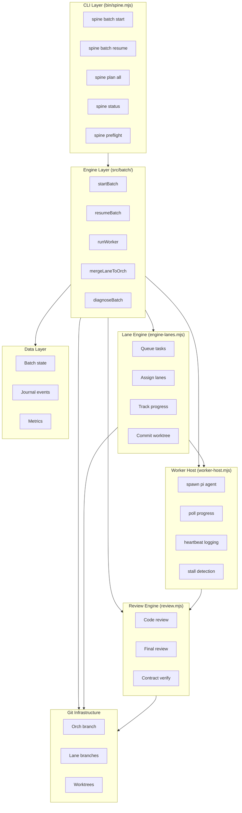
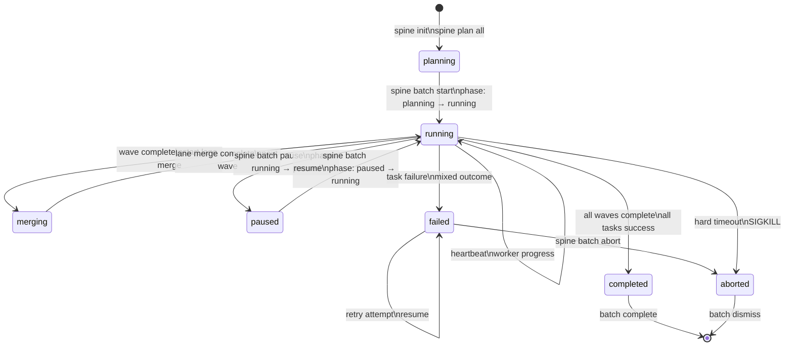
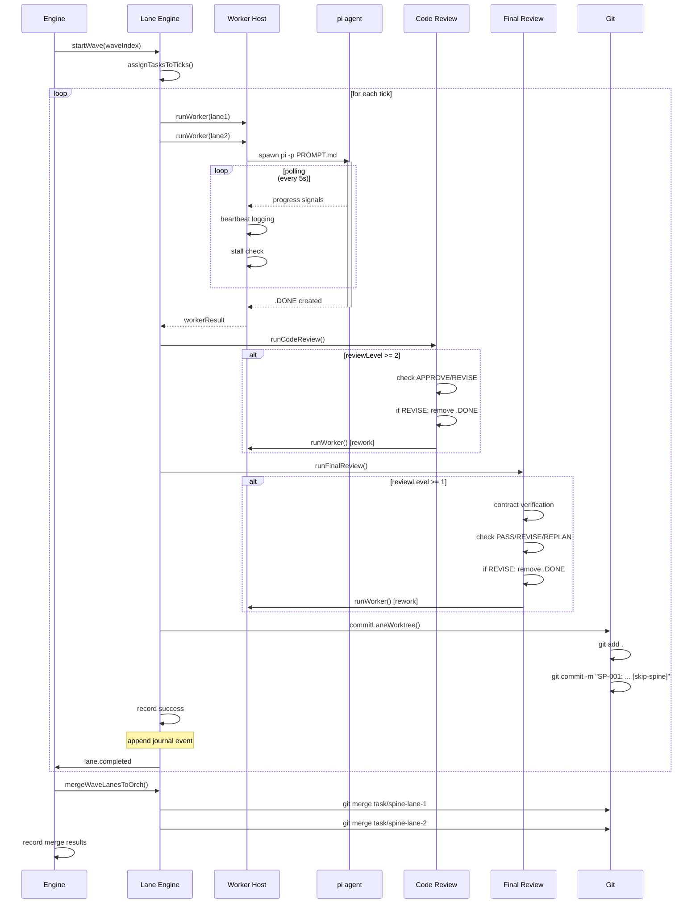
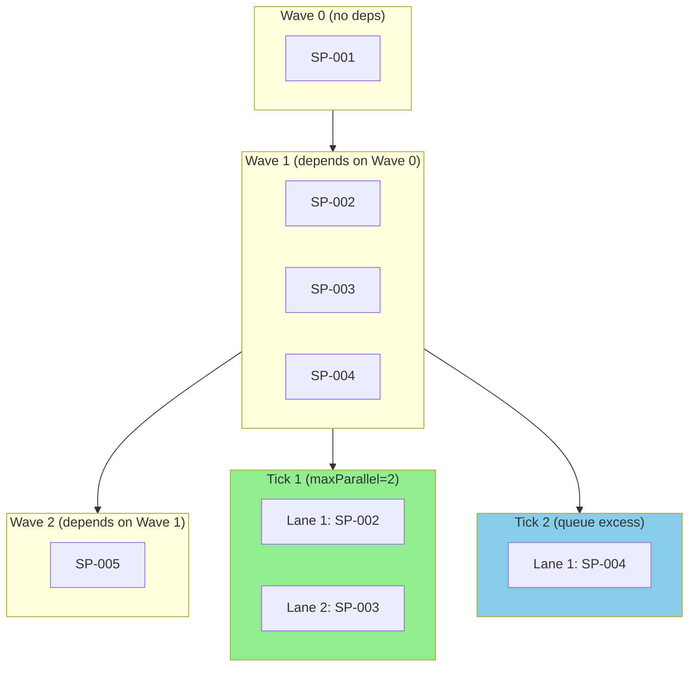
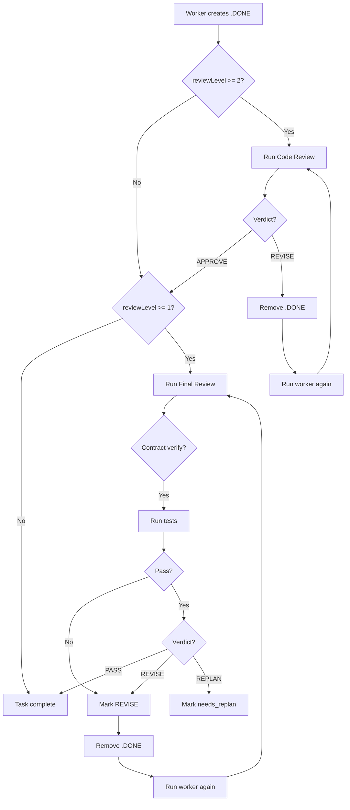
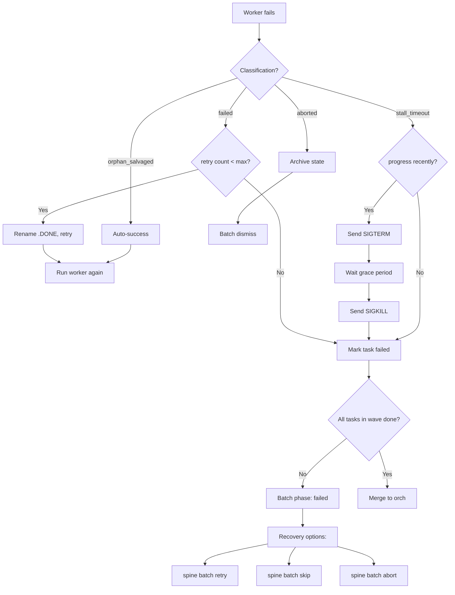
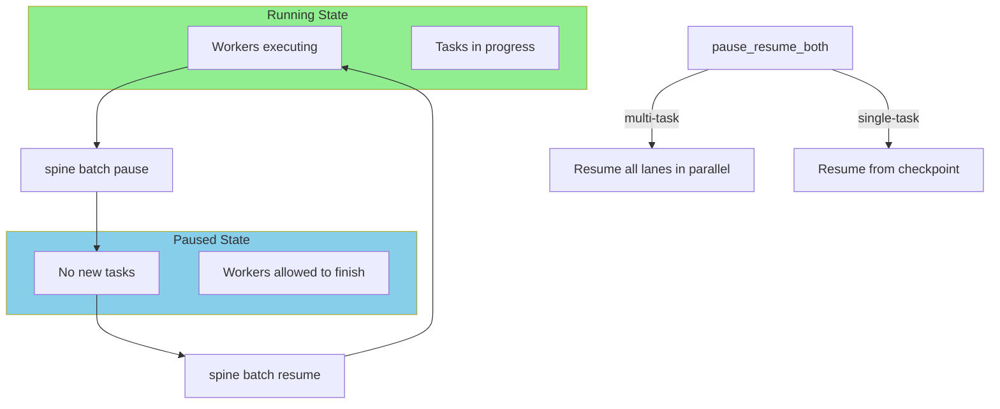
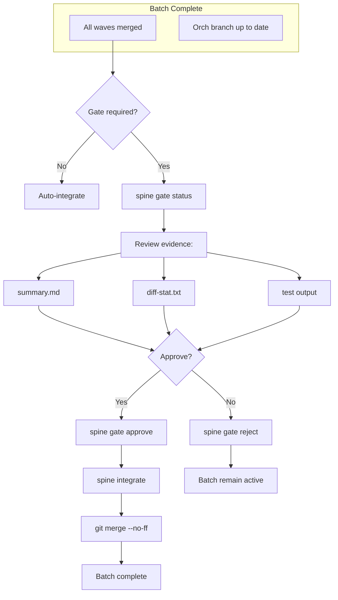
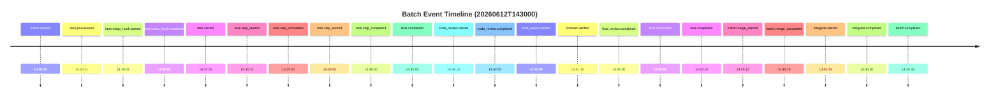
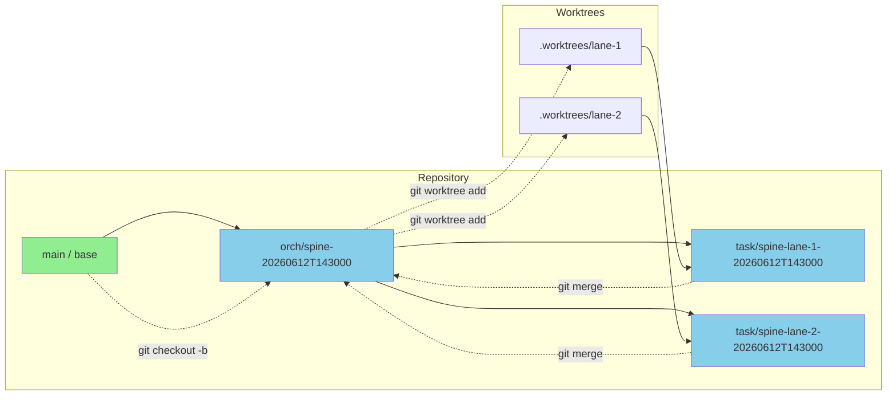

# pi-spine Execution Flow Diagrams

This document contains visual diagrams that complement `EXECUTION-FLOW.md`.

---

## 1. System Architecture

---

## 2. Batch Lifecycle State Machine

---

## 3. Task Execution Sequence

---

## 4. Wave and Tick Scheduling

---

## 5. Review Loop Flow

---

## 6. Error Recovery Flow

---

## 7. Pause and Resume Flow

---

## 8. Integration Gate Flow

---

## 9. Journal Event Timeline

---

## 10. Git Branch Strategy

---

*These diagrams visualize the execution flow documented in `EXECUTION-FLOW.md`.*
