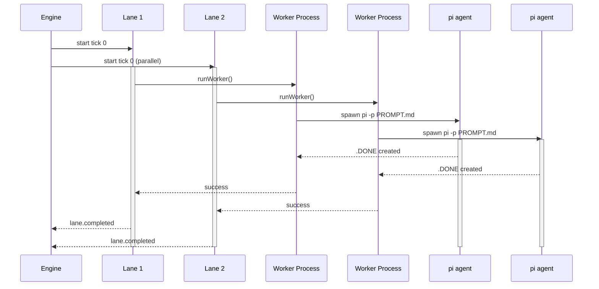
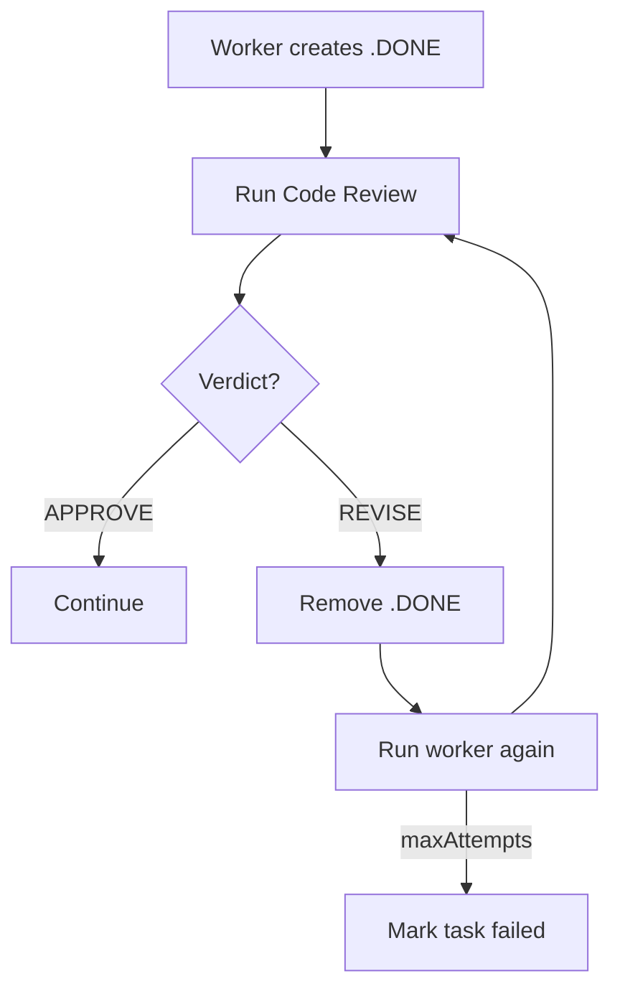
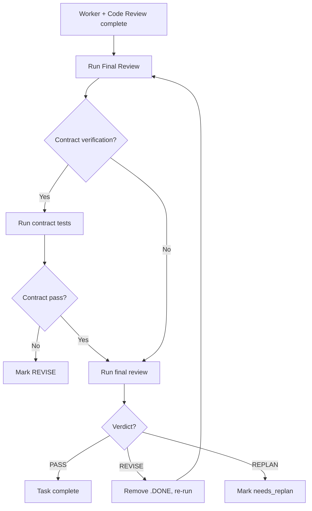

# pi-spine Execution Flow Documentation

This document provides a comprehensive explanation of how pi-spine executes batches, from initial command to final completion or failure. It's designed to help users understand what's happening under the hood at each stage of the orchestration process.

---

## Table of Contents

1. [Overview](#overview)
2. [System Architecture](#system-architecture)
3. [Batch Lifecycle States](#batch-lifecycle-states)
4. [Detailed Execution Flow](#detailed-execution-flow)
   - [Phase 0: Initialization](#phase-0-initialization)
   - [Phase 1: Planning](#phase-1-planning)
   - [Phase 2: Batch Start](#phase-2-batch-start)
   - [Phase 3: Task Execution](#phase-3-task-execution)
   - [Phase 4: Lane Merge](#phase-4-lane-merge)
   - [Phase 5: Integration](#phase-5-integration)
   - [Phase 6: Completion](#phase-6-completion)
5. [The Worker Loop](#the-worker-loop)
6. [Review Loops](#review-loops)
7. [Error Recovery](#error-recovery)
8. [Pause and Resume](#pause-and-resume)
9. [Glossary](#glossary)

---

## Overview

pi-spine is an orchestration system for running long-running, multi-task development batches using the pi coding agent. It composes patterns from Taskplane, Babysitter, and pi-conductor to provide:

- **Taskplane-style task packets** with `PROMPT.md`/`STATUS.md`
- **Babysitter-grade audit history** via an append-only journal
- **pi-conductor-style human gates** before integration

The core philosophy: **"A batch interpreter that always answers: what state am I in, and what single command should I run next?"**

### Key Concepts

| Concept | Description |
|---------|-------------|
| **Batch** | A collection of tasks executed across multiple waves |
| **Wave** | A group of tasks with no internal dependencies; all tasks in a wave can run in parallel |
| **Lane** | A worktree isolated environment where tasks execute (one git branch per lane) |
| **Tick** | A scheduling unit within a wave; when more lanes exist than `maxParallel`, they're distributed across ticks |
| **Orch branch** | Integration branch where all lane work converges (`orch/spine-{batchId}`) |
| **Journal** | Append-only event log for auditability and recovery |
| **`.DONE` file** | Marker indicating a task has successfully completed |

### Scheduling model (waves, lanes, ticks)

A **wave** is a dependency group — tasks in wave *N* start only after wave *N−1* merges. Within a wave, the planner assigns **virtual lanes** from file-scope overlap: disjoint scopes get separate lanes (parallel up to `lanes.maxParallel`); overlapping scopes share one lane (serialized on one worktree). A **tick** queues virtual lanes when there are more lanes than `maxParallel` (tick 0 runs lanes 0…`maxParallel−1`, tick 1 runs the rest, and so on). The batch engine runs **one worker at a time per physical lane/worktree** and parallelizes only across distinct lane numbers in the same tick. The dashboard **Lanes** table shows **Active tasks** (running/pending in the current wave on that lane) separately from **Batch assignment** (all tasks ever bound to the lane).

---

## System Architecture

```
┌─────────────────────────────────────────────────────────────────────────────┐
│                                CLI Layer                                    │
│  bin/spine.mjs → handleBatch(), handlePlan(), handleStatus(), etc.         │
└─────────────────────────────────────────────────────────────────────────────┘
                                        │
                                        ▼
┌─────────────────────────────────────────────────────────────────────────────┐
│                              Engine Layer                                   │
│  src/batch/engine.mjs (main orchestrator)                                   │
│  ├─ startBatch()      # Start new batch                                     │
│  ├─ resumeBatch()     # Resume paused/failed batch                          │
│  ├─ pauseBatch()      # Pause execution                                     │
│  └─ diagnoseBatch()   # Reconcile state and suggest next command             │
└─────────────────────────────────────────────────────────────────────────────┘
                                        │
        ┌───────────────────────────────┼───────────────────────────────┐
        ▼                               ▼                               ▼
┌───────────────────┐       ┌───────────────────┐       ┌───────────────────┐
│   Worker Host     │       │    Lane Engine    │       │   Review Engine   │
│ worker-host.mjs   │       │ engine-lanes.mjs  │       │  engine-lanes/    │
│                   │       │                 │       │   review.mjs      │
│ Spawns pi agent   │       │ Manages lanes   │       │   Code/final      │
│ via spawn()       │       │ Tracks progress │       │   reviews         │
└───────────────────┘       └───────────────────┘       └───────────────────┘
```

---

## Batch Lifecycle States

pi-spine batches transition through these phases:

| Phase | Description | Notes |
|-------|-------------|-------|
| `planning` | Batch state is being initialized | Tasks and lanes are being set up |
| `running` | Tasks are actively executing | Worker processes are running |
| `paused` | Batch execution is suspended | Can be resumed with `spine batch resume` |
| `merging` | Lane merges to orch branch are in progress | Between waves |
| `failed` | Batch encountered an error | May have partial success |
| `completed` | All waves completed successfully | Ready for integrate and archive |
| `aborted` | Batch was manually aborted | Graceful or hard (SIGKILL) |

---

## Detailed Execution Flow

### Phase 0: Initialization

**Commands**: `spine init`, `spine doctor`

**Purpose**: Set up project configuration and validate environment

#### What happens:

1. **`spine init` creates:**
   - `.spine/` directory (gitignored)
   - `.spine/spine-config.json` with default configuration
   - Agent stubs in `.spine/agents/` (worker, reviewer)
   - `.spine/rules-manifest.json` for Cursor rule discovery

2. **`spine doctor` validates:**
   - Node.js ≥ 22.0.0
   - Git is available
   - pi agent is on PATH
   - Configuration files are valid
   - `.spine/` directory structure exists

3. **Configuration structure:**
   ```json
   {
     "project": { "name": "project" },
     "paths": { "tasksRoot": "spine-tasks" },
     "baseBranch": "main",
     "lanes": {
       "maxParallel": 4,
       "queueExcess": true,
       "stallTimeoutMinutes": 60,
       "heartbeatIntervalMinutes": 10
     },
     "review": {
       "requireFinalVerdict": true,
       "maxFinalAttempts": 3
     },
     "contract": { "mode": "strict" }
   }
   ```

---

### Phase 1: Planning

**Commands**: `spine preflight`, `spine plan all`, `spine deps`

**Purpose**: Discover tasks, build dependency graph, and assign to lanes

#### What happens:

1. **Task Discovery**
   ```bash
   spine tasks discover spine-tasks/
   ```
   - Scans `tasksRoot` for directories matching `SP-*` or `TP-*` patterns
   - Validates each task has `PROMPT.md` and `STATUS.md`
   - Reports validation errors

2. **Dependency Graph Building**
   ```mermaid
   graph TD
       A[SP-001] --> B[SP-002]
       A --> C[SP-003]
       B --> D[SP-004]
       C --> D
   ```
   - Loads `dependencies.json` from tasks root
   - Merges explicit dependencies with `PROMPT.md` dependencies
   - Builds a directed acyclic graph (DAG)

3. **Topological Wave Formation**
   - Tasks with no dependencies → Wave 0
   - Tasks depending only on Wave 0 tasks → Wave 1
   - Tasks depending on Wave 1 tasks → Wave 2
   - And so on...

4. **Lane Assignment** (FR-SCHED-03/04)
   - Within each wave, tasks are assigned to virtual lanes
   - Tasks with overlapping file scopes share lanes (serialized)
   - Tasks with disjoint file scopes get separate lanes (parallel)
   - When virtual lanes > `maxParallel`, excess tasks are queued in ticks

5. **Plan Artifact**
   ```json
   {
     "waves": [
       {
         "index": 0,
         "taskIds": ["SP-001"],
         "virtualLaneCount": 1,
         "ticks": [
           {
             "index": 0,
             "lanes": [["SP-001"]]
           }
         ]
       },
       {
         "index": 1,
         "taskIds": ["SP-002", "SP-003"],
         "virtualLaneCount": 2,
         "ticks": [
           {
             "index": 0,
             "lanes": [["SP-002"], ["SP-003"]]
           }
         ]
       }
     ]
   }
   ```

---

### Phase 2: Batch Start

**Command**: `spine batch start TP-012` or `spine batch start pending`

**Purpose**: Initialize batch state and provision worktrees

#### What happens:

1. **Preflight Checks** (`spine preflight`)
   - Doctor check passes
   - No active batch exists
   - Git working tree is clean
   - Tasks root exists and is valid
   - Dependencies parse correctly
   - Wave plan is valid

2. **Batch State Creation**
   ```json
   {
     "schemaVersion": 1,
     "batchId": "20260612T143000",
     "baseBranch": "main",
     "orchBranch": "orch/spine-20260612T143000",
     "phase": "planning",
     "wavePlan": [["SP-001"], ["SP-002", "SP-003"]],
     "tasks": [
       { "taskId": "SP-001", "laneNumber": 1, "status": "pending" },
       { "taskId": "SP-002", "laneNumber": 1, "status": "pending" },
       { "taskId": "SP-003", "laneNumber": 2, "status": "pending" }
     ],
     "lanes": [
       { "laneNumber": 1, "laneId": "lane-1", "worktreePath": "...", "branch": "task/spine-lane-1-..." },
       { "laneNumber": 2, "laneId": "lane-2", "worktreePath": "...", "branch": "task/spine-lane-2-..." }
     ],
     "segments": [],
     "mergeResults": [],
     "currentWaveIndex": -1
   }
   ```

3. **Orch Branch Provisioning**
   ```bash
   git checkout main
   git checkout -b orch/spine-20260612T143000
   git push origin orch/spine-20260612T143000
   ```

4. **Lane Worktree Creation**
   ```bash
   # For each lane:
   git worktree add .worktrees/spine-20260612T143000/lane-1 task/spine-lane-1-20260612T143000
   git worktree add .worktrees/spine-20260612T143000/lane-2 task/spine-lane-2-20260612T143000
   ```

5. **Batch State Transition**
   - Phase: `planning` → `running`
   - Journal event: `batch.started`
   - Engine PID recorded

---

### Phase 3: Task Execution

**Purpose**: Run tasks on lanes according to wave/tick plan

#### Execution Flow (per wave):



#### Detailed Worker Process:

1. **Worker Host Launch** (`worker-host.mjs`):
   - Sets up environment variables:
     ```bash
     SPINE_TASK_FOLDER=/path/to/task
     SPINE_WORKTREE=/path/to/worktree
     SPINE_WORKER_RUNNER=/path/to/spine-worker-runner.mjs
     SPINE_BATCH_ID=20260612T143000
     SPINE_LANE_NUMBER=1
     SPINE_TASK_ID=SP-001
     ```
   - Spawns worker process:
     ```bash
     node spine-worker-runner.mjs --pi
     ```

2. **Worker Runner** (`spine-worker-runner.mjs`):
   - Detects if task is already done (`.DONE` exists)
   - Builds worker prompt with rules, file scope, and context
   - Calls `pi -p PROMPT.md` to run the agent
   - Polls for progress and `.DONE` file
   - Handles abort signals

3. **Heartbeat and Stall Detection** (`heartbeat.mjs`):
   - Polls every 10 minutes (configurable)
   - Checks for:
     - File changes in worktree
     - Git commits on lane branch
     - `.DONE` file creation
   - Logs `lane.heartbeat` to journal
   - Sends SIGTERM after `stallTimeoutMinutes` (default 60)
   - Sends SIGKILL after grace period if still running

4. **Step Progress Reporting**:
   Workers can emit step progress:
   ```bash
   spine report progress --step 1
   ```
   This writes to journal: `task.step_started` / `task.step_completed`

---

### Phase 4: Lane Merge

**Purpose**: Merge completed lane branches into orch branch

#### Merge Process:

1. **Assess Merge Eligibility**
   - All tasks in wave must succeed or be skipped
   - No failed or pending tasks allowed
   - If any task fails, batch phase → `failed`

2. **Execute Lane Merge**
   ```bash
   cd .worktrees/spine-20260612T143000/lane-1
   git checkout orch/spine-20260612T143000
   git merge task/spine-lane-1-20260612T143000
   ```

3. **Auto-Commit Lane Worktree**
   ```bash
   # After worker succeeds and .DONE is created:
   git add .
   git commit -m "SP-001:完成任务 [skip-spine]"
   ```

4. **Record Merge Result**
   ```json
   {
     "waveIndex": 0,
     "status": "succeeded",
     "mergeCommit": "abc123..."
   }
   ```

5. **Optional Auto-Integrate**
   - If `contract.autoIntegrateAfterWave` is configured
   - Or if it's the final wave
   - Then merge orch branch to base branch

---

### Phase 5: Integration

**Purpose**: Merge orch branch into base branch (main)

**Commands**: `spine integrate`, `spine gate approve`

#### Integration Flow:

1. **Gate Inspection** (`spine gate status`)
   ```bash
   ls -la .spine/runtime/20260612T143000/evidence/
   ```
   Evidence includes:
   - `summary.md` - Post-mortem summary
   - `diff-stat.txt` - File change statistics
   - Optional test/build output

2. **Gate Approval** (if required)
   - User reviews evidence
   - Runs `spine gate approve`
   - Or rejects with `spine gate reject --reason "..."`

3. **Integrate**
   ```bash
   git checkout main
   git merge --no-ff orch/spine-20260612T143000
   ```

4. **Batch Completion**
   - Phase: `running` → `completed`
   - Journal: `batch.completed`
   - State: archived to `.spine/runtime/{batchId}/archive/`

---

### Phase 6: Completion

**Commands**: `spine batch complete`, `spine batch dismiss`

#### Completion Options:

1. **Normal Completion** (`spine batch complete`)
   - Validates orch branch is merged to main
   - Archives batch state
   - Writes post-mortem summary
   - Batch moved to `.spine/batch-history.json`

2. **Dismiss** (`spine batch dismiss --reason "..."`)
   - For limbo/stale batches
   - Archives state
   - Clears active batch record
   - Useful when work is on main but batch state is inconsistent

---

## The Worker Loop

The worker loop is the core execution engine for each task:

```
┌─────────────────────────────────────────────────────────────┐
│                     Worker Loop                              │
└─────────────────────────────────────────────────────────────┘
                              │
                              ▼
┌─────────────────────────────────────────────────────────────┐
│ 1. Check .DONE exists? ──yes──→ return success               │
└─────────────────────────────────────────────────────────────┘
                              │
                              ▼ no
┌─────────────────────────────────────────────────────────────┐
│ 2. Build worker prompt                                       │
│    - Include rules (Cursor or default)                       │
│    - Include file scope                                      │
│    - Include task PROMPT.md and STATUS.md                    │
│    - Include dependency context                              │
└─────────────────────────────────────────────────────────────┘
                              │
                              ▼
┌─────────────────────────────────────────────────────────────┐
│ 3. Spawn pi agent                                            │
│    node spine-worker-runner.mjs --pi                         │
└─────────────────────────────────────────────────────────────┘
                              │
                              ▼
┌─────────────────────────────────────────────────────────────┐
│ 4. Poll for progress (every 5s)                              │
│    - Check .DONE file                                        │
│    - Collect progress signals                                │
│    - Check abort signal                                      │
│    - Heartbeat logging                                       │
└─────────────────────────────────────────────────────────────┘
                              │
          ┌───────────────────┴───────────────────┐
          ▼                                       ▼
┌─────────────────────┐                 ┌─────────────────────┐
│ .DONE created       │                 │ Timeout / abort     │
│ + exit code 0       │                 │ SIGTERM / SIGKILL   │
└──────────┬──────────┘                 └──────────┬──────────┘
           │                                       │
           ▼                                       ▼
┌─────────────────────────────────────────────────────────────┐
│ 5. Run Code Review (if reviewLevel >= 2)                    │
│    - Run reviewer agent                                      │
│    - Check APPROVE / REVISE verdict                          │
│    - If REVISE: remove .DONE, re-run worker                  │
│    - Loop until APPROVE or maxAttempts reached               │
└─────────────────────────────────────────────────────────────┘
                              │
                              ▼
┌─────────────────────────────────────────────────────────────┐
│ 6. Run Final Review (if reviewLevel >= 1)                   │
│    - Run final reviewer agent                                │
│    - Check PASS / REVISE / REPLAN verdict                    │
│    - If contract verification configured, run it             │
│    - If REVISE: remove .DONE, re-run worker                  │
│    - If REPLAN: mark as failed with exitReason "needs_replan"│
│    - Loop until PASS or maxAttempts reached                  │
└─────────────────────────────────────────────────────────────┘
                              │
                              ▼
┌─────────────────────────────────────────────────────────────┐
│ 7. Commit lane worktree                                      │
│    git add . && git commit -m "SP-001: ... [skip-spine]"     │
└─────────────────────────────────────────────────────────────┘
                              │
                              ▼
┌─────────────────────────────────────────────────────────────┐
│ 8. Record success                                            │
│    - .DONE file exists                                       │
│    - Task status: succeeded                                  │
│    - Journal: task.completed                                 │
└─────────────────────────────────────────────────────────────┘
```

---

## Review Loops

pi-spine supports a two-level review system:

### Code Review (Level ≥ 2)



**Characteristics:**
- Triggered when `reviewLevel >= 2` in `PROMPT.md`
- Reviewer agent checks code quality and correctness
- Can request revisions or approve
- Loops until APPROVE or max attempts exhausted

### Final Review (Level ≥ 1)



**Characteristics:**
- Triggered when `reviewLevel >= 1` in `PROMPT.md`
- Optional contract verification (test commands, file scope changes, coverage)
- Can request revisions or replan
- Loops until PASS or max attempts exhausted

---

## Error Recovery

### Worker Failure Scenarios

| Scenario | Classification | Recovery |
|----------|---------------|----------|
| Worker exits with non-zero code | `failed` | Retry task |
| Worker stalls (no progress for timeout) | `stall_timeout` | Retry or abort |
| Worker abort signal received | `aborted` | Resume or dismiss |
| Lane commit fails | `lane_commit_failed` | Retry or manual commit |
| .DONE exists but worker didn't finish | `orphan_salvaged` | Auto-success |

### Recovery Commands

```bash
# Retry a specific task
spine batch retry SP-012

# Skip a failed task
spine batch skip SP-012

# Force resume a failed batch
spine batch resume --force

# Abort current batch
spine batch abort
spine batch abort --hard  # SIGKILL workers

# Dismiss stale batch
spine batch dismiss --reason "manual recovery"
```

### Reconciliation

**Command**: `spine status --diagnose`

The reconciliation engine analyzes:
- Batch phase and task statuses
- Git state (orch branch, merges)
- Journal events
- Worker output logs

And returns a diagnosis:
```json
{
  "diagnosis": "needs_retry",
  "headline": "Batch SP-012 failed — retry or abort",
  "suggestedCommand": "spine batch retry SP-012",
  "alternatives": ["spine batch abort", "/spine-skip-task"]
}
```

**Diagnosis taxonomy:**
- `running` — Batch is active
- `paused` — Batch is suspended
- `needs_retry` — Tasks failed, can retry
- `needs_merge` — Lane merges pending
- `needs_integrate` — Ready to merge to main
- `completed` — Batch finished successfully
- `failed` — Batch has failures
- `aborted` — Batch was aborted
- `limbo_stale` — State inconsistent
- `worker_orphaned` — Worker running but engine died

---

## Pause and Resume

### Pause

**Command**: `spine batch pause`

**What happens:**
- Phase: `running` → `paused`
- No new tasks scheduled
- Existing workers allowed to finish
- Journal: `batch.paused`

### Resume

**Command**: `spine batch resume`

**Resume behavior:**
1. **Single-task batch**: Resume from where it left off
2. **Multi-task batch**: Resume all pending tasks in parallel
3. **Force resume**: Bypass validation for corrupted state
4. **Attached mode**: Block until complete (`--attached` flag)

**What gets resumed:**
- Tasks that don't have `.DONE` yet
- Segments that didn't complete
- Review phases that need rework

---

## Glossary

| Term | Definition |
|------|------------|
| **Batch** | A collection of tasks executed across waves |
| **Wave** | A group of tasks with the same dependency depth |
| **Lane** | A worktree with its own git branch for parallel execution |
| **Tick** | A scheduling slot; excess virtual lanes queue across ticks |
| **Orch branch** | Integration branch for batch work (`orch/spine-{id}`) |
| **Base branch** | Main branch (typically `main` or `master`) |
| **Journal** | Append-only event log for auditability |
| **`.DONE`** | Marker file indicating task completion |
| **Review level** | Task requirement for code/final review (0-3) |
| **Contract** | Task verification requirements (test commands, coverage, etc.) |
| **Salvage** | Process of recovering work from failed tasks |
| **Orphan** | Worker process running without engine control |
| **Diagnosis** | Reconciled batch state + suggested next action |

---

## Summary

pi-spine orchestrates batches through these key phases:

1. **Planning** → Discover tasks, build dependency graph, assign to waves and lanes
2. **Start** → Provision worktrees, create orch branch, initialize state
3. **Execution** → Run tasks in parallel (per tick), poll for progress, handle timeouts
4. **Merge** → Merge lane branches to orch, commit worktree, record results
5. **Integrate** → Merge orch to main (with optional gates)
6. **Complete** → Archive state, clear active batch

The system is designed for **resilience**:
- Append-only journal for recovery
- Heartbeat and stall detection
- Review loops for quality gates
- Graceful abort handling
- Reconciliation for diagnosis

---

*This document covers pi-spine v0.0.1 implementation as of 2026-06-12.*
