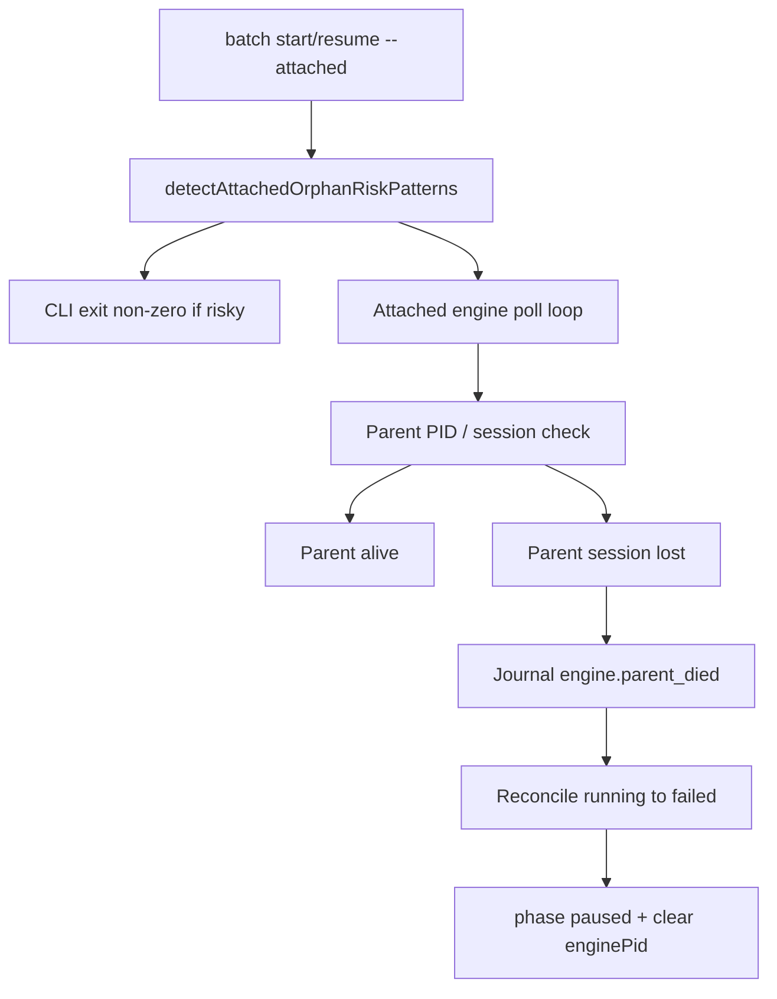

# pi-spine v1.10.1 — Stabilization Implementation Handoff

**Document type:** Implementation decomposition spec (spine-ready epic brief)  
**Product:** pi-spine  
**Version:** 1.10.1 Stabilization  
**Last updated:** 2026-07-08  
**Status:** Ready for `create-spine-tasks` decomposition  

**Epic alias:** Phase 61b — SP-STAB (SP-539+)

**Prerequisite:** v1.10.0 exit criteria met ([`PRD-v1.10.0-release-harness-handoff.md`](PRD-v1.10.0-release-harness-handoff.md)); tag `v1.10.0` published.

**Release profile:** patch — 4–6 tasks; 2 waves max; detached batches only.

---

## 1. Executive summary

v1.10.0 shipped the release harness (SP-530–538) and closed several lifecycle bugs, but two **P1 stabilization gaps** remain open on GitHub:

- [#163](https://github.com/beettlle/pi-spine/issues/163) — attached batch orphaned when operator shell backgrounds or receives SIGKILL (exit 137). Partial mitigation landed (SP-518 doctor warn, SP-534 detached policy docs); **engine parent-session death detection and reconcile are not implemented**.
- [#187](https://github.com/beettlle/pi-spine/issues/187) — `npm test -- <path>` runs the full suite in contract verify. SP-522 added **warn-only** validation; preflight still passes packets with the anti-pattern.

Four additional bugs ([#174](https://github.com/beettlle/pi-spine/issues/174), [#173](https://github.com/beettlle/pi-spine/issues/173), [#167](https://github.com/beettlle/pi-spine/issues/167), [#188](https://github.com/beettlle/pi-spine/issues/188)) are **fixed on `main`** in v1.9.0/v1.10.0 but still open on GitHub.

**v1.10.1** closes the P1 gap, promotes contract scoping to fail-closed, and runs GitHub backlog hygiene before the v2.0.0 automation proof.

**Tagline:** *Close the P1 stabilization gap before v2.0 proof.*

---

## 2. Scope lock

### In scope (Phase 61b — SP-STAB)

| FR | Description |
|----|-------------|
| FR-STAB-01 | Full #163 fix: parent PID/session monitor, `engine.parent_died` journal, reconcile orphan `running` → `failed`, `--attached` fail-fast in risky shells |
| FR-STAB-02 | Strengthen #187: promote `npm test -- <path>` from warn → **error** in `contract.mode: required` for Size S/M; optional contract-verify runtime guard |
| FR-STAB-03 | GitHub backlog hygiene: close issues already fixed on `main` with landed commit references |

### Deferred (v2.0.0+)

- Full gates-only automation proof — [`PRD-v2.0.0-automation-proof-handoff.md`](PRD-v2.0.0-automation-proof-handoff.md)
- Gate maturity epics ([#120](https://github.com/beettlle/pi-spine/issues/120)–[#123](https://github.com/beettlle/pi-spine/issues/123))
- v2.3 module split ([#117](https://github.com/beettlle/pi-spine/issues/117))
- Bulk rewrite of historical `.DONE` task PROMPTs with legacy `npm test --` patterns

### Non-goals

- npm publish automation without operator approval
- Changing stet CLI behavior
- New product features beyond stabilization
- v1.11.0 minor release for already-landed P2 fixes

---

## 3. Baseline — already landed

| Work | Reference | Gap |
|------|-----------|-----|
| Doctor attached orphan advisory | SP-518, [`src/doctor/attached-orphan-risk.mjs`](../src/doctor/attached-orphan-risk.mjs) | Warn-only; no engine monitor |
| Detached-first policy docs | SP-534, operator-runbook §Detached-first | Does not detect parent death |
| Orphan retry reconciliation | SP-315 | Manual operator trigger; no `engine.parent_died` |
| npm test -- warn | SP-522, [`src/tasks/validate-contract-warn.mjs`](../src/tasks/validate-contract-warn.mjs) | Warn in `validateContract`; preflight ignores warnings |
| Skill scoped testCommand template | SP-523 | Authoring only; does not block bad pending packets |
| #174 CI flutter stub | SP-528 (`1176e8b6`) | Issue still open |
| #173 complete waits engine | SP-532 (`fa2d1584`) | Issue still open |
| #167 concurrent resume fail-fast | SP-533 (`c221bdc6`) | Issue still open |
| #188 review crash_recovered | SP-538 (`bf7c89d0`) | Issue still open |

**Next Task ID:** SP-539 ([`spine-tasks/CONTEXT.md`](../spine-tasks/CONTEXT.md))

---

## 4. Code anchors

| Concern | Primary files |
|---------|---------------|
| Attached engine loop | [`src/batch/attached-runner.mjs`](../src/batch/attached-runner.mjs), [`src/batch/attached-engine-handoff.mjs`](../src/batch/attached-engine-handoff.mjs) |
| Parent session monitor (new) | `src/batch/parent-session-monitor.mjs` or `src/process/parent-session.mjs` |
| Orphan detection / reconcile | [`src/batch/orphan-detect.mjs`](../src/batch/orphan-detect.mjs), [`src/batch/reconcile.mjs`](../src/batch/reconcile.mjs) |
| Process liveness | [`src/process/liveness.mjs`](../src/process/liveness.mjs) |
| Attached orphan doctor | [`src/doctor/attached-orphan-risk.mjs`](../src/doctor/attached-orphan-risk.mjs) |
| Batch CLI entry | `bin/spine-batch.mjs` |
| Contract validate | [`src/tasks/packet/validate-contract.mjs`](../src/tasks/packet/validate-contract.mjs), [`src/tasks/validate-contract-warn.mjs`](../src/tasks/validate-contract-warn.mjs) |
| Contract verify runtime | [`src/batch/contract-verify.mjs`](../src/batch/contract-verify.mjs) |
| Preflight tasks validate | [`src/config/preflight/discovery.mjs`](../src/config/preflight/discovery.mjs) |
| Operator runbook | [`docs/adoption/operator-runbook.md`](adoption/operator-runbook.md) |

---

## 5. GitHub issue intake

| Issue | Priority | On `main` | v1.10.1 action | Landed in |
|-------|----------|-----------|----------------|-----------|
| [#163](https://github.com/beettlle/pi-spine/issues/163) | P1 | Partial | **Implement** (SP-539) | — |
| [#187](https://github.com/beettlle/pi-spine/issues/187) | P1 | Partial | **Strengthen** (SP-540, SP-541) | SP-522 warn (`8f3c2744`) |
| [#174](https://github.com/beettlle/pi-spine/issues/174) | P1 | Fixed | **Close** at publish | SP-528 (`1176e8b6`) |
| [#173](https://github.com/beettlle/pi-spine/issues/173) | P2 | Fixed | **Close** at publish | SP-532 (`fa2d1584`) |
| [#167](https://github.com/beettlle/pi-spine/issues/167) | P2 | Fixed | **Close** at publish | SP-533 (`c221bdc6`) |
| [#188](https://github.com/beettlle/pi-spine/issues/188) | P2 | Fixed | **Close** at publish | SP-538 (`bf7c89d0`) |

### Issue acceptance quotes

**#163** — Expected: parent session loss pauses batch cleanly or surfaces actionable recovery without zombie `running` tasks. Proposed fix: detect parent TTY/session loss; journal `engine.parent_died`; auto-pause batch and reconcile orphan `running` → `failed`.

**#187** — Expected: `npm test -- <path>` runs only the scoped test file, or `spine tasks validate` rejects the pattern. Proposed: `validateContract` / `spine tasks validate` reject or warn when `testCommand` matches `npm test --` with single-file argument.

---

## 6. Functional requirements

### FR-STAB-01 — Attached parent-session guard (closes #163)



**Acceptance criteria:**

1. Attached engine records initial parent PID (`process.ppid`) at startup.
2. Periodic check (reuse attached milestone poll interval or dedicated interval) detects:
   - parent PID changed to init (1) or unexpected reparenting, **or**
   - parent PID no longer alive (`isProcessAlive(ppid)` from [`src/process/liveness.mjs`](../src/process/liveness.mjs)).
3. On detection: append journal `engine.parent_died` with `{ parentPid, enginePid, signal: "parent_exit" }`.
4. Fail-closed reconcile: orphan `running` tasks → `failed` via existing reconcile paths (SP-315); clear `enginePid`; set `phase: "paused"`.
5. CLI guard: `batch start|resume --attached` exits non-zero when `detectAttachedOrphanRiskPatterns` is risky — upgrade from doctor warn-only to hard block at batch entry. Suggested remediation in error text: detached start + `spine wait`.
6. Regression tests in `tests/batch/attached-parent-died.test.mjs` — simulate parent PID change / dead parent without hand-editing batch-state JSON.
7. Update operator-runbook attached recovery section — mark #163 **Closes** (not Partial).

**Already done (do not re-implement):** SP-518 doctor advisory, SP-534 detached policy docs, SP-315 orphan retry reconciliation.

### FR-STAB-02 — Contract scoping hard-fail (closes #187)

**Acceptance criteria:**

1. When `contract.mode` is `"required"` and task Size is **S** or **M**: `npm test -- <path>` in `testCommand` is a **validation error** (not warning) in `validateContract`.
2. Size **L** tasks: retain warning (documented exception — large tasks may use broader commands with operator awareness).
3. Preflight `tasks-validate` fails when pending packets have the error (inherits from `validatePrompt` → `validation.errors`).
4. **Defense in depth (SP-541):** `contract-verify.mjs` refuses to execute commands matching `NPM_TEST_DASH_DASH_RE` before spawning — prevents mid-batch collateral on grandfathered packets.
5. Update [`tests/tasks/validate-contract-warn.test.mjs`](../tests/tasks/validate-contract-warn.test.mjs): required/S/M cases expect `ok: false`.
6. No bulk rewrite of historical `.DONE` PROMPTs required.

**Already done (do not re-implement):** SP-522 warn collector, SP-523 skill template, SP-521 generic scope warnings.

### FR-STAB-03 — GitHub backlog hygiene

Operator checklist at v1.10.1 publish (see §11). No code task required unless operator wants journal trail.

---

## 7. Task decomposition (SP-STAB ↔ SP-ID)

| SP-STAB | SP-ID | Slug | Mission | Size | Deps | Closes |
|---------|-------|------|---------|------|------|--------|
| 001 | SP-539 | attached-parent-died-guard | FR-STAB-01: parent PID monitor, `engine.parent_died`, reconcile, `--attached` fail-fast | M | — | #163 |
| 002 | SP-540 | validate-npm-test-hardfail | FR-STAB-02: promote `npm test --` to validate error (required, S/M) | S | SP-522 | #187 |
| 003 | SP-541 | contract-verify-npm-guard | FR-STAB-02: runtime block in contract-verify before spawn | S | SP-540 | #187 |
| 004 | SP-542 | context-phase61b-capstone | CONTEXT Phase 61b, dependencies.json, manifest example | S | SP-539, SP-540 | — |

### File scope hints

**SP-539:**

- `src/batch/attached-runner.mjs`
- `src/batch/attached-engine-handoff.mjs`
- `src/batch/parent-session-monitor.mjs` (new)
- `src/batch/orphan-detect.mjs` (integration only)
- `bin/spine-batch.mjs`
- `tests/batch/attached-parent-died.test.mjs`
- `docs/adoption/operator-runbook.md`

**SP-540:**

- `src/tasks/validate-contract-warn.mjs`
- `src/tasks/packet/validate-contract.mjs`
- `tests/tasks/validate-contract-warn.test.mjs`

**SP-541:**

- `src/batch/contract-verify.mjs`
- `tests/batch/contract-verify-npm-scope.test.mjs`

**SP-542:**

- `spine-tasks/CONTEXT.md`
- `spine-tasks/dependencies.json`
- `docs/release/manifest-v1.10.1-example.md`

---

## 8. Gaps requiring new packets

| Gap | Proposed SP-ID |
|-----|----------------|
| Parent session death engine guard | SP-539 |
| npm test -- hard-fail in validate | SP-540 |
| contract-verify runtime guard | SP-541 |
| CONTEXT Phase 61b capstone | SP-542 |

---

## 9. Wave run order

```text
Wave 0 (parallel): SP-539, SP-540
Wave 1: SP-541 (depends SP-540)
Leaves: SP-542
```

### Suggested batches

| Wave | Tasks | Parallel |
|------|-------|----------|
| S0 | SP-539, SP-540 | Yes |
| S1 | SP-541 | No |
| Cap | SP-542 | No |

**Regression gate:** `npm run typecheck && SPINE_WORKER_STUB=1 npm test && npm run release:check`

**Release execution:** spine release operator **patch** profile — detached batches only; operator closes GitHub issues per §11 after `npm version patch`.

### Operator notes

- **Detached only:** do not use `--attached` from Cursor Agent shells ([#163](https://github.com/beettlle/pi-spine/issues/163)).
- **Preflight git-clean:** remove or restore `.pi-smart-router/state.db-{shm,wal}` if present before `spine preflight` or publish.

---

## 10. Exit criteria

- [ ] Attached engine journals `engine.parent_died` and reconciles on parent session loss ([#163](https://github.com/beettlle/pi-spine/issues/163))
- [ ] `batch start|resume --attached` fails fast in risky shell contexts (non-TTY, CI, Cursor agent env)
- [ ] `spine tasks validate` **errors** on `testCommand: npm test -- tests/foo.test.mjs` for required/S/M packets ([#187](https://github.com/beettlle/pi-spine/issues/187))
- [ ] `spine preflight` `tasks-validate` fails on pending packets with `npm test --` pattern
- [ ] contract-verify refuses `npm test --` at runtime (SP-541)
- [ ] GitHub issues #174, #173, #167, #188 closed with landed commit refs
- [ ] GitHub issues #163, #187 closed after SP-539/SP-540 merge
- [ ] Open P1 bugs = 0 before v2.0.0 proof batch
- [ ] CONTEXT Phase 61b complete; Next Task ID → SP-543
- [ ] `npm version patch` → v1.10.1 published

---

## 11. GitHub hygiene workflow

Run at v1.10.1 publish (single cleanup pass). Use `gh issue close` with `--comment` citing commit SHA and release tag.

| Issue | Close when | Comment template |
|-------|------------|------------------|
| #174 | Publish | Fixed in SP-528 (`1176e8b6`) — Flutter stub on PATH in CI test harness. Shipped v1.9.0. |
| #173 | Publish | Fixed in SP-532 (`fa2d1584`) — `completeBatch` refuses archive while engine PID alive. Shipped v1.10.0. |
| #167 | Publish | Fixed in SP-533 (`c221bdc6`) — concurrent `resume --force` fail-fast. Shipped v1.10.0. |
| #188 | Publish | Fixed in SP-538 (`bf7c89d0`) — `crash_recovered` review retry visibility. Shipped v1.10.0. |
| #163 | After SP-539 merge | Full fix: parent session monitor + `engine.parent_died` + reconcile. Shipped v1.10.1. |
| #187 | After SP-540 merge | Hard-fail `npm test --` in required/S/M validate + contract-verify guard. Shipped v1.10.1. |

```bash
# Example (adjust issue numbers and SHAs as needed)
gh issue close 174 --comment "Fixed in SP-528 (1176e8b6). Landed v1.9.0; closing at v1.10.1 publish."
gh issue close 173 --comment "Fixed in SP-532 (fa2d1584). Landed v1.10.0; closing at v1.10.1 publish."
gh issue close 167 --comment "Fixed in SP-533 (c221bdc6). Landed v1.10.0; closing at v1.10.1 publish."
gh issue close 188 --comment "Fixed in SP-538 (bf7c89d0). Landed v1.10.0; closing at v1.10.1 publish."
gh issue close 163 --comment "Fixed in SP-539. Parent session guard + engine.parent_died. Shipped v1.10.1."
gh issue close 187 --comment "Fixed in SP-540/SP-541. npm test -- hard-fail in validate + contract-verify. Shipped v1.10.1."
```

Update [`docs/release/stabilization-roadmap-v1.8-v2.0.md`](release/stabilization-roadmap-v1.8-v2.0.md) open-issue counts after cleanup.

---

## 12. Success metrics

| ID | Metric | Verification |
|----|--------|--------------|
| M-STAB-01 | Parent died detected and reconciled | `tests/batch/attached-parent-died.test.mjs` |
| M-STAB-02 | npm test -- hard-fail | `tests/tasks/validate-contract-warn.test.mjs` |
| M-STAB-03 | contract-verify blocks npm test -- | `tests/batch/contract-verify-npm-scope.test.mjs` |
| M-STAB-04 | Open P1 count = 0 | `gh issue list --label "priority:P1" --state open` |
| M-STAB-05 | GitHub hygiene complete | 6 issues closed with commit refs |

---

## 13. Workflow after this document

```text
Use create-spine-tasks to decompose docs/PRD-v1.10.1-stabilization-handoff.md
into SP-539+ packets. Update CONTEXT.md Phase 61b.
```

Example manifest: [`docs/release/manifest-v1.10.1-example.md`](release/manifest-v1.10.1-example.md)

```bash
spine tasks validate SP-539 SP-540 SP-541 SP-542
spine plan SP-539,SP-540,SP-541,SP-542
spine run sequence SP-539,SP-540,SP-541,SP-542 --dry-run
```

**Handoff to v2.0.0:** After v1.10.1 exit criteria met, proceed to [`PRD-v2.0.0-automation-proof-handoff.md`](PRD-v2.0.0-automation-proof-handoff.md) (Phase 62 — SP-AUTO).
