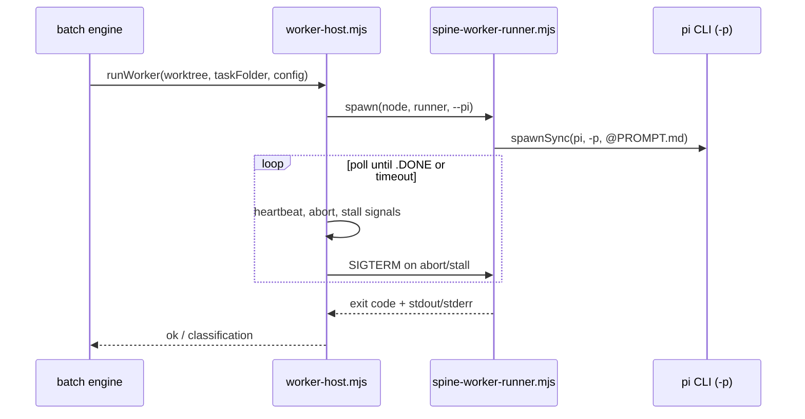
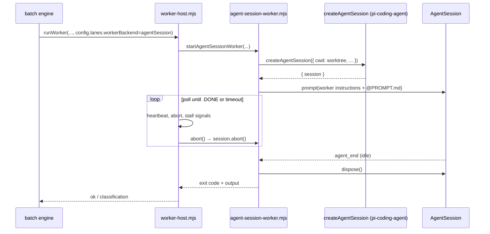

# createAgentSession worker backend spike (TP-050)

**Date:** 2026-06-02  
**Status:** Conditional **GO** — flag scaffold + in-process happy path viable; default remains subprocess for v1.0.

## Goal

Evaluate PRD v1.1 optional execution backend: spawn lane workers via `@earendil-works/pi-coding-agent` `createAgentSession` instead of subprocess `pi -p` (`bin/spine-worker-runner.mjs`).

## Current subprocess path (v1.0 default)



**Pros:** Process isolation, matches operator `pi` CLI, no pi-coding-agent peer at engine runtime, easy kill via PID, TP-048 real-pi E2E validated.

**Cons:** Cold start per task, duplicate extension load, harder to share parent pi session auth, subprocess stdout-only observability.

## Proposed agentSession path (v1.1 flag)



**Pros:** No subprocess overhead, direct access to `AgentSession` events, shared Node runtime with batch engine, natural path to RPC/embed modes, `session.abort()` for graceful stop.

**Cons:** Requires `@earendil-works/pi-coding-agent` at engine runtime (peer dep), weaker isolation (shared memory), model/auth must be resolved in-engine, reviewer path still subprocess today.

## pi-coding-agent API surface (0.78.0)

| API | Role for pi-spine |
|-----|-------------------|
| `createAgentSession(options?)` | Primary entry — returns `{ session, extensionsResult }` |
| `CreateAgentSessionOptions.cwd` | Lane worktree root |
| `CreateAgentSessionOptions.thinkingLevel` | Map from `agents.worker.thinking` |
| `CreateAgentSessionOptions.resourceLoader` | `DefaultResourceLoader` — skills, rules, extensions |
| `SessionManager.create(cwd)` / `SessionManager.inMemory()` | Per-lane session files vs ephemeral spike |
| `AgentSession.prompt(text)` | Send worker prompt (supports `@file` templates) |
| `AgentSession.subscribe(listener)` | `agent_end`, tool events for progress |
| `AgentSession.abort()` | Cooperative stop (abort signal / stall) |
| `AgentSession.dispose()` | Cleanup after lane completes |
| `createAgentSessionServices` / `createAgentSessionFromServices` | Split service vs session creation for cwd switches |

**Not on ExtensionAPI:** `createAgentSession` is an SDK export, not `pi.createAgentSession(...)`. The batch engine (Node) imports the package directly; it does not run inside an extension callback.

## Config flag

```json
"lanes": {
  "maxParallel": 3,
  "workerBackend": "subprocess"
}
```

| Value | Behavior |
|-------|----------|
| `subprocess` (default) | Current `spine-worker-runner.mjs` path — unchanged |
| `agentSession` | In-process `createAgentSession` via `src/batch/agent-session-worker.mjs` |

`SPINE_WORKER_STUB=1` always forces subprocess stub (CI / tests without real pi).

## Prototype scope (TP-050)

Implemented behind flag:

1. `resolveWorkerBackend(config)` — default `subprocess`
2. `startAgentSessionWorker` — single-lane happy path: prompt → poll `.DONE` → dispose
3. Mock factory injectable in tests (`SPINE_AGENT_SESSION_STUB=1` or test deps)
4. Abort / stall reuse existing worker-host poll loop (`session.abort()` on kill)

**Out of scope for spike:** reviewer `createAgentSession`, session resume across batch pause, multi-lane soak, production default flip.

## Blockers for full v1.1 adoption

| ID | Blocker | Follow-up |
|----|---------|-----------|
| B1 | Reviewer still spawns `pi -p` (`review.mjs`) | TP-051: agentSession reviewer backend |
| B2 | Per-lane `SessionManager` persistence + resume | TP-052: session continuity |
| B3 | Model resolution for `agents.worker.model: inherit` in headless engine | TP-053: model/auth bridge |
| B4 | Real-pi soak: memory, extension conflicts, parallel lanes | Adoption E2E with `workerBackend: agentSession` |
| B5 | `spine doctor` peer version pin enforcement | Already planned in PRD §5.2 |

## Go / no-go

| Criterion | Result |
|-----------|--------|
| API exists and supports headless prompt loop | **Yes** (`createAgentSession` + `prompt` + `abort`) |
| Can implement without breaking default | **Yes** (flag default `subprocess`) |
| CI testable without real pi | **Yes** (mock session factory) |
| Ready to replace subprocess as default | **No** — blockers B1–B4 |

**Recommendation:** **Conditional GO.** Ship flag + prototype for opt-in single-lane trials; keep subprocess default through v1.0 pilot. Revisit default after reviewer parity and adoption soak.

## Issue template (if blocked later)

```markdown
### createAgentSession backend — [blocker title]

**Config:** `lanes.workerBackend: agentSession`
**pi-coding-agent version:**
**Batch / lane:**

#### Expected
In-process worker completes task and writes `.DONE`.

#### Actual


#### Logs
- worker-host mode:
- session.abort called:
- journal events:

#### Repro
1. Set `lanes.workerBackend` to `agentSession` in `.spine/spine-config.json`
2. `spine batch start <task>`
```
