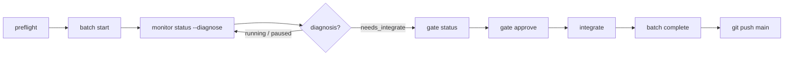

# Operator runbook (real projects)

Daily procedures for running pi-spine batches on a **consumer repository** — install through land loop, recovery, and Taskplane coexistence. Use this with the [bootstrap checklist](./bootstrap-checklist.md) for first-time setup.

**Normative behavior:** [PRD §12–18](../PRD.md) (gates, reconciliation, journal). This runbook is procedural, not a spec duplicate.

---

## Before you start

| Doc | When |
|-----|------|
| [local-install.md](./local-install.md) | First install from git checkout |
| [bootstrap-checklist.md](./bootstrap-checklist.md) | Greenfield or Taskplane migration |
| [upstream-execution-workflow.md](./upstream-execution-workflow.md) | PRD → task packets → batch (optional [zero-pi](https://pi.dev/packages/@gonrocca/zero-pi) or [spec-kit](https://github.com/github/spec-kit) upstream) |
| [real-pi-e2e.md](./real-pi-e2e.md) | Optional real-`pi` validation on adoption fixture |
| [component-maturity-matrix.md](./component-maturity-matrix.md) | L0–L4 per-component test/CI maturity audit ([#129](https://github.com/beettlle/pi-spine/issues/129)) |
| [flutter-worktree-guide.md](./flutter-worktree-guide.md) | Flutter lane worktrees — gitignored assets, analyzer scope, setup hook |

**CLI choice:** Prefer the published global CLI; pin a checkout path when developing pi-spine itself or when PATH drift is a concern:

```bash
# Recommended — published release (re-install after version bumps)
npm install -g pi-spine
# or: pi install npm:pi-spine

# Development — replace with your pi-spine checkout path
export SPINE="/absolute/path/to/pi-spine/bin/spine.mjs"
alias spine="node $SPINE"

# Or, after npm link from the checkout:
# alias spine="spine"   # global on PATH — re-link after git pull
```

Throughout this doc, `spine` means whichever invocation you chose (global `npm install -g`, `node …/bin/spine.mjs`, or linked checkout).

### Detached-first policy (default)

Omit `--attached`. Detached is the CLI default for `spine batch start` and `spine batch resume` — the engine survives parent shell exit ([#163](https://github.com/beettlle/pi-spine/issues/163), [#185](https://github.com/beettlle/pi-spine/issues/185)):

```bash
spine batch start pending --wave 2          # detached — engine survives parent shell exit
spine batch resume --force                  # detached orphan recovery
spine wait --until completed,needs_integrate,failed,aborted --timeout 4h
spine status --diagnose
```

In pi sessions, prefer **MonitorCreate** for detached start with an `onDone` prompt — see `skills/spine-release-operator/references/pi-async-orchestration.md`.

**`--attached` (persistent interactive terminal only):** Use only when **all** of the following hold: a human operator in iTerm/Terminal.app (or similar), the shell stays in the **foreground** for the full batch duration (often 30+ minutes), and you want the CLI to block until the engine finishes. Until you trust detached batches on a new repo, attached mode can help build confidence — but never from agent harnesses:

```bash
spine batch start SP-042 --attached   # human terminal — blocks until engine finishes
spine batch resume --attached
```

`spine doctor` warns when stdin is not a TTY or when agent/CI environment variables indicate a short-lived parent shell. **`batch start|resume --attached` now fails fast** in those contexts (SP-539, **Closes** [#163](https://github.com/beettlle/pi-spine/issues/163)) with detached-start remediation. Cursor Agent shells may background long commands after **~120 seconds** even when started from the IDE terminal — treat them like CI/agent harnesses (detached + monitor). **Do not** pass `--attached` from Cursor background shells, piped CI steps, or pi worker sessions — the parent exit orphans the engine (shell exit 137) and tasks stick in `running` until `engine.parent_died` reconciliation runs.

Default detached `start`/`resume` return when the engine **starts**, not when work completes. After detached return, always run `spine status --diagnose`.

**Single attached engine:** only one foreground `--attached` engine may own a batch at a time. `resilience.enginePid` is checked before attached `start`/`resume`. If that PID is still alive, the CLI fails fast with `attached_engine_already_running`. Use `spine batch resume --attached --force` to orphan the prior engine (`engine.orphan_terminated` in the journal) before handoff — do not run two `spine.mjs batch … --attached` processes for the same batch.

**PID-reuse-safe engine liveness (SP-715 / #259):** engine ownership checks pair `resilience.enginePid` with `resilience.engineStartedAt` — on macOS/Linux the recorded start time is compared against the live process start time (`ps lstart` / `/proc/<pid>/starttime`), so a recycled PID owned by an unrelated process is treated as a dead engine and no longer blocks writes or skips orphan recovery. **Windows limitation:** liveness remains PID-only (`kill(pid, 0)`), so a recycled PID can still masquerade as the engine there.

After `engine_orphaned`, `worker_orphaned`, `worker_done_missing`, or `state_drift`, detached `resume` defaults to `--wait-terminal` (blocks until terminal phase). Pass `--no-wait-terminal` for the old quick-return behavior.

**Orphan recovery tree:**

1. `spine status --diagnose` — read headline and `suggestedCommand`
2. `state_drift` → follow **`suggestedCommand`** from diagnose (agent-safe: detached `spine batch resume --force` when phase is `running` / engine dead / tasks terminal-success — SP-613 / [#196](https://github.com/beettlle/pi-spine/issues/196); `spine batch retry <id>` when the drift task is not `running` — SP-512). **Do not** background `resume --attached` from agent/non-TTY shells ([#163](https://github.com/beettlle/pi-spine/issues/163), [#185](https://github.com/beettlle/pi-spine/issues/185)). See **[Agent-safe state_drift recovery (#196)](#agent-safe-state_drift-recovery-196)** below.
3. `engine_orphaned` or `worker_orphaned` with dead PIDs → run the **`suggestedCommand`** (usually `spine batch retry <id>`). **No `batch pause` first** — retry reconciles orphan `running` tasks to `failed` and journals `task.failed` / `lane.died` when missing (SP-315). Then detached `spine batch resume --force` (or `resume --attached` only in a persistent human TTY). `worker_done_missing` → `spine batch retry <id>` only (worker already exited — do not use orphan-resume paths). When journal shows `batch.resumed` + `worker.rules_selected` with both PIDs dead, diagnosis upgrades to `engine_orphaned` — follow `suggestedCommand` (detached `resume --force` when tasks are terminal-success; otherwise retry / attached only for human TTY).
4. Never hand-edit `.spine/batch-state.json`

---

## 1. Install

On the **consumer** repo (your application, not the pi-spine repo):

```bash
# Slash commands + pi extension (required for /spine-*)
pi install /absolute/path/to/pi-spine -l

# Optional: global CLI for shells and CI
cd /absolute/path/to/pi-spine && npm link

# First-time spine layout
spine init

# Taskplane migrants — preview then apply
spine migrate-from-taskplane --dry-run --source .pi/taskplane-config.json
spine migrate-from-taskplane --source .pi/taskplane-config.json
```

Verify:

```bash
spine doctor
spine version   # confirms global npm link resolves (npm bin is a symlink to bin/spine.mjs)
```

When `PI_SPINE_ROOT` is unset, the CLI defaults it to the current working directory so `spine doctor` / preflight do not require a manual `export PI_SPINE_ROOT=$PWD` solely for a missing env var (SP-643 / [#203](https://github.com/beettlle/pi-spine/issues/203)). An explicit `PI_SPINE_ROOT` still wins; worker spawn continues to resolve the package root via `resolvePiSpineRoot`.

`spine doctor` prints an advisory **`lanes.maxParallel`** sizing line when config is valid (configured vs CPU-based suggestion). Use it with [§3 Orchestrator process model](#orchestrator-process-model-98) to estimate expected node process count during batches.

**Duplicate pi-spine installs (issue #128, SP-559):** Pi 0.75+ installs packages under `~/.pi/agent/npm/node_modules/` via `pi install npm:pi-spine`. If you previously ran `npm install -g pi-spine`, two copies can drift independently — `pi update` refreshes only the Pi-private copy while the global CLI runs stale code. `spine doctor` warns when both copies exist with **different versions** and suggests `npm uninstall -g pi-spine` plus `pi install npm:pi-spine`. Same-version pairs are tolerated.

**Pi CLI resolution (issue #128):** Doctor resolves the authoritative Pi entrypoint via `process.argv[1]` when spine runs inside a Pi session, then falls back through `npm root -g`, NVM (`NVM_BIN` / `NVM_SYMLINK`), and common static paths. When PATH `pi` differs from that resolution, doctor prints a **PATH mismatch** warning so you can align `PATH` with the Pi install you intend to use.

Global `npm link` / `npm install -g` invokes `spine` through a symlink on `PATH`. If `spine version` prints package and Node info, the CLI entrypoint is wired correctly (SP-099).

In pi: `pi list` should show `pi-spine`; try `/spine-plan pending`.

Details: [local-install.md](./local-install.md).

### 1.1 Cursor rules (FR-WORK-05)

When the consumer repo has `.cursor/rules/`, spine workers receive **auto-selected** rule files in their prompt tail (not the full rules tree). Full design: [cursor-rules-discovery.md](../design/cursor-rules-discovery.md).

| File | Purpose |
|------|---------|
| `.spine/rules-profile.json` | Always-include (`taskplane-worker-cursor.mdc` by default), never-include, discovery exclusions |
| `.spine/rules-manifest.json` | **Committed** inventory from last discovery scan |
| `config.standards` | Explicit paths that **append** after auto-selection (deduped) |
| `config.neverLoad` | Blocklist for all injected docs |

**After changing rules:**

```bash
spine rules sync
git add .spine/rules-manifest.json
git commit -m "chore: refresh rules manifest"
```

**Preview what a task will load:**

```bash
spine rules select --task SP-042
```

**Doctor warnings:**

| Code | Fix |
|------|-----|
| `RULES_MANIFEST_MISSING` | `spine rules sync` |
| `RULES_MANIFEST_STALE` | `spine rules sync` (rescan differs from committed manifest) |

Glob-triggered language packs match PROMPT **File Scope** via micromatch. Empty File Scope still loads profile always-includes and `alwaysApply` rules. Tune `.spine/rules-profile.json` or add paths to `config.standards` when workers miss expected rules.

**Journal audit:** batch journal events `worker.rules_selected` list `paths`, `mode`, and cap metadata per worker spawn.

---

## 2. Task validation and preflight

**Human pre-batch gates:** Before your first batch (or after major decomposition), walk the [authoring approval checklist](./authoring-approval-checklist.md) — approve upstream spec/plan conversion, then run validate → analyze → plan → preflight. Authoring gates are operator habits; execution gates (`spine gate approve` after the wave) are separate — see the checklist comparison table.

### 2.1 Validate task packets (v1.3 — FR-UXB-02)

Run **before** `spine batch start` when authoring or editing `PROMPT.md` files. This is the same gate as upstream authoring — see [upstream-execution-workflow.md](./upstream-execution-workflow.md) Path 1 step 3.

**When to run:**

| Trigger | Command |
|---------|---------|
| After editing any `PROMPT.md` | `spine tasks validate <task-id>` or `spine tasks validate pending` |
| Before every batch | `spine tasks validate pending` (also runs inside `spine preflight`) |
| CI / automation | `spine tasks validate pending --json` (exit 0 pass, 1 validation fail, 2 config error) |

```bash
spine tasks validate pending
spine tasks validate pending --json
spine tasks validate SP-042 --warnings-only   # advisory STATUS/deps warnings only
```

**Scope:** `pending` (no `.DONE`), explicit task IDs, or `all` (every discovered packet). Scoped plans validate only selected tasks; `spine plan all` fails if any discovered packet is invalid.

Catches invalid headings, missing sections, missing Testing step, Size XL, and (v2.0) missing or invalid `## Contract` — the same rules as the planner (`prompt_parse_failed` at worker launch).

**Fixing validation errors:**

| Error pattern | Fix |
|---------------|-----|
| `em dash` / invalid heading | Use `# Task: SP-042 — Title` with U+2014 em dash, not hyphen |
| `Missing required sections` | Add Mission, Dependencies, File Scope, Steps, Completion Criteria, Do NOT |
| `Testing` / missing Testing step | Add `### Step N: Testing & Verification` under Steps |
| `Contract` missing or empty | Add `## Contract` table (§2.3) or set `contract.mode: "optional"` during migration |
| Size XL | Split into dependent S/M tasks (`skills/create-spine-tasks`) |

### 2.2 Preflight

Run **before every batch** (FR-BATCH-11). Fails fast on dirty git, active batch, broken deps, or orchestrator conflict.

```bash
spine tasks validate pending  # v1.3 — explicit validate before preflight
spine plan pending            # optional — see waves and lanes
spine preflight
spine preflight --json        # automation / CI
```

**Plan pending idle state (issue #99):** When all discovered tasks have `.DONE` on disk, `spine plan pending` prints a friendly summary (excluded count, `→ spine plan all` hint) and exits 0. No stack trace. JSON mode (`--json`) returns a synthetic empty plan with `tasksSelected: 0` and `tasksExcluded: N`.

| Check | What it catches |
|-------|-----------------|
| Doctor | Node, git, pi, config, agents, coexistence |
| Git clean | Uncommitted changes in working tree (`.pi/` session metadata ignored — same treatment as `.spine/runtime/` via `spine init` gitignore) |
| No active batch | Stale `.spine/batch-state.json` or Taskplane `.pi/batch-state.json` |
| Tasks + deps | Discoverable `PROMPT.md`, valid `dependencies.json` |
| Tasks validate (v1.3) | Invalid PROMPT packets for pending scope |
| Wave plan | Same planner output as `spine plan` (invalid PROMPTs fail here with actionable errors) |

When validate, `spine plan`, or preflight fails with `Invalid PROMPT for …` or `PROMPT validation failed for N task(s):`, fix the listed `PROMPT.md` files before retrying. Fix `suggestedCommand` from failed preflight before `batch start`. Do **not** hand-edit `.spine/batch-state.json`.

### 2.3 Contract authoring (v2.0 — FR-CDO-01)

New `SP-*` tasks require a `## Contract` section in `PROMPT.md` when `contract.mode` is `"required"` (default after `spine init`). Legacy `TP-*` tasks skip Contract validation via `legacyTaskIdPrefixes`.

```markdown
## Contract

| Field | Value |
|-------|-------|
| testCommand | `npm test -- tests/example.test.mjs` |
| fileScopeMustChange | `src/example.mjs` |
| minLineCoverage | 77 |
```

**testCommand output limits (issue #86, SP-426):** Contract verification captures stdout/stderr from `testCommand` with a **10MB** `maxBuffer` (raised from 256KB). Full-suite commands such as `flutter test` with thousands of tests can exceed smaller limits and fail with exit 255 and truncated output. Prefer **scoped** commands — e.g. `flutter test test/widget_test.dart` or `npm test -- tests/feature.test.mjs` — instead of unscoped full-suite runs. If output still exceeds 10MB, the verifier fails with an explicit `maxBuffer` message naming the command; narrow `testCommand` scope rather than disabling contract checks.

**testCommand retry (issue #136, SP-485):** When `testCommand` fails, the verifier retries up to `contract.testRetries` times (default **1**) with a 5-second delay between attempts. This absorbs transient failures from resource contention (concurrent lane test suites) or pre-existing flakes without masking persistent problems. Failed attempt output is captured to `{taskFolder}/.reviews/contract-fail-{timestamp}.log` for post-mortem diagnosis. The journal records `contract.test_retry` events with attempt number and exit code; the final `contract.verified` event reflects the last attempt's result.

**testCommand execution model — shell, distinct from gate evidence (issue [#268](https://github.com/beettlle/pi-spine/issues/268), SP-723):** PROMPT `testCommand` runs through a **full shell** (`spawnSync($SHELL, ["-c", …])` in `src/batch/contract-exec.mjs`) in the lane worktree. This is a different execution model from gate evidence `testing.*` commands, which run through a hardened no-shell argv allowlist ([#254](https://github.com/beettlle/pi-spine/issues/254) — see [Template vs evidence commands](#template-vs-evidence-commands-160-phase-a--phase-b)). Today the contract path accepts `&&` chains, pipes, and env-var prefixes (`SPINE_WORKER_STUB=1 npm test`) only because it uses a shell. **Once SP-723 lands**, `$`, backticks, `;`, `|`, `&&`, `||` are rejected **before spawn**, fail-closed, with error copy distinct from the #254 gate-evidence path. Author testCommands without those metacharacters now to stay forward-compatible: prefer a single scoped command, chain multi-step verification through a `scripts/…` wrapper, and never interpolate `$VAR` / `$(…)` — pass secrets via the environment exactly as a CI script would.

| Config key | Type | Default | Description |
|------------|------|---------|-------------|
| `contract.testRetries` | integer ≥ 0 | `1` | Max retries after first `testCommand` failure (total attempts = retries + 1) |
| `contract.testRetryDelayMs` | integer ≥ 0 | `5000` | Delay in milliseconds between retry attempts |

Set `contract.testRetries: 0` to disable retry (pre-SP-485 behavior). For flaky environments, `2` gives three total attempts.

| `contract.mode` | Behavior |
|-----------------|----------|
| `required` | Missing or empty Contract fails `spine tasks validate` for non-legacy task IDs |
| `optional` | Missing Contract warns only; present Contract must be syntactically valid |
| `legacy` | Contract section ignored for validation and final-review verifier |

**Migration tip:** Dogfood repos with 100+ legacy packets can start with `contract.mode: "optional"`, add Contract to new `SP-*` tasks, then flip to `"required"` when backlog is updated. Taskplane migrants keep `TP-*` on legacy behavior regardless of global mode.

**Pre-landed implementation warning (issue #56):** When implementation for a pending task was already merged to `main` before the batch runs, `fileScopeMustChange` paths may not diff in a new lane — final contract verification can fail repeatedly. Before batch start:

- `spine preflight` and `spine plan` emit a **⚠️ Pre-landed contract risk** warning when pending tasks have `fileScopeMustChange` paths that changed on `main` since the task PROMPT was first added.
- `spine tasks validate pending --warnings-only` lists the same advisory per task.

**Recovery:** Amend `PROMPT.md` **## Contract** before batch start — e.g. point `fileScopeMustChange` at delivery artifacts (`STATUS.md`, `.DONE`) when source code is already on `main`, and document the pre-land in **## Amendments** (see SP-358/SP-359). Do not start the batch until the contract matches how the task will actually land.

Authoring guidance: [create-spine-tasks skill](../../skills/create-spine-tasks/SKILL.md) and [upstream-execution-workflow.md](./upstream-execution-workflow.md).

### 2.4 Matrix tasks (parametric sub-lanes)

A matrix task fans out one `PROMPT.md` into **parallel sub-lanes**, one per row of a `## Matrix` table. Each row supplies its own parameter values, and `{matrix.<column>}` placeholders in the contract and steps are substituted per row. Matrix tasks are useful for running the same procedure against multiple targets (environments, files, test targets) without copying the PROMPT.

#### Matrix syntax

Add a `## Matrix` section after the front matter. It is a markdown table whose columns are parameter names and whose rows are parameter sets. If the first column is named `run_id`, its value is used as the row identifier; otherwise the row values are joined with underscores.

```markdown
## Matrix

| run_id | target_region | image_tag |
|--------|---------------|-----------|
| us_east | us-east-1 | v1.2.3 |
| eu_west | eu-west-1 | v1.2.3 |

## Contract

| Field | Value |
|-------|-------|
| testCommand | `scripts/deploy-{matrix.target_region}.sh {matrix.image_tag}` |
| runCommand | `scripts/deploy-{matrix.target_region}.sh {matrix.image_tag}` |
| fileScopeMustChange | `spine-tasks/{taskId}/STATUS.md` |

## Steps

### Step 1: Deploy to {matrix.target_region}

- [ ] Run `scripts/deploy-{matrix.target_region}.sh {matrix.image_tag}`
- [ ] Verify the deployment in {matrix.target_region}
```

#### Substitution rules

- Placeholder syntax: `{matrix.<column>}` only. `<column>` matches letters, digits, underscores, and hyphens (e.g. `{matrix.run_id}`, `{matrix.target_region}`).
- Placeholders are substituted in string contract fields and step bodies (`testCommand`, `runCommand`, `fileScopeMustChange`, `fileScopeMustNotChange`, `artifactsMustExist`).
- **LLM rows receive a fully substituted PROMPT** (#232, SP-742): before the row worker starts, the engine substitutes `{matrix.*}` across the entire `PROMPT.md` served in the row worktree — steps, contract table, File Scope paths, and mission text — using the same fail-loud engine as the contract fields. An unknown `{matrix.X}` reference fails the row before the worker spawns.
- Substitution is **fail-loud**: a `{matrix.X}` reference whose column is absent from the row throws a parse error before the sub-lane runs. A placeholder that reaches substitution with no row at all also fails.
- Non-matrix tasks are unchanged — if no row is supplied, `applyMatrixRowToContract` returns the contract verbatim.

#### Matrix row environment variables

Every row process — execute shells and LLM row workers alike — also receives Slurm/K8s-style matrix index environment variables (#229, SP-751), so existing HPC/CI scripts can be ported without string substitution:

| Variable | Value |
|----------|-------|
| `SPINE_MATRIX_JOB_ID` | Parent matrix task id (e.g. `SP-100`) |
| `SPINE_MATRIX_TASK_ID` | Row id (`run_id` value or derived) |
| `SPINE_MATRIX_TASK_INDEX` | 0-based index of the row in the matrix |
| `SPINE_MATRIX_TASK_COUNT` | Total number of rows |
| `JOB_COMPLETION_INDEX` | Alias of `SPINE_MATRIX_TASK_INDEX` for Kubernetes indexed-job scripts |

Contract `runCommand` / `testCommand` values refuse `$` (#268), so consume the variables from a helper script rather than inline expansion:

```markdown
| Field | Value |
|-------|-------|
| runCommand | `sh scripts/run-row.sh` |
```

```sh
# scripts/run-row.sh — reads the matrix row identity from its environment
case "$SPINE_MATRIX_TASK_INDEX" in
  0) target=us-east-1 ;;
  1) target=eu-west-1 ;;
esac
"./deploy.sh" "$target" > "out/${SPINE_MATRIX_TASK_ID}.txt"
```

#### Plan output and sub-lane naming

The planner treats a matrix task as a **single task** — `spine plan` shows the parent task on one lane, not per-row sub-lanes:

```text
Wave 0
  lane-1: SP-100  deploy to multiple regions (matrix: us_east, eu_west)
```

Row fan-out happens only in the engine at run time (see [Concurrency](#concurrency-and-failure-behavior) below). Plan output still shows one parent line; first-class row scheduling (#228, SP-697/SP-698) makes each row a real lane-pool occupant at run time without changing the `spine plan` shape.

#### Concurrency and failure behavior

- `spine status` reports the parent task's **aggregated** state. Per-row status is stored in `task.matrixRows[]` and emitted as `matrix.sub_lane.started/completed/failed` journal events.
- The parent task succeeds only if **all rows** succeed. If any row fails, the parent task fails with `matrix_sub_lane_failed:<rowIds>` and the failing row IDs are surfaced in the diagnosis.
- Rows are scheduled as **first-class lane occupants** (#228, SP-697/SP-698; supersedes the SP-690 nested throttle). The parent matrix task holds **no** lane slot while its rows run: each active row acquires a slot from the global pool sized `lanes.maxParallel`, competing with sibling lane tasks, so global in-flight workers never exceed `lanes.maxParallel`. The acquired slot number is the row's lane identity — each row gets its own git worktree (`lane-{n}-{parentTaskSlug}-{rowSlug}`), so row output is isolated and then merged back into the lane branch.
- **Per-matrix throttle** (#229, SP-751): an optional Contract field `matrixMaxParallel` (positive integer) caps how many rows of this matrix run at once — the Slurm `--array=0-15%4` analog. The effective row concurrency is `min(matrixMaxParallel, lanes.maxParallel)`: a matrix can narrow its share of the global pool but never widen it, and global `lanes.maxParallel` semantics are unchanged. The parsed throttle and effective limit are journaled on `matrix.task_started` as `matrixMaxParallel` / `rowConcurrency`.
- A failing row's worktree is cleaned up; the remaining rows finish (or are aborted) before the parent is marked failed.

> **Superseded: SP-690 nested throttle.** The interim `max(1, maxParallel - 1)` row cap (SP-690 / #227) reserved the parent lane's slot and under-utilized the pool at higher parallelism. First-class row scheduling (#228) replaces it: the parent releases its slot and rows compete for the global pool alongside sibling lanes, so the pool is fully utilized and the in-flight invariant holds at any `lanes.maxParallel`.

#### Caveats

- **Execute-type rows are fully substituted and tested.** For `Type: execute` matrix tasks, the engine substitutes `runCommand` (or `testCommand`) and runs the shell command in each row worktree.
- **LLM-type rows are fully substituted** (#232, SP-742): each row's worker receives a row-substituted `PROMPT.md`, and the row journals `matrix.sub_lane.prompt_served` with the served document's sha256, so per-row substitution is verifiable instead of assumed. Substitution scaffolding is never committed — the row branch carries only worker output, and the authored packet keeps its placeholders.
- **Rows must write row-distinct outputs.** Row branches merge back into the lane (SP-697), so outputs shared across rows are safe only when their content is identical (e.g. stub `STATUS.md` delivery). Two rows concurrently writing *different* content to the same path will conflict at the row→lane merge; scope `fileScopeMustChange` / outputs per row (`out/{matrix.run_id}.txt`).
- **Planner packing:** the planner treats a matrix task as a single task. `buildPlan` does **not** expand `## Matrix` rows into virtual `SP-X[rowId]` sub-lanes — SP-690 (#227) reverted the SP-689 plan-time expansion that exposed virtual row IDs to the batch engine before it could schedule them (causing `task_not_found`). **#226 is closed as superseded by #228:** first-class row scheduling is run-time lane-pool fan-out under the parent task ID (SP-697/SP-698). Re-propagating matrix fields through `buildPlan` without engine virtual-ID consumption still fails matrix E2E with `task_not_found` (verified SP-696 / batch `20260806T184913`). Plan output shows one parent line; row parallelism is an engine concern.
- **Deferred follow-ups:** per-row status APIs (#230) and `maxFailedIndexes` partial-failure tolerance (#231) remain deferred. Matrix environment variables and the `matrixMaxParallel` throttle (#229) shipped in SP-751 (see the row environment and throttle sections above). Full PROMPT-body substitution for LLM rows (#232) shipped in SP-742 (see the substitution rules above). The default — and only — parent success policy is that all rows succeed.
- Matrix tasks are best for **deterministic, scoped** automation. Avoid large matrix tables that exceed your machine's parallel capacity or produce overlapping file-scope changes across rows.

### 2.5 Execution-only tasks (Type: execute)

An execution-only task bypasses the LLM worker and runs a shell command directly in the lane worktree. Use it for deterministic steps that do not need reasoning, planning, or code review: CI checks, generated-file refreshes, deployment scripts, or mechanical validation.

#### Frontmatter syntax

Set `Type: execute` in the task frontmatter. The default type is `llm`.

```markdown
# Task: SP-101 — Regenerate API client stubs
**Created:** 2026-07-19
**Size:** S
**Type:** execute

## Contract

| Field | Value |
|-------|-------|
| runCommand | `npm run generate-api-client && git diff --stat` |
| testCommand | `npm run typecheck` |
| fileScopeMustChange | `src/api-client/**` |

## Steps

### Step 1: Generate and verify

- [ ] Run the generation command
- [ ] Confirm changed files are in `src/api-client/`
```

#### Execution behavior

- The engine reads `runCommand` from the Contract. If `runCommand` is missing, it falls back to `testCommand`.
- The command is executed via `/bin/sh -c` inside the lane worktree, with the same environment as an LLM worker subprocess.
- **Exit 0:** the engine touches `.DONE` for the task and marks it succeeded (subject to contract verification).
- **Non-zero exit, hang, or crash:** the task fails normally and is reported as `needs_retry`.
- The command's stdout/stderr are captured in the worker output log for the lane.

#### When to use execution-only vs. LLM tasks

| Use execution-only | Use LLM |
|--------------------|---------|
| Deterministic scripts (`npm run generate`, `scripts/lint.sh`) | Design, refactoring, or reasoning about code |
| Deployment / provisioning against known targets | Tasks requiring planning or cross-file judgment |
| Mechanical validation that already has a CLI | Tasks that need step-by-step STATUS checkpointing |
| Matrix rows with simple shell commands | Matrix rows requiring agent adaptation per row |

#### Lane isolation and contract verification still apply

- The task still runs in its own lane worktree, still respects `lanes.maxParallel`, and still participates in dependency waves.
- `fileScopeMustChange`, `fileScopeMustNotChange`, and `testCommand` Contract verification still run at the end of the task.
- The execution-only path does **not** run plan, code, or final review phases. It is a direct command runner with the same delivery and merge semantics as an LLM task.
- If the command needs secrets, load them from the environment exactly as you would for a CI script; pi-spine does not inject extra credentials beyond the shell environment.

#### Execution-only with matrix tasks

Combine `Type: execute` with `## Matrix` to run the same shell command across many parameter sets in parallel. The engine substitutes `{matrix.<column>}` into `runCommand` per row and runs each row in its own worktree. This is the most tested and deterministic matrix path.

```markdown
## Matrix

| run_id | target |
|--------|--------|
| prod_a | production-a |
| prod_b | production-b |

## Contract

| Field | Value |
|-------|-------|
| runCommand | `scripts/promote.sh {matrix.target}` |
| fileScopeMustChange | `spine-tasks/SP-102/STATUS.md` |
```

**Environment overrides** (optional, FR-CFG-04):

```bash
SPINE_TASKS_ROOT=alt-tasks spine plan pending
SPINE_MAX_LANES=2 spine batch start pending
spine settings show lanes.maxParallel   # shows env vs file source
```

---

## 3. Start and monitor

### Start a batch

Detached by default — the CLI returns while the engine runs in the background.

```bash
spine preflight

# Single task (recommended for implementation work)
spine batch start TP-012

# Pending backlog (tasks without .DONE or .SUPERSEDED) — prefer IDs from plan output
spine plan pending
spine batch start pending

# Multi-task (one wave, disjoint file scopes)
spine batch start TP-043 TP-045 TP-046

# Preview only
spine batch start TP-012 --dry-run

# Foreground engine (blocks until batch ends)
spine batch start TP-012 --attached

# Do not paste stale plan IDs for superseded parent tasks (.SUPERSEDED marker).
# Batch start rejects them; use child replacement IDs from the marker or `spine plan pending`.
# Deliberate rerun only: spine batch start SP-257 --force-superseded
```

**Stub workers** (CI, no real `pi`):

```bash
SPINE_WORKER_STUB=1 spine batch start <task-id>
```

#### Stub batch delivery (issue #67, SP-408)

Stub mode (`SPINE_WORKER_STUB=1`) runs `bin/spine-worker-runner.mjs --stub`, which writes `.DONE` but does **not** implement application code. Lane commit still enforces `fileScopeMustChange` via `verifyStubFileScopeMustChange` ([SP-349](https://github.com/beettlle/pi-spine/issues/33) / [#40](https://github.com/beettlle/pi-spine/issues/40)) — stub workers must produce a diff on every contracted path or lane commit fails with `Stub worker completed without required file-scope changes`.

**Auto STATUS delivery (SP-408):** When `## Contract` `fileScopeMustChange` is **delivery-only** (only `spine-tasks/<id>/STATUS.md`, `.DONE`, or task-folder delivery globs such as `spine-tasks/<id>/**`), the stub runner calls `writeStubDeliveryStatusIfNeeded` **before** writing `.DONE`. It updates `**Current Step:**` and `**Status:**` in `STATUS.md` (or appends a minimal completion block). Contracts that list only `.DONE` rely on the existing `.DONE` write — no STATUS touch.

| `fileScopeMustChange` scope | Stub runner behavior |
|-----------------------------|----------------------|
| Delivery-only (`STATUS.md`, `.DONE`, `spine-tasks/<id>/**`) | Auto-writes STATUS when required; writes `.DONE` |
| Implementation paths (`src/**`, `bin/**`, `tests/**`, …) | **No auto-touch** — lane commit fails unless the stub or operator changes those files |
| Mixed delivery + implementation | Treated as implementation — manual lane work or real `pi` worker required |

**Pre-landed implementation (issue #56, SP-373):** When implementation was already merged to `main` before the batch runs, amend `PROMPT.md` **## Contract** to point `fileScopeMustChange` at delivery artifacts (`STATUS.md`, `.DONE`) and document the pre-land in **## Amendments** (see [§2.3 Pre-landed implementation warning](#pre-landed-implementation-warning-issue-56)). SP-373 satisfies pre-landed **implementation** paths at verify time when `testCommand` and artifacts pass — it does not replace stub STATUS delivery for amended delivery-only contracts. Preflight warns on stale implementation scope ([SP-374](https://github.com/beettlle/pi-spine/pull/374)).

**Idempotent tasks on consumer base (issue #105, SP-462):** When a task's `fileScopeMustChange` path already exists on the batch base branch and the lane has zero diff for that path (no-op after a prior integration on the consumer base), contract verification treats the scope as satisfied — the worker only needs delivery artifacts and a passing `testCommand`. This complements SP-373 pre-landed detection (paths changed on base *after* the task PROMPT was introduced). Regression: `tests/batch/contract-base-satisfied.test.mjs`.

**Operator recovery when stub delivery is insufficient:**

1. Confirm contract scope in `PROMPT.md` — delivery-only vs implementation.
2. For implementation tasks in stub batches, either run a real `pi` worker (`unset SPINE_WORKER_STUB`) or manually edit scoped files + `STATUS.md` in the lane worktree before retry.
3. `spine batch retry <taskId>` then `spine batch resume` after lane worktree fixes.

Regression coverage: `tests/batch/stub-runner-delivery.test.mjs`, `tests/batch/contract-stub-delivery.test.mjs`.

**Real pi workers:**

```bash
unset SPINE_WORKER_STUB   # or SPINE_WORKER_STUB=0
spine batch start <task-id>
```

**pi-web-access extension conflicts (issue #104):** When both `npm:pi-web-access` and a local dev checkout appear in `~/.pi/agent/settings.json`, pi may fail worker spawn with `Tool "web_search" conflicts with …`. Batch workers pass **`pi -ne`** only when `spine doctor` detects duplicate pi-web-access sources (so Cursor provider extensions still load when there is no conflict). `spine doctor` warns when duplicate pi-web-access sources are detected. Fix: `pi remove npm:pi-web-access -l` or remove the local path entry — keep only one source. Worker output logs append an actionable hint when spawn fails with extension tool conflicts.

**Contract verify vs reviewer failure (issue #85):** When final `contract.verified` fails (`ok: false`), the engine records **`contract_failed`** (not `review_exhausted`) and does **not** re-run the worker or consume `maxFinalAttempts`. Journal includes `contract.failed`; run-metrics uses `failureKind: contract`. Edit `PROMPT.md` `testCommand` / scope, then `spine batch retry <id>`.

### Worker backend default (FR-SHIP-09)

**Default:** `lanes.workerBackend: subprocess` — lane workers spawn `pi -p` via `bin/spine-worker-runner.mjs`. This is the validated production path ([stub-free dogfood](../compatibility/stub-free-dogfood-report.md)).

| Backend | Config | When to use |
|---------|--------|-------------|
| **subprocess** (default) | `lanes.workerBackend: subprocess` or omit key | All routine batches; real-pi and attached-first workflows |
| **agentSession** (opt-in) | `spine settings set lanes.workerBackend agentSession` | Single-lane trials of in-process `createAgentSession`; requires `@earendil-works/pi-coding-agent` peer |

**Rules:**

- `SPINE_WORKER_STUB=1` **always** forces the subprocess stub — never agentSession (CI / tests).
- Reviewers remain subprocess (`review.mjs`) regardless of worker backend until a future reviewer backend ships (spike blocker B1).
- Before first agentSession batch: `npm install @earendil-works/pi-coding-agent`, `spine doctor`, then `./scripts/stub-free-dogfood.sh --agent-session`.
- Promotion to default requires land-loop dogfood sign-off — see [agent-session dogfood report](../compatibility/agent-session-dogfood-report.md) (SP-219 decision: **subprocess remains default**).

`spine doctor` reports the effective worker backend (subprocess default or opt-in agentSession with peer check). `spine preflight` includes doctor — confirm the worker backend line before starting a batch.

### Agent model pins (pi inheritance vs spine-config)

Spine passes `pi --model` and `pi --thinking` from `.spine/spine-config.json` when `agents.worker.model` / `agents.reviewer.model` are set and **not** `inherit` (SP-232). Reviewers already honored pins; workers now do too.

| `agents.*.model` | Worker/reviewer behavior |
|------------------|--------------------------|
| `cursor/auto` (greenfield default after `spine init`) | Explicit pin — batch agents use Cursor auto, not pi's global default |
| `inherit` | Opt-in — pi uses global `defaultProvider` / `defaultModel` from `~/.pi/agent/settings.json` (project `.pi/settings.json` overrides) |
| Other provider/id | Passed verbatim to `pi --model` |

**Use canonical pi model ids, not TUI display labels.** Pi's model picker shows labels like `gemini-3.1-pro-preview [google]`; spine-config and `pi --model` require the canonical id `google/gemini-3.1-pro-preview` from `pi --list-models`. `spine settings set` normalizes display labels when they match a listed model; `spine doctor` fails when pins use display labels or unknown ids.

```bash
pi --list-models | rg gemini
spine settings set agents.reviewer.model google/gemini-3.1-pro-preview
spine doctor   # agent model ids (canonical) must pass before real-pi batches
```

**Why pin by default:** Real-pi stress batches (2026-06-12) used `inherit` while pi's global default was **lmstudio** (`pi-lmstudio` → `http://127.0.0.1:1234`). `spine doctor` "model provider configured" showed the first listed model (`cursor/auto`), but lane workers inherited LM Studio and failed with unloaded models or missing MLX backends.

**Operator checklist before real-pi batches:**

```bash
spine settings show agents.worker.model
spine settings show agents.reviewer.model
spine doctor   # warns when inherit + pi defaultProvider lmstudio
spine doctor   # fails when inherit + non-cursor provider lacks valid credentials (SP-460 / #97)
```

When `agents.*.model` is `inherit` and pi's `defaultProvider` is a cloud API provider (not `cursor` or `lmstudio`), `spine doctor` probes that provider's credentials with `pi --list-models` and a lightweight `pi -p` auth check. Missing or rejected credentials (401 / `authentication_error`) fail doctor before batch start — the same failure mode that otherwise appears only in worker logs. Remediation: `pi login` or refresh provider API keys, or pin explicit models:

```bash
spine settings set agents.worker.model cursor/auto
spine settings set agents.reviewer.model cursor/auto
```

**Opt into inheritance** (interactive pi session parity):

```bash
spine settings set agents.worker.model inherit
spine settings set agents.reviewer.model inherit
```

Only use `inherit` when you intentionally want batch workers to follow your pi TUI model selection.

#### Release cycles: scope approval, one pin, push after land loop

For **curated release cycles** (see [spine-release-operator](../../skills/spine-release-operator/SKILL.md)), the policy is stricter than per-batch pinning:

- **Scope approval is a hard gate before execution (Phase 4).** Do not start release execution without a recorded `Operator approved scope: yes` in the release manifest. v2.12.1 started Phase 4 without it (F1).
- **Pin one worker for the release.** Do not mid-release-edit `.spine/spine-config.json` agent pins while a batch is running or integrated work is unpublished. Quota/403 aborts and launch storms are not reasons to swap models mid-release — escalation into quota-starved providers made v2.12.1 worse (F7). Escalate only on content/contract failure; record any override in the manifest first ([#248](https://github.com/beettlle/pi-spine/issues/248)).
- **Push/sync `main` after each land loop** when remote publish is the goal — v2.12.1 drifted 24 commits ahead of `origin` (F8). Post-integrate `release:check` green is the precondition ([#249](https://github.com/beettlle/pi-spine/issues/249)).

**Out of scope (deferred):** a `spine doctor`/preflight quota-risk escalate signal ([#248](https://github.com/beettlle/pi-spine/issues/248) optional AC) is intentionally not implemented this release; the one-pin policy above is the policy-level mitigation until then.

Full release-phase procedure: [spine-release-operator/SKILL.md](../../skills/spine-release-operator/SKILL.md). Post-mortem: [`docs/release/post-mortem-v2.12.1.md`](../release/post-mortem-v2.12.1.md) §§F1/F7/F8.

### Cross-model PROMPT authoring (issue #84)

When worker and reviewer use **different models** (e.g. worker `cursor/auto`, reviewer `google/gemini-3.1-pro-preview`), PROMPT and Contract shape directly affect review outcomes. The most common cross-model failure pattern is `review_exhausted` / `contract_failed` caused by broad `testCommand` or missing reviewer context — not code quality rejection.

**Scoped `testCommand`:** Lane worktrees are not identical to the developer checkout. Pre-existing full-suite failures, missing assets, and Flutter/monorepo pollution cause unscoped `testCommand` to fail at final contract verify even when targeted tests pass. Prefer scoped commands that match the PROMPT Testing step:

| Avoid | Prefer |
|-------|--------|
| `` `flutter test` `` or `` `npm test` `` (full suite) | `` `flutter test test/unit/services/foo_test.dart` `` |
| `` `npm test` `` without verifying lane compatibility | `` `npm test -- tests/feature.test.mjs` `` |
| Docs-only tasks with implementation test command | `` `true` `` |

See [contract-template.md § Cross-model authoring](../../skills/create-spine-tasks/references/contract-template.md#cross-model-authoring-worker--reviewer) for the full `testCommand` decision table.

**Self-contained PROMPT:** Cross-model reviewers spawn as **fresh sessions** (FR-REV-04) with no memory of the worker session. They receive a bounded rule subset via `profile.reviewer.*` (FR-REV-08) — not `referenceDocs`, not worker execution rules, and limited to a 16 KiB rule cap. Place acceptance criteria, spec references, and "done means" in PROMPT `## Mission`, `## Contract`, and step checkboxes. Do not assume the reviewer read domain plans or `referenceDocs` unless quoted in PROMPT.

**Reviewer context preview:**

```bash
spine rules select --role reviewer --review-type plan --task SP-042
spine rules select --role reviewer --review-type code --task SP-042
```

**Related engine issues:** [#78](https://github.com/beettlle/pi-spine/issues/78), [#80](https://github.com/beettlle/pi-spine/issues/80) (lane worktree setup hook and analyzer hygiene). **Flutter repos:** see [Flutter lane worktree guide](./flutter-worktree-guide.md) for gitignored pubspec assets, `worktreeSetupHook` symlinks, scoped `flutter analyze`, and the hook template copied by `spine init` to `scripts/spine-worktree-setup-flutter.sh` ([#80](https://github.com/beettlle/pi-spine/issues/80) / SP-459).

### Hybrid model recipes (worker ≠ reviewer)

Closes [#210](https://github.com/beettlle/pi-spine/issues/210). Hybrid setups run the worker and reviewer on **different models** so you trade cost vs. quality deliberately instead of paying one model everywhere. Every recipe below reuses the same two knobs already covered in [Agent model pins](#agent-model-pins-pi-inheritance-vs-spine-config) — `agents.worker.model` and `agents.reviewer.model` — plus optional per-review-type overrides. Set them once, then start batches normally; the worker subprocess and reviewer subprocess each receive their own `pi --model` (and `pi --thinking`).

**Recipe selection:**

| Goal | Worker | Reviewer | When to use |
|------|--------|----------|-------------|
| **Cost saver** | cheaper / faster | stronger | Routine backlog and large waves — the reviewer is your quality backstop |
| **Quality first** | stronger | cheaper / faster | High-stakes refactors or novel code where review is mostly mechanical contract + convention checking |
| **Strong final only** | cheaper / faster | cheap for plan/code, strong for final | Maximize review throughput while keeping the final gate rigorous |

Use canonical pi model ids from `pi --list-models` (e.g. `cursor/auto`, `google/gemini-3.1-pro-preview`, `anthropic/claude-sonnet-4`). `spine doctor` fails on TUI display labels or unknown ids — see [Agent model pins](#agent-model-pins-pi-inheritance-vs-spine-config).

#### Recipe 1 — Cheap worker, strong reviewer (cost saver)

The worker does the bulk implementation on a fast, inexpensive model; a stronger model reviews every plan, code change, and the final contract. This is the most cost-effective hybrid — the reviewer catches what the cheaper worker misses.

```bash
# Worker: fast / cheap model for implementation
spine settings set agents.worker.model cursor/auto
# Reviewer: stronger model + high reasoning on every review pass (plan, code, final)
spine settings set agents.reviewer.model google/gemini-3.1-pro-preview
spine settings set agents.reviewer.thinking high

spine doctor   # both pins must resolve to canonical ids before a real-pi batch
```

#### Recipe 2 — Strong worker, cheap reviewer (quality first)

The strong model authors and self-checks the implementation; a cheaper model runs reviews as a mechanical contract + convention check. Use when implementation correctness is the priority and review rarely rejects on logic.

```bash
spine settings set agents.worker.model google/gemini-3.1-pro-preview
spine settings set agents.worker.thinking high
spine settings set agents.reviewer.model cursor/auto
spine settings set agents.reviewer.thinking low

spine doctor
```

#### Recipe 3 — Cheap plan/code review, strong final review

Per-review-type overrides win over the top-level pin: `agents.reviewer.{plan,code,final}.model` is checked first, then `agents.reviewer.model` (`agent-model-resolve.mjs`). Keep plan and code review cheap and fast, but spend the strong model only on the **final** review — the last gate before integrate. This maximizes review throughput without weakening the final decision.

```bash
spine settings set agents.worker.model cursor/auto

# Cheap, fast plan + code review
spine settings set agents.reviewer.plan.model cursor/auto
spine settings set agents.reviewer.code.model cursor/auto

# Strong model + high reasoning only on the final gate
spine settings set agents.reviewer.final.model google/gemini-3.1-pro-preview
spine settings set agents.reviewer.final.thinking high

spine doctor
```

Any unset `agents.reviewer.{plan|code|final}.model` falls back to `agents.reviewer.model`. Recipe 1 and Recipe 3 use the same engine path — Recipe 3 just narrows the strong model to the final review.

#### Before every hybrid batch

1. **Use canonical ids** — `pi --list-models` prints them; `spine doctor` fails on display labels. See [Agent model pins](#agent-model-pins-pi-inheritance-vs-spine-config).
2. **Confirm the pins resolved** — run `spine doctor`; it probes `inherit` providers and warns on mismatched ids.
3. **Scope `testCommand`** — cross-model reviewers spawn as fresh sessions, and an unscoped full-suite command is the most common `contract_failed` cause. See [Cross-model PROMPT authoring](#cross-model-prompt-authoring-issue-84) and [contract-template.md § Cross-model authoring](../../skills/create-spine-tasks/references/contract-template.md#cross-model-authoring-worker--reviewer) for the decision table.
4. **Self-contained PROMPT** — quote acceptance criteria and "done means" in `## Mission`, `## Contract`, and step checkboxes. The reviewer does not inherit the worker's `referenceDocs` or execution rules.

#### Inspecting what each role will run

```bash
spine settings show agents.worker.model
spine settings show agents.reviewer.model
spine settings show agents.reviewer.final.model   # empty → falls back to agents.reviewer.model

# Preview the bounded rule subset a cross-model reviewer receives
spine rules select --role reviewer --review-type final --task SP-042
```

### Orchestrator process model ([#98](https://github.com/beettlle/pi-spine/issues/98))

pi-spine is a **transparent orchestrator**: most CPU belongs to LLM workers (pi/Cursor), reviewers, and project harnesses (`testCommand`, `buildCommand`). Spine poll paths (reconcile, journal reads, dashboard SSE, attached milestone loops) should stay **idle-light** when lanes are not actively working.

| Layer | Should be heavy | Should be light |
|-------|-----------------|-----------------|
| pi / Cursor worker | ✅ | |
| Reviewer LLM session | ✅ | |
| `testCommand` / `buildCommand` | ✅ | |
| Batch engine reconcile | | ✅ |
| Dashboard status polling | | ✅ |
| Journal reads for milestones | | ✅ |
| Attached / sequence wait loops | | ✅ |

#### Expected node processes (normal vs leak)

| `ps` command pattern | Owner | Busy CPU expected? | Normal count |
|--------------------|-------|------------------|--------------|
| `pi`, `cursor`, agent harness | LLM worker / reviewer | Yes, while session runs | **≤ `lanes.maxParallel`** workers during a wave tick, plus **0–1** reviewer subprocess per active review |
| `flutter test`, `npm test`, `go test`, … | Contract verify / PROMPT `testCommand` | Yes, during verify | Bursts per lane at contract verify — not spine orchestration |
| `spine.mjs batch`, `attached-runner`, detached engine | Spine batch engine | Low when lanes idle | **1** engine per active batch |
| `spine dashboard` | Dashboard SSE server | Low–moderate (one shared reconcile + journal tail per tick) | **1** per machine/repo (distinct ports for multiple repos) |
| `spine watch`, `spine wait`, `spine run sequence` | CLI monitor / sequence waiter | Low–moderate during poll | **0–1** while you monitor; sequence waiter only during `spine run sequence` |
| Second `spine.mjs batch … --attached` for same batch | **Leak** ([#89](https://github.com/beettlle/pi-spine/issues/89)) | High duplicate reconcile | **0** — use `resume --attached --force` handoff instead |

**Rough process budget:** `1` batch engine + up to **`lanes.maxParallel`** pi workers + optional `1` dashboard + short-lived reviewers and `testCommand` children. Seven or more sustained busy `node` processes usually means overlapping harness work **or** duplicate orchestrator monitors — not a single healthy batch.

Run `spine doctor` for an advisory **`lanes.maxParallel`** line (`configured` vs `suggested = clamp(1, 4, floor(cpu/2))`). The hint never fails doctor; it warns when configured parallelism looks high for your machine. See [§1 Install — `spine doctor`](#1-install) and [QUICK-REFERENCE — doctor](../QUICK-REFERENCE.md#validate-installation).

```bash
spine doctor
spine settings show lanes.maxParallel
SPINE_MAX_LANES=2 spine batch start pending   # env override (FR-CFG-04)
```

#### Distinguish spine vs harness CPU

```bash
ps -p <pid> -o command=
```

If the command is an LLM agent or test harness, high CPU is expected. If it is `spine.mjs`, `spine dashboard`, or attached milestone polling with **idle lanes**, investigate poll duplication (extra dashboard, concurrent attached engines, aggressive `spine watch` in many terminals).

#### Poll budget (NFR-PERF-03)

PRD defines NFR-PERF-01 (planner) and NFR-PERF-02 (journal append). **NFR-PERF-03** (orchestrator poll budget) is documented below — poll intervals are configurable via `orchestrator.*PollMs` keys ([#98](https://github.com/beettlle/pi-spine/issues/98)).

| Path | Default | Notes |
|------|---------|-------|
| Attached milestone poll (`attached-runner.mjs`) | **2000ms** | Human-scale events; override with `orchestrator.attachedMilestonePollMs` |
| Sequence `waitForSequenceBatchTerminal` | **5000ms**; first poll full reconcile, later polls **`reconcileBatch({ light: true })`** when phase stable | Aligns with `spine watch`; override with `orchestrator.sequencePollMs` |
| Dashboard SSE (`DEFAULT_DASHBOARD_POLL_MS`) | **2000ms** shared reconcile per server tick | One `reconcileBatch` + journal tail per poll interval; fan-out to all SSE clients. One dashboard per machine; override with `orchestrator.dashboardPollMs` |
| Heartbeat stall monitor (`worker-host.mjs`) | **30s** poll (loop sleeps ≤5s) | Shared journal cache across lanes when mtime unchanged |
| `spine watch` / `spine wait` | **5s** | Reference interval — use `--interval 10` for lighter monitoring |

**Journal read cache (shipped):** hot paths share `readJournalEventsCached` — see [Monitoring cookbook — journal cache](#monitoring-cookbook) below.

**Light reconcile (shipped, SP-456):** poll loops may call `reconcileBatch({ light: true })` when batch **phase** is unchanged since the last full reconcile. Light mode skips expensive git branch scans but still classifies tasks and reads the journal. Phase changes or diagnosis transitions automatically fall back to a full reconcile — correctness first, performance when safe ([#98](https://github.com/beettlle/pi-spine/issues/98)).

**Config surface** (`.spine/spine-config.json`):

```json
{
  "orchestrator": {
    "attachedMilestonePollMs": 2000,
    "sequencePollMs": 5000,
    "dashboardPollMs": 2000
  }
}
```

#### Operator mitigations

1. **One `spine dashboard` per machine** — use distinct ports per repo (`dashboard.port`).
2. **Avoid concurrent attached engines** ([#89](https://github.com/beettlle/pi-spine/issues/89)) — only one `--attached` engine per batch; use `resume --attached --force` for handoff.
3. **Slower CLI monitors:** `spine watch --interval 10`, `spine wait --interval 10`.
4. **Scoped `testCommand`** in PROMPTs ([#84](https://github.com/beettlle/pi-spine/issues/84)) — full-suite tests look like spine CPU but are contract verify children.
5. **Right-size lanes:** follow `spine doctor` `lanes.maxParallel` suggestion (`floor(cpu/2)`, cap 4).

### Monitor

```bash
spine status                    # headline + suggested next command
spine status --diagnose         # verbose signals (use this daily)
spine status --json
spine watch                     # compact one-line reconcile poll (default 5s)
spine watch --json --once       # single NDJSON snapshot for scripts/monitors
spine watch --interval 10       # slower poll interval in seconds
spine wait --until completed,needs_integrate,failed,aborted --timeout 2h  # CI: block until terminal diagnosis
spine wait --until gate_open,post_merge_limbo --timeout 30m  # land loop: block until integrate gate opens
spine wait --until completed,failed --json --timeout 30m  # emit final reconcile snapshot on match or timeout
spine next                      # print suggestedCommand only
```

### Monitoring cookbook

Part of the [Operator monitoring toolkit epic (#43)](https://github.com/beettlle/pi-spine/issues/43). First-class CLI surfaces: [#30](https://github.com/beettlle/pi-spine/issues/30) (`status --json` progress), [#44](https://github.com/beettlle/pi-spine/issues/44) (`watch`), [#45](https://github.com/beettlle/pi-spine/issues/45) (`journal follow`), [#46](https://github.com/beettlle/pi-spine/issues/46) (`wait`). All call the same `reconcileBatch` / journal helpers as the dashboard (NFR-OBS-04) — do not fork parallel monitor scripts.

| Question | Command |
|----------|---------|
| What is the headline diagnosis and suggested next step? | `spine status --diagnose` |
| What is the one-line suggested command only? | `spine next` |
| Live compact reconcile poll in the terminal (default 5s)? | `spine watch` |
| Single reconcile snapshot for scripts or CI? | `spine watch --json --once` or `spine status --json` |
| Block until diagnosis reaches a target set (CI/automation)? | `spine wait --until completed,needs_integrate,failed,aborted --timeout 2h` |
| Block until integrate gate opens during land loop? | `spine wait --until gate_open,needs_approval --timeout 30m` |
| Block until post-merge limbo clears (gate not yet open)? | `spine wait --until post_merge_limbo --timeout 15m` |
| Live control-plane journal events as they append? | `spine journal follow` |
| Journal follow scoped to one lane? | `spine journal follow --lane lane-1` |
| Raw jsonl journal lines for parsers? | `spine journal follow --json` |
| Visual multi-panel view (lanes, gate, journal)? | `spine dashboard` (§7) |
| Detached engine stderr or crash mid-run? | `.spine/runtime/detached-engine.log` |
| Post-mortem timeline table or jsonl export? | `spine journal export --batch <batchId> --format markdown` |
| Ordered replay of a completed batch (not live)? | `spine journal replay --batch <batchId>` |

**Typical combinations:**

- **Daily `--attached` (human interactive terminal only):** `spine batch start … --attached` — engine blocks; use a second terminal for `spine journal follow` or `spine dashboard` if you want live context. Not for Cursor Agent or other short-lived agent shells — use detached + monitor.
- **Detached batch:** after start/resume returns, run `spine watch` or `spine status --diagnose` until diagnosis changes; add `spine journal follow` when you need event-level detail (stall, orphan, review).
- **CI pipeline:** `spine batch start pending --json` then `spine wait --until completed,failed --json --timeout 30m`; parse the final snapshot stdout.

Tier 2 surfaces (`lane.progress_snapshot`, `spine lane logs --follow`, dashboard lane detail) are tracked under epic #43 ([#48](https://github.com/beettlle/pi-spine/issues/48)–[#51](https://github.com/beettlle/pi-spine/issues/51)). Tier 3 agent event streaming remains deferred ([#52](https://github.com/beettlle/pi-spine/issues/52)).

**Journal read cache ([#98](https://github.com/beettlle/pi-spine/issues/98)):** orchestrator hot paths (`collectProgressSignals`, attached milestone reporter, dashboard snapshot) share an mtime-keyed journal read cache. When the journal file has not changed since the last read, the cached parsed events are reused — reducing CPU during idle monitoring loops. The cache invalidates automatically when the file mtime changes (e.g. after `appendJournalEvent`). Test code should call `clearJournalCache()` for isolation.

**Git porcelain debounce ([#98](https://github.com/beettlle/pi-spine/issues/98)):** `collectProgressSignals` skips `git status --porcelain` when file-scope mtimes are unchanged since the last check for that lane worktree. When a scoped file is touched, porcelain is refreshed and cached dirty paths update. Test code should call `clearGitPorcelainDebounceCache()` for isolation.

**`spine status --json` progress fields (issue #30):** when a batch is active, JSON output includes task and wave progress at the top level:

| Field | Meaning |
|-------|---------|
| `succeededTasks` | Tasks in terminal success state |
| `pendingTasks` | Tasks still resumable (`pending` / `running` or matching segment status) |
| `totalTasks` | Tasks in the batch plan |
| `currentWaveIndex` | Zero-based wave index from batch state |
| `waveCount` | Total waves (`totalWaves` or `wavePlan.length`) |

Idle repos omit these fields. `spine watch --json` wraps the same reconcile fields and may nest them under `progress` when present.

`spine watch` wraps the same `reconcileBatch` path as `spine status` without `--diagnose` verbosity. Human mode refreshes one line (diagnosis, batchId, macro phase, headline). `--json` emits newline-delimited snapshots with `observedAt`, reconcile fields, and a `progress` block when SP-339 / issue #30 fields are present on the reconcile result.

`spine wait` reuses the same reconcile poll interval as `spine watch` (default 5s, overridable with `--interval`). It blocks until `diagnosis` is in the `--until` set, exits **0** on match and **1** on `--timeout`. With `--json`, stdout receives one final reconcile snapshot (match or timeout) for CI parsers — no continuous NDJSON stream.

Land-loop pseudo-diagnoses for `--until` (SP-479, issue #105): `gate_open` and `needs_approval` match when reconcile suggests `spine gate approve` (integrate gate opened, awaiting operator approval); `post_merge_limbo` matches when merges finished but the gate is not yet open (`spine batch resume --force` suggestion). These complement taxonomy diagnoses such as `needs_integrate`.

For `state_drift`, `spine status --diagnose` suggests **`suggestedCommand`**: `spine batch retry <taskId>` when the drift task is not `running`, or `spine batch resume --force` when still `running` (SP-512 — not `pause && retry`, which deadlocks). **`spine batch retry --force` is invalid** — retry always requires a task id.

Detached engine logs: `.spine/runtime/detached-engine.log`

**Detached start/resume return contract:** default detached `spine batch start` and `spine batch resume` return as soon as batch-state shows the engine has started (`status: engine_started`, `phase: running`). That means the background engine is running — not that the resumed task or batch finished. After a default detached return, run `spine status --diagnose` to confirm workers, PIDs, and journal progress.

Optional `--wait-terminal` on start or resume blocks until the batch reaches a terminal phase (`completed` / `failed` / `aborted`), pauses, or (on resume) the resumed task reaches a terminal task status — then returns `status: start_completed` or `resume_completed`.

Live journal follow and replay:

```bash
spine journal follow [--batch <batchId>] [--lane lane-N]
spine journal replay --batch <batchId>
```

**Journal export (FR-SHIP-08):** attach a human-readable timeline or raw jsonl to incident reports and consumer pilot evidence.

```bash
# Markdown timeline table (default for post-mortems)
spine journal export --batch <batchId> --format markdown

# Raw jsonl (machine-readable audit trail)
spine journal export --batch <batchId> --format jsonl

# Write to file instead of stdout
spine journal export --batch <batchId> --format markdown --output ./journal-timeline.md
```

Both formats read `.spine/runtime/<batchId>/journal/events.jsonl` and exit non-zero when the journal is missing.

**Journal structural rebuild vs Babysitter replay (FR-SHIP-10):** pi-spine rebuilds **orchestration control-plane state** from the append-only journal — not agent work. `spine status --diagnose` compares cached `.spine/batch-state.json` against a journal rebuild and surfaces `state_drift` when they disagree.

| Capability | pi-spine (v2.2) | Babysitter |
|------------|-----------------|------------|
| Timeline audit | `spine journal replay` / `export` | Full event log |
| Task status / batch phase | Rebuilt from lifecycle events (`task.started`, `task.completed`, …) | Full state reconstruction |
| Lanes, wave plan, branches | Derived from structural events (`batch.started`, `lane.provisioned`, `task.started`, …) when present | Process-definition driven |
| Agent / worker re-execution | **Not supported** — journal records boundaries only | `run:iterate` deterministic replay |
| Runtime-only fields | `resilience.*`, PIDs, `taskFolder`, segments may require cache seed or filesystem | N/A (harness-owned) |

**Operator implications:**

- **`state_drift`** usually means the journal has a terminal lifecycle event the cache missed (common after retry success, crash, or a **stale detached engine** still writing `.spine/batch-state.json` after pause/resume). Inspect `spine journal follow` (or `spine journal replay --batch <batchId>`) for `engine.orphan_terminated`. If batch already landed on `main`, kill orphan `spine.mjs batch` PIDs and run `spine batch complete` to clear cache; otherwise use the **`suggestedCommand`** from diagnose — prefer detached `spine batch resume --force` for dead-engine / `phase=running` / terminal-success drift ([#196](https://github.com/beettlle/pi-spine/issues/196), SP-613); `spine batch retry <id>` when the drift task is not `running` (SP-512). **Never** background `--attached` from agent shells — see **[Agent-safe state_drift recovery (#196)](#agent-safe-state_drift-recovery-196)**.
- **Incident tails** often start mid-batch (resume wedge, orphan stall). Structural rebuild without cache seed still derives lanes/tasks from `task.started`, but `wavePlan` and `taskFolder` may need the existing batch-state cache — regression coverage lives in `tests/batch/journal-rebuild-incidents.test.mjs`.
- **Do not expect** pi-spine to replay pi worker sessions or re-run agent code from the journal alone; use lane worktrees, `.DONE`, and evidence bundles for that audit trail.
- **Batch-history corruption (SP-717 / #261):** appends to `.spine/batch-history.json` are atomic (temp file + rename). If the file is corrupt (unparseable JSON or non-array root), pi-spine **quarantines** it to `.spine/runtime/batch-history.json.corrupt.<timestamp>` and logs an operator-visible error instead of silently resetting history to `[]`. Recovery: inspect the quarantined file, salvage entries manually if needed, then delete it — a fresh `batch-history.json` is created on the next append.

**Diagnosis quick map** (full taxonomy: PRD §18.3):

| `diagnosis` | Meaning | Typical next step |
|-------------|---------|-------------------|
| `running` | Workers active | Wait; use dashboard or `--diagnose` |
| `paused` | Operator or engine paused | `spine batch resume` |
| `needs_retry` | Failed or dead worker task | `spine batch retry <id>` or skip |
| `needs_retry` + `DirtyWorktree` | Lane worktree dirty after worker completion (often `extension/coverage/`) | `git checkout -- extension/coverage && spine batch retry <id>` |
| `needs_retry` + `review_exhausted` | Final review REVISE cap reached | Fix implementation or packet scope, then `spine batch retry <id>` |
| `needs_retry` + `contract_failed` | Final `contract.verified` failed | Edit `PROMPT.md` scope, then `spine batch retry <id>` |
| `worker_orphaned` | Lane worker PID dead while task still `running` | `spine batch retry <id>` or `spine batch abort` |
| `worker_done_missing` | Worker exited without `.DONE` (early pi exit) | `spine batch retry <id>` — inspect worker output log in headline |
| `engine_orphaned` | Batch engine died mid-run | `spine batch retry <id>` when task still `running`; detached `spine batch resume --force` when tasks are terminal-success ([#196](https://github.com/beettlle/pi-spine/issues/196)); `--attached` only in a persistent human TTY |
| `state_drift` | Cache vs journal disagree | Detached `spine batch resume --force` / `retry <id>` per `suggestedCommand` — never background `--attached` ([#196](https://github.com/beettlle/pi-spine/issues/196)) |
| `nested_batch_spawn_blocked` | Worker or extension tried to start a nested batch inside a lane worktree | No action needed — guard prevented the rogue engine. Check worker/extension config if unexpected |
| `needs_merge` | Wave done, merge blocked | Fix failures or `force-merge` |
| `needs_integrate` | Orch ahead of `main` | Land loop (§4) |
| `completed` | Batch terminal, merged | `spine batch complete` if not archived |
| `limbo_stale` / `completed_manual` | Tasks green, batch record stale | `dismiss` or `complete --detect-manual-merge` |
| `failed` / `aborted` | Terminal error | `retry`, `resume --force`, or `dismiss` |
| `merge_blocked` phase | Lane→orch merge failed; batch halted | Resolve conflicts on `orch/spine-<batchId>`, then `spine batch resume --force` |

**Phase vs diagnosis vs macro phase** — three distinct operator labels:

| Field | Source | Role | Example |
|-------|--------|------|---------|
| `phase` | Batch-state cache (`batch-state.json`) | Raw engine phase string | `running`, `merging`, `completed` |
| `diagnosis` | Reconciliation (`deriveDiagnosis`) | Actionable next step | `needs_retry`, `needs_integrate`, `limbo_stale` |
| `macroPhase` / `macroPhaseLabel` | Lifecycle rollup (`deriveMacroPhase`) | Stable high-level batch lifecycle | `Executing`, `Gating`, `Integrating`, `Completed` |

`spine status` prints all three when a batch is active (macro phase always, including `Idle` when no batch). `spine status --diagnose` adds `macroPhase` inside verbose signals. Diagnosis headline and `suggestedCommand` remain driven by `diagnosis` only — macro phase does not replace them.

In pi: `/spine-status` mirrors reconciliation.

### Supervisor opt-in (FR-SHIP-11 MVP)

pi-spine ships an **opt-in supervisor monitor** behind `agents.supervisor.enabled` (default `false`). When enabled, detached `spine batch start` spawns a lightweight monitor process that polls `reconcileBatch` on an interval and journals structured events:

| Event | When |
|-------|------|
| `supervisor.started` | Monitor spawned (batchId, model, pid) |
| `supervisor.observation` | Each poll — diagnosis, macro phase, task counts |
| `supervisor.nudge` | Actionable diagnosis transition (e.g. `needs_retry`, `engine_orphaned`) |
| `supervisor.stopped` | Batch terminal, dismiss/complete, or explicit kill |

**Enable in `.spine/spine-config.json`:**

```json
"agents": {
  "supervisor": {
    "enabled": true,
    "model": "inherit",
    "pollIntervalMs": 30000
  }
}
```

The supervisor **does not** auto-approve gates, integrate, or retry tasks. Operators still use CLI diagnosis and dashboard as primary surfaces; the monitor augments the journal audit trail.

Configure via `spine settings set agents.supervisor.enabled true` (and related fields). Run `spine doctor` to verify the agent template exists and the model pin is valid when enabled.

Agent template: `.spine/agents/supervisor.md` (poll-loop standing orders).

### Supervisor deferred (legacy v2.2 note)

Prior to the FR-SHIP-11 MVP, pi-spine v2.2 **did not** ship Taskplane-style **supervisor mail** or an autonomous monitor agent. That defer is superseded by the opt-in monitor above when `agents.supervisor.enabled: true`.

### Agent observability stream deferred (#52)

pi-spine v2.2 and Phase 46 deliver **orchestration-tier** monitoring (`spine watch`, `spine journal follow`, `lane.progress_snapshot`, live lane worker logs). They do **not** stream structured pi agent events (tool calls, assistant messages, step boundaries) in real time.

That **Tier 3** capability is deferred per [GitHub #52](https://github.com/beettlle/pi-spine/issues/52) and PRD §4.2 (deterministic LLM/tool replay remains a non-goal). Explore findings — journal vs per-lane SSE options, redaction, and phasing after SP-360–367 — live in [`spine-tasks/_explore/operator-observability-stream/findings.md`](../../spine-tasks/_explore/operator-observability-stream/findings.md).

**Operator workaround today:** `spine journal follow` for control-plane events; `spine lane logs --follow` (when enabled) for redacted worker output; attach to the pi TUI session in the lane worktree for full transcript visibility.

---

## 4. Land loop

> **Agent/automation callers:** The attached-first guidance in [§Detached-first policy](#detached-first-policy-default) applies to **persistent interactive human terminals only** — not Cursor Agent shells, pi worker sessions, or CI. For multi-wave agent orchestration, see **[agent-orchestrated-waves.md](./agent-orchestrated-waves.md)** (detached default + orphan recovery recipe).

After a successful wave (all tasks succeeded or skipped, lane merges into `orch/spine-<batchId>`), merge orch → `main` and archive the batch record.



**Copy-paste sequence** (run from project root when `spine status --diagnose` shows `needs_integrate`):

```bash
spine status --diagnose
spine gate status
# Review evidence under .spine/runtime/<batchId>/evidence/
spine gate approve
spine integrate
spine batch complete
git push origin main
```

Dry-run integrate:

```bash
spine integrate --dry-run
```

When `gates.requireBeforeIntegrate` is true (default after `spine init`), `spine integrate` **refuses** until the gate is approved.

**Synthesis readback (`--synthesis`, #280 / SP-747):** `spine gate approve` and `spine gate reject` accept an optional `--synthesis "…"` note — the receiver's readback of what was reviewed, I-PASS-lite style. The text is persisted on the gate record and surfaced by `spine gate status` (human output and `--json`) when present:

```bash
spine gate approve --synthesis "Evidence reviewed: 41 tests green, scope matches PROMPT"
spine gate reject --reason "scope drift" --synthesis "Readback: batch landed wrong lane"
```

Rules: the flag is optional — approving without it leaves `synthesis` absent, so existing automation is unaffected; empty/whitespace values are treated as absent; posture auto-approve never writes a synthesis (the record's `decidedBy: auto` already marks automation); approvals with a recorded synthesis also carry it on the `gate.approved` / `gate.rejected` journal events for audit.

**Rules-manifest drift on `main` before integrate:** Lane workers may refresh `.spine/rules-manifest.json` on the base worktree (e.g. after `spine rules sync` or new `.cursor/rules/` entries). If the gate is approved and the **only** dirty path is the manifest:

| Drift kind | Integrate behavior |
|------------|-------------------|
| `generatedAt` only (rules[] fingerprint matches `main` HEAD) | Auto-restores HEAD; merge applies orch manifest |
| Worker entries on `main` matching orch fingerprint | Auto-restores HEAD; merge lands orch manifest (no manual commit — [#22](https://github.com/beettlle/pi-spine/issues/22)) |
| Manifest differs from both `main` HEAD and orch | Refused — commit or stash, then re-run |
| Any other dirty file on `main` (legacy) | Previously refused; **interim (SP-475):** allowed — integrate uses isolated plumbing merge and leaves your working tree untouched |

**Concurrent development (FR-WT-08, SP-475/476/477):** `spine integrate` no longer checks out `main` in your project root. When you stay on `main` with uncommitted edits, integrate uses an isolated plumbing merge so lane land can proceed; your working tree is left as-is. The same applies when you are on a **non-base branch** with a dirty tree — isolated integrate does not require a clean checkout. After integrate, run `git status` — uncommitted files remain until you commit or stash them.

Config defaults (`.spine/spine-config.json`): `integrate.isolatedWorktree` (default `true`) and `integrate.allowHumanOnBaseBranch` (`warn` | `block` | `allow`, default `warn`). With an active batch, `spine doctor` warns when you are on `baseBranch` with uncommitted edits (`warn`) or fails the check (`block`).

**Sync human checkout after isolated land:**

```bash
spine sync-base              # fast-forward or path-sync checkout with landed base
spine sync-base --dry-run    # preview sync plan
spine status --diagnose      # integrate_isolated_ok or human_base_diverged
```

| Diagnosis | Meaning | Suggested command |
|-----------|---------|-------------------|
| `integrate_isolated_ok` | Orch landed on base via isolated integrate; human checkout behind | `spine sync-base` |
| `human_base_diverged` | Human commits on base overlap orch land paths | `spine sync-base` (may refuse) + runbook §4.1 orch-first |

When `human_base_diverged` reports overlapping paths, prefer **orch-first recovery** (§4.1) before forcing a merge on `main`.

Multi-wave batches: repeat monitor → land loop **between waves** if the plan has multiple dependency waves. pi-spine does not auto-integrate mid-batch. For the full multi-wave procedure driven by an external agent (pi, OpenCode, Cursor), see **[agent-orchestrated-waves.md](./agent-orchestrated-waves.md)**.

#### Planner wave sequences (`spine run sequence`)

For multi-wave **planner sequences** (chained `batch start` → land loop per wave), use:

```bash
# Dry-run the operator command script per wave
spine run sequence pending --dry-run

# Unattended land loop between waves (stub/CI only)
SPINE_WORKER_STUB=1 spine run sequence pending --auto-approve-gate

# Real pi workers: manual gate approval between waves (default)
spine run sequence pending
```

`--auto-approve-gate` calls `spine gate approve` automatically in the inter-wave land loop. Safety gates (SP-390) **block** the flag for real pi workers unless you also pass `--force` after reviewing the risk. Stub mode (`SPINE_WORKER_STUB=1`) is the supported path for CI and unattended test sequences.

**Detached sequence monitoring (SP-435):** When running detached sequences (default, not `--attached`), the sequence orchestrator keeps polling while the detached engine PID is alive and the batch phase is active — it does not exit with failure on a poll timeout. The engine log tail shown on errors is scoped to the **current** batch session (stale entries from previous batch starts are filtered out). If the engine process dies while the batch is `running`, the sequence exits with an actionable diagnosis.

**Partial wave / merge_blocked continuation (SP-437, [#82](https://github.com/beettlle/pi-spine/issues/82)):** When a sequence wave hits `merge_blocked` or mixed-outcome `§17.4` policy (some tasks succeeded, others failed), the sequence runner **does not silently stop** after that wave. It evaluates later waves against `dependencies.json` / planner task deps:

| Outcome | Behavior |
|---------|----------|
| Later wave tasks have all dependencies satisfied by succeeded/skipped tasks from prior waves (or `.DONE` on `main`) | Sequence starts the next wave batch with only runnable task IDs |
| Later wave tasks depend on failed or unsatisfied tasks | Sequence prints a structured skip message naming the wave, failed task IDs, and blocked dependencies — then continues evaluating remaining waves |
| Entire sequence | Exits non-zero when any wave was merge_blocked, even if independent later waves completed |

Example skip output:

```text
Sequence wave 2 skipped (§17.4 mixed-outcome policy — wave 0 merge blocked).
Prior wave succeeded task(s): SP-001.
Prior wave failed task(s): SP-002.
  SP-007: blocked by unsatisfied dependencies SP-002.
Retry or skip failed tasks on the blocked wave, or land succeeded lanes before dependencies unblock.
```

Recover the blocked wave with `spine batch retry <taskId>` / `spine batch resume --force` per §6, then `spine run sequence pending --resume` or start the next planner wave manually.

### 4.1 Integrate merge conflicts (FR-SHIP-12)

When `spine integrate` merges `orch/spine-<batchId>` into `main` and git reports a conflict, pi-spine **aborts the merge** and restores your previous checkout. `main` is left unchanged. The CLI prints a `MergeConflict` headline and journals `integrate.failed` with `conflict: true`.

**Automatic resolution (only one case):** `.spine/rules-manifest.json` when both sides have identical `rules[]` and only `generatedAt` differs (lane merge and integrate). If `rules[]` differ, merge fails loud — run `spine rules sync` on one branch, commit, and retry.

**Not shipped in v2.2:** Taskplane-style **merger LLM agent** for conflict resolution ([PRD §4.2](../PRD.md#42-non-goals-v1)). Operators resolve conflicts with git, then re-run the land loop. Spike rationale: [integrate-conflict-recovery.md](../design/integrate-conflict-recovery.md).

#### Recognize

| Signal | Meaning |
|--------|---------|
| `spine integrate` exit code 1 | Integrate refused or merge failed |
| Headline contains `Merge conflict integrating` | Orch → `main` conflict after gate approval |
| Journal `integrate.failed` with `conflict: true` | Auditable failure — export with `spine journal export` |
| `git status` on `main` without `MERGING` | Fail-closed abort succeeded (expected after failed integrate) |

```bash
spine status --diagnose
spine journal export --batch <batchId> --format markdown
git status
git branch --show-current   # expect main (or branch you were on before integrate)
```

#### Manual recovery (orch-first — preferred)

Use when batch lane work on the orch branch is correct but `main` moved during the batch (another operator merged, hotfix, etc.).

1. Note the orch branch from `--diagnose` (e.g. `orch/spine-20260614T004041`).
2. Check out the orch branch and bring in `main`:

   ```bash
   git checkout orch/spine-<batchId>
   git merge main    # or: git rebase main
   ```

3. Resolve conflict markers in your editor; run tests if the touched paths are critical.
4. Commit on the orch branch.
5. Return to the land loop on `main`:

   ```bash
   git checkout main
   spine integrate
   spine batch complete
   git push origin main
   ```

Gate approval remains valid only while the orch tip still matches the gate’s pinned `targetRevision` ([§5.2](#52-gate-maturity-v250--121122123)). If orch advanced after approve, integrate fails closed with `stale_revision` — re-open and re-approve before retrying (`spine gate reopen`; see [§5.2](#52-gate-maturity-v250--121122123)). If unsure, run `spine gate status` before re-integrating.

#### Manual recovery (merge on main)

Use when you prefer a single merge commit on `main` or orch history is messy.

1. Confirm no merge in progress: `git status` (no `MERGING` state).
2. Check out `main` and merge orch manually:

   ```bash
   git checkout main
   git merge --no-ff orch/spine-<batchId>
   ```

3. Resolve conflicts, commit, then complete the batch without re-running integrate:

   ```bash
   spine batch complete
   git push origin main
   ```

Only use this path when the resulting `main` tip matches what integrate would have produced. If `spine batch complete` refuses (orch still ahead), run `spine integrate` after your manual merge or use `--detect-manual-merge` per §6.

#### Lane merge conflicts (before integrate)

Conflicts during **lane → orch** wave merge surface as `needs_merge` or failed wave merge — not during `spine integrate`. Typical causes: overlapping File Scope across parallel lanes, or editing the same file on `main` and in a lane.

| Diagnosis | Action |
|-----------|--------|
| `merge_blocked` phase | Resolve conflicts on `orch/spine-<batchId>` in git; `spine batch resume --force`. Resume skips waves that already have `mergeResults.status=succeeded`. |
| `needs_merge` | Fix failed lane(s); `spine batch retry <taskId>` or `spine batch resume --force` after resolving git state in lane worktrees |
| `needs_merge` + gitignored paths in `lastError` | On the lane task branch: `git rm -r --cached -- <gitignored-paths>` (e.g. committed `coverage/` or `__pycache__`), commit, then `spine batch resume --force`. Diagnosis headline mentions gitignored merge failure. |
| `GitignoredDirtyWorktree` (index-tracked) | Gitignored paths are in the git index — error message suggests `git rm --cached` on the task branch. Common with force-added `coverage/` or `__pycache__`. |
| `GitignoredDirtyWorktree` (worktree-only) | Gitignored paths exist only in the worktree (never in the index) — pi-spine auto-cleans known artifact dirs (`coverage/`, `node_modules/`, `__pycache__/`, `graphify-out/`, `.review/`, `.pi-smart-router/`, `.spine/runtime/`) with `git clean -fdX` before the lane dirty gate ([SP-471](https://github.com/beettlle/pi-spine/issues/95), [SP-463](https://github.com/beettlle/pi-spine/issues/113), [#189](https://github.com/beettlle/pi-spine/issues/189), [#205](https://github.com/beettlle/pi-spine/issues/205) / SP-656). Marked roots are **re-cleaned** after commit hooks that regenerate them ([#206](https://github.com/beettlle/pi-spine/issues/206) / SP-659 — see [v2.8.0 dogfood land](#v280-dogfood-land-recovery-205206207)). Set `lanes.autoCleanGitignoredArtifacts: false` in `.spine/spine-config.json` to disable. Common after `npm test` generates ephemeral coverage artifacts, graphify post-commit hook rebuilds `graphify-out/`, Pi WAL under `.pi-smart-router/`, or stet review writes `.review/lock` and session files. |
| `DirtyWorktree` after PASS with only `**/coverage/**` dirty | Regenerated coverage reports from `npm test` are ephemeral when not in task File Scope — pi-spine restores or excludes them at lane commit ([SP-427](https://github.com/beettlle/pi-spine/issues/73)). Prefer `.gitignore` for generated coverage; if reports stay committed, expect engine hygiene rather than task failure. |
| `DirtyWorktree` after PASS with only `worktreeSetupHook` symlink deletions (e.g. ` D assets/bundled_skins`) | Hook-managed symlinks can drift when workers or tooling remove them — pi-spine re-runs `worktreeSetupHook` before the dirty gate, then ignores remaining deletion-only drift when a hook is configured ([SP-429](https://github.com/beettlle/pi-spine/issues/87)). List hook paths in `worktreeSetupIgnorePaths` only when you need basename ignores without re-running the hook. |
| `DirtyWorktree` after PASS with only `graphify-out/**` dirty | [Graphify post-commit hook](#graphify-post-commit-hook-vs-spine-batches) rebuilds `graphify-out/` in the background after lane commits — pi-spine auto-cleans gitignored hook output ([SP-463](https://github.com/beettlle/pi-spine/issues/113)). Ensure `graphify-out/` is in `.gitignore`; if it was previously tracked, run `git rm -r --cached graphify-out/` once on the repo |
| rules-manifest only | Usually auto-resolved; if not, `spine rules sync` + commit on one side |
| `docs/adoption/*` (e.g. operator-runbook) | Engine auto-merges disjoint additive hunks (table rows, cross-links) via 3-way merge; overlapping edits fail with recovery commands in `lastError` |
| `docs/PRD.md` (release-recovery / merge-origin-main) | Engine auto-merges disjoint additive PRD edits (e.g. lane merged `origin/main` while orch advanced earlier waves); overlapping hunks fail with `lastError` recovery commands |
| Other files | Resolve in the lane worktree under `.worktrees/spine-<batchId>/lane-N`, commit on lane branch, then resume batch |

Lane worktrees: [Worktree layout](#worktree-layout) (§9).

### 4.2 Integrate sync timeout (issue #114)

When `spine integrate` lands the merge commit on the base ref but the post-merge worktree sync (`syncPlumbingMergePathsToWorktree`) exceeds the timeout, pi-spine journals `integrate.failed` with `timeout: true` and `mergeCommitLanded: true`, then returns `failureClass: "IntegrateTimeout"`. The merge ref is safe — the orch branch is already merged into `main` — but the working tree may not reflect the new HEAD.

**Default timeout:** 60 seconds per git subprocess. Override with `SPINE_SYNC_TIMEOUT_MS` (milliseconds).

#### Recognize

| Signal | Meaning |
|--------|---------|
| `spine integrate` exit code 1 with `IntegrateTimeout` | Sync timed out after merge landed |
| Headline contains `timed out after merge landed` | Worktree sync failed; ref is safe |
| Journal `integrate.failed` with `timeout: true, mergeCommitLanded: true` | Merge commit is on the ref; only worktree is stale |

#### Recovery

1. Confirm the merge landed: `git log --oneline -3 main` — the merge commit should appear.
2. Sync the working tree manually:

   ```bash
   git checkout main
   git reset --hard main
   ```

3. Re-run the land loop:

   ```bash
   spine integrate
   spine batch complete
   git push origin main
   ```

4. If the timeout recurs, raise the limit: `SPINE_SYNC_TIMEOUT_MS=120000 spine integrate`.

**Root cause:** git subprocess hangs on lock contention, credential prompts, or large file counts during per-file `git show` / `git add` in `syncPlumbingMergePathsToWorktree`.

#### Reject and rework

When conflicts indicate bad batch scope or unacceptable merge risk:

```bash
spine gate reject --reason "integrate conflict — rework scope"
# Edit tasks, new batch, or manual git recovery per PRD §18.6
```

Emergency bypass (journaled, not for routine conflict resolution):

```bash
SPINE_ALLOW_FORCE=1 spine integrate --force-integrate
```

---

## 5. Gate races

The integrate gate opens **after** the batch engine finishes the wave and writes terminal batch state. Approving or integrating too early is the most common operator timing mistake.

### Symptoms

| Symptom | Cause |
|---------|--------|
| `No integrate gate found for this batch` | Batch still `running` or merge not finished |
| `Integrate blocked — no gate record` | Same — gate not opened yet |
| `Integrate gate already approved` | Harmless — proceed to `spine integrate` |
| Gate pending but orch not ahead of `main` | Manual git state; run `--diagnose` |

### Recovery

1. Wait for detached engine to finish (or use `--attached` on start).
2. Confirm batch phase:

   ```bash
   spine status --diagnose
   # expect diagnosis: needs_integrate (or completed with orch commits)
   ```

3. If gate missing but diagnosis is `needs_integrate`, check evidence dir exists, then:

   ```bash
   spine gate status
   spine gate approve    # retry — idempotent if already approved
   spine integrate
   ```

4. Never approve while `diagnosis: running`. Dashboard integrate panel stays pending until the engine opens the gate.

Reject path:

```bash
spine gate reject --reason "tests red on evidence review"
# fix work, then new batch or manual recovery per PRD §18.6
```

Emergency bypass (journaled, not for routine use):

```bash
SPINE_ALLOW_FORCE=1 spine integrate --force-integrate
```

### 5.1 Worker `spine_request_gate` (FR-SHIP-13 — v2.2)

Lane workers register `spine_request_gate`, but **cannot open or refresh any human gate** in v2.2. All gate kinds return structured `not_supported` (`integrate`, `manual`, `conflict`). Workers must not approve integrate gates or create gate records — that stays operator/host CLI.

| Worker need | Operator workaround |
|-------------|-------------------|
| Batch ready to land on `main` | From **host shell** (not inside a worker session): `spine gate status` → review `.spine/runtime/<batchId>/evidence/` → `spine gate approve` → `spine integrate` |
| Worker blocked mid-step | Update task `STATUS.md`, commit step work, call `spine_report_progress`; monitor with `spine status --diagnose` or dashboard stall signals |
| Worker called `spine_request_gate` | Expect `notSupported: true` and `suggestedCommand: spine gate approve` — do not retry in a loop; operator acts from host |

In pi (operator session): `/spine-gate approve` delegates to `spine gate approve`.

Design reference: [worker-gate-inventory.md](../design/worker-gate-inventory.md).

### 5.2 Gate maturity (v2.5.0 — #121/#122/#123)

v2.5.0 tightens the integrate gate for operators and automation: revision pinning so stale approvals cannot land after orch drift ([#121](https://github.com/beettlle/pi-spine/issues/121)), structured `{ code, message }` blockers ([#122](https://github.com/beettlle/pi-spine/issues/122)), and category postures with **locked defaults** so existing integrate gates stay manual until you opt in ([#123](https://github.com/beettlle/pi-spine/issues/123)).

Cross-links: sequence `--auto-approve-gate` safety remains fail-closed for real pi (see [Planner wave sequences](#planner-wave-sequences-spine-run-sequence) / `validateSequenceAutoApproveGate`); prefer [detached-first](#detached-first-policy-default) batches ([#163](https://github.com/beettlle/pi-spine/issues/163), [#185](https://github.com/beettlle/pi-spine/issues/185)) so land-loop gate opens survive parent shell exit.

#### Revision pin + re-approve on drift (#121)

On gate open, pi-spine pins `targetRevision` to the **orch tip SHA** (`batchState.orchBranch` via `git rev-parse`, with HEAD fallback). The pin is stored on `.spine/runtime/<batchId>/gate.json`.

On `spine integrate` / `checkIntegrateGate`, an **approved** gate is re-validated against the current orch tip:

| Outcome | Behavior |
|---------|----------|
| Pin matches current orch tip | Integrate may proceed (gate still required) |
| Pin missing, unreadable, or orch tip advanced | Fail closed — `stale_revision` blocker; headline *gate targetRevision stale* |

**Operator recovery when integrate reports stale revision (SP-740 / #275):**

1. Confirm drift: `spine gate status` and compare orch tip (`git rev-parse orch/spine-<batchId>`) to `targetRevision` in the gate record.
2. Re-open a fresh pin: `spine gate reopen` — removes the stale (or rejected, or missing) gate record and re-opens the gate with a new `targetRevision` pinned to the current orch tip plus freshly collected evidence. `spine batch resume --force` on a completed batch routes through the same re-open (no worker re-run).
3. Review evidence again → `spine gate approve` → `spine integrate`.

`spine gate reopen` never invalidates a gate that is approved or pending and still pinned to the current orch tip (`gate_current` / `gate_pending`) — approve or integrate instead. Do not hand-edit `targetRevision` on an approved gate to “force” a match — that defeats the safety boundary. (Before SP-740 / #275 this step recommended hand-deleting `gate.json` and re-running `spine batch resume --force`; resume refuses `phase=completed`, which wedged completed batches at exactly this recovery step.)

#### Structured blocker codes (#122)

Gate check / approve fail paths return `blockers: [{ code, message }]` alongside the human `error` / headline. Automation and dashboards should switch on `code`; humans still read `message`.

| Code | When |
|------|------|
| `missing_gate` | No gate record — batch not ready or gate not opened (completed batches: `spine gate reopen`) |
| `gate_pending` | Gate open, awaiting approve/reject |
| `gate_rejected` | Gate was rejected |
| `stale_revision` | Approved gate pin missing or orch tip drifted (#121) |
| `force_integrate_blocked` | `--force-integrate` without `SPINE_ALLOW_FORCE=1` |

Additional readiness-oriented codes exist for automation parity (`missing_task`, `task_not_terminal`, `open_gate`, `missing_completion_report`, `missing_test_result`, `missing_commit`, `missing_push`, `missing_ready_for_pr_gate`). Unknown codes fail closed in the helper — do not invent strings outside the allow-list.

#### Category postures + locked defaults (#123)

Gates carry a `category` (`read` \| `write` \| `execute` \| `destroy` \| `network` \| `auth`). Integrate gates default to **`execute`** (`gates.integrateCategory` may override). Documented default postures:

| Category | Default posture | `autoApproveAfterN` |
|----------|-----------------|---------------------|
| `read` | permissive | `0` (immediate when opted in) |
| `write` | cautious | `3` |
| `execute` | guarded | `5` |
| `destroy` | **locked** | never (`null`) |
| `network` | cautious | `3` |
| `auth` | **locked** | never (`null`) |

**Hard safety:** Without an explicit `gates.postures.<category>` overlay in `.spine/spine-config.json`, integrate auto-approve stays **locked** — bare defaults never unlock land-loop approve. `destroy` / `auth` remain locked even if config tries to relax them. Evaluation cascade (highest precedence first): posture locked → never-auto → `alwaysBreakOn` tag match → immediate auto (`autoApproveAfterN: 0`) → streak threshold. Journal events record `decidedBy: "auto"` vs `"human"`.

**Opt in safely** (example — only after you accept consecutive-approve risk for that category):

```json
{
  "gates": {
    "requireBeforeIntegrate": true,
    "integrateCategory": "execute",
    "alwaysBreakOn": ["release", "destroy-path"],
    "postures": {
      "execute": { "posture": "guarded", "autoApproveAfterN": 5 }
    }
  }
}
```

| Control | Guidance |
|---------|----------|
| Explicit `gates.postures.<category>` | Required for auto-approve; omit → locked |
| `alwaysBreakOn` | Tags that always require manual approve regardless of posture |
| Reject | Resets consecutive-approval streak for that category |
| Sequence `--auto-approve-gate` | Separate blunt CLI path — still blocked for real pi unless stub/`--force`; posture opt-in does **not** bypass release gate-only loops |

Keep real-pi and release sequences on manual `spine gate approve` between waves unless you have reviewed stub/`--force` risk. Prefer detached land loops so gate open + approve are not orphaned by a short-lived parent shell.

---

## 6. Resume, dismiss, complete

### Resume (paused or failed)

```bash
spine batch resume                  # detached; returns engine_started
spine batch resume --wait-terminal  # block until task/batch terminal
spine batch resume --attached       # foreground
spine batch resume --force          # after stale segment state; skips already-succeeded tasks
```

`--force` on resume resets failed tasks to pending and continues the batch. Tasks that already reached terminal success in journal and batch-state (`task.completed`, `lane.committed`, `.DONE` on the lane branch) are **not** re-run through contract verification or review — only pending, retried, or still-failed segments are scheduled. This prevents a single-task retry from regressing unrelated succeeded lanes in the same wave.

Default detached resume success means **engine started**, not resume finished. Use `--wait-terminal` when you need the CLI to block until the resumed task or batch reaches a terminal state; otherwise monitor with `spine status --diagnose`.

Multi-task paused batches resume **all** pending lanes in one command. Tasks assigned to the same physical lane run **sequentially** (one worker at a time on that worktree); tasks on different lanes still run in parallel. The journal records `lane.tasks_serialized` when a lane queue has more than one pending task in a wave.

### Retry and skip

```bash
spine batch retry TP-012
spine batch skip TP-012
spine batch force-merge --wave 0    # mixed-outcome override, then resume --force
```

In pi: `/spine-retry-task TP-012`, `/spine-skip-task TP-012`.

When `spine batch skip` clears the last failed task, batch phase moves to **`paused`** (not `failed`) so `spine batch resume --force` can merge. Reconcile no longer reports `needs_retry` when all tasks are terminal-success/skipped but merge has not run. Segment status is set to `skipped` and `failedTasks` is recomputed to zero.

When `spine batch retry` clears the last failed task, the batch transitions from `failed` to **`paused`**, journals `batch.retry_unblocked`, and clears batch-level failure markers (`lastError`, `endedAt`, `resilience.lastFailureClass`). Run `spine batch resume` (or `--force` if batch-state still shows `phase: failed` with only pending tasks). Do not dismiss and cold-start unless you intend to abandon the batch.

### Replan (v1.3 — FR-UXB-04)

When final review returns `REPLAN` (wrong scope in `PROMPT.md`), `spine status --diagnose` reports `diagnosis: needs_replan`. REPLAN blocks wave merge until the packet is fixed.

```bash
spine status --diagnose    # expect diagnosis: needs_replan
spine journal follow       # look for task.verdict_recorded verdict: REPLAN
```

**Retry flow:**

1. Read reviewer feedback in `{taskFolder}/.reviews/final-*.md`.
2. Edit `PROMPT.md` (scope, steps, dependencies, or Contract).
3. `spine tasks validate <taskId>` — confirm packet is valid before retry.
4. `spine batch retry <taskId>` then `spine batch resume`.

Alternatives: `spine batch skip <taskId>` to unblock the wave, or abandon via dismiss per §18.6.

| Diagnosis | Meaning | Blocks merge? |
|-----------|---------|---------------|
| `needs_replan` | Final review REPLAN — edit PROMPT | Yes |
| `needs_retry` | Worker/review failure — fix code | No (retry in place) |

### Operator handoff (v1.3 — FR-UXB-05)

Before closing your IDE, switching machines, or pausing overnight — write batch state for the next operator session. Complements upstream session handoff in [upstream-execution-workflow.md](./upstream-execution-workflow.md) (pi-spine handoff is batch-scoped; zero-pi `/zero-resume` is pi-session-scoped).

```bash
spine handoff              # writes .spine/handoff.md
spine next                 # suggested next command
spine status --diagnose    # confirm diagnosis before handoff
```

In pi: `/spine-handoff`. Handoff summarizes batch diagnosis, pending tasks, and suggested next command — not full pi conversation history.

#### Operator handoff packet (#282)

A handoff — `spine handoff` output, a written note, or a message to the next operator or agent — is **complete** only when it carries all four roles, in spine vocabulary:

| Role | Answers | Filled from |
|------|---------|-------------|
| **Situation** | What is the batch state right now? | `spine status --diagnose` headline, phase, lane/task counts |
| **Background** | How did the batch get here? | Commands run, journal events, last review verdict |
| **Assessment** | What does that mean? | Root-cause read of the diagnosis |
| **Recommendation** | What should happen next? | The diagnose `suggestedCommand`, or an explicit alternative with reasoning |

**Incomplete handoff = missing any of the four.** Do not act on an incomplete handoff without re-running `spine status --diagnose`, and do not write one: finish the packet before ending the session. Agents follow the diagnose `suggestedCommand` instead of inventing recovery — deviation is allowed only after the suggested command fails, and then goes through the upstream triage tree at the top of this runbook.

**Structured fields (planned):** diagnose `background[]` / `assessmentReason` ([#278](https://github.com/beettlle/pi-spine/issues/278)) and the issue-draft / handoff SBAR-shaped render ([#279](https://github.com/beettlle/pi-spine/issues/279)) will populate these roles mechanically when they land. Until then, write the four roles by hand and keep spine vocabulary — the four roles are a quality bar, not a rename of engine fields to SBAR.

### Pause and abort

```bash
spine batch pause
spine batch abort --dry-run         # read-only preview — does not archive or clear (SP-615 / #196)
spine batch abort                   # graceful — worker may finish step
spine batch abort --hard            # SIGKILL + worktree cleanup
```

**`abort --dry-run` is read-only** (SP-615, [#196](https://github.com/beettlle/pi-spine/issues/196)): it must not archive the live batch, journal `batch.aborted`, or clear batch-state. Do **not** treat dry-run as a mutation probe — if you need to abandon the batch, run `spine batch abort` without `--dry-run`.

When a **live attached engine** (foreground `spine batch start --attached` / `resume --attached`) is running, `spine batch pause` writes `phase: paused` to batch-state (bypassing the engine write guard) and waits for that phase to **persist without regression** through the grace window. Only after confirmation does the CLI record `batch.paused` in the journal. If the engine keeps overwriting batch-state back to `running`, the CLI **fails loud** with `pause_not_confirmed`, journals `batch.pause_failed` only (no orphan `batch.paused`), and reverts phase to `running`. Do not assume pause succeeded from journal alone — check `grep phase .spine/batch-state.json` or `spine status --diagnose`.

**Recovery when pause fails:** stop the attached engine (Ctrl+C or kill the engine PID), confirm `phase: paused` or run `spine batch pause` again, then `spine batch retry <taskId>` when you need to reset a failed task. `spine batch retry` is allowed when phase is **`paused`** or **`failed`**, not while phase is **`running`**.

### Batch abort recovery (salvage)

After **`spine batch abort`** or **`spine batch dismiss --force`**, succeeded lane commits may remain on lane task branches without reaching `main`. Use salvage to list and land that work without manual cherry-pick (**Closes** [#158](https://github.com/beettlle/pi-spine/issues/158)).

```bash
# 1. List salvageable lanes (read-only)
spine batch salvage --batch <batchId> --dry-run

# 2. Integrate one lane (interactive confirm on TTY)
spine batch salvage --batch <batchId> --lane <n> --integrate

# 3. Non-interactive / CI
spine batch salvage --batch <batchId> --lane <n> --integrate --yes
```

| Step | What it does |
|------|----------------|
| `--dry-run` | Lists lanes with journal success + lane commit ahead of `main`; shows per-lane diff stat and excluded failed tasks |
| `--integrate` | Merges the lane task branch into `main` using isolated integrate plumbing |
| `--yes` | Skip confirmation (required when stdin is not a TTY) |

**Rules:**

- Only tasks with terminal success (`succeeded` / `skipped`) and a `lane.committed` journal event are salvageable. Tasks that failed contract or review are **listed as excluded** and must not be integrated alone.
- Salvage integrate respects **integrate gates** (`gates.requireBeforeIntegrate`). When a gate record exists, run `spine gate approve` before `--integrate`, or salvage exits **2** with `GateBlocked`.
- **No gate record (#274):** if the batch failed before the merge phase, the gate was never opened and the old path dead-ended on "no gate record". `salvage --integrate` now opens a fresh gate from salvage inspection evidence (`evidence/salvage-inspect.json`: lane, commits ahead, diff stat, base/lane tips) plus the current orch tip pin. Default posture keeps it **pending** — run `spine gate approve`, then re-run `salvage --lane <n> --integrate --yes`. With an explicit `gates.postures.<category>` auto-approve opt-in, the run proceeds end-to-end. Non-salvageable lanes never get a gate opened.
- Merge conflicts fail loud with `MergeConflict` — `main` is not silently updated. Resolve on the lane branch or `main`, then re-run salvage integrate.
- Journal events: `batch.salvage_gate_opened` (when salvage opens a missing gate), `batch.salvage_integrate_started`, `batch.salvage_integrated`, or `batch.salvage_integrate_failed`.

**Typical workflow:** abort → `salvage --dry-run` → `salvage --lane N --integrate` (opens gate if missing) → `spine gate approve` if the gate is pending → re-run `salvage --lane N --integrate --yes` per salvageable lane → `spine status --diagnose`.

After abort, salvage lists lanes whose task branches have commits ahead of base when the task reached terminal-success / lane `.DONE` — even if journal status cache disagrees (SP-614 / [#196](https://github.com/beettlle/pi-spine/issues/196)). Do not assume "no salvageable commits" means the lane branch is empty; re-check with `salvage --dry-run` and `git log main..<lane-task-branch>`.

### Force-resume from batch-meta after abort limbo (#126)

When **`batch-state.json` is missing or corrupt** after abort, crash, or cleanup limbo — but the batch may still be recoverable — prefer reconstructing from survival **`batch-meta.json`** rather than hand-editing state or cold-starting (**Closes** path for [#126](https://github.com/beettlle/pi-spine/issues/126); SP-619 persist / SP-620 reconstruct).

**Artifact:** `.spine/runtime/{batchId}/batch-meta.json` (written at batch start). It holds wave topology (`baseBranch`, `orchBranch`, `totalWaves`, `mode`, `tasksRoot`, wave→task mapping) so force-resume can rebuild usable live state.

**Ordered path:**

1. **Locate meta** — confirm survival artifact exists:
   ```bash
   ls .spine/runtime/*/batch-meta.json
   # or, for a known batch:
   cat .spine/runtime/<batchId>/batch-meta.json
   ```
2. **Detached force-resume** — rebuild state from meta + surviving journal/archive, then continue:
   ```bash
   spine batch resume --force          # detached — never background --attached from agents
   ```
   Prefer detached (see [Detached-first policy](#detached-first-policy-default); [#163](https://github.com/beettlle/pi-spine/issues/163), [#185](https://github.com/beettlle/pi-spine/issues/185)). Do **not** pass `--attached` from Cursor Agent, pi workers, or CI shells.
3. **Diagnose** — `spine status --diagnose`. Expect reconstructed progress toward `needs_integrate` / gate open, clearer retry, or a terminal phase. Follow `suggestedCommand`.
4. **Integrate or salvage** — when lanes already succeeded: open/approve integrate gate and `spine integrate`, or after a deliberate abort use [Batch abort recovery (salvage)](#batch-abort-recovery-salvage). For dead-engine / `phase=running` drift with intact live state, use [Agent-safe state_drift recovery (#196)](#agent-safe-state_drift-recovery-196) first — batch-meta reconstruct is for **missing/corrupt** live state.

```bash
ls .spine/runtime/*/batch-meta.json
spine batch resume --force          # detached reconstruct + resume
spine status --diagnose             # confirm next step (integrate / retry / salvage)
```

**Fail-closed:** If `batch-meta.json` is **missing**, **corrupt**, **ambiguous** (multiple runtime metas with no batch id), or **wavePlan conflicts** with archive/journal topology, `resume --force` exits with a clear error and does **not** guess a wave. Inspect `.spine/runtime/`, remove stale runtime dirs or identify the correct `batchId`, then retry — or abandon via dismiss / salvage only the lanes you can prove succeeded. Prefer a loud failure over silently resuming the wrong wave.

**Related:** journal `batch.state_reconstructed` after a successful reconstruct; never hand-edit `.spine/batch-state.json` (orphan recovery tree step 4).

### Agent-safe state_drift recovery (#196)

When an agent/non-TTY shell hits **`state_drift`** after engine SIGTERM (dead `enginePid`, cache still `phase=running`, lane `.DONE` / terminal-success evidence), recover **detached-first**. Do **not** background `spine batch resume --attached` — agent harnesses refuse or orphan attached engines ([#163](https://github.com/beettlle/pi-spine/issues/163), [#185](https://github.com/beettlle/pi-spine/issues/185); see [Detached-first policy](#detached-first-policy-default)).

**Ordered path:**

1. **Diagnose** — `spine status --diagnose`. Read `headline` and `suggestedCommand`. Confirm engine PID is dead and lane evidence (`.DONE`, terminal task status) before mutating.
2. **Detached recover** — run the suggested detached command (typically `spine batch resume --force`). SP-613 reconciles dead-engine + `phase=running` + `doneInLane` toward `needs_integrate` / an open gate — it must not dead-end on `Cannot resume batch in phase running`. Monitor with `spine status --diagnose` (or `spine wait --until needs_integrate,completed,failed,aborted`).
3. **Abort only if reconcile cannot progress** — `spine batch abort` (mutating). Preview with `spine batch abort --dry-run` first if you need a read-only check; dry-run must not archive (SP-615).
4. **Salvage lane commits** — after abort, `spine batch salvage --batch <batchId> --dry-run`, then `salvage --lane N --integrate` for lanes with commits ahead of base (SP-614). See [Batch abort recovery (salvage)](#batch-abort-recovery-salvage).
5. **Manual fast-forward last resort** — only if salvage cannot land work: inspect lane task branches under `.worktrees/spine-<batchId>/`, then operator-controlled `git merge --ff-only` onto `main` / orch. Prefer salvage over hand merges.

```bash
spine status --diagnose
spine batch resume --force          # detached — never background --attached from agents
spine status --diagnose             # expect needs_integrate / gate, or clearer next step

# If still stuck after abort:
spine batch abort --dry-run         # read-only (SP-615)
spine batch abort
spine batch salvage --batch <batchId> --dry-run
spine batch salvage --batch <batchId> --lane <n> --integrate --yes
```

**Related:** review-crash drift after `review.started` is a different path — see [Review crash state drift](#review-crash-state-drift-state_drift-after-reviewstarted).

### v2.6.0 consumer reliability + resume (#197–#204)

Use the **checkout CLI** for dogfood on this repo: `node bin/spine.mjs …` (or `npm link`). PATH global `spine` may lag `package.json` — `spine version` / `spine doctor` warn on skew ([#204](https://github.com/beettlle/pi-spine/issues/204)). Unset `PI_SPINE_ROOT` defaults to cwd for CLI doctor/preflight (SP-643).

| Issue | Symptom | Recovery / behavior |
|-------|---------|---------------------|
| [#197](https://github.com/beettlle/pi-spine/issues/197) | `state_drift` suggests `resume --force` but detached resume rejects `phase=running` | Eligibility uses terminal-success / `doneInLane` — **no manual `pause` first** (SP-635) |
| [#198](https://github.com/beettlle/pi-spine/issues/198) | Resume engine hangs after host integrate; `batch complete` blocked by live PID | Engine finalizes / exits; diagnose shows `engine_still_running` limbo — not “running reviews” (SP-636/SP-637) |
| [#199](https://github.com/beettlle/pi-spine/issues/199) | Gate evidence rejects `python` | Allow project-local `.venv/bin/python` / `venv/bin/python3` relative paths; bare `python` still rejected (SP-638) |
| [#254](https://github.com/beettlle/pi-spine/issues/254) | Gate evidence rejects `cargo` / `task` and `PATH="$HOME/.cargo/bin:…"` prefix | `cargo` / `task` added to the allowlist; documented `PATH="…"` prefix with bounded entries (`$PATH`, `$HOME/<relative>`, project-relative) allowed — arbitrary `$` still rejected; doctor/preflight warn (non-blocking) when `testing.*` would be rejected (SP-710) |
| [#160](https://github.com/beettlle/pi-spine/issues/160) Phase A | Need stet/external CLI at gate | Point `testing.*` at `scripts/…` wrappers — validated sandbox, no shell metachar widen (SP-639). **Phase B** allowlisted `&&` — see [v2.7.0 operator UX](#v270-operator-ux--evidence-phase-b-202-160) (SP-653) |
| [#200](https://github.com/beettlle/pi-spine/issues/200) | Lane commit stages hook `.venv` symlink | Default ignore includes `.venv`; lane commit skips hook noise (SP-640) |
| [#255](https://github.com/beettlle/pi-spine/issues/255) | Lane commit stages pi session trees (`.pi/`, `.pi-smart-router/`) | Default lane-commit ignores now include `.pi` and `.pi-smart-router` (SP-711). Opt in to committing those paths via explicit task `fileScope`; do not clear `worktreeSetupIgnorePaths` |
| [#201](https://github.com/beettlle/pi-spine/issues/201) | `batch complete` archives while lane commits never landed | Complete **refuses** when `doneInLane && !doneOnMain`; diagnose suggests `spine batch salvage --batch <id> --lane <n> --integrate` (SP-644/SP-645) |
| [#203](https://github.com/beettlle/pi-spine/issues/203) | Multi-lane `worker_orphaned` with **dead** engine PID | Classify `engine_orphaned` + single `spine batch retry <taskId>` (or abort); no `.spine/runtime` surgery (SP-646/SP-647) |

```bash
# Checkout dogfood
node bin/spine.mjs version          # warn if PATH/global skews package.json
node bin/spine.mjs status --diagnose

# #197 / #196 family
node bin/spine.mjs batch resume --force

# #201 pending land — do NOT batch complete first
node bin/spine.mjs batch salvage --batch <batchId> --lane <n> --integrate --yes

# #203 dead-engine multi-lane orphan
node bin/spine.mjs batch retry <taskId>
```

Gate evidence examples (consumer Python):

```json
"testing": {
  "test": ".venv/bin/python -m unittest discover -s tests",
  "testWithCoverage": "scripts/run-coverage.sh"
}
```

### v2.7.0 operator UX + evidence Phase B (#202, #160)

Hygiene for wrong-cwd messaging, template/evidence parity, doctor `.gitignore`, and allowlisted `&&` gate evidence. Batches stay **detached-first** ([#163](https://github.com/beettlle/pi-spine/issues/163), [#185](https://github.com/beettlle/pi-spine/issues/185)) — see [Detached-first policy](#detached-first-policy-default).

#### Wrong cwd / missing config (#202)

When `.spine/spine-config.json` is missing under the resolved project root, CLI and load paths print the **resolved root** (cwd/`$PWD`) and suggest changing to the project root **or** running `spine init` here — not bare `spine init` alone (`missingConfigHint`; SP-649/SP-650).

**Symptom:** `spine plan`, `spine tasks`, `spine preflight`, or config load fails with “not found under …” while you thought you were at repo root.

**Remediation:**

```bash
pwd   # confirm you are in the consumer (or pi-spine) repo root that has .spine/
cd /absolute/path/to/your-project
spine doctor
# Only if this directory should become a spine project:
spine init
```

`suggestedCommand` from diagnose/load looks like `cd <resolvedRoot>  # if wrong directory — or run: spine init`. Do **not** run `spine init` in a random subdirectory to “fix” a wrong cwd.

#### Template vs evidence commands (#160 Phase A + Phase B)

Gate evidence runs config `testing.build` / `testing.test` / `testing.testWithCoverage` through a **no-shell** argv executor (`src/batch/evidence-command.mjs`). Shape must match the validator:

| Shape | Example | Notes |
|-------|---------|-------|
| Phase A — `scripts/` wrapper | `"testWithCoverage": "scripts/run-coverage.sh"` | Relative path under `scripts/`; no shell metacharacters (SP-639) |
| Phase A — single allowlisted argv | `"build": "npm run typecheck"`, `"test": "npm test"` | First token must be `npm` / `node` / `npx` / `pnpm` / `yarn` / `cargo` / `task` (or project-local `.venv/bin/python`) |
| Documented `PATH="…"` prefix | `"test": "PATH=\"$HOME/.cargo/bin:$PATH\" cargo test"` | Entries bounded to `$PATH`, `$HOME/<relative>` toolchain dirs, and project-relative paths; other `$` expansions stay rejected (SP-710, [#254](https://github.com/beettlle/pi-spine/issues/254)) |
| Phase B — allowlisted `&&` only | `"build": "npm run typecheck && npm test"` | Each segment allowlisted; join with `&&` only (SP-653; **partial** [#160](https://github.com/beettlle/pi-spine/issues/160)) |

**Reject (fail-closed):** `;`, `|`, redirects (`>`, `<`), backticks, `$VAR` / `$(…)` / `${…}` outside the documented `PATH="…"` prefix, lone `&`. Phase C (`testing.review` slot) remains deferred.

Greenfield `spine init` templates use Phase B chains (`npm run typecheck && npm test`) once SP-653 is on the installed CLI. If an older template or hand-edited config still uses rejected metacharacters, either switch to Phase-A-safe single commands / `scripts/…` wrappers or upgrade to a CLI with Phase B.

```json
"testing": {
  "build": "npm run typecheck && npm test",
  "test": "npm run typecheck && npm test",
  "testWithCoverage": "npm run coverage:check"
}
```

#### Doctor `.pi/` gitignore hygiene

`spine doctor` checks that required spine runtime entries appear in `.gitignore` (matching `SPINE_GITIGNORE_ENTRIES`). Ensure **`.pi/`** is listed (alongside `.spine/runtime/`, `.spine/batch-state.json`, …) so the “spine runtime entries” / missing-entry warning stays green (SP-652). Fresh `spine init` appends the full set; older repos may need a one-line add:

```bash
# from project root — only if doctor reports .pi/ missing
echo '.pi/' >> .gitignore
git add .gitignore && git commit -m "chore: ignore .pi/ for spine doctor parity"
spine doctor
```

#### PATH / `npm link` / checkout CLI

Developing or dogfooding pi-spine: prefer **`node bin/spine.mjs …` from the checkout** so PATH cannot serve a stale global binary. Consumer pilots: re-`npm link` (or reinstall) after `git pull` / version bumps. `spine version` and `spine doctor` warn on PATH/global skew ([#204](https://github.com/beettlle/pi-spine/issues/204)); see also [`node bin/spine.mjs` vs global `spine`](#node-binspinemjs-vs-global-spine).

```bash
# Checkout dogfood (this repo)
node bin/spine.mjs version
node bin/spine.mjs doctor

# After checkout updates — refresh global link if you use PATH `spine`
cd /absolute/path/to/pi-spine && npm link
which spine && spine version
```

### v2.8.0 dogfood land recovery (#205/#206/#207)

Operator-facing recovery from the v2.7.0 batch that needed heavy manual heal (`20260713T171709`). Product fixes landed in SP-656–660; this section is the procedural summary. Deep timeline and failure taxonomy: [`docs/release/post-mortem-v2.7.0-batch-20260713T171709.md`](../release/post-mortem-v2.7.0-batch-20260713T171709.md).

**Recovery order (when land fails after Steps look done):**

1. **`GitignoredDirtyWorktree` (F1)** — worktree-only regenerating artifacts → trust auto-clean / re-clean; if still stuck, `git clean -fdX` in the **lane** worktree → `spine batch retry <taskId>` → **detached** `spine batch resume --force`.
2. **Post-DONE orphan (F2/F3)** — lane has `.DONE` but task stayed `running` / `merge_blocked` with dead PIDs → engine should auto-heal (`skippedDoneOnDisk`); if not, `spine status --diagnose` (trust the **current** headline) → `spine batch retry <taskId>` then detached `resume --force`.
3. **Never** start a second resume engine while one is alive (F4) — single owner; see below.

#### F1 — `.pi-smart-router` auto-clean (#205 partial / SP-656)

**Symptom:** Lane fails land with `GitignoredDirtyWorktree` on `.pi-smart-router/state.db-shm` / `.pi-smart-router/state.db-wal` (or other files under `.pi-smart-router/`) after the worker finished Steps.

**Behavior (v2.8.0+):** `.pi-smart-router/` is in `GITIGNORED_ARTIFACT_MARKERS` / auto-clean roots (same class as `.review/` / #189). Lane sanitize runs `git clean -fdX` on marked roots before the dirty gate — operator should not need `git rm --cached` for worktree-only Pi WAL files.

**If land still fails on this class:** clean the lane worktree and retry (do not deep-dive diagnose for gitignore index remediation when porcelain is worktree-only ignored paths):

```bash
# From repo root — replace <batchId> / lane-N with diagnose paths
git -C .worktrees/spine-<batchId>/lane-N clean -fdX
spine batch retry <taskId>
spine batch resume --force   # detached — see Detached-first below
spine status --diagnose
```

#### F1 — `graphify-out` regenerate / re-clean race (#206 / SP-659)

**Symptom:** Docs-only (or any) task completes Steps / `.DONE`, then fails land with `GitignoredDirtyWorktree` on `graphify-out/**` even though `graphify-out/` was already a marked auto-clean root (#113 / SP-463). Cause: graphify **post-commit** hook regenerates files **after** the first sanitize.

**Behavior (v2.8.0+):** Lane commit **re-cleans** marked gitignored artifacts after the pre-commit dirty check and again after `git commit` (hook churn). Operator should rarely need manual `git clean -fdX` for this race.

**If it still fails** (hook timing / exotic regenerator): same lane `git clean -fdX` → `retry` → detached `resume --force` sequence as above. Ensure `graphify-out/` is gitignored; see [Graphify post-commit hook vs spine batches](#graphify-post-commit-hook-vs-spine-batches).

#### F2/F3 — Post-DONE orphan auto-heal + diagnose headline honesty (#205 / SP-657, SP-658)

**Symptom (v2.7.0 dogfood):** Worker finished Steps and left `.DONE` on disk; engine/worker died; reconcile labeled `worker_orphaned`; wave hit `merge_blocked` for hours. Meanwhile `spine status --diagnose` headlined **stale** gitignored / pending-lane-land remediation even when the primary problem was orphan or the batch was already gating.

**Behavior (v2.8.0+):**

| Concern | Product behavior | Operator action |
|---------|------------------|-----------------|
| Post-DONE + dead worker/engine | Reconcile **auto-heals** via `skippedDoneOnDisk` **before** `merge_blocked` when lane `.DONE` / terminal-success evidence is complete (SP-657) | Prefer waiting for heal / following `suggestedCommand`; avoid inventing a gitignored fix when `.DONE` exists |
| Diagnose headline | Headline = **latest primary failure** (orphan, gate-ready, …); historical gitignored signals stay in diagnose **signals**, not the headline (SP-658; #195 follow-up) | Trust headline + `suggestedCommand`; do not run stale `git rm --cached … .pi-smart-router…` when headline says orphan/gating |

```bash
spine status --diagnose    # headline should match current primary failure
spine journal follow       # look for skippedDoneOnDisk / task.completed after heal
# Only if heal did not run and diagnose still names a task:
spine batch retry <taskId>
spine batch resume --force
```

#### F4 — Single resume owner (#207 / SP-660) + detached-first (#163)

**Symptom (v2.7.0 dogfood):** Recovery logged **paired** `batch.resume_handoff_started` events (detached + attached) for the same retry; leftover resume PIDs needed `kill -9` after `batch complete`.

**Behavior (v2.8.0+):** One live engine owns the batch. A second `resume --force` (attached or detached) while the handoff lock / recorded `enginePid` is alive **fails fast** (`attached_engine_already_running` / concurrent-resume class) — no dual engines, no silent second handoff pair (SP-660; strengthens #167).

**Operator rules (restated):**

1. Prefer **true detached** start/resume + `spine wait` / `spine status --diagnose` — see [Detached-first policy](#detached-first-policy-default) ([#163](https://github.com/beettlle/pi-spine/issues/163), [#185](https://github.com/beettlle/pi-spine/issues/185)).
2. **Never** background `spine batch start|resume --attached` from Cursor Agent shells, pi workers, or CI — parent exit orphans the engine.
3. Do **not** run a second resume while the first engine PID is still alive; wait for diagnose or `spine wait`, then retry once if needed.
4. Human TTY `--attached` only when the shell stays foreground for the full batch; otherwise detached.

```bash
# Recover / continue — one owner, detached
spine batch retry <taskId>          # when diagnose / failed task requires it
spine batch resume --force          # detached default
spine wait --until completed,needs_integrate,failed,aborted --timeout 4h
spine status --diagnose
```

### Orphan running (zombie batch)

When `spine status --diagnose` shows `engine_orphaned` or `needs_retry` with a **worker died** headline while batch-state still says `phase: running`, the detached engine or lane worker exited without writing a terminal journal event (common after kill -9, OOM, or host crash mid-resume). Attached engines journal **`engine.parent_died`** when the parent shell/session is lost, reconcile orphan `running` → `failed`, clear `enginePid`, and set **`phase: paused`** (SP-539, **Closes** [#163](https://github.com/beettlle/pi-spine/issues/163)).

1. Confirm diagnosis: `spine status --diagnose` (never trust plain `running` when PIDs are dead).
2. Inspect journal: `spine journal follow` — expect `task.started` / `lane.heartbeat` then silence.
3. Check detached engine log: `.spine/runtime/detached-engine.log`.
4. Recover (follow **`suggestedCommand`** from step 1):
   - **`engine_orphaned` / `worker_orphaned`:** `spine batch retry <taskId>` — reconciles orphan `running` → `failed` automatically; **no `batch pause` first** (SP-315).
   - **`engine_orphaned` (no named task):** `spine batch resume --attached` (SP-284/SP-297).
   - `spine batch abort` when no task is active or work should be discarded.
   - `spine batch resume --force` after retry when phase is `failed`, or when diagnose suggests resume with dead engine PID.

Batch-state records `resilience.enginePid` and lane `workerPid` for liveness checks during reconciliation.

Incident narratives: [`20260603-orphan-running-resume.md`](../incidents/20260603-orphan-running-resume.md) (single-task resume silence), [`20260604-resume-parallel-lane-orphan.md`](../incidents/20260604-resume-parallel-lane-orphan.md) (forced multi-task resume, parallel lane-1, batch `20260603T224829`).

### Resume engine crash (fail-closed)

When the detached resume engine throws (for example a broken lane worktree during `commitLaneWorktree`), pi-spine should leave **`phase: failed`**, append **`batch.failed`** to the journal, mark ghost **`running`** tasks as **`failed`**, and clear **`resilience.enginePid`**. This is the fail-closed path — not the orphan/zombie case above where the process exits without writing terminal state.

1. Confirm: `spine status --diagnose` — expect **`failed`**, not **`running`**.
2. Inspect journal: `spine journal follow` — look for **`batch.failed`** with `reason: engine_error` and the git/worktree message.
3. Check detached engine log: `.spine/runtime/detached-engine.log`.
4. Recover:
   - `spine batch retry <taskId>` when a failed task is named in the headline.
   - `spine batch resume --force` after retry clears stale segment state.
   - `spine batch abort` when work should be discarded.

If diagnosis is still **`engine_orphaned`** with **`phase: running`**, the engine died without hitting the fail-closed handler — use the orphan steps above.

### Final review spawn timeout (`final_review_timeout`)

When the journal shows **`review.started`** (final or code) with **no** matching **`review.completed`** / **`review.failed`**, and lane `pi` reviewer children stay alive past the stall budget, the engine was blocked on a hung reviewer spawn (batch `20260617T164948`, SP-279).

**Symptoms:** `phase: running`, multiple tasks stuck `running` with `.DONE` in lane worktrees, pending wave tasks never scheduled, engine PID alive, last journal line is `review.started` for final review.

**Recovery:**

1. Inspect journal tail: `.spine/runtime/<batchId>/journal/events.jsonl` — look for `review.failed` with `reason: review_timeout` after SP-279 (fail-closed terminal event).
2. If still hung on pre-fix engine: `spine batch resume --force` after confirming reviewer PIDs are stale, or wait for reviewer timeout (`SPINE_REVIEW_TIMEOUT_MS` / per-task stall budget).
3. Retry failed lane: `spine batch retry <taskId>` then `spine batch resume --attached --force`.

Reviewer spawn uses **async** `pi` with timeout aligned to **`resolveReviewSpawnTimeoutMs`** (same stall budget as workers). Override for tests or emergencies: `SPINE_REVIEW_TIMEOUT_MS`.

### Hung reviewer with on-disk artifact (`artifact_ready`)

When the journal shows **`review.started`** followed by **`review.completed`** with **`honorReason: artifact_ready`**, the engine honored a terminal on-disk review artifact while the reviewer `pi` child was still running (batch `20260618T000943`, SP-282/SP-294, issue #5).

**Symptoms (pre-fix):** reviewer wrote APPROVE to `{taskFolder}/.reviews/{step}-*.md` within minutes, but the engine waited the full **`resolveReviewSpawnTimeoutMs`** (~90 minutes for S tasks) before **`spawn_timeout_with_done`** honor.

**Expected (post-fix):** completion within poll interval plus mtime quiescence (typically seconds with defaults), hung child terminated, journal **`review.completed`** with **`honorReason: artifact_ready`**.

**Operator action:** Usually none — the batch proceeds. If an artifact exists but honor did not trigger, confirm the file contains a parseable terminal verdict (APPROVE/PASS) and is not still being written. Diagnostic overrides only: `SPINE_REVIEW_ARTIFACT_POLL_MS`, `SPINE_REVIEW_ARTIFACT_QUIESCENCE_MS`.

### Review crash state drift (`state_drift` after `review.started`)

When the engine crashes after journaling `review.started` but before `review.completed` and `task.completed`, the task remains stuck as `status: "running"` even though `.DONE` exists and a review artifact with a terminal verdict is on disk.

**Symptoms:** `spine status --diagnose` reports `state_drift`; journal has `review.started` with no matching `review.completed`; `.DONE` and review artifact (`.reviews/{step}-*.md` or `.reviews/final-*.md`) exist in the lane worktree.

**Self-healing (SP-484 / #131):** On `spine batch resume`, two mechanisms recover automatically:

1. **Artifact honor at any attempt count:** `findCompletedCodeReview` and `findCompletedFinalReview` check for existing review artifacts regardless of `codeReviewAttempt` / `finalAttempt` value. When a valid APPROVE/PASS artifact is found, the engine honors it and journals `review.crash_recovered`.
2. **Orphaned review reconciliation:** `reconcileOrphanedReviewEvents` detects orphaned `review.started` events, reads the on-disk artifact, and synthesizes `review.completed` + `task.completed` events with `synthesizeReason: orphaned_review_crash_recovery`.

**Manual recovery (if self-healing does not trigger):**

```bash
spine batch retry <taskId>
spine batch resume --attached --force
```

**Diagnosis in journal:**

| Event | Meaning |
|-------|---------|
| `review.crash_recovered` | Engine honored pre-existing artifact at attempt > 0 |
| `review.completed` with `synthesized: true` | Orphan reconciler synthesized missing completion |
| `task.completed` with `synthesized: true` | Orphan reconciler synthesized missing task completion |

Incident reference: [20260605-retry-state-drift.md](../incidents/20260605-retry-state-drift.md).

### Final review nested spawn (`final_review_spawn_failed`)

When the real-pi **worker** finishes (`.DONE` on disk) but the batch fails with **`final_review_spawn_failed`** / journal **`review.failed`** reason **`nested_spawn_blocked`**, the spine CLI inherited **`SPINE_WORKER_RUNNER`** from an active pi worker session (SP-195). Reviewer spawn is intentionally blocked inside worker sessions.

### In-worker `spine_review_step` skip (SP-278)

When workers call **`spine_review_step`** inside a pi worker session, the tool returns **`skipped: true`** with exit 0 (not `isError`). Journal records **`review.skipped`** with `reason: nested_spawn_blocked` instead of **`review.failed`**. This is expected — the batch engine runs plan/code/final review after worker `.DONE`.

Since SP-695 (#250), the engine-owned **plan** review phase (`runPlanReviewPhase`) actually executes after worker success for Review Level ≥ 1 — before the code (RL≥2) and final (RL≥1) phases, on both the success path and `batch resume`. It journals `review.started` / `review.completed` / `task.verdict_recorded` with `reviewType: "plan"`, honors a prior in-worker plan APPROVE from the journal or artifact instead of re-spawning, re-invokes the worker on REVISE (fail-closed on exhaustion), and uses `agents.reviewer.plan` model/thinking pins for the reviewer spawn.

Workers should **not** retry or treat the skip as failure. Task PROMPTs for real-pi batches should not require in-worker review calls (see `skills/create-spine-tasks/references/prompt-template.md`).

### Resume stall after `worker.rules_selected` (SP-309 / issue #13)

**Symptoms:** `batch resume --attached --force` restarts the worker (`task.started` with `resumed: true`, `worker.rules_selected`), then journal freezes and both `enginePid` and `workerPid` are dead. Diagnosis may show `engine_orphaned` when the journal tail includes `batch.resumed` + `worker.rules_selected`.

**Recovery:**

1. `spine status --diagnose` — prefer `spine batch resume --attached --force` when headline cites engine death after resume stall.
2. Detached `spine batch resume --force` (without `--attached`) defaults to `--wait-terminal` for orphan diagnoses and blocks up to **2 hours** while the attached child engine runs.
3. If plan `review.failed` with `nested_spawn_blocked` is still in the journal (pre-SP-278 PATH), retry the task first: `spine batch retry <taskId>`.

### Worker exited without `.DONE` (SP-313 / issue #18)

**Symptoms:** Task fails in seconds with journal `lane.died` → `task.failed`, output `pi exited but .DONE was not created`, `doneFound: false`, `changedFileCount: 0`. `spine status --diagnose` reports **`worker_done_missing`** (not `worker_orphaned` or generic `needs_retry`). Headline cites `.spine/runtime/<batchId>/lanes/lane-<N>/worker-output-<taskId>.log` and the last worker output lines.

**Cause:** pi or agent session exited before writing `.DONE` — launch/config error, prompt rejection, or early tool failure. This is **not** an orphan stall (worker PID already exited and batch-state marks the task failed).

**Recovery:**

1. Read the worker output log path from `--diagnose` headline (or `spine journal follow` → `task.failed` → `workerOutputLogRef`).
2. Fix the underlying blocker (config, PROMPT, credentials, model error) in the lane worktree if needed.
3. Retry in place:

   ```bash
   spine batch retry <taskId>
   spine batch resume --attached
   ```

**Do not** use `spine batch resume --attached --force` orphan recovery — the worker already terminated cleanly without completing the task.

### Plan review `review.failed` + `worker_orphaned` (SP-308 / batch 20260619T020951)

**Symptoms:** Journal shows **`review.started`** (plan, step 0) then **`review.failed`** with `reason: nested_spawn_blocked` (not **`review.skipped`**). Dashboard later reports **`worker_orphaned`** for the same task (~14h stall in batch `20260619T020951` / SP-306).

**Cause:** Stale global **`spine` on PATH** (e.g. v1.0.1) running pre-SP-278 behavior, or operator invoked review from a worker session before skip semantics landed.

**Recovery:**

1. `spine doctor` — if **stale PATH spine** is reported, run `npm link` from the checkout or use `node bin/spine.mjs` for all batch commands.
2. `spine status --diagnose` — headline should cite plan `nested_spawn_blocked` and suggest **`spine batch retry <taskId>`** (or `node bin/spine.mjs batch retry …` when PATH is stale).
3. Retry and resume:

   ```bash
   spine batch retry SP-306
   spine batch resume --attached --force
   ```

**Prevention:** `spine preflight` fails when PATH `spine` version ≠ package (SP-308). Prefer `node bin/spine.mjs batch start …` when developing pi-spine itself.

1. Confirm worker output exists: lane worktree `.DONE`, file-scope artifacts, plan review APPROVE in journal.
2. Run recovery from a **clean shell** (unset worker session env — at minimum `SPINE_WORKER_RUNNER`, `SPINE_JOURNAL_ATTACH`, `SPINE_BATCH_ID`, `SPINE_PROJECT_ROOT`):

   ```bash
   spine batch retry <taskId>
   spine batch resume --attached --force
   ```

3. Resume with `.DONE` on disk skips re-spawn and commits the lane; proceed with gate → integrate → complete.

Consumer pilot evidence: batch `20260614T002449` (SP-233), adoption fixture temp repo.

### Dismiss and complete (terminal limbo)

When tasks are green but the batch record is stale (common after Taskplane manual recovery):

```bash
spine status --diagnose

# Work already merged to main manually:
spine batch complete --detect-manual-merge

# Clear batch without claiming merge:
spine batch dismiss --reason "manual recovery"

# Normal happy path after integrate:
spine batch complete
```

**Worker tree teardown (SP-609 / #194):** abort, dismiss, stall timeout, and hung-worker teardown kill the tracked lane `workerPid` **and** its descendants (nested `pi` / tool children). If a leftover `pi` still appears after teardown (rare race or pre-existing orphan), detect and clean up:

```bash
# List pi processes tagged with this batch (env inherited by workers):
pgrep -af "SPINE_BATCH_ID=<batchId>" || pgrep -af '[p]i '

# Confirm before kill — only processes for the finished batch:
kill -9 <pid>
```

**Never** edit `.pi/batch-state.json` or `.spine/batch-state.json` by hand. pi-spine archives to `.spine/runtime/<batchId>/archive/` first.

**Crash-safe persistence:** `.spine/batch-state.json` and `.spine/runtime/<batchId>/gate.json` are written atomically (temp file + rename). A crash mid-write should leave the previous file intact or the new complete file — never torn partial JSON. The append-only journal and run-metrics paths are unchanged.

---

## 7. Dashboard

Local SSE UI for batch, lanes, gate, and journal (default port **8109**, avoids Taskplane 8099).

```bash
spine dashboard
spine dashboard --port 8110
```

In pi: `/spine-dashboard`

- URL prints on listen (e.g. `http://127.0.0.1:8109`)
- **Default view** (always visible): diagnosis banner (`headline`, `suggestedCommand`, action chips) and integrate gate status when applicable — same reconciliation fields as `spine status` (no `--diagnose` required). Banner badge color follows **`diagnosis`**, not macro phase.
- **Active batch panels** (when a batch is reconciled): batch summary (raw `phase` + **macro phase** label), wave progress (wave index + macro phase), lane table (includes **Phase** column — worker/review activity inferred from journal events; **Elapsed**, **Done**, and **Rate** throughput columns — task-based elapsed time, completed task count, and tasks/hr derived from journal and run-metrics; **status row highlighting** — failed tasks red with `❌ FAILED — {exitReason}`, succeeded green with `✅ Done`, running amber), journal tail
- **Read-only** — run CLI commands from your terminal (action chips copy suggested commands)
- Keep the dashboard terminal open while it runs

Configure port in `.spine/spine-config.json`:

```json
"dashboard": { "port": 8109 }
```

When `diagnosis` is `needs_integrate`, the banner uses integrate styling even if raw `phase` is `completed`.

### 7.1 Run metrics (v1.3 — FR-UXB-06)

After batches complete, inspect per-task outcomes (model, duration, final verdict, contract result):

```bash
spine metrics show
spine metrics show --batch 20260610T140000
spine metrics show --batch 20260610T140000 --json
spine metrics show --last 20
```

| Field | Meaning |
|-------|---------|
| `laneNumber` | Lane that executed the task (1-based) |
| `durationMs` | Wall-clock task duration from `startedAt` to `endedAt` (milliseconds) |
| `finalVerdict` | `PASS`, `REVISE`, or `REPLAN` from final review |
| `contractOk` | Machine contract verifier result |
| `finalAttempts` | Final review attempt count (capped by `review.maxFinalAttempts`) |
| `outcome` | `completed`, `failed`, or `skipped` |

Data appends to `.spine/run-metrics.jsonl` when `metrics.enabled` is true (default). The path is added to `.gitignore` by `spine init`. If the file was committed before upgrading, `spine doctor` warns with `git rm --cached .spine/run-metrics.jsonl`; until then, preflight ignores append-only changes to that path. Disable collection with `"metrics": { "enabled": false }` in `.spine/spine-config.json`. v1.3 collects metrics only; `spine settings suggest-models` is deferred to v1.4. `spine doctor` hints when the metrics file exists.

---

## 8. Taskplane coexistence

Do **not** run Taskplane `/orch` and `spine batch start` on the same repo concurrently (PRD §22.1).

`spine doctor` and `spine preflight` inspect both:

- `.spine/batch-state.json` (pi-spine)
- `.pi/batch-state.json` (Taskplane)

| Situation | Action |
|-----------|--------|
| Active Taskplane batch | Finish or dismiss Taskplane batch before spine start |
| Migrating | `spine migrate-from-taskplane`, stub batch, then retire `/orch` |
| Dual active (error) | `spine doctor` names both IDs — dismiss one orchestrator |
| Taskplane limbo, tasks green | `spine batch dismiss` or `complete --detect-manual-merge` |

Same task folders (`taskplane-tasks/`, `PROMPT.md`, `dependencies.json`) work in both systems; only one orchestrator should own batch state at a time.

---

## 8.1 Stet code review (v1.5.0)

v1.5.0 uses **stet** for per-task LLM code review via Option A (baseline-at-setup + contract `testCommand`). See [stet integration overview](../stet-overview.md) §1.

### Preflight (operator)

Before starting a v1.5.0 batch:

1. **stet** on `PATH` (`stet doctor` exits 0).
2. **LM Studio** local server at `http://127.0.0.1:1234/v1` with model **`qwen/qwen3-coder-next`** loaded.
3. Verify:

```bash
export STET_PROVIDER=openai
export STET_OPENAI_BASE_URL=http://127.0.0.1:1234/v1
export STET_MODEL=qwen/qwen3-coder-next
stet doctor   # expect: OpenAI-compatible API OK, Model: qwen/qwen3-coder-next
```

Config is committed at `.review/config.toml` so lane worktrees inherit settings without per-worker env exports.

### How it runs

| Phase | Mechanism | Command |
|-------|-----------|---------|
| Lane setup | `worktreeSetupHook` | `stet start HEAD --allow-dirty --quiet` (writes `.review/spine-stet-baseline.ref`) |
| Contract verify | task `testCommand` suffix | `scripts/spine-stet-contract-run.sh [lenient\|default]` — restores session from baseline ref if needed; **do not** run `stet start HEAD` here (resets baseline → 0 hunks, no LLM review). **Non-zero findings fail contract** with triage instructions; session stays open until dismissals. Zero findings auto-finish as before. |

Non-code files (markdown, config, lockfiles, assets) are skipped via `exclude_patterns` in `.review/config.toml`.

### Triage

- `stet list` — active findings with IDs
- `stet dismiss <id> <reason>` — reasons: `false_positive`, `already_correct`, `wrong_suggestion`, `out_of_scope` (see `.cursor/rules/stet-integration.mdc`)
- `scripts/spine-stet-file-issues.sh [SP-XXX]` — file GitHub issues on beettlle/pi-spine with label `stet`

**Findings policy:** Project code defects → beettlle/pi-spine issues (`stet` label). stet CLI bugs → https://github.com/beettlle/stet/issues.

### State & feedback loop (`history.jsonl`)

Stet writes `.review/history.jsonl` only when feedback occurs: `stet dismiss <id> <reason>`, auto-dismiss during re-review, or `stet finish` when the session had findings. The contract script uses `--auto-finish-zero`; **zero-finding sessions do not create `history.jsonl`**. That is expected — stet ran; no dismissals were recorded.

| Symptom | Likely cause |
|---------|--------------|
| No `.review/history.jsonl` | No dismissals and no finish-with-findings yet (common in v1.5.0 batches with 0 findings) |
| `stet optimize` fails or no-ops | Same — optimizer reads `history.jsonl` |
| Git notes on `refs/notes/stet` exist | Sessions finished; notes are analytics, not the optimizer input |

**When findings exist:** triage before the session auto-finishes — `stet list`, then `stet dismiss <id> <reason>` for each finding you accept as suppressed. Each dismiss appends to `history.jsonl` and feeds prompt shadowing.

**Contract failure → triage → re-run:** When contract verify reports findings, `scripts/spine-stet-contract-run.sh` exits non-zero and prints triage steps. Dismiss each finding (with reason), then re-run the task `testCommand` (or `scripts/spine-stet-contract-run.sh` alone). Do not dismiss project code defects without a filed issue or documented reason in `STATUS.md`.

**Optional env — keep session open:** Set `SPINE_STET_NO_AUTO_FINISH=1` before contract stet to skip auto-finish even when findings are zero (manual triage window; session and worktree remain until `stet finish`).

**Quality loop (optional cadence):**

```bash
stet stats    # dismissal rate, categories (reads history + git notes)
stet optimize # after enough dismissals; writes .review/system_prompt_optimized.txt
```

See [stet feedback loop brief](../features/stet-feedback-loop-brief.md) for v1.5.0 audit and next-release proposals.

### Gate evidence

v2.11.0+ adds an optional `testing.review` evidence slot (SP-674). Set it to `scripts/spine-evidence-review.sh` to attach a stet review of the full wave diff to the integrate gate evidence bundle:

```json
{
  "testing": {
    "review": "scripts/spine-evidence-review.sh"
  }
}
```

The script runs `stet start main`, `stet run --json`, and `stet finish` and emits the JSON review output to stdout; the engine captures this into the gate evidence bundle as `evidence/review-output.txt`. Active findings are evidence, not a gate failure — the operator reviews them before `spine gate approve`. If `stet` is not on `PATH`, the script prints a clear skip message and exits 0 so the gate does not fail on environments without stet installed.

Gate evidence commands also accept Phase A single allowlisted argv or `scripts/…` wrappers, plus Phase B allowlisted `&&` chains (see [v2.7.0 operator UX + evidence Phase B](#v270-operator-ux--evidence-phase-b-202-160)). Use `testing.review` for a dedicated review artifact; use `testing.build` with a wrapper if you prefer to combine build and review.

---

## 8.2 Quota snapshots and provider probes (v2.11.0)

v2.11.0+ adds `spine metrics quota` (SP-678–SP-680) to build a privacy-safe quota snapshot from the active agent model configuration and `.spine/run-metrics.jsonl`.

```bash
# Write a timestamped JSON report and print a short human summary
spine metrics quota

# Emit snapshot JSON to stdout
spine metrics quota --json

# Also write a self-contained HTML report beside the JSON file
spine metrics quota --open
```

Report paths:

- JSON: `.spine/reports/quota-snapshot-<ISO-timestamp>.json`
- HTML: `.spine/reports/quota-snapshot-<ISO-timestamp>.html` (only with `--open`)

The JSON report includes a `snapshotSource` (`estimate` / `absent` / `live`) and a per-provider `pools` map. Each pool shows expected models (from `spine-config.json`), observed models (from metrics), task count, duration, tokens, estimated cost, and drift. Reports are runtime artifacts under `.spine/reports/` and are never committed.

### Credential classes

Provider probes (SP-681) distinguish two credential classes:

- **Inference credentials** — the API keys used by worker/reviewer models during task execution (e.g., Z.ai, Kimi, Google provider keys in `~/.pi/agent/auth.json`). When a provider exposes a usage endpoint, probes may use these credentials read-only to enrich the snapshot with live usage.
- **Admin credentials** — separate Cursor Admin/Enterprise analytics or provider account keys that can see account-wide quota and billing. Probes that require admin credentials only run when an explicit admin key is configured.

Spine never reads credentials itself; probes run as optional adapters and fail closed. Inference keys are never promoted to admin endpoints.

### Degrade matrix

All probes are optional and fail-closed:

| Probe result | Pool source | Remaining headroom |
|--------------|-------------|-------------------|
| Provider returns usage and a configured limit | `live` | Computed (`limit - used`) |
| Provider auth missing / not configured | `estimate` or `absent` | `unknown` |
| Provider returns 403 (non-Enterprise, disallowed) | `absent` | `unknown` |
| Provider probe hard failure | `estimate` or `absent` | `unknown` |

Headroom, burn rate, and ETA are reported as **unknown** when limits are not available. No fake cost, invented remaining percentage, or guessed quota is emitted.

### Cross-links

- See [docs/QUICK-REFERENCE.md](../QUICK-REFERENCE.md) for `spine metrics show` usage rollups and `spine metrics quota` CLI flags.
- See [docs/stet-overview.md](../stet-overview.md) for the `testing.review` Approach 2 stet integration.

---

## 9. Troubleshooting

### Dev verification (pi-spine repo)

When developing or contributing to **pi-spine itself**, run these from the repo root after `npm ci`:

```bash
npm run release:check
```

`npm run release:check` runs the full local gate in CI order: `typecheck` → `lint` → `SPINE_WORKER_STUB=1 npm test` → `coverage:check`. Run this before `npm version` / push to avoid lint-only CI failures.

`npm run lint` runs ESLint on `src/`, `bin/`, `tests/`, and `scripts/` with `--max-warnings 0` (any warning fails, same as CI). GitHub Actions runs lint after typecheck on every push and pull request to `main`.

`npm run typecheck` runs TypeScript on `extensions/**/*.ts` plus batch hot-path modules (`src/batch/engine.mjs`, `worker-host.mjs`, `worktree.mjs`, `src/config/spine-config-load.mjs`) via `tsconfig.batch.json` with `checkJs: true` and per-file `// @ts-check` on those four modules (transitive imports use `// @ts-nocheck` until typed incrementally).

### Contract `testCommand` false positives in worker environment (issue #132)

When final contract verification runs inside a **real-pi worker**, the `testCommand` subprocess inherits `SPINE_IS_WORKER=1` from `worker-host.mjs`. Pre-existing tests that call `startBatch` (or otherwise spawn a batch from inside a test) hit the `nested_batch_spawn_blocked` guard in `engine.mjs` (SP-482) and fail — even when the task's own code changes are correct, step checkboxes are complete, `.DONE` was written, and code review returned **APPROVE**.

**Symptom:** Batch diagnosis `needs_retry` + **`contract_failed`** after the worker finished normally. Journal shows `contract.verified` with `ok: false`; run-metrics uses `failureKind: contract`. Worker `STATUS.md` shows all steps complete and `.DONE` on disk.

**Cause:** Broad `testCommand` values such as `` `npm run typecheck && SPINE_WORKER_STUB=1 npm test` `` run the **full** suite inside the worker environment. Dozens of batch/adoption/cli tests intentionally call `startBatch`; under `SPINE_IS_WORKER=1` those calls return `nested_batch_spawn_blocked` by design — not because the lane task regressed.

**Observed incidents:** Batch `20260703T183108` — **SP-451** (journal read cache) and **SP-435** (sequence detached false failure) both failed final contract verify with full-suite `testCommand` while task-scoped work was correct. Same pattern appears in other real-pi lanes when PROMPT Testing step uses scoped commands but Contract `testCommand` runs the full suite.

**Diagnosis:**

1. `spine status --diagnose` — headline includes `contract_failed`; suggested next step is often `spine batch retry <id>`.
2. Open the lane worker's `spine-tasks/<task-id>/STATUS.md` — if steps and `.DONE` look complete, suspect false positive rather than incomplete worker work.
3. Inspect journal `contract.verified` / `contract.failed` for the task — stderr often lists many `nested_batch_spawn_blocked` failures from unrelated test files.
4. Re-run the PROMPT **Testing step** command from the lane worktree **without** `SPINE_IS_WORKER=1` (or run only the scoped test files listed in PROMPT). If those pass, the failure is environmental, not a product defect in the task diff.

**Resolution:**

1. Confirm the task implementation is actually correct (review verdict, scoped tests, lane diff).
2. Narrow `PROMPT.md` **## Contract** `testCommand` to match the Testing step (task-scoped files, or `` `true` `` for docs-only tasks). See [Cross-model PROMPT authoring](#cross-model-prompt-authoring-issue-84).
3. `spine batch retry <task-id>` — contract verify re-runs after PROMPT edit; no worker re-implementation required when only `testCommand` scope was wrong.

### Contract verify nested batch spawn in lane worktrees (issue #162)

When contract `testCommand` runs batch integration tests from a **lane worktree**, sanitized subprocess env clears `SPINE_IS_WORKER` (SP-491) but must **not** spawn live nested batch engines in the parent batch. `buildContractTestEnv()` moves `SPINE_BATCH_ID` → `SPINE_PARENT_BATCH_ID` and blocks `startBatch` when `projectRoot` is under `.worktrees/spine-*`.

**Symptom:** Journal shows rogue `spine.mjs batch start` PIDs under `.worktrees/spine-<batchId>/lane-*`; parent batch hits `state_drift` or duplicate resume engines.

**Resolution:** Guard is in `detectNestedWorkerContext` (SP-495). If nested engines appear, `pkill` rogue PIDs, `spine batch pause`, `spine batch retry <id>`, single `spine batch resume --attached --force`. Narrow contract `testCommand` to scoped tests when possible.

**Prevention:**

| Avoid | Prefer |
|-------|--------|
| Full `` `npm test` `` or `` `SPINE_WORKER_STUB=1 npm test` `` in Contract when Testing step is scoped | Same scoped command in both Testing step and Contract |
| Assuming full-suite green in a developer checkout implies lane contract verify will pass | Treat worker env (`SPINE_IS_WORKER=1`) as distinct from operator shell |
| Interpreting `contract_failed` as bad code when STATUS + review are green | Follow diagnosis above before rewriting implementation |

**Fix (SP-491):** Contract `testCommand` now runs in a sanitized subprocess that omits `SPINE_IS_WORKER` (see `buildContractTestEnv` in `src/batch/contract-verify.mjs`), so full-suite `testCommand` matches operator re-run behavior outside worker-host ([#155](https://github.com/beettlle/pi-spine/issues/155)). Scoped `testCommand` values remain faster and are still preferred for large suites.

**Historical note:** Before SP-491, operators saw false `contract_failed` when Contract `testCommand` ran the full suite inside worker env; the diagnosis steps above still apply when investigating older batches or custom contract runners that bypass `runContractTestCommand`.

### Scenario fixture registry

Central catalog for incident replays, stub batches, adoption fixtures, and test recipes. **Source of truth:** `tests/fixtures/scenarios/registry.json` (schema version 1). Module API: `src/fixtures/scenario-registry.mjs`.

| `kind` | Meaning | `fixturePath` |
|--------|---------|---------------|
| `incident` | Batch-state + journal tail for orphan/retry/resume regression | Required — JSON under `tests/fixtures/incidents/` |
| `stub` | Generated or README-only stub replay (e.g. SAT-020 stall) | Required |
| `adoption` | Git-backed consumer layout for install/batch drills | Required — directory under `tests/fixtures/` |
| `recipe` | Test-driven scenario without a dedicated fixture dir | Optional |

**Inspect the catalog** (pi-spine repo root; requires SP-332 `spine scenarios` CLI):

```bash
spine scenarios list
spine scenarios list --json
spine scenarios show adoption-smoke
spine scenarios show adoption-smoke --json
```

`list` prints one line per scenario: `id`, `kind`, and `title` (sorted by id). `show` prints all registry fields for one id (`description`, `fixturePath`, `batchId`, `tests`, `docs`, `relatedTasks`, `tags`). `--json` emits a single object or array for automation.

**Materialize incident/stub fixtures** (dev/dogfood only — writes `.spine/batch-state.json` and journal tail into the target repo):

```bash
spine scenarios materialize orphan-running-resume
spine scenarios materialize orphan-running-resume --force   # when active batch present
```

Materialize does **not** start a batch. Refuses when `.spine/batch-state.json` shows an active batch unless `--force` is passed.

**v1.8.1 reconciliation incidents** (Phase 59 / FR-STA-06; fixes in SP-512, SP-513):

| Registry id | Batch | Symptom | Fixture |
|-------------|-------|---------|---------|
| `v181-batch-20260705T210857` | `20260705T210857` | `state_drift` with lane `.DONE` + review APPROVE while cache `running` ([#170](https://github.com/beettlle/pi-spine/issues/170)) | `tests/fixtures/incidents/v181-batch-20260705T210857.json` |
| `v181-batch-20260706T052912` | `20260706T052912` | `engine_orphaned` after pause → SIGTERM → force resume with lane `.DONE` ([#184](https://github.com/beettlle/pi-spine/issues/184)) | `tests/fixtures/incidents/v181-batch-20260706T052912.json` |

Regression: `npm run typecheck && SPINE_WORKER_STUB=1 node --experimental-strip-types --test tests/batch/incident-replay-v181.test.mjs`. Explore narrative: `spine-tasks/_explore/reconciliation-v181/findings.md`.

**Adoption smoke recipe** (`adoption-smoke` in the registry): operator entry point for pre-publish validation — typecheck plus stub adoption tests (no network, no real `pi`):

```bash
./scripts/adoption-smoke.sh
```

Equivalent targeted run:

```bash
npm run typecheck
SPINE_WORKER_STUB=1 node --test tests/adoption/fixture-batch.test.mjs tests/adoption/replan-needs-replan.test.mjs
```

Related registry entry `adoption-repo` points at the consumer fixture under `tests/fixtures/adoption-repo/` (AD-001 stub batch, AD-002 real-pi). See [bootstrap checklist](./bootstrap-checklist.md#adoption-fixture-smoke-target).

### `node bin/spine.mjs` vs global `spine`

| Symptom | Fix |
|---------|-----|
| `spine: command not found` | `npm link` from checkout, or `node /path/to/pi-spine/bin/spine.mjs …` |
| Global `spine` exits 0 with no output | Fixed in SP-099 — upgrade and run `spine version`; should print package info |
| Doctor warns **stale global spine** | `which spine` points at old build — re-`npm link` or use `node …/bin/spine.mjs`; **`spine preflight` fails** when PATH version ≠ package (SP-308) |
| Slash commands work, CLI wrong version | Pi uses linked package; shell uses stale PATH binary |
| CI / scripts | `SPINE_BIN="node ../pi-spine/bin/spine.mjs"` (see `./scripts/adoption-smoke.sh`) |

**Rule of thumb:** Developing pi-spine itself → always `node bin/spine.mjs` from repo root. Consumer pilot → `npm link` or explicit `node` path after every `git pull`.

### Task sizing vs batch stalls

Oversized task packets and wide parallel waves are the main cause of **stall_timeout** on real `pi` workers (workers alive but no checkpoint progress).

| Practice | Why |
|----------|-----|
| Target **S/M** tasks (≤4 implementation steps) | Fits stall grace + review cycles |
| Split **L/XL** epics into dependent tasks | Avoids 60m+ silent pi runs |
| Run **≤4** parallel M tasks per wave; land between waves | Batch `20260603T225112` stalled 5/8 tasks at once |
| Set `lanes.stallTimeoutMinutes` ≥ **120** for real `pi` | Template default; doctor warns if unset/low |
| Use PROMPT **Size:** S/M/L | Engine applies per-task floor (SP-088): M→180m, L→300m |
| Operator matrix / 2h+ external jobs | Add `stallTimeoutMinutes: 240` (or higher) to task `## Contract` (SP-314); optional `extendGraceOnFileScope: true` when only `STATUS.md` changes during the run |

`spine doctor` warns on oversized **pending** packets (XL, >4 steps, wide file scope). `skills/create-spine-tasks` documents decomposition rules.

#### Contract stall override (SP-314)

When a single task runs a long external job (matrix arms, remote CI) with little lane git/STATUS checkpoint progress, raise the **per-task** stall budget in `## Contract` instead of the global `lanes.stallTimeoutMinutes`:

```markdown
## Contract

| Field | Value |
|-------|-------|
| testCommand | `npm run typecheck && SPINE_WORKER_STUB=1 npm test` |
| stallTimeoutMinutes | 240 |
| extendGraceOnFileScope | true |
```

The engine applies `max(global, size floor, contract.stallTimeoutMinutes)` for both the worker stall loop and `SPINE_WORKER_PI_TIMEOUT_MS`. Set `extendGraceOnFileScope: true` when the worker only touches in-scope `STATUS.md` during the external phase (batch `20260620T043504` / SP-029 pattern).

### Stall diagnosis (5-minute path)

When a lane dies with `stall_timeout` or frozen heartbeats, use this flow before re-running a long batch. Full design: [stall-recovery-improvements-brief.md](../features/stall-recovery-improvements-brief.md).

```bash
spine status --diagnose
# Journal tail: .spine/runtime/<batchId>/journal/events.jsonl
```

| Step | What to look for | Action |
|------|------------------|--------|
| 1 | `lane.checkpoint_warning` | File-scope edits without commit — commit step work + `spine_report_progress` |
| 2 | `lane.stall_killed` → `logPath` | Read `.spine/runtime/<batchId>/lanes/lane-N/worker-output-<taskId>.log` for stderr tail |
| 3 | `lane.salvage_inspection` | Note `changedFileCount` / `dirtyPaths` — valid WIP may exist without `.DONE` |
| 4 | `task.failed` | Confirm non-empty `output` and `classification` |
| 5 | Retry | `spine batch retry <taskId>` (diagnose may suggest this when salvageable) |

**Lane config** (`.spine/spine-config.json` → `lanes`):

| Key | Default | Meaning |
|-----|---------|---------|
| `stallTimeoutMinutes` | 120 (template); 60 if unset | Hard silence timeout; use ≥120 for real `pi` workers |
| `stallGraceAfterProgressMinutes` | **30** (`spine init` template); **15** code fallback when unset | Extra grace after STATUS/commit/`task.step_completed` |
| `checkpointWarningMinutes` | 10 | Warn when file-scope activity lacks checkpoint |
| `extendGraceOnFileScope` | false | File-scope mtime must **not** extend stall grace |
| `workerOutputMaxBytes` / `workerOutputTailLines` | 262144 / 200 | Bounded worker log on terminal failure |
| `autoCommitOnStall` | false | Opt-in WIP commit on stall (§18.5 lane branch); default off |

**Contract config** (`.spine/spine-config.json` → `contract`, v2.0):

| Key | Default | Meaning |
|-----|---------|---------|
| `mode` | `required` | `required` — `## Contract` mandatory for non-legacy tasks; `optional` — warn only when missing; `legacy` — ignore Contract section |
| `legacyTaskIdPrefixes` | `["TP-"]` | Task IDs matching these prefixes use legacy Contract behavior regardless of `mode` |

Missing keys are merged on `loadSpineConfig` from template defaults (SP-141). Invalid `contract.mode` values fail config load with `CONFIG_CONTRACT_MODE_INVALID`.

**Stall grace default (template vs code):** `templates/spine-config.json` sets `stallGraceAfterProgressMinutes: 30` (SP-087 — longer grace for real `pi` workers). `src/batch/heartbeat.mjs` falls back to **15** only when the key is missing or zero in the loaded config. After `spine init`, the on-disk value is **30**; do not assume 15 unless you removed the key.

**Retry with salvage:** `autoCommitOnStall: false` (default) leaves uncommitted scoped work on the lane branch for human review before retry. When `autoCommitOnStall: true`, one scoped `wip(<taskId>): stall salvage …` commit may be created; atomic retry (§18.5) keeps that commit on the lane branch.

### Contract `fileScopeMustNotChange` failures (issue #63)

When journal `contract.verified` shows `testCommand` **pass** but `fileScopeMustNotChange` **fail**, code review may still APPROVE — the batch fails on contract gate only (`review_exhausted`).

**Symptom:** `contract.verified` payload with `field: fileScopeMustNotChange`, `ok: false`, and messages like:

```text
Contract fileScopeMustNotChange: forbidden change spine-tasks/SP-001/STATUS.md
Contract fileScopeMustNotChange: forbidden change spine-tasks/SP-001/.DONE
```

#### Serialized lane scoped verify (issue #62, SP-416)

When the planner serializes multiple tasks on one lane (`lane.tasks_serialized`), final contract verify scopes `fileScopeMustChange` and `fileScopeMustNotChange` to **this task only**:

| Mechanism | Behavior |
|-----------|----------|
| `resolveTaskStartCommit` | Reads journal `task.started` / prior `lane.committed` to find the lane HEAD at task start |
| Scoped diff | `taskStartCommit..HEAD` via `verifyContract` `sinceCommit` — excludes prior same-lane task commits |
| First task on lane | No prior anchor — falls back to cumulative `main...HEAD` (same as single-task lanes) |
| Parallel lanes | Unchanged — each lane branch typically has one active task per wave |

Regression coverage: `tests/batch/contract-verify-serialized.test.mjs` (task 2 passes `fileScopeMustNotChange` for paths only task 1 committed when `sinceCommit` is set).

#### Contract verify after pause/retry/resume (issue #105, SP-478)

After `spine batch retry` + `spine batch resume`, the engine may append a second `task.started` with `resumed: true`. Final contract verify must still diff from the **original** task-start baseline — not from the task's own `lane.committed` SHA (which would make `sinceCommit..HEAD` empty and false-fail `fileScopeMustChange` even when the lane commit is present).

| Mechanism | Behavior |
|-----------|----------|
| Baseline anchor | `resolveTaskStartCommit` uses the **first** matching `task.started` for the task in the batch journal |
| Same-task lane commit | Prior `lane.committed` events for the **same** `taskId` are excluded when resolving the start anchor |
| Payload commit | When the first `task.started` carries `taskStartCommit` (or alias keys), that SHA wins over journal inference |

**Symptom:** First final review passes; after operator pause/retry/resume, `contract.verified` fails with `fileScopeMustChange: no matching changes for <path>` while `git log` on the lane branch shows the required commit.

**Recovery:** No PROMPT edit required when the lane commit is correct — `spine batch retry <taskId>` and `spine batch resume` re-run verify with the stable baseline. If failure persists, inspect journal for missing first `task.started` or absent `taskStartCommit` on serialized lanes.

Regression coverage: `tests/batch/contract-resume-baseline.test.mjs`.

**Cause (remaining failure patterns):**

| Pattern | Why it fails |
|---------|--------------|
| `spine-tasks/**` in `fileScopeMustNotChange` | Workers must update `STATUS.md`, write `.DONE`, and may write `.reviews/` — orchestration artifacts, not product scope violations |
| Current task folder in must-not-change | Same — blocks required delivery paths for the running task |
| True scope violation on this task | Scoped diff still flags files the **current** worker changed in forbidden paths |

`fileScopeMustNotChange` is for **parallel lane** collision detection (concurrent lanes editing the same product path). On serialized lanes, scoped verify (SP-416) prevents false failures from prior same-lane commits; use disjoint `fileScopeMustChange` paths when `spine plan` reports overlap — do not rely on must-not-change for queue ordering.

**Fix:**

1. Edit `PROMPT.md` **## Contract** — remove `spine-tasks/**` and the current task folder from `fileScopeMustNotChange`.
2. Keep only product paths that parallel lanes must not touch, e.g. `extension/**`, `.spine/**` (not `spine-tasks/**`).
3. For failures on paths the **current** task legitimately touched, narrow must-not-change patterns or fix the worker scope — prior same-lane task paths should not fail after SP-416 when journal resolution succeeds.
4. `spine tasks validate <taskId>` then `spine batch retry <taskId>` and `spine batch resume`.

Authoring reference: [contract-template.md](../../skills/create-spine-tasks/references/contract-template.md#filescopemustnotchange-semantics).

### Graphify post-commit hook vs spine batches

When [graphify](https://github.com/beettlle/graphify) is installed with `graphify hook install`, the **post-commit** hook (`.git/hooks/post-commit`) launches a background rebuild of `graphify-out/` after **every** commit — including spine lane commits in `.worktrees/spine-<batchId>/lane-N/`.

**Observed pattern** (issue [#113](https://github.com/beettlle/pi-spine/issues/113)):

After a successful lane commit, `git status --porcelain` in the lane worktree may show:

```text
 M graphify-out/.graphify_labels.json
 D graphify-out/.rebuild.lock
 M graphify-out/cache/stat-index.json
?? graphify-out/.pending_changes
?? graphify-out/cache/ast/v0.9.4/<hash>.json
```

Spine classifies this as **`DirtyWorktree`** → `task.failed` → wave **`merge_blocked`** even when task implementation succeeded. The same hook output on the **main checkout** can fail preflight **git clean** before batch start.

**Mitigation (consumer repos — do this before spine batch dogfood):**

1. Add `graphify-out/` to `.gitignore` (generated cache — do not track in git).
2. If `graphify-out/` was previously committed, remove from the index once:

   ```bash
   git rm -r --cached graphify-out/
   git commit -m "chore: stop tracking graphify-out cache"
   ```

3. Re-run `spine preflight` — main checkout should be clean aside from ignored hook churn.

**Engine fix (pi-spine):** [SP-463](https://github.com/beettlle/pi-spine/issues/113) extends lane dirty-worktree hygiene (same family as [SP-427](https://github.com/beettlle/pi-spine/issues/73) coverage and [SP-430](https://github.com/beettlle/pi-spine/issues/95) gitignored paths) to treat gitignored `graphify-out/` as ephemeral hook output — lane merge does not fail when only that directory is dirty.

**Optional follow-ups** (not required for batch operation): defer graphify rebuild when spine lane env is set; document hook coordination in graphify itself.

### Common batch failures

| Problem | Command / fix |
|---------|----------------|
| `contract.verified` pass on `testCommand`, fail on `fileScopeMustNotChange` for `spine-tasks/**` | Remove `spine-tasks/**` from must-not-change; see [Contract fileScopeMustNotChange failures](#contract-filescopemustnotchange-failures-issue-63) |
| Preflight git dirty | Commit or stash; lanes need clean tree |
| `DirtyWorktree` / `merge_blocked` with only `graphify-out/**` dirty | [Graphify post-commit hook](#graphify-post-commit-hook-vs-spine-batches) — gitignore `graphify-out/`; engine auto-cleans gitignored hook output ([SP-463](https://github.com/beettlle/pi-spine/issues/113)) |
| `no-active-batch` while you think batch runs | Check `.spine/runtime/detached-engine.log`; `spine status --diagnose` |
| Worker stall | Follow [Stall diagnosis](#stall-diagnosis-5-minute-path); `spine status --diagnose` → worker log + `lane.salvage_inspection`; ensure `spine_report_progress` after steps |
| Stall salvage WIP | Set `lanes.autoCommitOnStall: true` to commit scoped File Scope + task folder on stall (default **false**). Journal `lane.salvage_commit`. Refused during merge, index conflicts, or hook failure. `spine batch retry` keeps WIP on the lane branch (PRD §18.5). |
| Review fail-closed | Fix reviewer feedback; re-run `spine review step` |
| Empty orch merge | Engine blocks complete — check task actually committed in lane worktree |
| Post-merge limbo (`running`, merges done, no gate) | Normal engine path auto-opens the gate immediately after the last wave merge (SP-280, SP-281, SP-358). Attached engines also finalize on `SIGTERM`/`SIGINT` when merges are done but the land loop has not finished (SP-316); if that fails, a detached resume engine is spawned automatically. If diagnose still shows limbo, run **`spine batch resume --force`** (detached fast path finalizes in-process without spawning a second engine). When global `spine` on PATH may be stale (`spine doctor` → “spine on PATH (stale)”), use **`node bin/spine.mjs batch resume --attached --force`** from the repo root |
| Integrate merge conflict (`MergeConflict`) | Merge aborted automatically — follow [§4.1 Integrate merge conflicts](#41-integrate-merge-conflicts-fr-ship-12); resolve in git on orch or `main`, then re-run land loop |
| Integrate sync timeout (`IntegrateTimeout`) | Merge ref landed but worktree sync timed out — [§4.2 Integrate sync timeout](#42-integrate-sync-timeout-issue-114); merge is safe on the ref, run `git checkout main && git reset --hard main` then `spine integrate` to retry sync |
| Orphaned engine after resume wedge | Detached resume kills stale PID **before** spawning the new engine (`prepareDetachedResumeEngineHandoff`, SP-254); check journal `engine.orphan_terminated`. If dashboard shows `state_drift` after a successful land loop, kill leftover `spine.mjs batch` processes and re-run `spine batch complete` |
| rules-manifest merge conflict (lane→orch) | Engine auto-resolves when only `.spine/rules-manifest.json` `generatedAt` differs (rules[] identical); merge keeps the newest timestamp. If rules[] differ, merge fails loud — run `spine rules sync` on one branch, commit, and retry the batch merge |
| `docs/PRD.md` merge conflict (lane→orch) | Engine auto-merges disjoint additive PRD hunks (common after merge-origin-main tasks); overlapping edits fail with recovery commands in `lastError` — resolve in lane worktree, commit, `spine batch resume` |
| Port 8109 in use | `spine dashboard --port 8110` or stop other dashboard |

### Atomic orchestration writes (SP-318+)

pi-spine persists orchestration artifacts with **temp file + rename** so crash mid-write does not leave torn JSON on disk:

| Artifact | Path |
|----------|------|
| Spine config | `.spine/spine-config.json` |
| Rules manifest | `.spine/rules-manifest.json` |
| Batch state / gate | `.spine/batch-state.json`, gate records |
| Evidence / salvage | `.spine/runtime/<batchId>/evidence/`, salvage bundles |
| Worker output log | `.spine/runtime/<batchId>/lanes/lane-N/worker-output-<taskId>.log` |
| Task completion | `<tasksRoot>/<id>/.DONE` |

Stub and agent-session workers write structured `.DONE` JSON (`{ "taskId", "completedAt" }`). Legacy empty or text `.DONE` markers remain valid for pending-task filtering. Partial JSON bodies are invalid and should not appear when workers use atomic writes.

**Fail-closed done marker (SP-569 / [#190](https://github.com/beettlle/pi-spine/issues/190)):** Reconcile, paused-resume promote, resume fast-path, and lane→orch merge require **`.DONE` committed on the lane task branch** (`git cat-file -e task/spine-lane-N-<batchId>:<tasksRoot>/<id>/.DONE`), not merely present in the worktree or implied by journal terminal events (`lane.completed`, `contract.verified`, review APPROVE). A worker that finishes `STATUS.md` without creating `.DONE` stays `running` until retry or manual fix — the engine does **not** auto-create `.DONE`.

**`skippedDoneOnDisk` journal field:** When reconcile or resume promotes a task whose `.DONE` was already on the lane branch before the normal `task.completed` journal line, the engine may journal `task.completed` with `skippedDoneOnDisk: true`. This means “completion journal synthesized during reconcile/resume,” **not** “`.DONE` was intentionally omitted.” If `.DONE` is missing from the branch, promote/merge is blocked (fail-closed).

### Worktree layout

| Path | Purpose |
|------|---------|
| `.worktrees/spine-<batchId>/lane-N` | Lane worktrees |
| `.spine/runtime/<batchId>/journal/events.jsonl` | Audit trail |
| `.spine/runtime/<batchId>/evidence/` | Gate evidence bundle |
| `<tasksRoot>/<id>/.DONE` | Task completion marker — structured JSON from spine workers; legacy empty/text still accepted (`spine-tasks/` or `taskplane-tasks/` — see [bootstrap checklist](./bootstrap-checklist.md#tasks-root-decision)) |

**Cleanup after complete/dismiss/abort:** When `lanes.cleanupWorktreesOnComplete` is true (default), `spine batch complete` and `spine batch dismiss` call `removeLaneWorktrees`, journal `batch.worktrees_cleaned`, and remove empty `.worktrees/spine-<batchId>/` shells. Hard abort (`spine batch abort --hard`) removes lane worktrees when `lanes.cleanupWorktreesOnHardAbort` is true (default) with the same journal event. Legacy batches completed before this behavior may leave `.worktrees/spine-<batchId>/` on disk.

**Operator cleanup CLI:**

```bash
spine cleanup worktrees --dry-run   # list stale batch dirs and dangling git worktree refs
spine cleanup worktrees --yes       # remove empty batch shells + git worktree prune
```

**Stale worktree warning:** `spine doctor` (and preflight via doctor) reports **stale worktrees** when `.worktrees/spine-*` directories exist for batch IDs other than the in-progress batch in `.spine/batch-state.json`.

To clean up manually after confirming no active batch (`spine status --diagnose`):

```bash
# One completed batch (repeat per stale batchId)
git worktree remove --force .worktrees/spine-<batchId>/lane-1
# ... lanes 2-N ...
rm -rf .worktrees/spine-<batchId>
git branch -D task/spine-lane-<N>-<batchId>   # when merged
```

To keep worktrees after terminal lifecycle (debugging), set `lanes.cleanupWorktreesOnComplete` to `false` in spine-config — expect doctor stale-worktree warnings until you remove dirs yourself.

### Flutter lane worktrees (#78, #80)

Flutter consumer repos often hit **contract verify** failures in lane worktrees while the main checkout passes: gitignored `pubspec.yaml` asset dirs missing from git-only worktrees ([#80](https://github.com/beettlle/pi-spine/issues/80)), and `flutter analyze` scanning polluted `build/SourcePackages` ([#78](https://github.com/beettlle/pi-spine/issues/78)).

**Engine hygiene (SP-458, #78):** When a task Contract `testCommand` includes **unscoped** `flutter analyze` (for example `flutter analyze && flutter test`), contract verify removes the lane worktree `build/` directory before running the command. Scoped analyze (`flutter analyze lib test`) is unchanged. Disable with `contract.flutterAnalyzerHygiene: false` in spine-config when you intentionally rely on `build/` during verify.

**Operator guide:** [flutter-worktree-guide.md](./flutter-worktree-guide.md) — symlink pattern via `worktreeSetupHook` + `SPINE_PROJECT_ROOT`, scoped Contract `testCommand`. **`spine init`** copies optional [`scripts/spine-worktree-setup-flutter.sh`](../../templates/spine-worktree-setup-flutter.sh) from the pi-spine template; customize asset paths, then set `"worktreeSetupHook": "scripts/spine-worktree-setup-flutter.sh"` in `.spine/spine-config.json`. **`spine doctor`** warns when gitignored pubspec assets exist on main but lanes would miss them without the hook (SP-459, closes [#80](https://github.com/beettlle/pi-spine/issues/80)).

### Get help from reconciliation

```bash
spine status --diagnose    # primary signal
spine next                 # suggestedCommand
spine next --execute       # run suggested dismiss/preflight (careful)
```

---

## Daily checklist (operator)

1. `git status` — clean working tree
2. `spine doctor` — no ❌ (warnings OK if understood)
3. `spine preflight`
4. `spine batch start <scope>` (stub or real pi)
5. Monitor: `spine status --diagnose` and/or dashboard
6. Land loop: gate → integrate → complete → push
7. Next batch: preflight again

---

## Related docs

| Doc | Purpose |
|-----|---------|
| [bootstrap-checklist.md](./bootstrap-checklist.md) | First-time consumer setup |
| [local-install.md](./local-install.md) | Install paths and PATH |
| [real-project-readiness.md](./real-project-readiness.md) | Phase 9 adoption plan |
| [real-pi-e2e.md](./real-pi-e2e.md) | Real-pi fixture validation |
| [README § Batch lifecycle](../../README.md) | Full CLI reference |
| [PRD](../PRD.md) | Normative requirements |
| [stall-recovery-improvements-brief.md](../features/stall-recovery-improvements-brief.md) | Stall epic (SAT-020), FR-STALL-* |
| [integrate-conflict-recovery.md](../design/integrate-conflict-recovery.md) | FR-SHIP-12 spike — merger-agent defer, manual integrate conflicts |
| [flutter-worktree-guide.md](./flutter-worktree-guide.md) | Flutter — gitignored assets, analyzer scope, worktree setup hook |
| [post-mortem-v2.7.0-batch-20260713T171709.md](../release/post-mortem-v2.7.0-batch-20260713T171709.md) | v2.7.0 land dogfood — F1–F4 taxonomy; basis for [v2.8.0 dogfood land](#v280-dogfood-land-recovery-205206207) |
