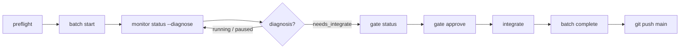

# Operator runbook (real projects)

Daily procedures for running pi-spine batches on a **consumer repository** — install through land loop, recovery, and Taskplane coexistence. Use this with the [bootstrap checklist](./bootstrap-checklist.md) for first-time setup.

**Normative behavior:** [PRD §12–18](../PRD.md) (gates, reconciliation, journal). This runbook is procedural, not a spec duplicate.

---

## Before you start

| Doc | When |
|-----|------|
| [local-install.md](./local-install.md) | First install from git checkout |
| [bootstrap-checklist.md](./bootstrap-checklist.md) | Greenfield or Taskplane migration |
| [upstream-execution-workflow.md](./upstream-execution-workflow.md) | PRD → task packets → batch (optional [zero-pi](https://pi.dev/packages/@gonrocca/zero-pi) or [spec-kit](https://github.com/github/spec-kit) upstream) |
| [real-pi-e2e.md](./real-pi-e2e.md) | Optional real-`pi` validation on adoption fixture |

**CLI choice:** Prefer the published global CLI; pin a checkout path when developing pi-spine itself or when PATH drift is a concern:

```bash
# Recommended — published release (re-install after version bumps)
npm install -g pi-spine
# or: pi install npm:pi-spine

# Development — replace with your pi-spine checkout path
export SPINE="/absolute/path/to/pi-spine/bin/spine.mjs"
alias spine="node $SPINE"

# Or, after npm link from the checkout:
# alias spine="spine"   # global on PATH — re-link after git pull
```

Throughout this doc, `spine` means whichever invocation you chose (global `npm install -g`, `node …/bin/spine.mjs`, or linked checkout).

### Attached-first policy (Phase 22)

Until you trust detached batches on a repo, prefer **attached** mode so the CLI blocks until the engine finishes:

```bash
spine batch start SP-042 --attached
spine batch resume --attached
```

Default detached `start`/`resume` return when the engine **starts**, not when work completes. After detached return, always run `spine status --diagnose`.

**Single attached engine:** only one foreground `--attached` engine may own a batch at a time. `resilience.enginePid` is checked before attached `start`/`resume`. If that PID is still alive, the CLI fails fast with `attached_engine_already_running`. Use `spine batch resume --attached --force` to orphan the prior engine (`engine.orphan_terminated` in the journal) before handoff — do not run two `spine.mjs batch … --attached` processes for the same batch.

After `engine_orphaned`, `worker_orphaned`, `worker_done_missing`, or `state_drift`, detached `resume` defaults to `--wait-terminal` (blocks until terminal phase). Pass `--no-wait-terminal` for the old quick-return behavior.

**Orphan recovery tree:**

1. `spine status --diagnose` — read headline and `suggestedCommand`
2. `state_drift` → retry affected task, then `spine batch resume --force`
3. `engine_orphaned` or `worker_orphaned` with dead PIDs → run the **`suggestedCommand`** (usually `spine batch retry <id>`). **No `batch pause` first** — retry reconciles orphan `running` tasks to `failed` and journals `task.failed` / `lane.died` when missing (SP-315). Then `spine batch resume --attached` or `--force` as diagnose suggests. `worker_done_missing` → `spine batch retry <id>` only (worker already exited — do not use orphan-resume paths). When journal shows `batch.resumed` + `worker.rules_selected` with both PIDs dead, diagnosis upgrades to `engine_orphaned` — `spine batch retry <id>` or `spine batch resume --attached --force` (detached resume waits up to 2h by default).
4. Never hand-edit `.spine/batch-state.json`

---

## 1. Install

On the **consumer** repo (your application, not the pi-spine repo):

```bash
# Slash commands + pi extension (required for /spine-*)
pi install /absolute/path/to/pi-spine -l

# Optional: global CLI for shells and CI
cd /absolute/path/to/pi-spine && npm link

# First-time spine layout
spine init

# Taskplane migrants — preview then apply
spine migrate-from-taskplane --dry-run --source .pi/taskplane-config.json
spine migrate-from-taskplane --source .pi/taskplane-config.json
```

Verify:

```bash
spine doctor
spine version   # confirms global npm link resolves (npm bin is a symlink to bin/spine.mjs)
```

Global `npm link` / `npm install -g` invokes `spine` through a symlink on `PATH`. If `spine version` prints package and Node info, the CLI entrypoint is wired correctly (SP-099).

In pi: `pi list` should show `pi-spine`; try `/spine-plan pending`.

Details: [local-install.md](./local-install.md).

### 1.1 Cursor rules (FR-WORK-05)

When the consumer repo has `.cursor/rules/`, spine workers receive **auto-selected** rule files in their prompt tail (not the full rules tree). Full design: [cursor-rules-discovery.md](../design/cursor-rules-discovery.md).

| File | Purpose |
|------|---------|
| `.spine/rules-profile.json` | Always-include (`taskplane-worker-cursor.mdc` by default), never-include, discovery exclusions |
| `.spine/rules-manifest.json` | **Committed** inventory from last discovery scan |
| `config.standards` | Explicit paths that **append** after auto-selection (deduped) |
| `config.neverLoad` | Blocklist for all injected docs |

**After changing rules:**

```bash
spine rules sync
git add .spine/rules-manifest.json
git commit -m "chore: refresh rules manifest"
```

**Preview what a task will load:**

```bash
spine rules select --task SP-042
```

**Doctor warnings:**

| Code | Fix |
|------|-----|
| `RULES_MANIFEST_MISSING` | `spine rules sync` |
| `RULES_MANIFEST_STALE` | `spine rules sync` (rescan differs from committed manifest) |

Glob-triggered language packs match PROMPT **File Scope** via micromatch. Empty File Scope still loads profile always-includes and `alwaysApply` rules. Tune `.spine/rules-profile.json` or add paths to `config.standards` when workers miss expected rules.

**Journal audit:** batch journal events `worker.rules_selected` list `paths`, `mode`, and cap metadata per worker spawn.

---

## 2. Task validation and preflight

**Human pre-batch gates:** Before your first batch (or after major decomposition), walk the [authoring approval checklist](./authoring-approval-checklist.md) — approve upstream spec/plan conversion, then run validate → analyze → plan → preflight. Authoring gates are operator habits; execution gates (`spine gate approve` after the wave) are separate — see the checklist comparison table.

### 2.1 Validate task packets (v1.3 — FR-UXB-02)

Run **before** `spine batch start` when authoring or editing `PROMPT.md` files. This is the same gate as upstream authoring — see [upstream-execution-workflow.md](./upstream-execution-workflow.md) Path 1 step 3.

**When to run:**

| Trigger | Command |
|---------|---------|
| After editing any `PROMPT.md` | `spine tasks validate <task-id>` or `spine tasks validate pending` |
| Before every batch | `spine tasks validate pending` (also runs inside `spine preflight`) |
| CI / automation | `spine tasks validate pending --json` (exit 0 pass, 1 validation fail, 2 config error) |

```bash
spine tasks validate pending
spine tasks validate pending --json
spine tasks validate SP-042 --warnings-only   # advisory STATUS/deps warnings only
```

**Scope:** `pending` (no `.DONE`), explicit task IDs, or `all` (every discovered packet). Scoped plans validate only selected tasks; `spine plan all` fails if any discovered packet is invalid.

Catches invalid headings, missing sections, missing Testing step, Size XL, and (v2.0) missing or invalid `## Contract` — the same rules as the planner (`prompt_parse_failed` at worker launch).

**Fixing validation errors:**

| Error pattern | Fix |
|---------------|-----|
| `em dash` / invalid heading | Use `# Task: SP-042 — Title` with U+2014 em dash, not hyphen |
| `Missing required sections` | Add Mission, Dependencies, File Scope, Steps, Completion Criteria, Do NOT |
| `Testing` / missing Testing step | Add `### Step N: Testing & Verification` under Steps |
| `Contract` missing or empty | Add `## Contract` table (§2.3) or set `contract.mode: "optional"` during migration |
| Size XL | Split into dependent S/M tasks (`skills/create-spine-tasks`) |

### 2.2 Preflight

Run **before every batch** (FR-BATCH-11). Fails fast on dirty git, active batch, broken deps, or orchestrator conflict.

```bash
spine tasks validate pending  # v1.3 — explicit validate before preflight
spine plan pending            # optional — see waves and lanes
spine preflight
spine preflight --json        # automation / CI
```

**Plan pending idle state (issue #99):** When all discovered tasks have `.DONE` on disk, `spine plan pending` prints a friendly summary (excluded count, `→ spine plan all` hint) and exits 0. No stack trace. JSON mode (`--json`) returns a synthetic empty plan with `tasksSelected: 0` and `tasksExcluded: N`.

| Check | What it catches |
|-------|-----------------|
| Doctor | Node, git, pi, config, agents, coexistence |
| Git clean | Uncommitted changes in working tree (`.pi/` session metadata ignored — same treatment as `.spine/runtime/` via `spine init` gitignore) |
| No active batch | Stale `.spine/batch-state.json` or Taskplane `.pi/batch-state.json` |
| Tasks + deps | Discoverable `PROMPT.md`, valid `dependencies.json` |
| Tasks validate (v1.3) | Invalid PROMPT packets for pending scope |
| Wave plan | Same planner output as `spine plan` (invalid PROMPTs fail here with actionable errors) |

When validate, `spine plan`, or preflight fails with `Invalid PROMPT for …` or `PROMPT validation failed for N task(s):`, fix the listed `PROMPT.md` files before retrying. Fix `suggestedCommand` from failed preflight before `batch start`. Do **not** hand-edit `.spine/batch-state.json`.

### 2.3 Contract authoring (v2.0 — FR-CDO-01)

New `SP-*` tasks require a `## Contract` section in `PROMPT.md` when `contract.mode` is `"required"` (default after `spine init`). Legacy `TP-*` tasks skip Contract validation via `legacyTaskIdPrefixes`.

```markdown
## Contract

| Field | Value |
|-------|-------|
| testCommand | `npm test -- tests/example.test.mjs` |
| fileScopeMustChange | `src/example.mjs` |
| minLineCoverage | 77 |
```

**testCommand output limits (issue #86, SP-426):** Contract verification captures stdout/stderr from `testCommand` with a **10MB** `maxBuffer` (raised from 256KB). Full-suite commands such as `flutter test` with thousands of tests can exceed smaller limits and fail with exit 255 and truncated output. Prefer **scoped** commands — e.g. `flutter test test/widget_test.dart` or `npm test -- tests/feature.test.mjs` — instead of unscoped full-suite runs. If output still exceeds 10MB, the verifier fails with an explicit `maxBuffer` message naming the command; narrow `testCommand` scope rather than disabling contract checks.

| `contract.mode` | Behavior |
|-----------------|----------|
| `required` | Missing or empty Contract fails `spine tasks validate` for non-legacy task IDs |
| `optional` | Missing Contract warns only; present Contract must be syntactically valid |
| `legacy` | Contract section ignored for validation and final-review verifier |

**Migration tip:** Dogfood repos with 100+ legacy packets can start with `contract.mode: "optional"`, add Contract to new `SP-*` tasks, then flip to `"required"` when backlog is updated. Taskplane migrants keep `TP-*` on legacy behavior regardless of global mode.

**Pre-landed implementation warning (issue #56):** When implementation for a pending task was already merged to `main` before the batch runs, `fileScopeMustChange` paths may not diff in a new lane — final contract verification can fail repeatedly. Before batch start:

- `spine preflight` and `spine plan` emit a **⚠️ Pre-landed contract risk** warning when pending tasks have `fileScopeMustChange` paths that changed on `main` since the task PROMPT was first added.
- `spine tasks validate pending --warnings-only` lists the same advisory per task.

**Recovery:** Amend `PROMPT.md` **## Contract** before batch start — e.g. point `fileScopeMustChange` at delivery artifacts (`STATUS.md`, `.DONE`) when source code is already on `main`, and document the pre-land in **## Amendments** (see SP-358/SP-359). Do not start the batch until the contract matches how the task will actually land.

Authoring guidance: [create-spine-tasks skill](../../skills/create-spine-tasks/SKILL.md) and [upstream-execution-workflow.md](./upstream-execution-workflow.md).

**Environment overrides** (optional, FR-CFG-04):

```bash
SPINE_TASKS_ROOT=alt-tasks spine plan pending
SPINE_MAX_LANES=2 spine batch start pending
spine settings show lanes.maxParallel   # shows env vs file source
```

---

## 3. Start and monitor

### Start a batch

Detached by default — the CLI returns while the engine runs in the background.

```bash
spine preflight

# Single task (recommended for implementation work)
spine batch start TP-012

# Pending backlog (tasks without .DONE or .SUPERSEDED) — prefer IDs from plan output
spine plan pending
spine batch start pending

# Multi-task (one wave, disjoint file scopes)
spine batch start TP-043 TP-045 TP-046

# Preview only
spine batch start TP-012 --dry-run

# Foreground engine (blocks until batch ends)
spine batch start TP-012 --attached

# Do not paste stale plan IDs for superseded parent tasks (.SUPERSEDED marker).
# Batch start rejects them; use child replacement IDs from the marker or `spine plan pending`.
# Deliberate rerun only: spine batch start SP-257 --force-superseded
```

**Stub workers** (CI, no real `pi`):

```bash
SPINE_WORKER_STUB=1 spine batch start <task-id>
```

#### Stub batch delivery (issue #67, SP-408)

Stub mode (`SPINE_WORKER_STUB=1`) runs `bin/spine-worker-runner.mjs --stub`, which writes `.DONE` but does **not** implement application code. Lane commit still enforces `fileScopeMustChange` via `verifyStubFileScopeMustChange` ([SP-349](https://github.com/beettlle/pi-spine/issues/33) / [#40](https://github.com/beettlle/pi-spine/issues/40)) — stub workers must produce a diff on every contracted path or lane commit fails with `Stub worker completed without required file-scope changes`.

**Auto STATUS delivery (SP-408):** When `## Contract` `fileScopeMustChange` is **delivery-only** (only `spine-tasks/<id>/STATUS.md`, `.DONE`, or task-folder delivery globs such as `spine-tasks/<id>/**`), the stub runner calls `writeStubDeliveryStatusIfNeeded` **before** writing `.DONE`. It updates `**Current Step:**` and `**Status:**` in `STATUS.md` (or appends a minimal completion block). Contracts that list only `.DONE` rely on the existing `.DONE` write — no STATUS touch.

| `fileScopeMustChange` scope | Stub runner behavior |
|-----------------------------|----------------------|
| Delivery-only (`STATUS.md`, `.DONE`, `spine-tasks/<id>/**`) | Auto-writes STATUS when required; writes `.DONE` |
| Implementation paths (`src/**`, `bin/**`, `tests/**`, …) | **No auto-touch** — lane commit fails unless the stub or operator changes those files |
| Mixed delivery + implementation | Treated as implementation — manual lane work or real `pi` worker required |

**Pre-landed implementation (issue #56, SP-373):** When implementation was already merged to `main` before the batch runs, amend `PROMPT.md` **## Contract** to point `fileScopeMustChange` at delivery artifacts (`STATUS.md`, `.DONE`) and document the pre-land in **## Amendments** (see [§2.3 Pre-landed implementation warning](#pre-landed-implementation-warning-issue-56)). SP-373 satisfies pre-landed **implementation** paths at verify time when `testCommand` and artifacts pass — it does not replace stub STATUS delivery for amended delivery-only contracts. Preflight warns on stale implementation scope ([SP-374](https://github.com/beettlle/pi-spine/pull/374)).

**Operator recovery when stub delivery is insufficient:**

1. Confirm contract scope in `PROMPT.md` — delivery-only vs implementation.
2. For implementation tasks in stub batches, either run a real `pi` worker (`unset SPINE_WORKER_STUB`) or manually edit scoped files + `STATUS.md` in the lane worktree before retry.
3. `spine batch retry <taskId>` then `spine batch resume` after lane worktree fixes.

Regression coverage: `tests/batch/stub-runner-delivery.test.mjs`, `tests/batch/contract-stub-delivery.test.mjs`.

**Real pi workers:**

```bash
unset SPINE_WORKER_STUB   # or SPINE_WORKER_STUB=0
spine batch start <task-id>
```

**pi-web-access extension conflicts (issue #104):** When both `npm:pi-web-access` and a local dev checkout appear in `~/.pi/agent/settings.json`, pi may fail worker spawn with `Tool "web_search" conflicts with …`. Batch workers pass **`pi -ne`** only when `spine doctor` detects duplicate pi-web-access sources (so Cursor provider extensions still load when there is no conflict). `spine doctor` warns when duplicate pi-web-access sources are detected. Fix: `pi remove npm:pi-web-access -l` or remove the local path entry — keep only one source. Worker output logs append an actionable hint when spawn fails with extension tool conflicts.

**Contract verify vs reviewer failure (issue #85):** When final `contract.verified` fails (`ok: false`), the engine records **`contract_failed`** (not `review_exhausted`) and does **not** re-run the worker or consume `maxFinalAttempts`. Journal includes `contract.failed`; run-metrics uses `failureKind: contract`. Edit `PROMPT.md` `testCommand` / scope, then `spine batch retry <id>`.

### Worker backend default (FR-SHIP-09)

**Default:** `lanes.workerBackend: subprocess` — lane workers spawn `pi -p` via `bin/spine-worker-runner.mjs`. This is the validated production path ([stub-free dogfood](../compatibility/stub-free-dogfood-report.md)).

| Backend | Config | When to use |
|---------|--------|-------------|
| **subprocess** (default) | `lanes.workerBackend: subprocess` or omit key | All routine batches; real-pi and attached-first workflows |
| **agentSession** (opt-in) | `spine settings set lanes.workerBackend agentSession` | Single-lane trials of in-process `createAgentSession`; requires `@earendil-works/pi-coding-agent` peer |

**Rules:**

- `SPINE_WORKER_STUB=1` **always** forces the subprocess stub — never agentSession (CI / tests).
- Reviewers remain subprocess (`review.mjs`) regardless of worker backend until a future reviewer backend ships (spike blocker B1).
- Before first agentSession batch: `npm install @earendil-works/pi-coding-agent`, `spine doctor`, then `./scripts/stub-free-dogfood.sh --agent-session`.
- Promotion to default requires land-loop dogfood sign-off — see [agent-session dogfood report](../compatibility/agent-session-dogfood-report.md) (SP-219 decision: **subprocess remains default**).

`spine doctor` reports the effective worker backend (subprocess default or opt-in agentSession with peer check). `spine preflight` includes doctor — confirm the worker backend line before starting a batch.

### Agent model pins (pi inheritance vs spine-config)

Spine passes `pi --model` and `pi --thinking` from `.spine/spine-config.json` when `agents.worker.model` / `agents.reviewer.model` are set and **not** `inherit` (SP-232). Reviewers already honored pins; workers now do too.

| `agents.*.model` | Worker/reviewer behavior |
|------------------|--------------------------|
| `cursor/auto` (greenfield default after `spine init`) | Explicit pin — batch agents use Cursor auto, not pi's global default |
| `inherit` | Opt-in — pi uses global `defaultProvider` / `defaultModel` from `~/.pi/agent/settings.json` (project `.pi/settings.json` overrides) |
| Other provider/id | Passed verbatim to `pi --model` |

**Use canonical pi model ids, not TUI display labels.** Pi's model picker shows labels like `gemini-3.1-pro-preview [google]`; spine-config and `pi --model` require the canonical id `google/gemini-3.1-pro-preview` from `pi --list-models`. `spine settings set` normalizes display labels when they match a listed model; `spine doctor` fails when pins use display labels or unknown ids.

```bash
pi --list-models | rg gemini
spine settings set agents.reviewer.model google/gemini-3.1-pro-preview
spine doctor   # agent model ids (canonical) must pass before real-pi batches
```

**Why pin by default:** Real-pi stress batches (2026-06-12) used `inherit` while pi's global default was **lmstudio** (`pi-lmstudio` → `http://127.0.0.1:1234`). `spine doctor` "model provider configured" showed the first listed model (`cursor/auto`), but lane workers inherited LM Studio and failed with unloaded models or missing MLX backends.

**Operator checklist before real-pi batches:**

```bash
spine settings show agents.worker.model
spine settings show agents.reviewer.model
spine doctor   # warns when inherit + pi defaultProvider lmstudio
```

**Opt into inheritance** (interactive pi session parity):

```bash
spine settings set agents.worker.model inherit
spine settings set agents.reviewer.model inherit
```

Only use `inherit` when you intentionally want batch workers to follow your pi TUI model selection.

### Cross-model PROMPT authoring (issue #84)

When worker and reviewer use **different models** (e.g. worker `cursor/auto`, reviewer `google/gemini-3.1-pro-preview`), PROMPT and Contract shape directly affect review outcomes. The most common cross-model failure pattern is `review_exhausted` / `contract_failed` caused by broad `testCommand` or missing reviewer context — not code quality rejection.

**Scoped `testCommand`:** Lane worktrees are not identical to the developer checkout. Pre-existing full-suite failures, missing assets, and Flutter/monorepo pollution cause unscoped `testCommand` to fail at final contract verify even when targeted tests pass. Prefer scoped commands that match the PROMPT Testing step:

| Avoid | Prefer |
|-------|--------|
| `` `flutter test` `` or `` `npm test` `` (full suite) | `` `flutter test test/unit/services/foo_test.dart` `` |
| `` `npm test` `` without verifying lane compatibility | `` `npm test -- tests/feature.test.mjs` `` |
| Docs-only tasks with implementation test command | `` `true` `` |

See [contract-template.md § Cross-model authoring](../../skills/create-spine-tasks/references/contract-template.md#cross-model-authoring-worker--reviewer) for the full `testCommand` decision table.

**Self-contained PROMPT:** Cross-model reviewers spawn as **fresh sessions** (FR-REV-04) with no memory of the worker session. They receive a bounded rule subset via `profile.reviewer.*` (FR-REV-08) — not `referenceDocs`, not worker execution rules, and limited to a 16 KiB rule cap. Place acceptance criteria, spec references, and "done means" in PROMPT `## Mission`, `## Contract`, and step checkboxes. Do not assume the reviewer read domain plans or `referenceDocs` unless quoted in PROMPT.

**Reviewer context preview:**

```bash
spine rules select --role reviewer --review-type plan --task SP-042
spine rules select --role reviewer --review-type code --task SP-042
```

**Related engine issues:** [#78](https://github.com/beettlle/pi-spine/issues/78), [#80](https://github.com/beettlle/pi-spine/issues/80) (lane worktree setup hook and analyzer hygiene).

### Monitor

```bash
spine status                    # headline + suggested next command
spine status --diagnose         # verbose signals (use this daily)
spine status --json
spine watch                     # compact one-line reconcile poll (default 5s)
spine watch --json --once       # single NDJSON snapshot for scripts/monitors
spine watch --interval 10       # slower poll interval in seconds
spine wait --until completed,needs_integrate,failed,aborted --timeout 2h  # CI: block until terminal diagnosis
spine wait --until completed,failed --json --timeout 30m  # emit final reconcile snapshot on match or timeout
spine next                      # print suggestedCommand only
```

### Monitoring cookbook

Part of the [Operator monitoring toolkit epic (#43)](https://github.com/beettlle/pi-spine/issues/43). First-class CLI surfaces: [#30](https://github.com/beettlle/pi-spine/issues/30) (`status --json` progress), [#44](https://github.com/beettlle/pi-spine/issues/44) (`watch`), [#45](https://github.com/beettlle/pi-spine/issues/45) (`journal follow`), [#46](https://github.com/beettlle/pi-spine/issues/46) (`wait`). All call the same `reconcileBatch` / journal helpers as the dashboard (NFR-OBS-04) — do not fork parallel monitor scripts.

| Question | Command |
|----------|---------|
| What is the headline diagnosis and suggested next step? | `spine status --diagnose` |
| What is the one-line suggested command only? | `spine next` |
| Live compact reconcile poll in the terminal (default 5s)? | `spine watch` |
| Single reconcile snapshot for scripts or CI? | `spine watch --json --once` or `spine status --json` |
| Block until diagnosis reaches a target set (CI/automation)? | `spine wait --until completed,needs_integrate,failed,aborted --timeout 2h` |
| Live control-plane journal events as they append? | `spine journal follow` |
| Journal follow scoped to one lane? | `spine journal follow --lane lane-1` |
| Raw jsonl journal lines for parsers? | `spine journal follow --json` |
| Visual multi-panel view (lanes, gate, journal)? | `spine dashboard` (§7) |
| Detached engine stderr or crash mid-run? | `.spine/runtime/detached-engine.log` |
| Post-mortem timeline table or jsonl export? | `spine journal export --batch <batchId> --format markdown` |
| Ordered replay of a completed batch (not live)? | `spine journal replay --batch <batchId>` |

**Typical combinations:**

- **Daily attached-first:** `spine batch start … --attached` — engine blocks; use a second terminal for `spine journal follow` or `spine dashboard` if you want live context.
- **Detached batch:** after start/resume returns, run `spine watch` or `spine status --diagnose` until diagnosis changes; add `spine journal follow` when you need event-level detail (stall, orphan, review).
- **CI pipeline:** `spine batch start pending --json` then `spine wait --until completed,failed --json --timeout 30m`; parse the final snapshot stdout.

Tier 2 surfaces (`lane.progress_snapshot`, `spine lane logs --follow`, dashboard lane detail) are tracked under epic #43 ([#48](https://github.com/beettlle/pi-spine/issues/48)–[#51](https://github.com/beettlle/pi-spine/issues/51)). Tier 3 agent event streaming remains deferred ([#52](https://github.com/beettlle/pi-spine/issues/52)).

**Journal read cache ([#98](https://github.com/beettlle/pi-spine/issues/98)):** orchestrator hot paths (`collectProgressSignals`, attached milestone reporter, dashboard snapshot) share an mtime-keyed journal read cache. When the journal file has not changed since the last read, the cached parsed events are reused — reducing CPU during idle monitoring loops. The cache invalidates automatically when the file mtime changes (e.g. after `appendJournalEvent`). Test code should call `clearJournalCache()` for isolation.

**`spine status --json` progress fields (issue #30):** when a batch is active, JSON output includes task and wave progress at the top level:

| Field | Meaning |
|-------|---------|
| `succeededTasks` | Tasks in terminal success state |
| `pendingTasks` | Tasks still resumable (`pending` / `running` or matching segment status) |
| `totalTasks` | Tasks in the batch plan |
| `currentWaveIndex` | Zero-based wave index from batch state |
| `waveCount` | Total waves (`totalWaves` or `wavePlan.length`) |

Idle repos omit these fields. `spine watch --json` wraps the same reconcile fields and may nest them under `progress` when present.

`spine watch` wraps the same `reconcileBatch` path as `spine status` without `--diagnose` verbosity. Human mode refreshes one line (diagnosis, batchId, macro phase, headline). `--json` emits newline-delimited snapshots with `observedAt`, reconcile fields, and a `progress` block when SP-339 / issue #30 fields are present on the reconcile result.

`spine wait` reuses the same reconcile poll interval as `spine watch` (default 5s, overridable with `--interval`). It blocks until `diagnosis` is in the `--until` set, exits **0** on match and **1** on `--timeout`. With `--json`, stdout receives one final reconcile snapshot (match or timeout) for CI parsers — no continuous NDJSON stream.

Detached engine logs: `.spine/runtime/detached-engine.log`

**Detached start/resume return contract:** default detached `spine batch start` and `spine batch resume` return as soon as batch-state shows the engine has started (`status: engine_started`, `phase: running`). That means the background engine is running — not that the resumed task or batch finished. After a default detached return, run `spine status --diagnose` to confirm workers, PIDs, and journal progress.

Optional `--wait-terminal` on start or resume blocks until the batch reaches a terminal phase (`completed` / `failed` / `aborted`), pauses, or (on resume) the resumed task reaches a terminal task status — then returns `status: start_completed` or `resume_completed`.

Live journal follow and replay:

```bash
spine journal follow [--batch <batchId>] [--lane lane-N]
spine journal replay --batch <batchId>
```

**Journal export (FR-SHIP-08):** attach a human-readable timeline or raw jsonl to incident reports and consumer pilot evidence.

```bash
# Markdown timeline table (default for post-mortems)
spine journal export --batch <batchId> --format markdown

# Raw jsonl (machine-readable audit trail)
spine journal export --batch <batchId> --format jsonl

# Write to file instead of stdout
spine journal export --batch <batchId> --format markdown --output ./journal-timeline.md
```

Both formats read `.spine/runtime/<batchId>/journal/events.jsonl` and exit non-zero when the journal is missing.

**Journal structural rebuild vs Babysitter replay (FR-SHIP-10):** pi-spine rebuilds **orchestration control-plane state** from the append-only journal — not agent work. `spine status --diagnose` compares cached `.spine/batch-state.json` against a journal rebuild and surfaces `state_drift` when they disagree.

| Capability | pi-spine (v2.2) | Babysitter |
|------------|-----------------|------------|
| Timeline audit | `spine journal replay` / `export` | Full event log |
| Task status / batch phase | Rebuilt from lifecycle events (`task.started`, `task.completed`, …) | Full state reconstruction |
| Lanes, wave plan, branches | Derived from structural events (`batch.started`, `lane.provisioned`, `task.started`, …) when present | Process-definition driven |
| Agent / worker re-execution | **Not supported** — journal records boundaries only | `run:iterate` deterministic replay |
| Runtime-only fields | `resilience.*`, PIDs, `taskFolder`, segments may require cache seed or filesystem | N/A (harness-owned) |

**Operator implications:**

- **`state_drift`** usually means the journal has a terminal lifecycle event the cache missed (common after retry success, crash, or a **stale detached engine** still writing `.spine/batch-state.json` after pause/resume). Inspect `spine journal follow` (or `spine journal replay --batch <batchId>`) for `engine.orphan_terminated`. If batch already landed on `main`, kill orphan `spine.mjs batch` PIDs and run `spine batch complete` to clear cache; otherwise `spine batch retry <id>` or `spine batch resume --force`.
- **Incident tails** often start mid-batch (resume wedge, orphan stall). Structural rebuild without cache seed still derives lanes/tasks from `task.started`, but `wavePlan` and `taskFolder` may need the existing batch-state cache — regression coverage lives in `tests/batch/journal-rebuild-incidents.test.mjs`.
- **Do not expect** pi-spine to replay pi worker sessions or re-run agent code from the journal alone; use lane worktrees, `.DONE`, and evidence bundles for that audit trail.

**Diagnosis quick map** (full taxonomy: PRD §18.3):

| `diagnosis` | Meaning | Typical next step |
|-------------|---------|-------------------|
| `running` | Workers active | Wait; use dashboard or `--diagnose` |
| `paused` | Operator or engine paused | `spine batch resume` |
| `needs_retry` | Failed or dead worker task | `spine batch retry <id>` or skip |
| `needs_retry` + `DirtyWorktree` | Lane worktree dirty after worker completion (often `extension/coverage/`) | `git checkout -- extension/coverage && spine batch retry <id>` |
| `needs_retry` + `review_exhausted` | Final review REVISE cap reached | Fix implementation or packet scope, then `spine batch retry <id>` |
| `needs_retry` + `contract_failed` | Final `contract.verified` failed | Edit `PROMPT.md` scope, then `spine batch retry <id>` |
| `worker_orphaned` | Lane worker PID dead while task still `running` | `spine batch retry <id>` or `spine batch abort` |
| `worker_done_missing` | Worker exited without `.DONE` (early pi exit) | `spine batch retry <id>` — inspect worker output log in headline |
| `engine_orphaned` | Batch engine died mid-run | `spine batch retry <id>` when task still `running`, else `spine batch resume --attached` |
| `nested_batch_spawn_blocked` | Worker or extension tried to start a nested batch inside a lane worktree | No action needed — guard prevented the rogue engine. Check worker/extension config if unexpected |
| `needs_merge` | Wave done, merge blocked | Fix failures or `force-merge` |
| `needs_integrate` | Orch ahead of `main` | Land loop (§4) |
| `completed` | Batch terminal, merged | `spine batch complete` if not archived |
| `limbo_stale` / `completed_manual` | Tasks green, batch record stale | `dismiss` or `complete --detect-manual-merge` |
| `failed` / `aborted` | Terminal error | `retry`, `resume --force`, or `dismiss` |
| `merge_blocked` phase | Lane→orch merge failed; batch halted | Resolve conflicts on `orch/spine-<batchId>`, then `spine batch resume --force` |

**Phase vs diagnosis vs macro phase** — three distinct operator labels:

| Field | Source | Role | Example |
|-------|--------|------|---------|
| `phase` | Batch-state cache (`batch-state.json`) | Raw engine phase string | `running`, `merging`, `completed` |
| `diagnosis` | Reconciliation (`deriveDiagnosis`) | Actionable next step | `needs_retry`, `needs_integrate`, `limbo_stale` |
| `macroPhase` / `macroPhaseLabel` | Lifecycle rollup (`deriveMacroPhase`) | Stable high-level batch lifecycle | `Executing`, `Gating`, `Integrating`, `Completed` |

`spine status` prints all three when a batch is active (macro phase always, including `Idle` when no batch). `spine status --diagnose` adds `macroPhase` inside verbose signals. Diagnosis headline and `suggestedCommand` remain driven by `diagnosis` only — macro phase does not replace them.

In pi: `/spine-status` mirrors reconciliation.

### Supervisor deferred (FR-SHIP-11)

pi-spine v2.2 **does not** ship Taskplane-style **supervisor mail** or an **autonomous monitor agent** that polls batch health and nudges workers. FR-SHIP-11 records an explicit defer: operators monitor batches themselves using CLI diagnosis, the dashboard banner, and the recovery paths in this runbook.

**Primary monitor surfaces:**

| Surface | Entry | Role |
|---------|-------|------|
| CLI diagnosis | `spine status --diagnose` | Daily signal — `diagnosis`, headline, `suggestedCommand`, lane health |
| Dashboard banner | `spine dashboard` or `/spine-dashboard` | Same reconciliation fields as `--diagnose`; diagnosis badge and copyable action chips (§7) |
| Runbook recovery | §6 Resume/dismiss/complete, §9 Troubleshooting, [Stall diagnosis](#stall-diagnosis-5-minute-path) | Operator-driven recovery when workers stall, engine orphans, or integrate gates block |

The supervisor agent template (`.spine/agents/supervisor.md`, copied on `spine init`) documents v1 no-agent behavior and optional project notes. The batch engine **does not** spawn a supervisor Pi session in v2.2.

**Optional stretch (out of v2.2 scope):** a minimal supervisor session that polls batch health and journals `supervisor.nudge` events — only if consumer pilot feedback shows dashboard + `--diagnose` are insufficient. See [PRD v2.2 §2.1 FR-SHIP-11](../PRD-v2.2-ship-readiness-handoff.md#fr-ship-11-design-decision).

### Agent observability stream deferred (#52)

pi-spine v2.2 and Phase 46 deliver **orchestration-tier** monitoring (`spine watch`, `spine journal follow`, `lane.progress_snapshot`, live lane worker logs). They do **not** stream structured pi agent events (tool calls, assistant messages, step boundaries) in real time.

That **Tier 3** capability is deferred per [GitHub #52](https://github.com/beettlle/pi-spine/issues/52) and PRD §4.2 (deterministic LLM/tool replay remains a non-goal). Explore findings — journal vs per-lane SSE options, redaction, and phasing after SP-360–367 — live in [`spine-tasks/_explore/operator-observability-stream/findings.md`](../../spine-tasks/_explore/operator-observability-stream/findings.md).

**Operator workaround today:** `spine journal follow` for control-plane events; `spine lane logs --follow` (when enabled) for redacted worker output; attach to the pi TUI session in the lane worktree for full transcript visibility.

---

## 4. Land loop

After a successful wave (all tasks succeeded or skipped, lane merges into `orch/spine-<batchId>`), merge orch → `main` and archive the batch record.



**Copy-paste sequence** (run from project root when `spine status --diagnose` shows `needs_integrate`):

```bash
spine status --diagnose
spine gate status
# Review evidence under .spine/runtime/<batchId>/evidence/
spine gate approve
spine integrate
spine batch complete
git push origin main
```

Dry-run integrate:

```bash
spine integrate --dry-run
```

When `gates.requireBeforeIntegrate` is true (default after `spine init`), `spine integrate` **refuses** until the gate is approved.

**Rules-manifest drift on `main` before integrate:** Lane workers may refresh `.spine/rules-manifest.json` on the base worktree (e.g. after `spine rules sync` or new `.cursor/rules/` entries). If the gate is approved and the **only** dirty path is the manifest:

| Drift kind | Integrate behavior |
|------------|-------------------|
| `generatedAt` only (rules[] fingerprint matches `main` HEAD) | Auto-restores HEAD; merge applies orch manifest |
| Worker entries on `main` matching orch fingerprint | Auto-restores HEAD; merge lands orch manifest (no manual commit — [#22](https://github.com/beettlle/pi-spine/issues/22)) |
| Manifest differs from both `main` HEAD and orch | Refused — commit or stash, then re-run |
| Any other dirty file on `main` (legacy) | Previously refused; **interim (SP-436):** allowed — integrate uses isolated plumbing merge and leaves your working tree untouched |

**Concurrent development (interim — FR-WT-08 slice 1):** `spine integrate` no longer checks out `main` in your project root. When you stay on `main` with uncommitted edits, integrate uses an isolated plumbing merge so lane land can proceed; your working tree is left as-is. After integrate, run `git status` — uncommitted files remain until you commit or stash them. Full `spine sync-base` / `human_base_diverged` diagnosis ships in SP-443 ([#91](https://github.com/beettlle/pi-spine/issues/91)).

Multi-wave batches: repeat monitor → land loop **between waves** if the plan has multiple dependency waves. pi-spine does not auto-integrate mid-batch. For the full multi-wave procedure driven by an external agent (pi, OpenCode, Cursor), see **[agent-orchestrated-waves.md](./agent-orchestrated-waves.md)**.

#### Planner wave sequences (`spine run sequence`)

For multi-wave **planner sequences** (chained `batch start` → land loop per wave), use:

```bash
# Dry-run the operator command script per wave
spine run sequence pending --dry-run

# Unattended land loop between waves (stub/CI only)
SPINE_WORKER_STUB=1 spine run sequence pending --auto-approve-gate

# Real pi workers: manual gate approval between waves (default)
spine run sequence pending
```

`--auto-approve-gate` calls `spine gate approve` automatically in the inter-wave land loop. Safety gates (SP-390) **block** the flag for real pi workers unless you also pass `--force` after reviewing the risk. Stub mode (`SPINE_WORKER_STUB=1`) is the supported path for CI and unattended test sequences.

### 4.1 Integrate merge conflicts (FR-SHIP-12)

When `spine integrate` merges `orch/spine-<batchId>` into `main` and git reports a conflict, pi-spine **aborts the merge** and restores your previous checkout. `main` is left unchanged. The CLI prints a `MergeConflict` headline and journals `integrate.failed` with `conflict: true`.

**Automatic resolution (only one case):** `.spine/rules-manifest.json` when both sides have identical `rules[]` and only `generatedAt` differs (lane merge and integrate). If `rules[]` differ, merge fails loud — run `spine rules sync` on one branch, commit, and retry.

**Not shipped in v2.2:** Taskplane-style **merger LLM agent** for conflict resolution ([PRD §4.2](../PRD.md#42-non-goals-v1)). Operators resolve conflicts with git, then re-run the land loop. Spike rationale: [integrate-conflict-recovery.md](../design/integrate-conflict-recovery.md).

#### Recognize

| Signal | Meaning |
|--------|---------|
| `spine integrate` exit code 1 | Integrate refused or merge failed |
| Headline contains `Merge conflict integrating` | Orch → `main` conflict after gate approval |
| Journal `integrate.failed` with `conflict: true` | Auditable failure — export with `spine journal export` |
| `git status` on `main` without `MERGING` | Fail-closed abort succeeded (expected after failed integrate) |

```bash
spine status --diagnose
spine journal export --batch <batchId> --format markdown
git status
git branch --show-current   # expect main (or branch you were on before integrate)
```

#### Manual recovery (orch-first — preferred)

Use when batch lane work on the orch branch is correct but `main` moved during the batch (another operator merged, hotfix, etc.).

1. Note the orch branch from `--diagnose` (e.g. `orch/spine-20260614T004041`).
2. Check out the orch branch and bring in `main`:

   ```bash
   git checkout orch/spine-<batchId>
   git merge main    # or: git rebase main
   ```

3. Resolve conflict markers in your editor; run tests if the touched paths are critical.
4. Commit on the orch branch.
5. Return to the land loop on `main`:

   ```bash
   git checkout main
   spine integrate
   spine batch complete
   git push origin main
   ```

Gate approval from before the failed integrate attempt remains valid unless you rejected it or changed orch content materially — if unsure, run `spine gate status` before re-integrating.

#### Manual recovery (merge on main)

Use when you prefer a single merge commit on `main` or orch history is messy.

1. Confirm no merge in progress: `git status` (no `MERGING` state).
2. Check out `main` and merge orch manually:

   ```bash
   git checkout main
   git merge --no-ff orch/spine-<batchId>
   ```

3. Resolve conflicts, commit, then complete the batch without re-running integrate:

   ```bash
   spine batch complete
   git push origin main
   ```

Only use this path when the resulting `main` tip matches what integrate would have produced. If `spine batch complete` refuses (orch still ahead), run `spine integrate` after your manual merge or use `--detect-manual-merge` per §6.

#### Lane merge conflicts (before integrate)

Conflicts during **lane → orch** wave merge surface as `needs_merge` or failed wave merge — not during `spine integrate`. Typical causes: overlapping File Scope across parallel lanes, or editing the same file on `main` and in a lane.

| Diagnosis | Action |
|-----------|--------|
| `merge_blocked` phase | Resolve conflicts on `orch/spine-<batchId>` in git; `spine batch resume --force`. Resume skips waves that already have `mergeResults.status=succeeded`. |
| `needs_merge` | Fix failed lane(s); `spine batch retry <taskId>` or `spine batch resume --force` after resolving git state in lane worktrees |
| `needs_merge` + gitignored paths in `lastError` | On the lane task branch: `git rm -r --cached -- <gitignored-paths>` (e.g. committed `coverage/` or `__pycache__`), commit, then `spine batch resume --force`. Diagnosis headline mentions gitignored merge failure. |
| `DirtyWorktree` after PASS with only `**/coverage/**` dirty | Regenerated coverage reports from `npm test` are ephemeral when not in task File Scope — pi-spine restores or excludes them at lane commit ([SP-427](https://github.com/beettlle/pi-spine/issues/73)). Prefer `.gitignore` for generated coverage; if reports stay committed, expect engine hygiene rather than task failure. |
| `DirtyWorktree` after PASS with only `worktreeSetupHook` symlink deletions (e.g. ` D assets/bundled_skins`) | Hook-managed symlinks can drift when workers or tooling remove them — pi-spine re-runs `worktreeSetupHook` before the dirty gate, then ignores remaining deletion-only drift when a hook is configured ([SP-429](https://github.com/beettlle/pi-spine/issues/87)). List hook paths in `worktreeSetupIgnorePaths` only when you need basename ignores without re-running the hook. |
| `DirtyWorktree` after PASS with only `graphify-out/**` dirty | [Graphify post-commit hook](#graphify-post-commit-hook-vs-spine-batches) rebuilds `graphify-out/` in the background after lane commits — pi-spine excludes gitignored hook output when [SP-463](https://github.com/beettlle/pi-spine/issues/113) lands; until then, add `graphify-out/` to `.gitignore` and `git rm -r --cached graphify-out/` on repos that track it |
| rules-manifest only | Usually auto-resolved; if not, `spine rules sync` + commit on one side |
| `docs/adoption/*` (e.g. operator-runbook) | Engine auto-merges disjoint additive hunks (table rows, cross-links) via 3-way merge; overlapping edits fail with recovery commands in `lastError` |
| `docs/PRD.md` (release-recovery / merge-origin-main) | Engine auto-merges disjoint additive PRD edits (e.g. lane merged `origin/main` while orch advanced earlier waves); overlapping hunks fail with `lastError` recovery commands |
| Other files | Resolve in the lane worktree under `.worktrees/spine-<batchId>/lane-N`, commit on lane branch, then resume batch |

Lane worktrees: [Worktree layout](#worktree-layout) (§9).

### 4.2 Integrate sync timeout (issue #114)

When `spine integrate` lands the merge commit on the base ref but the post-merge worktree sync (`syncPlumbingMergePathsToWorktree`) exceeds the timeout, pi-spine journals `integrate.failed` with `timeout: true` and `mergeCommitLanded: true`, then returns `failureClass: "IntegrateTimeout"`. The merge ref is safe — the orch branch is already merged into `main` — but the working tree may not reflect the new HEAD.

**Default timeout:** 60 seconds per git subprocess. Override with `SPINE_SYNC_TIMEOUT_MS` (milliseconds).

#### Recognize

| Signal | Meaning |
|--------|---------|
| `spine integrate` exit code 1 with `IntegrateTimeout` | Sync timed out after merge landed |
| Headline contains `timed out after merge landed` | Worktree sync failed; ref is safe |
| Journal `integrate.failed` with `timeout: true, mergeCommitLanded: true` | Merge commit is on the ref; only worktree is stale |

#### Recovery

1. Confirm the merge landed: `git log --oneline -3 main` — the merge commit should appear.
2. Sync the working tree manually:

   ```bash
   git checkout main
   git reset --hard main
   ```

3. Re-run the land loop:

   ```bash
   spine integrate
   spine batch complete
   git push origin main
   ```

4. If the timeout recurs, raise the limit: `SPINE_SYNC_TIMEOUT_MS=120000 spine integrate`.

**Root cause:** git subprocess hangs on lock contention, credential prompts, or large file counts during per-file `git show` / `git add` in `syncPlumbingMergePathsToWorktree`.

#### Reject and rework

When conflicts indicate bad batch scope or unacceptable merge risk:

```bash
spine gate reject --reason "integrate conflict — rework scope"
# Edit tasks, new batch, or manual git recovery per PRD §18.6
```

Emergency bypass (journaled, not for routine conflict resolution):

```bash
SPINE_ALLOW_FORCE=1 spine integrate --force-integrate
```

---

## 5. Gate races

The integrate gate opens **after** the batch engine finishes the wave and writes terminal batch state. Approving or integrating too early is the most common operator timing mistake.

### Symptoms

| Symptom | Cause |
|---------|--------|
| `No integrate gate found for this batch` | Batch still `running` or merge not finished |
| `Integrate blocked — no gate record` | Same — gate not opened yet |
| `Integrate gate already approved` | Harmless — proceed to `spine integrate` |
| Gate pending but orch not ahead of `main` | Manual git state; run `--diagnose` |

### Recovery

1. Wait for detached engine to finish (or use `--attached` on start).
2. Confirm batch phase:

   ```bash
   spine status --diagnose
   # expect diagnosis: needs_integrate (or completed with orch commits)
   ```

3. If gate missing but diagnosis is `needs_integrate`, check evidence dir exists, then:

   ```bash
   spine gate status
   spine gate approve    # retry — idempotent if already approved
   spine integrate
   ```

4. Never approve while `diagnosis: running`. Dashboard integrate panel stays pending until the engine opens the gate.

Reject path:

```bash
spine gate reject --reason "tests red on evidence review"
# fix work, then new batch or manual recovery per PRD §18.6
```

Emergency bypass (journaled, not for routine use):

```bash
SPINE_ALLOW_FORCE=1 spine integrate --force-integrate
```

### 5.1 Worker `spine_request_gate` (FR-SHIP-13 — v2.2)

Lane workers register `spine_request_gate`, but **cannot open or refresh any human gate** in v2.2. All gate kinds return structured `not_supported` (`integrate`, `manual`, `conflict`). Workers must not approve integrate gates or create gate records — that stays operator/host CLI.

| Worker need | Operator workaround |
|-------------|-------------------|
| Batch ready to land on `main` | From **host shell** (not inside a worker session): `spine gate status` → review `.spine/runtime/<batchId>/evidence/` → `spine gate approve` → `spine integrate` |
| Worker blocked mid-step | Update task `STATUS.md`, commit step work, call `spine_report_progress`; monitor with `spine status --diagnose` or dashboard stall signals |
| Worker called `spine_request_gate` | Expect `notSupported: true` and `suggestedCommand: spine gate approve` — do not retry in a loop; operator acts from host |

In pi (operator session): `/spine-gate approve` delegates to `spine gate approve`.

Design reference: [worker-gate-inventory.md](../design/worker-gate-inventory.md).

---

## 6. Resume, dismiss, complete

### Resume (paused or failed)

```bash
spine batch resume                  # detached; returns engine_started
spine batch resume --wait-terminal  # block until task/batch terminal
spine batch resume --attached       # foreground
spine batch resume --force          # after stale segment state; skips already-succeeded tasks
```

`--force` on resume resets failed tasks to pending and continues the batch. Tasks that already reached terminal success in journal and batch-state (`task.completed`, `lane.committed`, `.DONE` on the lane branch) are **not** re-run through contract verification or review — only pending, retried, or still-failed segments are scheduled. This prevents a single-task retry from regressing unrelated succeeded lanes in the same wave.

Default detached resume success means **engine started**, not resume finished. Use `--wait-terminal` when you need the CLI to block until the resumed task or batch reaches a terminal state; otherwise monitor with `spine status --diagnose`.

Multi-task paused batches resume **all** pending lanes in one command. Tasks assigned to the same physical lane run **sequentially** (one worker at a time on that worktree); tasks on different lanes still run in parallel. The journal records `lane.tasks_serialized` when a lane queue has more than one pending task in a wave.

### Retry and skip

```bash
spine batch retry TP-012
spine batch skip TP-012
spine batch force-merge --wave 0    # mixed-outcome override, then resume --force
```

In pi: `/spine-retry-task TP-012`, `/spine-skip-task TP-012`.

When `spine batch skip` clears the last failed task, batch phase moves to **`paused`** (not `failed`) so `spine batch resume --force` can merge. Reconcile no longer reports `needs_retry` when all tasks are terminal-success/skipped but merge has not run. Segment status is set to `skipped` and `failedTasks` is recomputed to zero.

When `spine batch retry` clears the last failed task, the batch transitions from `failed` to **`paused`**, journals `batch.retry_unblocked`, and clears batch-level failure markers (`lastError`, `endedAt`, `resilience.lastFailureClass`). Run `spine batch resume` (or `--force` if batch-state still shows `phase: failed` with only pending tasks). Do not dismiss and cold-start unless you intend to abandon the batch.

### Replan (v1.3 — FR-UXB-04)

When final review returns `REPLAN` (wrong scope in `PROMPT.md`), `spine status --diagnose` reports `diagnosis: needs_replan`. REPLAN blocks wave merge until the packet is fixed.

```bash
spine status --diagnose    # expect diagnosis: needs_replan
spine journal follow       # look for task.verdict_recorded verdict: REPLAN
```

**Retry flow:**

1. Read reviewer feedback in `{taskFolder}/.reviews/final-*.md`.
2. Edit `PROMPT.md` (scope, steps, dependencies, or Contract).
3. `spine tasks validate <taskId>` — confirm packet is valid before retry.
4. `spine batch retry <taskId>` then `spine batch resume`.

Alternatives: `spine batch skip <taskId>` to unblock the wave, or abandon via dismiss per §18.6.

| Diagnosis | Meaning | Blocks merge? |
|-----------|---------|---------------|
| `needs_replan` | Final review REPLAN — edit PROMPT | Yes |
| `needs_retry` | Worker/review failure — fix code | No (retry in place) |

### Operator handoff (v1.3 — FR-UXB-05)

Before closing your IDE, switching machines, or pausing overnight — write batch state for the next operator session. Complements upstream session handoff in [upstream-execution-workflow.md](./upstream-execution-workflow.md) (pi-spine handoff is batch-scoped; zero-pi `/zero-resume` is pi-session-scoped).

```bash
spine handoff              # writes .spine/handoff.md
spine next                 # suggested next command
spine status --diagnose    # confirm diagnosis before handoff
```

In pi: `/spine-handoff`. Handoff summarizes batch diagnosis, pending tasks, and suggested next command — not full pi conversation history.

### Pause and abort

```bash
spine batch pause
spine batch abort                   # graceful — worker may finish step
spine batch abort --hard            # SIGKILL + worktree cleanup
```

When a **live attached engine** (foreground `spine batch start --attached` / `resume --attached`) is running, `spine batch pause` writes `phase: paused` to batch-state (bypassing the engine write guard) and waits for that phase to **persist without regression** through the grace window. Only after confirmation does the CLI record `batch.paused` in the journal. If the engine keeps overwriting batch-state back to `running`, the CLI **fails loud** with `pause_not_confirmed`, journals `batch.pause_failed` only (no orphan `batch.paused`), and reverts phase to `running`. Do not assume pause succeeded from journal alone — check `grep phase .spine/batch-state.json` or `spine status --diagnose`.

**Recovery when pause fails:** stop the attached engine (Ctrl+C or kill the engine PID), confirm `phase: paused` or run `spine batch pause` again, then `spine batch retry <taskId>` when you need to reset a failed task. `spine batch retry` is allowed when phase is **`paused`** or **`failed`**, not while phase is **`running`**.

### Orphan running (zombie batch)

When `spine status --diagnose` shows `engine_orphaned` or `needs_retry` with a **worker died** headline while batch-state still says `phase: running`, the detached engine or lane worker exited without writing a terminal journal event (common after kill -9, OOM, or host crash mid-resume).

1. Confirm diagnosis: `spine status --diagnose` (never trust plain `running` when PIDs are dead).
2. Inspect journal: `spine journal follow` — expect `task.started` / `lane.heartbeat` then silence.
3. Check detached engine log: `.spine/runtime/detached-engine.log`.
4. Recover (follow **`suggestedCommand`** from step 1):
   - **`engine_orphaned` / `worker_orphaned`:** `spine batch retry <taskId>` — reconciles orphan `running` → `failed` automatically; **no `batch pause` first** (SP-315).
   - **`engine_orphaned` (no named task):** `spine batch resume --attached` (SP-284/SP-297).
   - `spine batch abort` when no task is active or work should be discarded.
   - `spine batch resume --force` after retry when phase is `failed`, or when diagnose suggests resume with dead engine PID.

Batch-state records `resilience.enginePid` and lane `workerPid` for liveness checks during reconciliation.

Incident narratives: [`20260603-orphan-running-resume.md`](../incidents/20260603-orphan-running-resume.md) (single-task resume silence), [`20260604-resume-parallel-lane-orphan.md`](../incidents/20260604-resume-parallel-lane-orphan.md) (forced multi-task resume, parallel lane-1, batch `20260603T224829`).

### Resume engine crash (fail-closed)

When the detached resume engine throws (for example a broken lane worktree during `commitLaneWorktree`), pi-spine should leave **`phase: failed`**, append **`batch.failed`** to the journal, mark ghost **`running`** tasks as **`failed`**, and clear **`resilience.enginePid`**. This is the fail-closed path — not the orphan/zombie case above where the process exits without writing terminal state.

1. Confirm: `spine status --diagnose` — expect **`failed`**, not **`running`**.
2. Inspect journal: `spine journal follow` — look for **`batch.failed`** with `reason: engine_error` and the git/worktree message.
3. Check detached engine log: `.spine/runtime/detached-engine.log`.
4. Recover:
   - `spine batch retry <taskId>` when a failed task is named in the headline.
   - `spine batch resume --force` after retry clears stale segment state.
   - `spine batch abort` when work should be discarded.

If diagnosis is still **`engine_orphaned`** with **`phase: running`**, the engine died without hitting the fail-closed handler — use the orphan steps above.

### Final review spawn timeout (`final_review_timeout`)

When the journal shows **`review.started`** (final or code) with **no** matching **`review.completed`** / **`review.failed`**, and lane `pi` reviewer children stay alive past the stall budget, the engine was blocked on a hung reviewer spawn (batch `20260617T164948`, SP-279).

**Symptoms:** `phase: running`, multiple tasks stuck `running` with `.DONE` in lane worktrees, pending wave tasks never scheduled, engine PID alive, last journal line is `review.started` for final review.

**Recovery:**

1. Inspect journal tail: `.spine/runtime/<batchId>/journal/events.jsonl` — look for `review.failed` with `reason: review_timeout` after SP-279 (fail-closed terminal event).
2. If still hung on pre-fix engine: `spine batch resume --force` after confirming reviewer PIDs are stale, or wait for reviewer timeout (`SPINE_REVIEW_TIMEOUT_MS` / per-task stall budget).
3. Retry failed lane: `spine batch retry <taskId>` then `spine batch resume --attached --force`.

Reviewer spawn uses **async** `pi` with timeout aligned to **`resolveReviewSpawnTimeoutMs`** (same stall budget as workers). Override for tests or emergencies: `SPINE_REVIEW_TIMEOUT_MS`.

### Hung reviewer with on-disk artifact (`artifact_ready`)

When the journal shows **`review.started`** followed by **`review.completed`** with **`honorReason: artifact_ready`**, the engine honored a terminal on-disk review artifact while the reviewer `pi` child was still running (batch `20260618T000943`, SP-282/SP-294, issue #5).

**Symptoms (pre-fix):** reviewer wrote APPROVE to `{taskFolder}/.reviews/{step}-*.md` within minutes, but the engine waited the full **`resolveReviewSpawnTimeoutMs`** (~90 minutes for S tasks) before **`spawn_timeout_with_done`** honor.

**Expected (post-fix):** completion within poll interval plus mtime quiescence (typically seconds with defaults), hung child terminated, journal **`review.completed`** with **`honorReason: artifact_ready`**.

**Operator action:** Usually none — the batch proceeds. If an artifact exists but honor did not trigger, confirm the file contains a parseable terminal verdict (APPROVE/PASS) and is not still being written. Diagnostic overrides only: `SPINE_REVIEW_ARTIFACT_POLL_MS`, `SPINE_REVIEW_ARTIFACT_QUIESCENCE_MS`.

### Final review nested spawn (`final_review_spawn_failed`)

When the real-pi **worker** finishes (`.DONE` on disk) but the batch fails with **`final_review_spawn_failed`** / journal **`review.failed`** reason **`nested_spawn_blocked`**, the spine CLI inherited **`SPINE_WORKER_RUNNER`** from an active pi worker session (SP-195). Reviewer spawn is intentionally blocked inside worker sessions.

### In-worker `spine_review_step` skip (SP-278)

When workers call **`spine_review_step`** inside a pi worker session, the tool returns **`skipped: true`** with exit 0 (not `isError`). Journal records **`review.skipped`** with `reason: nested_spawn_blocked` instead of **`review.failed`**. This is expected — the batch engine runs plan/code/final review after worker `.DONE`.

Workers should **not** retry or treat the skip as failure. Task PROMPTs for real-pi batches should not require in-worker review calls (see `skills/create-spine-tasks/references/prompt-template.md`).

### Resume stall after `worker.rules_selected` (SP-309 / issue #13)

**Symptoms:** `batch resume --attached --force` restarts the worker (`task.started` with `resumed: true`, `worker.rules_selected`), then journal freezes and both `enginePid` and `workerPid` are dead. Diagnosis may show `engine_orphaned` when the journal tail includes `batch.resumed` + `worker.rules_selected`.

**Recovery:**

1. `spine status --diagnose` — prefer `spine batch resume --attached --force` when headline cites engine death after resume stall.
2. Detached `spine batch resume --force` (without `--attached`) defaults to `--wait-terminal` for orphan diagnoses and blocks up to **2 hours** while the attached child engine runs.
3. If plan `review.failed` with `nested_spawn_blocked` is still in the journal (pre-SP-278 PATH), retry the task first: `spine batch retry <taskId>`.

### Worker exited without `.DONE` (SP-313 / issue #18)

**Symptoms:** Task fails in seconds with journal `lane.died` → `task.failed`, output `pi exited but .DONE was not created`, `doneFound: false`, `changedFileCount: 0`. `spine status --diagnose` reports **`worker_done_missing`** (not `worker_orphaned` or generic `needs_retry`). Headline cites `.spine/runtime/<batchId>/lanes/lane-<N>/worker-output-<taskId>.log` and the last worker output lines.

**Cause:** pi or agent session exited before writing `.DONE` — launch/config error, prompt rejection, or early tool failure. This is **not** an orphan stall (worker PID already exited and batch-state marks the task failed).

**Recovery:**

1. Read the worker output log path from `--diagnose` headline (or `spine journal follow` → `task.failed` → `workerOutputLogRef`).
2. Fix the underlying blocker (config, PROMPT, credentials, model error) in the lane worktree if needed.
3. Retry in place:

   ```bash
   spine batch retry <taskId>
   spine batch resume --attached
   ```

**Do not** use `spine batch resume --attached --force` orphan recovery — the worker already terminated cleanly without completing the task.

### Plan review `review.failed` + `worker_orphaned` (SP-308 / batch 20260619T020951)

**Symptoms:** Journal shows **`review.started`** (plan, step 0) then **`review.failed`** with `reason: nested_spawn_blocked` (not **`review.skipped`**). Dashboard later reports **`worker_orphaned`** for the same task (~14h stall in batch `20260619T020951` / SP-306).

**Cause:** Stale global **`spine` on PATH** (e.g. v1.0.1) running pre-SP-278 behavior, or operator invoked review from a worker session before skip semantics landed.

**Recovery:**

1. `spine doctor` — if **stale PATH spine** is reported, run `npm link` from the checkout or use `node bin/spine.mjs` for all batch commands.
2. `spine status --diagnose` — headline should cite plan `nested_spawn_blocked` and suggest **`spine batch retry <taskId>`** (or `node bin/spine.mjs batch retry …` when PATH is stale).
3. Retry and resume:

   ```bash
   spine batch retry SP-306
   spine batch resume --attached --force
   ```

**Prevention:** `spine preflight` fails when PATH `spine` version ≠ package (SP-308). Prefer `node bin/spine.mjs batch start …` when developing pi-spine itself.

1. Confirm worker output exists: lane worktree `.DONE`, file-scope artifacts, plan review APPROVE in journal.
2. Run recovery from a **clean shell** (unset worker session env — at minimum `SPINE_WORKER_RUNNER`, `SPINE_JOURNAL_ATTACH`, `SPINE_BATCH_ID`, `SPINE_PROJECT_ROOT`):

   ```bash
   spine batch retry <taskId>
   spine batch resume --attached --force
   ```

3. Resume with `.DONE` on disk skips re-spawn and commits the lane; proceed with gate → integrate → complete.

Consumer pilot evidence: batch `20260614T002449` (SP-233), adoption fixture temp repo.

### Dismiss and complete (terminal limbo)

When tasks are green but the batch record is stale (common after Taskplane manual recovery):

```bash
spine status --diagnose

# Work already merged to main manually:
spine batch complete --detect-manual-merge

# Clear batch without claiming merge:
spine batch dismiss --reason "manual recovery"

# Normal happy path after integrate:
spine batch complete
```

**Never** edit `.pi/batch-state.json` or `.spine/batch-state.json` by hand. pi-spine archives to `.spine/runtime/<batchId>/archive/` first.

**Crash-safe persistence:** `.spine/batch-state.json` and `.spine/runtime/<batchId>/gate.json` are written atomically (temp file + rename). A crash mid-write should leave the previous file intact or the new complete file — never torn partial JSON. The append-only journal and run-metrics paths are unchanged.

---

## 7. Dashboard

Local SSE UI for batch, lanes, gate, and journal (default port **8109**, avoids Taskplane 8099).

```bash
spine dashboard
spine dashboard --port 8110
```

In pi: `/spine-dashboard`

- URL prints on listen (e.g. `http://127.0.0.1:8109`)
- **Default view** (always visible): diagnosis banner (`headline`, `suggestedCommand`, action chips) and integrate gate status when applicable — same reconciliation fields as `spine status` (no `--diagnose` required). Banner badge color follows **`diagnosis`**, not macro phase.
- **Active batch panels** (when a batch is reconciled): batch summary (raw `phase` + **macro phase** label), wave progress (wave index + macro phase), lane table (includes **Phase** column — worker/review activity inferred from journal events; **Elapsed**, **Done**, and **Rate** throughput columns — task-based elapsed time, completed task count, and tasks/hr derived from journal and run-metrics), journal tail
- **Read-only** — run CLI commands from your terminal (action chips copy suggested commands)
- Keep the dashboard terminal open while it runs

Configure port in `.spine/spine-config.json`:

```json
"dashboard": { "port": 8109 }
```

When `diagnosis` is `needs_integrate`, the banner uses integrate styling even if raw `phase` is `completed`.

### 7.1 Run metrics (v1.3 — FR-UXB-06)

After batches complete, inspect per-task outcomes (model, duration, final verdict, contract result):

```bash
spine metrics show
spine metrics show --batch 20260610T140000
spine metrics show --batch 20260610T140000 --json
spine metrics show --last 20
```

| Field | Meaning |
|-------|---------|
| `laneNumber` | Lane that executed the task (1-based) |
| `durationMs` | Wall-clock task duration from `startedAt` to `endedAt` (milliseconds) |
| `finalVerdict` | `PASS`, `REVISE`, or `REPLAN` from final review |
| `contractOk` | Machine contract verifier result |
| `finalAttempts` | Final review attempt count (capped by `review.maxFinalAttempts`) |
| `outcome` | `completed`, `failed`, or `skipped` |

Data appends to `.spine/run-metrics.jsonl` when `metrics.enabled` is true (default). The path is added to `.gitignore` by `spine init`. If the file was committed before upgrading, `spine doctor` warns with `git rm --cached .spine/run-metrics.jsonl`; until then, preflight ignores append-only changes to that path. Disable collection with `"metrics": { "enabled": false }` in `.spine/spine-config.json`. v1.3 collects metrics only; `spine settings suggest-models` is deferred to v1.4. `spine doctor` hints when the metrics file exists.

---

## 8. Taskplane coexistence

Do **not** run Taskplane `/orch` and `spine batch start` on the same repo concurrently (PRD §22.1).

`spine doctor` and `spine preflight` inspect both:

- `.spine/batch-state.json` (pi-spine)
- `.pi/batch-state.json` (Taskplane)

| Situation | Action |
|-----------|--------|
| Active Taskplane batch | Finish or dismiss Taskplane batch before spine start |
| Migrating | `spine migrate-from-taskplane`, stub batch, then retire `/orch` |
| Dual active (error) | `spine doctor` names both IDs — dismiss one orchestrator |
| Taskplane limbo, tasks green | `spine batch dismiss` or `complete --detect-manual-merge` |

Same task folders (`taskplane-tasks/`, `PROMPT.md`, `dependencies.json`) work in both systems; only one orchestrator should own batch state at a time.

---

## 9. Troubleshooting

### Dev verification (pi-spine repo)

When developing or contributing to **pi-spine itself**, run these from the repo root after `npm ci`:

```bash
npm run lint
npm run typecheck && SPINE_WORKER_STUB=1 npm test
npm run coverage:check
```

`npm run lint` runs ESLint on `src/`, `bin/`, `tests/`, and `scripts/` (baseline warns on existing debt; CI fails on errors only). GitHub Actions runs lint after typecheck on every push and pull request to `main`.

`npm run typecheck` runs TypeScript on `extensions/**/*.ts` plus batch hot-path modules (`src/batch/engine.mjs`, `worker-host.mjs`, `worktree.mjs`, `src/config/spine-config-load.mjs`) via `tsconfig.batch.json` and per-file `// @ts-check`.

### Scenario fixture registry

Central catalog for incident replays, stub batches, adoption fixtures, and test recipes. **Source of truth:** `tests/fixtures/scenarios/registry.json` (schema version 1). Module API: `src/fixtures/scenario-registry.mjs`.

| `kind` | Meaning | `fixturePath` |
|--------|---------|---------------|
| `incident` | Batch-state + journal tail for orphan/retry/resume regression | Required — JSON under `tests/fixtures/incidents/` |
| `stub` | Generated or README-only stub replay (e.g. SAT-020 stall) | Required |
| `adoption` | Git-backed consumer layout for install/batch drills | Required — directory under `tests/fixtures/` |
| `recipe` | Test-driven scenario without a dedicated fixture dir | Optional |

**Inspect the catalog** (pi-spine repo root; requires SP-332 `spine scenarios` CLI):

```bash
spine scenarios list
spine scenarios list --json
spine scenarios show adoption-smoke
spine scenarios show adoption-smoke --json
```

`list` prints one line per scenario: `id`, `kind`, and `title` (sorted by id). `show` prints all registry fields for one id (`description`, `fixturePath`, `batchId`, `tests`, `docs`, `relatedTasks`, `tags`). `--json` emits a single object or array for automation.

**Materialize incident/stub fixtures** (dev/dogfood only — writes `.spine/batch-state.json` and journal tail into the target repo):

```bash
spine scenarios materialize orphan-running-resume
spine scenarios materialize orphan-running-resume --force   # when active batch present
```

Materialize does **not** start a batch. Refuses when `.spine/batch-state.json` shows an active batch unless `--force` is passed.

**Adoption smoke recipe** (`adoption-smoke` in the registry): operator entry point for pre-publish validation — typecheck plus stub adoption tests (no network, no real `pi`):

```bash
./scripts/adoption-smoke.sh
```

Equivalent targeted run:

```bash
npm run typecheck
SPINE_WORKER_STUB=1 node --test tests/adoption/fixture-batch.test.mjs tests/adoption/replan-needs-replan.test.mjs
```

Related registry entry `adoption-repo` points at the consumer fixture under `tests/fixtures/adoption-repo/` (AD-001 stub batch, AD-002 real-pi). See [bootstrap checklist](./bootstrap-checklist.md#adoption-fixture-smoke-target).

### `node bin/spine.mjs` vs global `spine`

| Symptom | Fix |
|---------|-----|
| `spine: command not found` | `npm link` from checkout, or `node /path/to/pi-spine/bin/spine.mjs …` |
| Global `spine` exits 0 with no output | Fixed in SP-099 — upgrade and run `spine version`; should print package info |
| Doctor warns **stale global spine** | `which spine` points at old build — re-`npm link` or use `node …/bin/spine.mjs`; **`spine preflight` fails** when PATH version ≠ package (SP-308) |
| Slash commands work, CLI wrong version | Pi uses linked package; shell uses stale PATH binary |
| CI / scripts | `SPINE_BIN="node ../pi-spine/bin/spine.mjs"` (see `./scripts/adoption-smoke.sh`) |

**Rule of thumb:** Developing pi-spine itself → always `node bin/spine.mjs` from repo root. Consumer pilot → `npm link` or explicit `node` path after every `git pull`.

### Task sizing vs batch stalls

Oversized task packets and wide parallel waves are the main cause of **stall_timeout** on real `pi` workers (workers alive but no checkpoint progress).

| Practice | Why |
|----------|-----|
| Target **S/M** tasks (≤4 implementation steps) | Fits stall grace + review cycles |
| Split **L/XL** epics into dependent tasks | Avoids 60m+ silent pi runs |
| Run **≤4** parallel M tasks per wave; land between waves | Batch `20260603T225112` stalled 5/8 tasks at once |
| Set `lanes.stallTimeoutMinutes` ≥ **120** for real `pi` | Template default; doctor warns if unset/low |
| Use PROMPT **Size:** S/M/L | Engine applies per-task floor (SP-088): M→180m, L→300m |
| Operator matrix / 2h+ external jobs | Add `stallTimeoutMinutes: 240` (or higher) to task `## Contract` (SP-314); optional `extendGraceOnFileScope: true` when only `STATUS.md` changes during the run |

`spine doctor` warns on oversized **pending** packets (XL, >4 steps, wide file scope). `skills/create-spine-tasks` documents decomposition rules.

#### Contract stall override (SP-314)

When a single task runs a long external job (matrix arms, remote CI) with little lane git/STATUS checkpoint progress, raise the **per-task** stall budget in `## Contract` instead of the global `lanes.stallTimeoutMinutes`:

```markdown
## Contract

| Field | Value |
|-------|-------|
| testCommand | `npm run typecheck && SPINE_WORKER_STUB=1 npm test` |
| stallTimeoutMinutes | 240 |
| extendGraceOnFileScope | true |
```

The engine applies `max(global, size floor, contract.stallTimeoutMinutes)` for both the worker stall loop and `SPINE_WORKER_PI_TIMEOUT_MS`. Set `extendGraceOnFileScope: true` when the worker only touches in-scope `STATUS.md` during the external phase (batch `20260620T043504` / SP-029 pattern).

### Stall diagnosis (5-minute path)

When a lane dies with `stall_timeout` or frozen heartbeats, use this flow before re-running a long batch. Full design: [stall-recovery-improvements-brief.md](../features/stall-recovery-improvements-brief.md).

```bash
spine status --diagnose
# Journal tail: .spine/runtime/<batchId>/journal/events.jsonl
```

| Step | What to look for | Action |
|------|------------------|--------|
| 1 | `lane.checkpoint_warning` | File-scope edits without commit — commit step work + `spine_report_progress` |
| 2 | `lane.stall_killed` → `logPath` | Read `.spine/runtime/<batchId>/lanes/lane-N/worker-output-<taskId>.log` for stderr tail |
| 3 | `lane.salvage_inspection` | Note `changedFileCount` / `dirtyPaths` — valid WIP may exist without `.DONE` |
| 4 | `task.failed` | Confirm non-empty `output` and `classification` |
| 5 | Retry | `spine batch retry <taskId>` (diagnose may suggest this when salvageable) |

**Lane config** (`.spine/spine-config.json` → `lanes`):

| Key | Default | Meaning |
|-----|---------|---------|
| `stallTimeoutMinutes` | 120 (template); 60 if unset | Hard silence timeout; use ≥120 for real `pi` workers |
| `stallGraceAfterProgressMinutes` | **30** (`spine init` template); **15** code fallback when unset | Extra grace after STATUS/commit/`task.step_completed` |
| `checkpointWarningMinutes` | 10 | Warn when file-scope activity lacks checkpoint |
| `extendGraceOnFileScope` | false | File-scope mtime must **not** extend stall grace |
| `workerOutputMaxBytes` / `workerOutputTailLines` | 262144 / 200 | Bounded worker log on terminal failure |
| `autoCommitOnStall` | false | Opt-in WIP commit on stall (§18.5 lane branch); default off |

**Contract config** (`.spine/spine-config.json` → `contract`, v2.0):

| Key | Default | Meaning |
|-----|---------|---------|
| `mode` | `required` | `required` — `## Contract` mandatory for non-legacy tasks; `optional` — warn only when missing; `legacy` — ignore Contract section |
| `legacyTaskIdPrefixes` | `["TP-"]` | Task IDs matching these prefixes use legacy Contract behavior regardless of `mode` |

Missing keys are merged on `loadSpineConfig` from template defaults (SP-141). Invalid `contract.mode` values fail config load with `CONFIG_CONTRACT_MODE_INVALID`.

**Stall grace default (template vs code):** `templates/spine-config.json` sets `stallGraceAfterProgressMinutes: 30` (SP-087 — longer grace for real `pi` workers). `src/batch/heartbeat.mjs` falls back to **15** only when the key is missing or zero in the loaded config. After `spine init`, the on-disk value is **30**; do not assume 15 unless you removed the key.

**Retry with salvage:** `autoCommitOnStall: false` (default) leaves uncommitted scoped work on the lane branch for human review before retry. When `autoCommitOnStall: true`, one scoped `wip(<taskId>): stall salvage …` commit may be created; atomic retry (§18.5) keeps that commit on the lane branch.

### Contract `fileScopeMustNotChange` failures (issue #63)

When journal `contract.verified` shows `testCommand` **pass** but `fileScopeMustNotChange` **fail**, code review may still APPROVE — the batch fails on contract gate only (`review_exhausted`).

**Symptom:** `contract.verified` payload with `field: fileScopeMustNotChange`, `ok: false`, and messages like:

```text
Contract fileScopeMustNotChange: forbidden change spine-tasks/SP-001/STATUS.md
Contract fileScopeMustNotChange: forbidden change spine-tasks/SP-001/.DONE
```

#### Serialized lane scoped verify (issue #62, SP-416)

When the planner serializes multiple tasks on one lane (`lane.tasks_serialized`), final contract verify scopes `fileScopeMustChange` and `fileScopeMustNotChange` to **this task only**:

| Mechanism | Behavior |
|-----------|----------|
| `resolveTaskStartCommit` | Reads journal `task.started` / prior `lane.committed` to find the lane HEAD at task start |
| Scoped diff | `taskStartCommit..HEAD` via `verifyContract` `sinceCommit` — excludes prior same-lane task commits |
| First task on lane | No prior anchor — falls back to cumulative `main...HEAD` (same as single-task lanes) |
| Parallel lanes | Unchanged — each lane branch typically has one active task per wave |

Regression coverage: `tests/batch/contract-verify-serialized.test.mjs` (task 2 passes `fileScopeMustNotChange` for paths only task 1 committed when `sinceCommit` is set).

**Cause (remaining failure patterns):**

| Pattern | Why it fails |
|---------|--------------|
| `spine-tasks/**` in `fileScopeMustNotChange` | Workers must update `STATUS.md`, write `.DONE`, and may write `.reviews/` — orchestration artifacts, not product scope violations |
| Current task folder in must-not-change | Same — blocks required delivery paths for the running task |
| True scope violation on this task | Scoped diff still flags files the **current** worker changed in forbidden paths |

`fileScopeMustNotChange` is for **parallel lane** collision detection (concurrent lanes editing the same product path). On serialized lanes, scoped verify (SP-416) prevents false failures from prior same-lane commits; use disjoint `fileScopeMustChange` paths when `spine plan` reports overlap — do not rely on must-not-change for queue ordering.

**Fix:**

1. Edit `PROMPT.md` **## Contract** — remove `spine-tasks/**` and the current task folder from `fileScopeMustNotChange`.
2. Keep only product paths that parallel lanes must not touch, e.g. `extension/**`, `.spine/**` (not `spine-tasks/**`).
3. For failures on paths the **current** task legitimately touched, narrow must-not-change patterns or fix the worker scope — prior same-lane task paths should not fail after SP-416 when journal resolution succeeds.
4. `spine tasks validate <taskId>` then `spine batch retry <taskId>` and `spine batch resume`.

Authoring reference: [contract-template.md](../../skills/create-spine-tasks/references/contract-template.md#filescopemustnotchange-semantics).

### Graphify post-commit hook vs spine batches

When [graphify](https://github.com/beettlle/graphify) is installed with `graphify hook install`, the **post-commit** hook (`.git/hooks/post-commit`) launches a background rebuild of `graphify-out/` after **every** commit — including spine lane commits in `.worktrees/spine-<batchId>/lane-N/`.

**Observed pattern** (issue [#113](https://github.com/beettlle/pi-spine/issues/113)):

After a successful lane commit, `git status --porcelain` in the lane worktree may show:

```text
 M graphify-out/.graphify_labels.json
 D graphify-out/.rebuild.lock
 M graphify-out/cache/stat-index.json
?? graphify-out/.pending_changes
?? graphify-out/cache/ast/v0.9.4/<hash>.json
```

Spine classifies this as **`DirtyWorktree`** → `task.failed` → wave **`merge_blocked`** even when task implementation succeeded. The same hook output on the **main checkout** can fail preflight **git clean** before batch start.

**Mitigation (consumer repos — do this before spine batch dogfood):**

1. Add `graphify-out/` to `.gitignore` (generated cache — do not track in git).
2. If `graphify-out/` was previously committed, remove from the index once:

   ```bash
   git rm -r --cached graphify-out/
   git commit -m "chore: stop tracking graphify-out cache"
   ```

3. Re-run `spine preflight` — main checkout should be clean aside from ignored hook churn.

**Engine fix (pi-spine):** [SP-463](https://github.com/beettlle/pi-spine/issues/113) extends lane dirty-worktree hygiene (same family as [SP-427](https://github.com/beettlle/pi-spine/issues/73) coverage and [SP-430](https://github.com/beettlle/pi-spine/issues/95) gitignored paths) to treat gitignored `graphify-out/` as ephemeral hook output — lane merge should not fail when only that directory is dirty.

**Optional follow-ups** (not required for batch operation): defer graphify rebuild when spine lane env is set; document hook coordination in graphify itself.

### Common batch failures

| Problem | Command / fix |
|---------|----------------|
| `contract.verified` pass on `testCommand`, fail on `fileScopeMustNotChange` for `spine-tasks/**` | Remove `spine-tasks/**` from must-not-change; see [Contract fileScopeMustNotChange failures](#contract-filescopemustnotchange-failures-issue-63) |
| Preflight git dirty | Commit or stash; lanes need clean tree |
| `DirtyWorktree` / `merge_blocked` with only `graphify-out/**` dirty | [Graphify post-commit hook](#graphify-post-commit-hook-vs-spine-batches) — gitignore `graphify-out/`; after SP-463, engine ignores gitignored hook output |
| `no-active-batch` while you think batch runs | Check `.spine/runtime/detached-engine.log`; `spine status --diagnose` |
| Worker stall | Follow [Stall diagnosis](#stall-diagnosis-5-minute-path); `spine status --diagnose` → worker log + `lane.salvage_inspection`; ensure `spine_report_progress` after steps |
| Stall salvage WIP | Set `lanes.autoCommitOnStall: true` to commit scoped File Scope + task folder on stall (default **false**). Journal `lane.salvage_commit`. Refused during merge, index conflicts, or hook failure. `spine batch retry` keeps WIP on the lane branch (PRD §18.5). |
| Review fail-closed | Fix reviewer feedback; re-run `spine review step` |
| Empty orch merge | Engine blocks complete — check task actually committed in lane worktree |
| Post-merge limbo (`running`, merges done, no gate) | Normal engine path auto-opens the gate immediately after the last wave merge (SP-280, SP-281, SP-358). Attached engines also finalize on `SIGTERM`/`SIGINT` when merges are done but the land loop has not finished (SP-316); if that fails, a detached resume engine is spawned automatically. If diagnose still shows limbo, run **`spine batch resume --force`** (detached fast path finalizes in-process without spawning a second engine). When global `spine` on PATH may be stale (`spine doctor` → “spine on PATH (stale)”), use **`node bin/spine.mjs batch resume --attached --force`** from the repo root |
| Integrate merge conflict (`MergeConflict`) | Merge aborted automatically — follow [§4.1 Integrate merge conflicts](#41-integrate-merge-conflicts-fr-ship-12); resolve in git on orch or `main`, then re-run land loop |
| Integrate sync timeout (`IntegrateTimeout`) | Merge ref landed but worktree sync timed out — [§4.2 Integrate sync timeout](#42-integrate-sync-timeout-issue-114); merge is safe on the ref, run `git checkout main && git reset --hard main` then `spine integrate` to retry sync |
| Orphaned engine after resume wedge | Detached resume kills stale PID **before** spawning the new engine (`prepareDetachedResumeEngineHandoff`, SP-254); check journal `engine.orphan_terminated`. If dashboard shows `state_drift` after a successful land loop, kill leftover `spine.mjs batch` processes and re-run `spine batch complete` |
| rules-manifest merge conflict (lane→orch) | Engine auto-resolves when only `.spine/rules-manifest.json` `generatedAt` differs (rules[] identical); merge keeps the newest timestamp. If rules[] differ, merge fails loud — run `spine rules sync` on one branch, commit, and retry the batch merge |
| `docs/PRD.md` merge conflict (lane→orch) | Engine auto-merges disjoint additive PRD hunks (common after merge-origin-main tasks); overlapping edits fail with recovery commands in `lastError` — resolve in lane worktree, commit, `spine batch resume` |
| Port 8109 in use | `spine dashboard --port 8110` or stop other dashboard |

### Atomic orchestration writes (SP-318+)

pi-spine persists orchestration artifacts with **temp file + rename** so crash mid-write does not leave torn JSON on disk:

| Artifact | Path |
|----------|------|
| Spine config | `.spine/spine-config.json` |
| Rules manifest | `.spine/rules-manifest.json` |
| Batch state / gate | `.spine/batch-state.json`, gate records |
| Evidence / salvage | `.spine/runtime/<batchId>/evidence/`, salvage bundles |
| Worker output log | `.spine/runtime/<batchId>/lanes/lane-N/worker-output-<taskId>.log` |
| Task completion | `<tasksRoot>/<id>/.DONE` |

Stub and agent-session workers write structured `.DONE` JSON (`{ "taskId", "completedAt" }`). Legacy empty or text `.DONE` markers remain valid for pending-task filtering. Partial JSON bodies are invalid and should not appear when workers use atomic writes.

### Worktree layout

| Path | Purpose |
|------|---------|
| `.worktrees/spine-<batchId>/lane-N` | Lane worktrees |
| `.spine/runtime/<batchId>/journal/events.jsonl` | Audit trail |
| `.spine/runtime/<batchId>/evidence/` | Gate evidence bundle |
| `<tasksRoot>/<id>/.DONE` | Task completion marker — structured JSON from spine workers; legacy empty/text still accepted (`spine-tasks/` or `taskplane-tasks/` — see [bootstrap checklist](./bootstrap-checklist.md#tasks-root-decision)) |

**Cleanup after complete/dismiss:** When `lanes.cleanupWorktreesOnComplete` is true (default), `spine batch complete` and `spine batch dismiss` call `removeLaneWorktrees` and journal `batch.worktrees_cleaned`. Legacy batches completed before this behavior may leave `.worktrees/spine-<batchId>/` on disk.

**Stale worktree warning:** `spine doctor` (and preflight via doctor) reports **stale worktrees** when `.worktrees/spine-*` directories exist for batch IDs other than the in-progress batch in `.spine/batch-state.json`. To clean up manually after confirming no active batch (`spine status --diagnose`):

```bash
# One completed batch (repeat per stale batchId)
git worktree remove --force .worktrees/spine-<batchId>/lane-1
# ... lanes 2-N ...
rm -rf .worktrees/spine-<batchId>
git branch -D task/spine-lane-<N>-<batchId>   # when merged
```

To keep worktrees after terminal lifecycle (debugging), set `lanes.cleanupWorktreesOnComplete` to `false` in spine-config — expect doctor stale-worktree warnings until you remove dirs yourself.

### Get help from reconciliation

```bash
spine status --diagnose    # primary signal
spine next                 # suggestedCommand
spine next --execute       # run suggested dismiss/preflight (careful)
```

---

## Daily checklist (operator)

1. `git status` — clean working tree
2. `spine doctor` — no ❌ (warnings OK if understood)
3. `spine preflight`
4. `spine batch start <scope>` (stub or real pi)
5. Monitor: `spine status --diagnose` and/or dashboard
6. Land loop: gate → integrate → complete → push
7. Next batch: preflight again

---

## Related docs

| Doc | Purpose |
|-----|---------|
| [bootstrap-checklist.md](./bootstrap-checklist.md) | First-time consumer setup |
| [local-install.md](./local-install.md) | Install paths and PATH |
| [real-project-readiness.md](./real-project-readiness.md) | Phase 9 adoption plan |
| [real-pi-e2e.md](./real-pi-e2e.md) | Real-pi fixture validation |
| [README § Batch lifecycle](../../README.md) | Full CLI reference |
| [PRD](../PRD.md) | Normative requirements |
| [stall-recovery-improvements-brief.md](../features/stall-recovery-improvements-brief.md) | Stall epic (SAT-020), FR-STALL-* |
| [integrate-conflict-recovery.md](../design/integrate-conflict-recovery.md) | FR-SHIP-12 spike — merger-agent defer, manual integrate conflicts |
