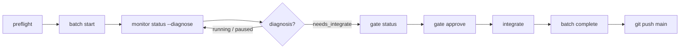

# Operator runbook (real projects)

Daily procedures for running pi-spine batches on a **consumer repository** — install through land loop, recovery, and Taskplane coexistence. Use this with the [bootstrap checklist](./bootstrap-checklist.md) for first-time setup.

**Normative behavior:** [PRD §12–18](../PRD.md) (gates, reconciliation, journal). This runbook is procedural, not a spec duplicate.

---

## Before you start

| Doc | When |
|-----|------|
| [local-install.md](./local-install.md) | First install from git checkout |
| [bootstrap-checklist.md](./bootstrap-checklist.md) | Greenfield or Taskplane migration |
| [real-pi-e2e.md](./real-pi-e2e.md) | Optional real-`pi` validation on adoption fixture |

**CLI choice:** Until npm publish, prefer a pinned binary so PATH drift does not bite you:

```bash
# Replace with your pi-spine checkout path
export SPINE="/absolute/path/to/pi-spine/bin/spine.mjs"
alias spine="node $SPINE"

# Or, after npm link from the checkout:
# alias spine="spine"   # global on PATH — re-link after git pull
```

Throughout this doc, `spine` means whichever invocation you chose (`node …/bin/spine.mjs` or global `spine`).

---

## 1. Install

On the **consumer** repo (your application, not the pi-spine repo):

```bash
# Slash commands + pi extension (required for /spine-*)
pi install /absolute/path/to/pi-spine -l

# Optional: global CLI for shells and CI
cd /absolute/path/to/pi-spine && npm link

# First-time spine layout
spine init

# Taskplane migrants — preview then apply
spine migrate-from-taskplane --dry-run --source .pi/taskplane-config.json
spine migrate-from-taskplane --source .pi/taskplane-config.json
```

Verify:

```bash
spine doctor
spine version   # confirms global npm link resolves (npm bin is a symlink to bin/spine.mjs)
```

Global `npm link` / `npm install -g` invokes `spine` through a symlink on `PATH`. If `spine version` prints package and Node info, the CLI entrypoint is wired correctly (SP-099).

In pi: `pi list` should show `pi-spine`; try `/spine-plan pending`.

Details: [local-install.md](./local-install.md).

### 1.1 Cursor rules (FR-WORK-05)

When the consumer repo has `.cursor/rules/`, spine workers receive **auto-selected** rule files in their prompt tail (not the full rules tree). Full design: [cursor-rules-discovery.md](../design/cursor-rules-discovery.md).

| File | Purpose |
|------|---------|
| `.spine/rules-profile.json` | Always-include (`taskplane-worker-cursor.mdc` by default), never-include, discovery exclusions |
| `.spine/rules-manifest.json` | **Committed** inventory from last discovery scan |
| `config.standards` | Explicit paths that **append** after auto-selection (deduped) |
| `config.neverLoad` | Blocklist for all injected docs |

**After changing rules:**

```bash
spine rules sync
git add .spine/rules-manifest.json
git commit -m "chore: refresh rules manifest"
```

**Preview what a task will load:**

```bash
spine rules select --task SP-042
```

**Doctor warnings:**

| Code | Fix |
|------|-----|
| `RULES_MANIFEST_MISSING` | `spine rules sync` |
| `RULES_MANIFEST_STALE` | `spine rules sync` (rescan differs from committed manifest) |

Glob-triggered language packs match PROMPT **File Scope** via micromatch. Empty File Scope still loads profile always-includes and `alwaysApply` rules. Tune `.spine/rules-profile.json` or add paths to `config.standards` when workers miss expected rules.

**Journal audit:** batch journal events `worker.rules_selected` list `paths`, `mode`, and cap metadata per worker spawn.

---

## 2. Preflight

Run **before every batch** (FR-BATCH-11). Fails fast on dirty git, active batch, broken deps, or orchestrator conflict.

```bash
spine plan pending          # optional — see waves and lanes
spine preflight
spine preflight --json      # automation / CI
```

| Check | What it catches |
|-------|-----------------|
| Doctor | Node, git, pi, config, agents, coexistence |
| Git clean | Uncommitted changes in working tree |
| No active batch | Stale `.spine/batch-state.json` or Taskplane `.pi/batch-state.json` |
| Tasks + deps | Discoverable `PROMPT.md`, valid `dependencies.json` |
| Wave plan | Same planner output as `spine plan` (invalid PROMPTs fail here with actionable errors) |

When `spine plan` or preflight **plan** fails with `Invalid PROMPT for …` or `PROMPT validation failed for N task(s):`, fix the listed `PROMPT.md` files (heading em dash, required sections, testing step) before retrying. Scoped plans only validate selected tasks; `spine plan all` fails if any discovered packet is invalid.

Fix `suggestedCommand` from failed preflight before `batch start`. Do **not** hand-edit `.spine/batch-state.json`.

**Environment overrides** (optional, FR-CFG-04):

```bash
SPINE_TASKS_ROOT=alt-tasks spine plan pending
SPINE_MAX_LANES=2 spine batch start pending
spine settings show lanes.maxParallel   # shows env vs file source
```

---

## 3. Start and monitor

### Start a batch

Detached by default — the CLI returns while the engine runs in the background.

```bash
spine preflight

# Single task (recommended for implementation work)
spine batch start TP-012

# Pending backlog (tasks without .DONE)
spine batch start pending

# Multi-task (one wave, disjoint file scopes)
spine batch start TP-043 TP-045 TP-046

# Preview only
spine batch start TP-012 --dry-run

# Foreground engine (blocks until batch ends)
spine batch start TP-012 --attached
```

**Stub workers** (CI, no real `pi`):

```bash
SPINE_WORKER_STUB=1 spine batch start <task-id>
```

**Real pi workers:**

```bash
unset SPINE_WORKER_STUB   # or SPINE_WORKER_STUB=0
spine batch start <task-id>
```

### Monitor

```bash
spine status                    # headline + suggested next command
spine status --diagnose         # verbose signals (use this daily)
spine status --json
spine next                      # print suggestedCommand only
```

Detached engine logs: `.spine/runtime/detached-engine.log`

**Detached start/resume return contract:** default detached `spine batch start` and `spine batch resume` return as soon as batch-state shows the engine has started (`status: engine_started`, `phase: running`). That means the background engine is running — not that the resumed task or batch finished. After a default detached return, run `spine status --diagnose` to confirm workers, PIDs, and journal progress.

Optional `--wait-terminal` on start or resume blocks until the batch reaches a terminal phase (`completed` / `failed` / `aborted`), pauses, or (on resume) the resumed task reaches a terminal task status — then returns `status: start_completed` or `resume_completed`.

Journal tail:

```bash
spine journal replay --batch <batchId>
```

**Diagnosis quick map** (full taxonomy: PRD §18.3):

| `diagnosis` | Meaning | Typical next step |
|-------------|---------|-------------------|
| `running` | Workers active | Wait; use dashboard or `--diagnose` |
| `paused` | Operator or engine paused | `spine batch resume` |
| `needs_retry` | Failed or dead worker task | `spine batch retry <id>` or skip |
| `engine_orphaned` | Batch engine died mid-run | `spine batch retry <id>` or `spine batch abort` |
| `needs_merge` | Wave done, merge blocked | Fix failures or `force-merge` |
| `needs_integrate` | Orch ahead of `main` | Land loop (§4) |
| `completed` | Batch terminal, merged | `spine batch complete` if not archived |
| `limbo_stale` / `completed_manual` | Tasks green, batch record stale | `dismiss` or `complete --detect-manual-merge` |
| `failed` / `aborted` | Terminal error | `retry`, `resume --force`, or `dismiss` |

In pi: `/spine-status` mirrors reconciliation.

---

## 4. Land loop

After a successful wave (all tasks succeeded or skipped, lane merges into `orch/spine-<batchId>`), merge orch → `main` and archive the batch record.



**Copy-paste sequence** (run from project root when `spine status --diagnose` shows `needs_integrate`):

```bash
spine status --diagnose
spine gate status
# Review evidence under .spine/runtime/<batchId>/evidence/
spine gate approve
spine integrate
spine batch complete
git push origin main
```

Dry-run integrate:

```bash
spine integrate --dry-run
```

When `gates.requireBeforeIntegrate` is true (default after `spine init`), `spine integrate` **refuses** until the gate is approved.

Multi-wave batches: repeat monitor → land loop **between waves** if the plan has multiple dependency waves. pi-spine does not auto-integrate mid-batch.

---

## 5. Gate races

The integrate gate opens **after** the batch engine finishes the wave and writes terminal batch state. Approving or integrating too early is the most common operator timing mistake.

### Symptoms

| Symptom | Cause |
|---------|--------|
| `No integrate gate found for this batch` | Batch still `running` or merge not finished |
| `Integrate blocked — no gate record` | Same — gate not opened yet |
| `Integrate gate already approved` | Harmless — proceed to `spine integrate` |
| Gate pending but orch not ahead of `main` | Manual git state; run `--diagnose` |

### Recovery

1. Wait for detached engine to finish (or use `--attached` on start).
2. Confirm batch phase:

   ```bash
   spine status --diagnose
   # expect diagnosis: needs_integrate (or completed with orch commits)
   ```

3. If gate missing but diagnosis is `needs_integrate`, check evidence dir exists, then:

   ```bash
   spine gate status
   spine gate approve    # retry — idempotent if already approved
   spine integrate
   ```

4. Never approve while `diagnosis: running`. Dashboard integrate panel stays pending until the engine opens the gate.

Reject path:

```bash
spine gate reject --reason "tests red on evidence review"
# fix work, then new batch or manual recovery per PRD §18.6
```

Emergency bypass (journaled, not for routine use):

```bash
SPINE_ALLOW_FORCE=1 spine integrate --force-integrate
```

---

## 6. Resume, dismiss, complete

### Resume (paused or failed)

```bash
spine batch resume                  # detached; returns engine_started
spine batch resume --wait-terminal  # block until task/batch terminal
spine batch resume --attached       # foreground
spine batch resume --force          # after stale segment state
```

Default detached resume success means **engine started**, not resume finished. Use `--wait-terminal` when you need the CLI to block until the resumed task or batch reaches a terminal state; otherwise monitor with `spine status --diagnose`.

Multi-task paused batches resume **all** pending lanes in one command. Tasks assigned to the same physical lane run **sequentially** (one worker at a time on that worktree); tasks on different lanes still run in parallel. The journal records `lane.tasks_serialized` when a lane queue has more than one pending task in a wave.

### Retry and skip

```bash
spine batch retry TP-012
spine batch skip TP-012
spine batch force-merge --wave 0    # mixed-outcome override, then resume --force
```

In pi: `/spine-retry-task TP-012`, `/spine-skip-task TP-012`.

### Pause and abort

```bash
spine batch pause
spine batch abort                   # graceful — worker may finish step
spine batch abort --hard            # SIGKILL + worktree cleanup
```

### Orphan running (zombie batch)

When `spine status --diagnose` shows `engine_orphaned` or `needs_retry` with a **worker died** headline while batch-state still says `phase: running`, the detached engine or lane worker exited without writing a terminal journal event (common after kill -9, OOM, or host crash mid-resume).

1. Confirm diagnosis: `spine status --diagnose` (never trust plain `running` when PIDs are dead).
2. Inspect journal tail: `spine journal tail` — expect `task.started` / `lane.heartbeat` then silence.
3. Check detached engine log: `.spine/runtime/detached-engine.log`.
4. Recover:
   - `spine batch retry <taskId>` when a running task is named in the headline.
   - `spine batch abort` when no task is active or work should be discarded.
   - `spine batch resume --force` only after retry/abort clears stale running records.

Batch-state records `resilience.enginePid` and lane `workerPid` for liveness checks during reconciliation.

Incident narratives: [`20260603-orphan-running-resume.md`](../incidents/20260603-orphan-running-resume.md) (single-task resume silence), [`20260604-resume-parallel-lane-orphan.md`](../incidents/20260604-resume-parallel-lane-orphan.md) (forced multi-task resume, parallel lane-1, batch `20260603T224829`).

### Resume engine crash (fail-closed)

When the detached resume engine throws (for example a broken lane worktree during `commitLaneWorktree`), pi-spine should leave **`phase: failed`**, append **`batch.failed`** to the journal, mark ghost **`running`** tasks as **`failed`**, and clear **`resilience.enginePid`**. This is the fail-closed path — not the orphan/zombie case above where the process exits without writing terminal state.

1. Confirm: `spine status --diagnose` — expect **`failed`**, not **`running`**.
2. Inspect journal: `spine journal tail` — look for **`batch.failed`** with `reason: engine_error` and the git/worktree message.
3. Check detached engine log: `.spine/runtime/detached-engine.log`.
4. Recover:
   - `spine batch retry <taskId>` when a failed task is named in the headline.
   - `spine batch resume --force` after retry clears stale segment state.
   - `spine batch abort` when work should be discarded.

If diagnosis is still **`engine_orphaned`** with **`phase: running`**, the engine died without hitting the fail-closed handler — use the orphan steps above.

### Dismiss and complete (terminal limbo)

When tasks are green but the batch record is stale (common after Taskplane manual recovery):

```bash
spine status --diagnose

# Work already merged to main manually:
spine batch complete --detect-manual-merge

# Clear batch without claiming merge:
spine batch dismiss --reason "manual recovery"

# Normal happy path after integrate:
spine batch complete
```

**Never** edit `.pi/batch-state.json` or `.spine/batch-state.json` by hand. pi-spine archives to `.spine/runtime/<batchId>/archive/` first.

---

## 7. Dashboard

Local SSE UI for batch, lanes, gate, and journal (default port **8109**, avoids Taskplane 8099).

```bash
spine dashboard
spine dashboard --port 8110
```

In pi: `/spine-dashboard`

- URL prints on listen (e.g. `http://127.0.0.1:8109`)
- Panels: diagnosis banner, wave progress, lane table, integrate gate, journal tail
- **Read-only** — run CLI commands from your terminal (action chips copy suggested commands)
- Keep the dashboard terminal open while it runs

Configure port in `.spine/spine-config.json`:

```json
"dashboard": { "port": 8109 }
```

When `diagnosis` is `needs_integrate`, the banner uses integrate styling even if raw `phase` is `completed`.

---

## 8. Taskplane coexistence

Do **not** run Taskplane `/orch` and `spine batch start` on the same repo concurrently (PRD §22.1).

`spine doctor` and `spine preflight` inspect both:

- `.spine/batch-state.json` (pi-spine)
- `.pi/batch-state.json` (Taskplane)

| Situation | Action |
|-----------|--------|
| Active Taskplane batch | Finish or dismiss Taskplane batch before spine start |
| Migrating | `spine migrate-from-taskplane`, stub batch, then retire `/orch` |
| Dual active (error) | `spine doctor` names both IDs — dismiss one orchestrator |
| Taskplane limbo, tasks green | `spine batch dismiss` or `complete --detect-manual-merge` |

Same task folders (`taskplane-tasks/`, `PROMPT.md`, `dependencies.json`) work in both systems; only one orchestrator should own batch state at a time.

---

## 9. Troubleshooting

### `node bin/spine.mjs` vs global `spine`

| Symptom | Fix |
|---------|-----|
| `spine: command not found` | `npm link` from checkout, or `node /path/to/pi-spine/bin/spine.mjs …` |
| Global `spine` exits 0 with no output | Fixed in SP-099 — upgrade and run `spine version`; should print package info |
| Doctor warns **stale global spine** | `which spine` points at old build — re-`npm link` or use `node …/bin/spine.mjs` |
| Slash commands work, CLI wrong version | Pi uses linked package; shell uses stale PATH binary |
| CI / scripts | `SPINE_BIN="node ../pi-spine/bin/spine.mjs"` (see `./scripts/adoption-smoke.sh`) |

**Rule of thumb:** Developing pi-spine itself → always `node bin/spine.mjs` from repo root. Consumer pilot → `npm link` or explicit `node` path after every `git pull`.

### Task sizing vs batch stalls

Oversized task packets and wide parallel waves are the main cause of **stall_timeout** on real `pi` workers (workers alive but no checkpoint progress).

| Practice | Why |
|----------|-----|
| Target **S/M** tasks (≤4 implementation steps) | Fits stall grace + review cycles |
| Split **L/XL** epics into dependent tasks | Avoids 60m+ silent pi runs |
| Run **≤4** parallel M tasks per wave; land between waves | Batch `20260603T225112` stalled 5/8 tasks at once |
| Set `lanes.stallTimeoutMinutes` ≥ **120** for real `pi` | Template default; doctor warns if unset/low |
| Use PROMPT **Size:** S/M/L | Engine applies per-task floor (SP-088): M→180m, L→300m |

`spine doctor` warns on oversized **pending** packets (XL, >4 steps, wide file scope). `skills/create-spine-tasks` documents decomposition rules.

### Stall diagnosis (5-minute path)

When a lane dies with `stall_timeout` or frozen heartbeats, use this flow before re-running a long batch. Full design: [stall-recovery-improvements-brief.md](../features/stall-recovery-improvements-brief.md).

```bash
spine status --diagnose
# Journal tail: .spine/runtime/<batchId>/journal/events.jsonl
```

| Step | What to look for | Action |
|------|------------------|--------|
| 1 | `lane.checkpoint_warning` | File-scope edits without commit — commit step work + `spine_report_progress` |
| 2 | `lane.stall_killed` → `logPath` | Read `.spine/runtime/<batchId>/lanes/lane-N/worker-output-<taskId>.log` for stderr tail |
| 3 | `lane.salvage_inspection` | Note `changedFileCount` / `dirtyPaths` — valid WIP may exist without `.DONE` |
| 4 | `task.failed` | Confirm non-empty `output` and `classification` |
| 5 | Retry | `spine batch retry <taskId>` (diagnose may suggest this when salvageable) |

**Lane config** (`.spine/spine-config.json` → `lanes`):

| Key | Default | Meaning |
|-----|---------|---------|
| `stallTimeoutMinutes` | 120 (template); 60 if unset | Hard silence timeout; use ≥120 for real `pi` workers |
| `stallGraceAfterProgressMinutes` | **30** (`spine init` template); **15** code fallback when unset | Extra grace after STATUS/commit/`task.step_completed` |
| `checkpointWarningMinutes` | 10 | Warn when file-scope activity lacks checkpoint |
| `extendGraceOnFileScope` | false | File-scope mtime must **not** extend stall grace |
| `workerOutputMaxBytes` / `workerOutputTailLines` | 262144 / 200 | Bounded worker log on terminal failure |
| `autoCommitOnStall` | false | Opt-in WIP commit on stall (§18.5 lane branch); default off |

**Stall grace default (template vs code):** `templates/spine-config.json` sets `stallGraceAfterProgressMinutes: 30` (SP-087 — longer grace for real `pi` workers). `src/batch/heartbeat.mjs` falls back to **15** only when the key is missing or zero in the loaded config. After `spine init`, the on-disk value is **30**; do not assume 15 unless you removed the key.

**Retry with salvage:** `autoCommitOnStall: false` (default) leaves uncommitted scoped work on the lane branch for human review before retry. When `autoCommitOnStall: true`, one scoped `wip(<taskId>): stall salvage …` commit may be created; atomic retry (§18.5) keeps that commit on the lane branch.

### Common batch failures

| Problem | Command / fix |
|---------|----------------|
| Preflight git dirty | Commit or stash; lanes need clean tree |
| `no-active-batch` while you think batch runs | Check `.spine/runtime/detached-engine.log`; `spine status --diagnose` |
| Worker stall | Follow [Stall diagnosis](#stall-diagnosis-5-minute-path); `spine status --diagnose` → worker log + `lane.salvage_inspection`; ensure `spine_report_progress` after steps |
| Stall salvage WIP | Set `lanes.autoCommitOnStall: true` to commit scoped File Scope + task folder on stall (default **false**). Journal `lane.salvage_commit`. Refused during merge, index conflicts, or hook failure. `spine batch retry` keeps WIP on the lane branch (PRD §18.5). |
| Review fail-closed | Fix reviewer feedback; re-run `spine review step` |
| Empty orch merge | Engine blocks complete — check task actually committed in lane worktree |
| rules-manifest merge conflict (lane→orch) | Engine auto-resolves when only `.spine/rules-manifest.json` `generatedAt` differs (rules[] identical); merge keeps the newest timestamp. If rules[] differ, merge fails loud — run `spine rules sync` on one branch, commit, and retry the batch merge |
| Port 8109 in use | `spine dashboard --port 8110` or stop other dashboard |

### Worktree layout

| Path | Purpose |
|------|---------|
| `.worktrees/spine-<batchId>/lane-N` | Lane worktrees |
| `.spine/runtime/<batchId>/journal/events.jsonl` | Audit trail |
| `.spine/runtime/<batchId>/evidence/` | Gate evidence bundle |
| `<tasksRoot>/<id>/.DONE` | Task completion marker (`spine-tasks/` or `taskplane-tasks/` — see [bootstrap checklist](./bootstrap-checklist.md#tasks-root-decision)) |

### Get help from reconciliation

```bash
spine status --diagnose    # primary signal
spine next                 # suggestedCommand
spine next --execute       # run suggested dismiss/preflight (careful)
```

---

## Daily checklist (operator)

1. `git status` — clean working tree
2. `spine doctor` — no ❌ (warnings OK if understood)
3. `spine preflight`
4. `spine batch start <scope>` (stub or real pi)
5. Monitor: `spine status --diagnose` and/or dashboard
6. Land loop: gate → integrate → complete → push
7. Next batch: preflight again

---

## Related docs

| Doc | Purpose |
|-----|---------|
| [bootstrap-checklist.md](./bootstrap-checklist.md) | First-time consumer setup |
| [local-install.md](./local-install.md) | Install paths and PATH |
| [real-project-readiness.md](./real-project-readiness.md) | Phase 9 adoption plan |
| [real-pi-e2e.md](./real-pi-e2e.md) | Real-pi fixture validation |
| [README § Batch lifecycle](../../README.md) | Full CLI reference |
| [PRD](../PRD.md) | Normative requirements |
| [stall-recovery-improvements-brief.md](../features/stall-recovery-improvements-brief.md) | Stall epic (SAT-020), FR-STALL-* |
