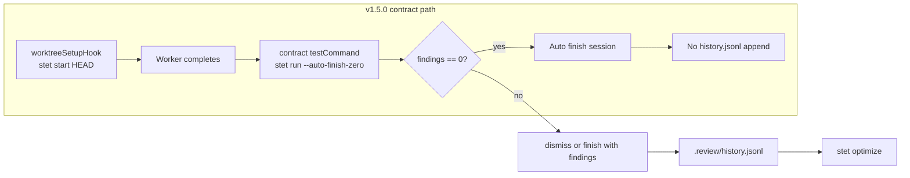

# pi-spine feature brief: Stet feedback loop & history.jsonl

**Audience:** pi-spine maintainers (product + engineering)  
**Author:** Operator investigation (v1.5.0 stet integration audit)  
**Date:** 2026-07-05  
**Status:** Proposal — ready for next-release task breakdown  
**Related:** v1.5.0 Phase 58 (SP-494, SP-491, SP-437, SP-471), [stet integration overview](../stet-overview.md), operator runbook §8.1

---

## Executive summary

**Stet is live in pi-spine v1.5.0** (since 2026-07-04). Option A integration runs at lane setup (`stet start HEAD`) and contract verify (`stet run --auto-finish-zero`). Bootstrap task **SP-494** and dependent tasks are complete; git notes on `refs/notes/stet` confirm finished sessions.

**`.review/history.jsonl` is absent because it was never written — not because stet was skipped.** The v1.5.0 contract path auto-finishes zero-finding sessions. Stet only appends history on dismiss, auto-dismiss during re-review, or `stet finish` when the session had findings. Completed v1.5.0 batches reported **0 findings** and **0 dismissals**, so no feedback trail exists for `stet optimize`.

This brief documents current behavior and proposes improvements for the **next release** so dismissal history, prompt shadowing, and optimizer feedback accumulate when stet finds real issues.

---

## Current integration (v1.5.0)

| Phase | Mechanism | Script / command |
|-------|-----------|------------------|
| Lane setup | `worktreeSetupHook` in `.spine/spine-config.json` | `scripts/spine-worktree-setup.sh` → `stet start HEAD --allow-dirty --quiet` |
| Contract verify | Task `testCommand` suffix | `scripts/spine-stet-contract-run.sh` → `stet run --auto-finish-zero --quiet` |
| Findings triage (manual) | Operator / agent | `stet list`, `stet dismiss <id> <reason>`, `scripts/spine-stet-file-issues.sh` |

**Committed artifacts:**

- `.review/config.toml` — LM Studio + `qwen/qwen3-coder-next`, `exclude_patterns` for non-code files
- `scripts/spine-worktree-setup.sh`, `scripts/spine-stet-contract-run.sh`, `scripts/spine-stet-file-issues.sh`
- `docs/stet-overview.md`, `docs/adoption/operator-runbook.md` §8.1, `.cursor/rules/stet-integration.mdc`

**Phase 58 tasks (complete):**

| Task | Role |
|------|------|
| SP-494 | Bootstrap (config, hooks, docs) |
| SP-491 | Contract verify worker env isolation (stet in contract) |
| SP-437 | Sequence continue after merge_blocked (stet 0 findings) |
| SP-471 | Gitignored auto-clean (stet 0 findings) |
| SP-492, SP-493 | Skill fixes (deps on SP-494) |

Stet was **not** used before v1.5.0; integration is new for the current release train.

---

## State artifacts (stet vs spine)

Stet state lives under `.review/` (see [stet cli-extension-contract](https://github.com/beettlle/stet/blob/main/docs/cli-extension-contract.md)):

| Path | Purpose | Gitignored in pi-spine? |
|------|---------|-------------------------|
| `.review/config.toml` | Repo-level stet config | **No** (committed) |
| `.review/session.json` | Active session (baseline, findings, dismissed_ids) | Yes |
| `.review/lock` | Advisory lock | Yes |
| `.review/spine-stet-baseline.ref` | Lane baseline ref (spine helper) | Yes |
| `.review/history.jsonl` | **Feedback log for optimize & prompt shadowing** | No (not listed; created on demand) |
| `.review/system_prompt_optimized.txt` | Output of `stet optimize` | No (created on demand) |
| `.review/worktrees/` | Stet review worktrees | Partially (runtime) |
| `refs/notes/stet` | Session analytics at finish (git notes) | N/A (git object) |

**Do not confuse with spine-owned jsonl:**

| Path | Owner | Purpose |
|------|-------|---------|
| `.spine/run-metrics.jsonl` | pi-spine | Batch run metrics |
| `.spine/runtime/<batchId>/journal/events.jsonl` | pi-spine | Orchestration audit journal |

---

## Why history.jsonl is absent

Stet appends to `.review/history.jsonl` only on **feedback events**:

1. **`stet dismiss <id> [reason]`** — always appends a line (includes reason for optimizer)
2. **Auto-dismiss** during re-review — appends when a prior finding no longer appears at that location
3. **`stet finish`** — appends **only if the session had findings** (`len(findings) > 0`)

The v1.5.0 contract uses `--auto-finish-zero`. When review completes with zero active findings, stet auto-finishes without appending history. Upstream stet explicitly tests this: `TestFinish_doesNotAppendHistoryWhenNoFindings`.

**Evidence from v1.5.0 batches:**

- Task STATUS files report "stet 0 findings" (SP-437, SP-471, SP-491)
- Git notes on `refs/notes/stet` show `"findings_count":0,"dismissals_count":0`
- `stet status` on main: `findings: 0`, `dismissed: 0`
- No `history.jsonl` anywhere under repo or lane worktrees

Until at least one dismiss or finish-with-findings event occurs, **`stet optimize` has nothing to read** and the file will not exist. That is expected behavior, not a misconfiguration.



---

## Operator playbook (today)

When stet reports findings during contract verify or manual review:

```bash
stet list
stet dismiss <id> false_positive   # or already_correct, wrong_suggestion, out_of_scope
stet optimize                       # reads .review/history.jsonl when present
stet stats                          # quality metrics from history + git notes
```

Dismiss reasons: see `.cursor/rules/stet-integration.mdc`.

**Findings policy (unchanged):** Project code defects → beettlle/pi-spine issues (`stet` label). stet CLI bugs → https://github.com/beettlle/stet/issues. Do not dismiss to pass contract without fix + issue or documented reason in `STATUS.md`.

---

## Proposed improvements (next release)

### P0 — Documentation / operator clarity

- [x] This brief (audit record + proposal)
- [ ] "State & feedback loop" subsection in `docs/stet-overview.md` (link here)
- [ ] Extend operator runbook §8.1: when `history.jsonl` appears, triage before auto-finish clears findings, `stet stats` / `stet optimize` cadence

### P1 — Feedback capture when findings exist

- When contract stet reports findings, **pause before auto-finish**: operator or script triages via `stet dismiss` (with reason) so history accumulates for shadowing/optimize.
- Optional: persist contract stet JSON output under `spine-tasks/<id>/.reviews/stet-*.json` for audit (similar to existing contract-fail logs).
- Consider a contract script flag or env (e.g. `SPINE_STET_NO_AUTO_FINISH=1`) for triage windows on non-zero findings.

### P1 — Quality loop

- Periodic `stet stats` on accumulated git notes + history to track dismissal rate and category breakdown.
- Run `stet optimize` after N dismissals; document whether to commit `.review/system_prompt_optimized.txt` or keep repo-local.

### P2 — Integration expansion

- Gate-level stet evidence (Approach 2 in `docs/stet-overview.md`) once [#160](https://github.com/beettlle/pi-spine/issues/160) is addressed.
- Tiered strictness by task size (Approach 5) via create-spine-tasks skill / contract templates.

---

## Open questions

1. **Commit history.jsonl?** Stet upstream allows committing `.review/` state; pi-spine currently gitignores only lock/session/baseline ref. Should team commit `history.jsonl` and `system_prompt_optimized.txt` for shared optimizer state?
2. **Auto-finish vs triage:** Should contract verify fail (not auto-finish) when findings exist, forcing operator triage before session cleanup?
3. **Gate-level stet:** Block on #160 or ship P1 contract-only improvements first?
4. **Cross-repo history:** Lane worktrees share repo-root `.review/` — confirm history accumulates across lanes as intended.

---

## References

- [docs/stet-overview.md](../stet-overview.md) — integration approaches
- [docs/adoption/operator-runbook.md](../adoption/operator-runbook.md) §8.1 — operator preflight and triage
- [stet review-process-internals](https://github.com/beettlle/stet/blob/main/docs/review-process-internals.md) — finish/dismiss/history append logic
- [stet cli-extension-contract](https://github.com/beettlle/stet/blob/main/docs/cli-extension-contract.md) — `.review/` layout and `history.jsonl` schema
- `.cursor/rules/stet-integration.mdc` — dismiss reasons for agents
- `spine-tasks/CONTEXT.md` — Phase 58 task table and stet batch policy
