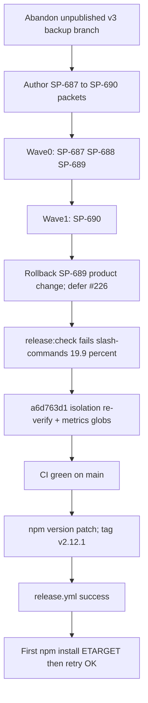

# v2.12.1 Release Post-Mortem

**Document type:** Incident / release post-mortem (Diátaxis: explanation)  
**Audience:** Operator + maintainers  
**Verdict:** Patch scope was sound and **shipped** (`pi-spine@2.12.1`). Pain came from **outer-loop / publish gates**, a **matrix planner regression** (SP-689 rolled back), and **coverage V8 attribution** blocking Phase 5 — not unrepayable engine debt. **Models amplified** cost (quota/403, launch storms, mid-release pin thrash).

---

## 1. Executive summary

| Metric | Value |
|--------|-------|
| Target | **v2.12.1** (patch from 2.12.0) |
| Profile | patch / bugs-only (stabilization after abandoned v3) |
| Authoring | 2026-07-25 |
| Publish | 2026-08-02 |
| Tag commit | `f519d4f5` |
| npm | `2.12.1` (published ~2026-08-02T22:37:42Z) |
| Release workflow | [`30770173115`](https://github.com/beettlle/pi-spine/actions/runs/30770173115) success |
| GitHub Release | https://github.com/beettlle/pi-spine/releases/tag/v2.12.1 |
| Manifest | [`spine-tasks/_authoring/release-v2.12.1/manifest.md`](../../spine-tasks/_authoring/release-v2.12.1/manifest.md) |
| Primary batches | `20260725T213740` (Wave 0), `20260726T015446` (aborted SP-690 retry), `20260726T023417` (SP-690) |
| Ahead of origin at Phase 5 start | **24** local commits (later pushed) |

**One-line root cause:** Curated release work landed, but publish was delayed by (1) SP-689 plan-time virtual row IDs incompatible with the parent-task engine, (2) V8 full-suite under-reporting `slash-commands.ts` (~19.9% vs ~90% narrow include), and (3) process lag leaving `main` unpublished while checklist items stayed open. Model/provider instability added failed waves before the stabilization window.

**What was *not* the primary problem:** Core orphan/`state_drift` engine debt from earlier releases — most related GitHub issues are already closed. Spine remains dogfood-capable; the tax is outer-loop + gates + scope risk on half-landed matrix features.

---

## 2. Scope & what shipped

**Manifest:** [`spine-tasks/_authoring/release-v2.12.1/manifest.md`](../../spine-tasks/_authoring/release-v2.12.1/manifest.md)  
**CONTEXT Phase 77:** [`spine-tasks/CONTEXT.md`](../../spine-tasks/CONTEXT.md)

| SP-ID | Issue | Intent | Landed? | Notes |
|-------|-------|--------|---------|-------|
| SP-687 | [#237](https://github.com/beettlle/pi-spine/issues/237) | Wire `runQuotaProbes` into metrics quota CLI | Yes | Closed on publish |
| SP-688 | [#224](https://github.com/beettlle/pi-spine/issues/224) | Run `worktreeSetupHook` for matrix sub-lanes | Yes | Closed on publish |
| SP-689 | [#226](https://github.com/beettlle/pi-spine/issues/226) | Propagate matrix through `buildPlan` | **Rolled back** | Virtual row IDs → production `task_not_found`; #226 remains open |
| SP-690 | [#227](https://github.com/beettlle/pi-spine/issues/227) | Cap nested matrix concurrency to remaining slots | Yes | Also restored parent-task planning after SP-689 rollback; interim vs #228 |

**Coverage / CI hygiene shipped outside original packets:**

| Commit | Change |
|--------|--------|
| `a6d763d1` | Isolation re-verify for FR-SHIP-06 + add `tests/metrics` to `npm test` / `TEST_GLOBS` |

**Still open after release:** [#226](https://github.com/beettlle/pi-spine/issues/226) (depends on [#228](https://github.com/beettlle/pi-spine/issues/228) first-class matrix scheduling); epic [#225](https://github.com/beettlle/pi-spine/issues/225) and follow-ons #229–#232 / #238.

---

## 3. Chronology

| When | What |
|------|------|
| Pre–2026-07-25 | Unpublished **v3.0.0** attempt (~34 local commits) — scope/process failures; tip saved on `backup/v3.0.0-abandoned-20260725` @ `c9a799dd` |
| 2026-07-25 | Reset local `main` to CI-green `origin/main`; author Phase 77 packets; operator approved patch scope |
| 2026-07-25 Wave 0 | Batch `20260725T213740` — SP-687, SP-688, SP-689 completed (later SP-689 product change rolled back) |
| 2026-07-26 | Batch `20260726T015446` **aborted** — stale SP-690 retry lane missed amended packet; dismissed and replaced |
| 2026-07-26 | Batch `20260726T023417` — SP-690 completed; SP-689 rollback recorded (`c6bb804a`); #226 deferred |
| Pre–push | Local `main` **24 commits ahead** of `origin/main`; publish checklist still open |
| 2026-08-02 Phase 5 | `npm run release:check` fails: `slash-commands.ts` **19.90%** &lt; 70% floor |
| 2026-08-02 | Root cause: full-suite V8 under-report; narrow include ~90%; fix `a6d763d1` |
| 2026-08-02 | Also found: `tests/metrics` missing from test/coverage globs (SP-687 tests skipped in gate) |
| 2026-08-02 | `release:check` green (~89% aggregate); push; CI green on `f0561e12` / `5c296f01` |
| 2026-08-02 | Operator approved publish; `npm version patch` → tag `v2.12.1` @ `f519d4f5` |
| 2026-08-02 | `release.yml` success [`30770173115`](https://github.com/beettlle/pi-spine/actions/runs/30770173115) |
| 2026-08-02 | First global smoke `ETARGET`; retry `npm install -g pi-spine@2.12.1` OK; `spine doctor` exit 0 |
| 2026-08-02 | Closed #237, #224, #227; left #226 open; docs commit `350108d7` |

**Earlier release-adjacent model aborts (context for F7):**

| Batch | Abort reason |
|-------|----------------|
| `20260720T235540` | Kimi billing quota exhausted mid wave-1 (v2.11.0 era) |
| `20260721T195712` | Kimi 403 salvage |

---

## 4. Failure taxonomy (evidence-backed)

### F1 — Abandoned unpublished v3.0.0 (process / scope)

**Area:** Release operator process  
**Severity:** High (trust + reset cost)  
**Tracked:** [#249](https://github.com/beettlle/pi-spine/issues/249) (docs/skill hardening)

Manifest “do not reintroduce” list:

1. Started Phase 4 without explicit “approve release scope”
2. Labeled incomplete helpers as shipped (no production call sites)
3. Journal rewrite-append increased runtime risk without integrity wiring
4. Out-of-scope model-config thrash + flake-chase commits on the release branch
5. Critical blast radius (~54 files) before publish gates

**Impact:** Required hard reset to `origin/main` and a patch-only trust-restore release.

### F2 — SP-689 / `buildPlan` virtual row IDs → `task_not_found`

**Area:** Planner / engine matrix  
**Severity:** High (mid-release rollback)  
**Tracked:** Open [#226](https://github.com/beettlle/pi-spine/issues/226); depends on [#228](https://github.com/beettlle/pi-spine/issues/228)

Plan-time expansion to virtual row IDs was incompatible with the current **parent-task** engine. Executed in Wave 0, then rolled back during SP-690 recovery; parent-task planning restored in SP-690 path.

**Impact:** #226 not closed; matrix epic must land first-class scheduling before retrying this shape of fix.

### F3 — Nested matrix concurrency exceeded `lanes.maxParallel`

**Area:** Engine matrix  
**Severity:** Medium (correctness / cost)  
**Tracked:** Closed [#227](https://github.com/beettlle/pi-spine/issues/227) via SP-690

Interim throttle to remaining slots; may be superseded by #228 first-class row scheduling (document as interim in runbook — already noted in manifest risks).

### F4 — Matrix sub-lanes skipped `worktreeSetupHook`

**Area:** Engine matrix  
**Severity:** Medium  
**Tracked:** Closed [#224](https://github.com/beettlle/pi-spine/issues/224) via SP-688

Sub-lanes lacked `.venv` / hook env that parent lanes received.

### F5 — Quota probes unwired + metrics suite missing from gate globs

**Area:** Metrics / CI globs  
**Severity:** Medium (false confidence in release:check)  
**Tracked:** Product fix closed [#237](https://github.com/beettlle/pi-spine/issues/237); glob discovery guard [#246](https://github.com/beettlle/pi-spine/issues/246)

`runQuotaProbes` was never called from `spine metrics quota`. Separately, `tests/metrics/*.test.mjs` was absent from `package.json` `test` and `TEST_GLOBS` until `a6d763d1`. Existing parity test only checks list equality — not “every suite directory is listed.”

### F6 — V8 full-suite under-reports `slash-commands.ts` (FR-SHIP-06)

**Area:** Coverage tooling  
**Severity:** **P0 for publish** (hard gate)  
**Tracked:** Mitigation in `a6d763d1`; root-cause [#245](https://github.com/beettlle/pi-spine/issues/245); related notes [`test-layout-coverage-notes.md`](test-layout-coverage-notes.md) (#222 family)

| Mode | Reported line % |
|------|-----------------|
| Full suite (`COVERAGE_INCLUDES` broad) | ~19.90% |
| Owning suites + narrow include of `slash-commands.ts` only | ~90.46% |
| Aggregate in-scope after fix | ~89% |

Isolation re-verify with **narrow include** unblocked publish; it does **not** fix underlying V8 attribution.

### F7 — Model / provider instability during release waves

**Area:** Config / ops  
**Severity:** High amplifier  
**Tracked:** [#248](https://github.com/beettlle/pi-spine/issues/248)

Approximate fail rates from `.spine/run-metrics.jsonl` (all recorded tasks, not only v2.12.1):

| Model | n | fail% |
|-------|---|-------|
| `cursor/auto` | 133 | 27.8% |
| `zai/glm-5.2` | 24 | 70.8% |
| `kimi-coding/kimi-k2-thinking` | 17 | 41.2% |
| `kimi-coding/k3` | 8 | 75.0% |
| `google/gemini-3.1-pro-preview` | 4 | 25.0% |

Notable patterns: glm **~25s launch storms** (env/launch, not reasoning); Kimi **quota/403** aborts; mid-release model thrash. Escalation into quota-starved providers makes releases worse.

### F8 — Publish outer-loop lag

**Area:** Process  
**Severity:** Medium  
**Tracked:** Documented here + skill hardening in [#249](https://github.com/beettlle/pi-spine/issues/249)

Work was integrated locally while checklist/publish remained open and `main` sat far ahead of `origin`. Increases conflict risk and “can’t finish a release” perception even when batches completed.

### F9 — Post-publish smoke `ETARGET` / registry lag

**Area:** Release workflow / smoke  
**Severity:** Low–medium (false negative)  
**Tracked:** [#247](https://github.com/beettlle/pi-spine/issues/247)

`release.yml` success ≠ immediate global installability. First `npm install -g pi-spine@2.12.1` failed; retry succeeded within seconds.

### F10 — Historical engine debt (orphans / attached shells)

**Area:** Engine (mostly paid down)  
**Severity:** Context only unless recurrence  
**Tracked:** Closed historically (#163, #184, #185, #196, #205, …)

Shapes runbooks and detached-first policy; not the v2.12.1 publish blocker. Do not reopen unless dogfood reproduces.

---

## 5. Engineering backlog

| Pri | Finding | Issue | Owner area | Next action |
|-----|---------|-------|------------|-------------|
| P0 | F6 V8 slash-commands under-report | [#245](https://github.com/beettlle/pi-spine/issues/245) | Coverage tooling | Root-cause V8 attribution; keep isolation re-verify until then |
| P1 | F2 matrix plan virtual IDs | [#226](https://github.com/beettlle/pi-spine/issues/226) + [#228](https://github.com/beettlle/pi-spine/issues/228) | Planner/engine | Design with first-class row scheduling; do not re-land SP-689 shape |
| P1 | F7 model pin / quota escalate | [#248](https://github.com/beettlle/pi-spine/issues/248) | Release ops / config | Pin one worker per release; escalate policy |
| P2 | F5 suite-dir glob discovery | [#246](https://github.com/beettlle/pi-spine/issues/246) | CI hygiene | Fail if `tests/<dir>` missing from globs |
| P2 | F9 smoke retry | [#247](https://github.com/beettlle/pi-spine/issues/247) | Release ops | Retry/backoff in smoke + docs |
| P2 | F1/F8 process gates | [#249](https://github.com/beettlle/pi-spine/issues/249) | Release operator skill | Refuse Phase 4 without approval; ban mid-release model commits |
| Done | F3 nested concurrency | [#227](https://github.com/beettlle/pi-spine/issues/227) | Engine | Shipped interim; watch #228 |
| Done | F4 worktreeSetupHook | [#224](https://github.com/beettlle/pi-spine/issues/224) | Engine | Shipped |
| Done | F5 product wiring | [#237](https://github.com/beettlle/pi-spine/issues/237) | Metrics | Shipped |

---

## 6. What not to reintroduce

From the v2.12.1 manifest (condensed):

- Do not start Phase 4 without recorded **approve release scope**
- Do not ship helpers without production call sites
- Do not mid-release thrash `.spine/spine-config.json` model pins
- Do not expand matrix planner with virtual task IDs until #228-compatible engine scheduling exists
- Do not judge `release:check` from log tails alone — verify exit codes (`PIPESTATUS`)
- Prefer detached batch start/resume from agent shells (#163 / #185)

---

## 7. Appendix

### Batch IDs

| Batch | Role |
|-------|------|
| `20260725T213740` | Wave 0 complete (SP-687/688/689) |
| `20260726T015446` | Aborted stale SP-690 retry |
| `20260726T023417` | SP-690 complete |
| Runtime post-mortems | `.spine/runtime/<batchId>/post-mortem.md` |

### Key commits / logs

| Artifact | Path / ID |
|----------|-----------|
| Coverage + metrics globs | `a6d763d1` |
| SP-689 rollback note | `c6bb804a` |
| Version bump | `f519d4f5` (`2.12.1`) |
| Phase 77 published docs | `350108d7` |
| Abandoned v3 tip | `backup/v3.0.0-abandoned-20260725` @ `c9a799dd` |
| Local release:check log | `/tmp/pi-spine-release-check-v2.12.1-final.log` |
| Metrics | `.spine/run-metrics.jsonl` |
| Batch history | `.spine/batch-history.json` |

### Related skills / scripts

| Path | Role |
|------|------|
| [`skills/spine-release-operator/SKILL.md`](../../skills/spine-release-operator/SKILL.md) | Release Phases 0–6 |
| [`scripts/run-coverage.mjs`](../../scripts/run-coverage.mjs) | Coverage gate + isolation re-verify |
| [`scripts/coverage-policy.mjs`](../../scripts/coverage-policy.mjs) | Thresholds, `TEST_GLOBS`, `FILE_COVERAGE_VERIFY_TESTS` |
| [`docs/release/npm-publish.md`](npm-publish.md) | Publish + smoke |
| [`docs/release/test-layout-coverage-notes.md`](test-layout-coverage-notes.md) | Prior V8 / layout notes (#222) |

### New issues filed from this post-mortem

| # | Title |
|---|-------|
| [#245](https://github.com/beettlle/pi-spine/issues/245) | V8 slash-commands under-report (root cause) |
| [#246](https://github.com/beettlle/pi-spine/issues/246) | Guard suite directories in TEST_GLOBS |
| [#247](https://github.com/beettlle/pi-spine/issues/247) | Post-publish smoke ETARGET retry |
| [#248](https://github.com/beettlle/pi-spine/issues/248) | Release model-pin / quota escalate policy |
| [#249](https://github.com/beettlle/pi-spine/issues/249) | Refuse Phase 4 without scope approval; block mid-release model commits |
