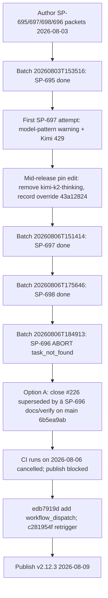

# v2.12.3 Release Post-Mortem

**Document type:** Incident / release post-mortem (Diátaxis: explanation)  
**Audience:** Operator + maintainers  
**Verdict:** Patch scope was sound and **shipped** (`pi-spine@2.12.3`). Pain came from (1) a **mid-release `.spine/spine-config.json` agent pin thrash** after a Kimi 429 — a direct F7/[#248](https://github.com/beettlle/pi-spine/issues/248) violation despite the SP-691 hard rule, (2) the **SP-696 planner re-propagation abort** (`task_not_found`, batch `20260806T184913`) forcing option A — supersede #226 by #228 — instead of the authored plan, and (3) **publish checklist hygiene lag**: work integrated 2026-08-06, publish 2026-08-09 after cancelled CI runs required a manual `workflow_dispatch` escape hatch.

---

## 1. Executive summary

| Metric | Value |
|--------|-------|
| Target | **v2.12.3** (patch from 2.12.2) |
| Profile | patch / bugs + override (#250 + coupled #226+#228) |
| Authoring | 2026-08-03 |
| Publish | 2026-08-09 (npm `2.12.3` @ 22:01:03Z) |
| Tag commit | `aee9f607` |
| Release workflow | [`31337914023`](https://github.com/beettlle/pi-spine/actions/runs/31337914023) success |
| CI on publish HEAD | [`31337913025`](https://github.com/beettlle/pi-spine/actions/runs/31337913025) success (push), [`31337248640`](https://github.com/beettlle/pi-spine/actions/runs/31337248640) success (workflow_dispatch) |
| GitHub Release | https://github.com/beettlle/pi-spine/releases/tag/v2.12.3 |
| Manifest | [`spine-tasks/_authoring/release-v2.12.3/manifest.md`](../../spine-tasks/_authoring/release-v2.12.3/manifest.md) |
| Primary batches | `20260803T153516` (SP-695), `20260806T151414` (SP-697), `20260806T175646` (SP-698), `20260806T184913` (**aborted** SP-696) |

**One-line root cause:** The release work itself landed cleanly in four days, but the cycle burned operator time on self-inflicted process friction: a mid-release model-pin edit on quota signal (the exact F7 pattern the skill bans), a second empirical proof that planner-only matrix propagation cannot work under the parent-identity engine, and a three-day gap between last integrate and publish while CI push triggers kept cancelling.

**What was *not* the problem:** Engine correctness of what shipped. SP-695 (engine-owned plan review, #250) and SP-697/SP-698 (first-class matrix row lanes, #228) landed with green gates. The failures were release-ops discipline failures, not product regressions.

---

## 2. Scope & what shipped

**Manifest:** [`spine-tasks/_authoring/release-v2.12.3/manifest.md`](../../spine-tasks/_authoring/release-v2.12.3/manifest.md)  
**CONTEXT Phase 79:** [`spine-tasks/CONTEXT.md`](../../spine-tasks/CONTEXT.md)

| SP-ID | Issue | Intent | Landed? | Notes |
|-------|-------|--------|---------|-------|
| SP-695 | [#250](https://github.com/beettlle/pi-spine/issues/250) | Engine-owned `runPlanReviewPhase` after worker `.DONE` | Yes | HIGH blast radius on review pipeline; wired `engine-lanes.mjs` + `resume-lane-reviews.mjs` |
| SP-697 | [#228](https://github.com/beettlle/pi-spine/issues/228) | First-class matrix row lane competitors (schedule core) | Yes | Rows compete for `lanes.maxParallel`; distinct worktree per active row |
| SP-698 | [#228](https://github.com/beettlle/pi-spine/issues/228) | Matrix parent aggregation + #224 hook + supersede SP-690 docs | Yes | Parent succeeds iff all rows succeed; runbook updated |
| SP-696 | [#226](https://github.com/beettlle/pi-spine/issues/226) | Re-propagate matrix through `buildPlan` | **Option A — superseded** | Batch `20260806T184913` aborted on empirical `task_not_found`; amended to docs/verify; #226 closed as superseded by #228 (`6b5ea9ab`) |

**Still open / deferred after release:** [#225](https://github.com/beettlle/pi-spine/issues/225) matrix epic remainder; matrix children [#229](https://github.com/beettlle/pi-spine/issues/229)–[#232](https://github.com/beettlle/pi-spine/issues/232); optional future engine virtual plan-ID redesign (old option B); [#238](https://github.com/beettlle/pi-spine/issues/238) quota pools (picked up in v2.13.0 Phase 80); [#251](https://github.com/beettlle/pi-spine/issues/251) doctor/preflight quota-risk escalate warning (filed from this cycle; SP-700).

---

## 3. Chronology

| When | What |
|------|------|
| 2026-08-03 | Phase 79 authoring; operator approved patch + override scope; worker pin `kimi-coding/k3` recorded with “do not change mid-release” |
| 2026-08-03 | Batch `20260803T153516` — SP-695 completed and integrated |
| 2026-08-06 | First SP-697 attempt failed: model-pattern warning + **Kimi 429 overload** |
| 2026-08-06 | **Mid-release pin thrash:** operator removed `kimi-coding/kimi-k2-thinking` from hard/profile pins (→ `google/gemini-3.1-pro-preview`), commit `6e7423c4`; override reason/date recorded in manifest (`43a12824`) per the new rule; worker pin `kimi-coding/k3` unchanged |
| 2026-08-06 | Batch `20260806T151414` — SP-697 completed and integrated (`79e89aa9`) |
| 2026-08-06 | Batch `20260806T175646` — SP-698 completed and integrated |
| 2026-08-06 | Batch `20260806T184913` — SP-696 **aborted**: planner-only `buildPlan` propagation still fails under the SP-697/698 parent-identity engine tick loop (`task_not_found`) |
| 2026-08-06 | **Option A** executed on `main` (`6b5ea9ab`): SP-696 amended to docs/verify; #226 closed as superseded by #228; parent-only `buildPlan` kept |
| 2026-08-06 | CI runs on `main` (`31124568615`, `31125168855`) and manual dispatches (`31127450445`, `31127864689`) all ended **cancelled** — no green CI on HEAD; publish stalled |
| 2026-08-06 → 2026-08-09 | Publish checklist items sat open; ~3-day gap between last integrate and publish |
| 2026-08-09 | `edb7919d` adds `workflow_dispatch` to `ci.yml`; `c281954f` retriggers CI for the publish gate; CI green (`31337248640` dispatch, `31337913025` push) |
| 2026-08-09 | `npm version patch` → tag `v2.12.3` @ `aee9f607`; `release.yml` success [`31337914023`](https://github.com/beettlle/pi-spine/actions/runs/31337914023); npm `2.12.3` @ 22:01:03Z |
| 2026-08-09 | Closed #250, #228, #226 (superseded); filed [#251](https://github.com/beettlle/pi-spine/issues/251) (quota-risk advisory) for v2.13.0 |

---

## 4. Failure taxonomy (evidence-backed)

### F-A — Mid-release agent pin thrash (F7/#248 violation despite SP-691)

**Area:** Config / release ops  
**Severity:** High (process trust)  
**Tracked:** [#248](https://github.com/beettlle/pi-spine/issues/248); follow-up [#251](https://github.com/beettlle/pi-spine/issues/251)

The v2.12.2 cycle (SP-691) encoded the hard rule in [`skills/spine-release-operator/SKILL.md`](../../skills/spine-release-operator/SKILL.md): **never** mid-release-edit `.spine/spine-config.json` agent pins while a batch is running or integrated work is unpublished; escalate models only on content/contract failure — never on quota/403 or launch storms. One release later, the first SP-697 attempt hit a model-pattern warning plus Kimi 429 overload, and the operator edited the pins mid-release anyway (removed `kimi-coding/kimi-k2-thinking` from hard/profile pins → `google/gemini-3.1-pro-preview`, `6e7423c4`).

**Mitigation that partially held:** the override was recorded in the manifest with reason and date (`43a12824`, 2026-08-06), and the worker pin (`kimi-coding/k3`) was left untouched — so the escalation was documented rather than silent. But the edit was still triggered by a **quota signal**, which is exactly the escalation trigger the rule bans, and it landed while unpublished work was in flight.

**Lesson:** documentation alone does not stop operator behavior under time pressure. The gap between “rule written in a skill” and “rule enforced” is why #251 (advisory doctor/preflight quota-risk warning) was filed for v2.13.0 — surface the risk at the tool layer instead of relying on prose.

### F-B — SP-696 planner re-propagation abort → option A supersede

**Area:** Planner / engine matrix  
**Severity:** Medium (predictable in hindsight; one wasted batch)  
**Tracked:** [#226](https://github.com/beettlle/pi-spine/issues/226) closed as superseded by [#228](https://github.com/beettlle/pi-spine/issues/228)

The manifest authored SP-696 as “re-propagate matrix fields through `buildPlan`” with an explicit risk note that this could repeat SP-690’s `task_not_found`. It did: batch `20260806T184913` aborted with the same failure mode under the new SP-697/698 parent-identity engine tick loop. Option A was then executed — keep parent-only `buildPlan`, close #226 as superseded by #228 runtime row lanes, amend SP-696 to docs/verify (`6b5ea9ab`).

**Lesson:** this is the **second** empirical proof (after SP-689/SP-690 in v2.12.1) that plan-time virtual row IDs are incompatible with the engine as built. The dependency was known at authoring time; the batch was a paid experiment. That is acceptable exactly once per hypothesis — the hypothesis is now dead and must not be re-proposed without an engine-side redesign (old option B), which is deferred, not scheduled.

### F-C — Publish checklist hygiene lag

**Area:** Release outer loop / CI  
**Severity:** Medium (3-day publish delay; F8-adjacent)  
**Tracked:** documented here; `workflow_dispatch` mitigation shipped in `edb7919d`

All release work was integrated on `main` by 2026-08-06, but publish did not happen until 2026-08-09. The blocking mechanism: every CI run on `main` in that window (push-triggered and manual) ended **cancelled**, so the hard rule “never publish when CI is not green on HEAD” could not be satisfied — there was no verdict at all, not a red one. The operator had to add `workflow_dispatch` to `ci.yml` (`edb7919d`) and push a retrigger commit (`c281954f`) to manufacture a green CI on the publish HEAD.

**Lesson:** “CI not green” includes “CI cancelled/no signal.” The publish checklist needs an explicit “no green CI run on HEAD” branch with the `workflow_dispatch` re-run as the documented recovery — now available since `edb7919d`. Related to the v2.12.1 F8 finding (push/sync after each land loop): the rule kept `main` close to `origin`, but the checklist itself still lagged the integrated work by three days.

### F-D — Amplifier: model/provider instability (context, not new)

**Area:** Config / ops  
**Severity:** Context  
**Tracked:** [#248](https://github.com/beettlle/pi-spine/issues/248)

The Kimi 429 that triggered F-A is the same quota/403 family documented in the v2.12.1 post-mortem F7 metrics. No new evidence changes the guidance: pin one worker per release, escalate only on content/contract failure.

---

## 5. Engineering backlog

| Pri | Finding | Issue | Owner area | Next action |
|-----|---------|-------|------------|-------------|
| P1 | F-A quota-signal escalation happened despite docs | [#251](https://github.com/beettlle/pi-spine/issues/251) | Doctor/preflight | **SP-700 (v2.13.0):** advisory doctor/preflight quota-risk escalate warning when the pinned provider has recent 429/403 evidence |
| P1 | F-B planner virtual rows are dead twice | [#226](https://github.com/beettlle/pi-spine/issues/226) (closed, superseded) | Planner/engine | Do not re-propose without engine-side redesign; option B stays deferred and unscheduled |
| P2 | F-C no green CI on HEAD blocks publish | — (mitigated by `edb7919d`) | Release ops | Document the “CI cancelled → `workflow_dispatch` re-run” recovery in the publish checklist |
| P2 | Matrix epic remainder | [#225](https://github.com/beettlle/pi-spine/issues/225), [#229](https://github.com/beettlle/pi-spine/issues/229)–[#232](https://github.com/beettlle/pi-spine/issues/232) | Engine matrix | Deferred children: index env, per-row status/retry/cancel, failure policies, per-row PROMPT substitution |
| P2 | Quota pools for anthropic/copilot | [#238](https://github.com/beettlle/pi-spine/issues/238) | Metrics | **SP-701/SP-702 (v2.13.0):** pool-ID mapping + optional probes |
| Done | F-A pin override recording | [#248](https://github.com/beettlle/pi-spine/issues/248) | Release ops | Rule exists; override recorded in manifest (`43a12824`) — enforcement gap moved to #251 |
| Done | First-class matrix rows | [#228](https://github.com/beettlle/pi-spine/issues/228) | Engine | Shipped (SP-697 + SP-698) |
| Done | Engine-owned plan review | [#250](https://github.com/beettlle/pi-spine/issues/250) | Review pipeline | Shipped (SP-695) |

---

## 6. What not to reintroduce

- Do **not** mid-release-edit `.spine/spine-config.json` agent pins on a quota/403/launch-storm signal — escalate only on content/contract failure (F7, [#248](https://github.com/beettlle/pi-spine/issues/248)). If an override is truly required, record reason + date in the release manifest first (as done in `43a12824`) and keep the worker pin stable.
- Do **not** re-attempt planner-only `buildPlan` matrix propagation (virtual `SP-X[rowId]` task IDs). Twice empirically proven incompatible (SP-690 rollback in v2.12.1; SP-696 batch `20260806T184913` abort in v2.12.3). #226 is closed as superseded by #228; any revisit requires an engine-side virtual plan-ID redesign (old option B), which is deferred.
- Do **not** let integrated release work sit unpublished for days: push/sync `main` after each land loop (F8), and if no green CI exists on the publish HEAD (runs cancelled), re-run via `workflow_dispatch` immediately rather than stalling the checklist.
- Do **not** treat “CI cancelled” as “CI green” or “CI red” — it is **no signal** and blocks publish under the hard rules; the recovery path is a manual re-run, now supported by `edb7919d`.
- Do **not** re-open the planner virtual matrix row ID design (task-scoped Do-NOT carried into the v2.13.0 packets).

---

## 7. Appendix

### Batch IDs

| Batch | Role |
|-------|------|
| `20260803T153516` | Wave 0 — SP-695 complete (#250) |
| `20260806T151414` | Wave 1 — SP-697 complete (#228 schedule core) |
| `20260806T175646` | Wave 2 — SP-698 complete (#228 aggregation + docs) |
| `20260806T184913` | SP-696 **aborted** — empirical `task_not_found`; superseded by option A on `main` |

### Key commits / runs

| Artifact | Path / ID |
|----------|-----------|
| Mid-release pin edit (kimi-k2 → gemini) | `6e7423c4` |
| Pin override recorded in manifest | `43a12824` |
| SP-697 integrate | `79e89aa9` |
| SP-696 option A supersede (docs/verify) | `6b5ea9ab` |
| CI `workflow_dispatch` escape hatch | `edb7919d` |
| CI retrigger for publish gate | `c281954f` |
| Version bump | `aee9f607` (`2.12.3`) |
| Cancelled CI runs (2026-08-06) | `31124568615`, `31125168855`, `31127450445`, `31127864689` |
| Green CI on publish HEAD | [`31337248640`](https://github.com/beettlle/pi-spine/actions/runs/31337248640) (dispatch), [`31337913025`](https://github.com/beettlle/pi-spine/actions/runs/31337913025) (push) |
| Release workflow | [`31337914023`](https://github.com/beettlle/pi-spine/actions/runs/31337914023) |

### Related docs / rules

| Path | Role |
|------|------|
| [`spine-tasks/_authoring/release-v2.12.3/manifest.md`](../../spine-tasks/_authoring/release-v2.12.3/manifest.md) | Release manifest (scope, option A, pin override) |
| [`spine-tasks/CONTEXT.md`](../../spine-tasks/CONTEXT.md) | Phase 79 (this release) + Phase 80 (v2.13.0 follow-ups) |
| [`skills/spine-release-operator/SKILL.md`](../../skills/spine-release-operator/SKILL.md) | Hard rules F1 (scope approval, #249), F7 (model pin, #248), F8 (push/sync, #249) — stabilization rules already encoded; not edited by this post-mortem |
| [`docs/release/post-mortem-v2.12.1.md`](post-mortem-v2.12.1.md) | Prior post-mortem (F1–F10); structural model for this document |
| [`docs/release/npm-publish.md`](npm-publish.md) | Publish + smoke runbook |

### Issues linked

| # | Relationship |
|---|--------------|
| [#226](https://github.com/beettlle/pi-spine/issues/226) | Closed as **superseded by #228** (SP-696 option A) |
| [#228](https://github.com/beettlle/pi-spine/issues/228) | Closed — first-class matrix row lanes (SP-697/SP-698) |
| [#248](https://github.com/beettlle/pi-spine/issues/248) | Model-pin policy — violated mid-release (F-A); enforcement follow-up is #251 |
| [#249](https://github.com/beettlle/pi-spine/issues/249) | Scope-approval / push-sync gates (F1/F8) — held; checklist lag documented in F-C |
| [#250](https://github.com/beettlle/pi-spine/issues/250) | Closed — engine-owned plan review (SP-695) |
| [#251](https://github.com/beettlle/pi-spine/issues/251) | Filed from this cycle — doctor/preflight quota-risk escalate warning (SP-700, v2.13.0) |
