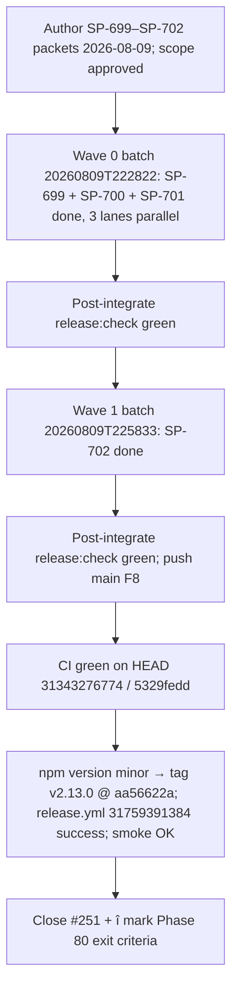

# v2.13.0 Release Post-Mortem

**Document type:** Incident / release post-mortem (Diátaxis: explanation)  
**Audience:** Operator + maintainers  
**Verdict:** Minor scope was sound and **shipped** (`pi-spine@2.13.0`) as the intended *painless-ops* cycle. The stabilization rules encoded after v2.12.1–v2.12.3 **held**: scope approval was recorded before Phase 4 (F1/[#249](https://github.com/beettlle/pi-spine/issues/249)), the worker pin `kimi-coding/k3` was **never touched mid-release** — a direct contrast to the v2.12.3 F-A pin thrash (F7/[#248](https://github.com/beettlle/pi-spine/issues/248)) — and `main` stayed synced to `origin` (F8). The one leftover process gap is docs-level: the v2.12.3 F-C finding (CI cancelled = **no signal**) is still not written into the publish runbook or the skill Phase 5 gate; that belongs to **SP-704** in v2.14.0, not this document.

---

## 1. Executive summary

| Metric | Value |
|--------|-------|
| Target | **v2.13.0** (minor from 2.12.3) |
| Profile | minor / composition A — painless ops |
| Authoring | 2026-08-09 |
| Waves | 2026-08-09 (Wave 0 batch `20260809T222822`; Wave 1 batch `20260809T225833`) |
| Publish | 2026-08-13/14 — tag `v2.13.0` @ `aa56622a`; operator approved bump 2026-08-14 |
| Release workflow | [`31759391384`](https://github.com/beettlle/pi-spine/actions/runs/31759391384) success |
| CI on pre-bump HEAD | [`31343276774`](https://github.com/beettlle/pi-spine/actions/runs/31343276774) success on `5329fedd` |
| Post-publish smoke | `scripts/post-publish-smoke.sh 2.13.0` OK (attempt 1/6) |
| GitHub Release | https://github.com/beettlle/pi-spine/releases/tag/v2.13.0 |
| Manifest | [`spine-tasks/_authoring/release-v2.13.0/manifest.md`](../../spine-tasks/_authoring/release-v2.13.0/manifest.md) |
| Primary batches | `20260809T222822` (SP-699/SP-700/SP-701), `20260809T225833` (SP-702) |
| Worker pin | `kimi-coding/k3` (thinking: high) — **held; no mid-release pin edits, no override recorded** |

**One-line outcome:** Four small packets (one docs, three enhancement) landed in two waves on a single evening with green gates throughout, and the v2.12.3 failure pattern — mid-release agent-pin thrash on a quota signal — did **not** recur: the pin held for the entire cycle.

**What was *not* the problem:** Model/provider stability. The v2.13.0 manifest flagged the `kimi-coding/k3` pin as elevated fail%/quota risk (F7 family); no 429/403 event materialized during the waves, so the "do not thrash pins; pause/retry or abort instead" contingency was never needed.

---

## 2. Scope & what shipped

**Manifest:** [`spine-tasks/_authoring/release-v2.13.0/manifest.md`](../../spine-tasks/_authoring/release-v2.13.0/manifest.md)  
**CONTEXT Phase 80:** [`spine-tasks/CONTEXT.md`](../../spine-tasks/CONTEXT.md)

| SP-ID | Issue | Intent | Landed? | Notes |
|-------|-------|--------|---------|-------|
| SP-699 | — | Post-mortem v2.12.3 (pin thrash, #226 option A, F-C checklist lag) | Yes | Docs-only; produced [`docs/release/post-mortem-v2.12.3.md`](post-mortem-v2.12.3.md) — the structural model for this document |
| SP-700 | [#251](https://github.com/beettlle/pi-spine/issues/251) | Doctor/preflight quota-risk escalate warning | Yes | Advisory warn when the pinned provider has recent 429/403 evidence — the tool-layer enforcement follow-up to v2.12.3 F-A; **closes #251** |
| SP-701 | [#238](https://github.com/beettlle/pi-spine/issues/238) | Map anthropic + github-copilot quota pool IDs | Yes | `resolvePoolId` + tests; partial #238 |
| SP-702 | [#238](https://github.com/beettlle/pi-spine/issues/238) | Optional anthropic/copilot probes + QUICK-REFERENCE | Yes | Fail-closed adapters (`absent` on enterprise/Admin API gaps); credential docs; **closes #238** |

**Composition:** 1 standalone docs task + embedded docs in the enhancement packets; 0 open bugs (operator override); 2 enhancement issues (#251, #238). Profile audit passed with the recorded override.

**Still open / deferred after release:** matrix epic [#225](https://github.com/beettlle/pi-spine/issues/225) and children [#229](https://github.com/beettlle/pi-spine/issues/229)–[#232](https://github.com/beettlle/pi-spine/issues/232); P3 backlog [#209](https://github.com/beettlle/pi-spine/issues/209)–[#213](https://github.com/beettlle/pi-spine/issues/213); larger enhancements (#120, #124, #127, #135, #43). The CI no-signal docs gap is staged as **SP-704** in v2.14.0 (Phase 81).

---

## 3. Chronology

| When | What |
|------|------|
| 2026-08-09 | Phase 80 authoring; operator approved minor / composition A; worker pin `kimi-coding/k3` recorded with "do not change mid-release" ([#248](https://github.com/beettlle/pi-spine/issues/248)); **no agent pin override** |
| 2026-08-09 | Wave 0 batch `20260809T222822` — SP-699 (`2936943c`), SP-700 (`a33fceba`), SP-701 (`12dda7c8`) completed on 3 parallel lanes and integrated |
| 2026-08-09 | Post-integrate `release:check` green after Wave 0 |
| 2026-08-09 | Wave 1 batch `20260809T225833` — SP-702 (`70485873`) completed and integrated (`5329fedd`) after SP-701 (serialized `src/metrics/*` hot files per manifest) |
| 2026-08-09 | Post-integrate `release:check` green after Wave 1; `main` pushed (F8) |
| 2026-08-13 | `npm run release:check` green on final HEAD — exit 0 verified, coverage 89.11% (`/tmp/pi-spine-release-check.log`) |
| 2026-08-13 | CI green on pre-bump HEAD — run [`31343276774`](https://github.com/beettlle/pi-spine/actions/runs/31343276774) on `5329fedd` |
| 2026-08-13/14 | Operator approved publish bump **minor** (2026-08-14); `npm version minor` → tag `v2.13.0` @ `aa56622a`; `git push && git push --tags` |
| 2026-08-13/14 | `release.yml` success [`31759391384`](https://github.com/beettlle/pi-spine/actions/runs/31759391384); npm `pi-spine@2.13.0`; post-publish smoke OK (attempt 1/6) |
| 2026-08-13/14 | Closed [#251](https://github.com/beettlle/pi-spine/issues/251) and [#238](https://github.com/beettlle/pi-spine/issues/238); Phase 80 exit criteria marked (`205af837`) |

**Observation (honest note):** there was a ~4-day span between the last integrate (2026-08-09) and publish (2026-08-13/14). Unlike v2.12.3 F-C, this gap was operator scheduling, not blocked CI — CI was green on HEAD when the publish checklist ran, and no `workflow_dispatch` escape hatch was needed. The docs gap it exposed in v2.12.3 remains open, however; see F-B below.

---

## 4. Failure taxonomy (evidence-backed)

This cycle shipped clean, so the taxonomy is framed as **held vs. not-yet-closed** against the v2.12.3 findings.

### F-A (v2.12.3) — Mid-release agent pin thrash: **HELD in v2.13.0**

**Area:** Config / release ops  
**Status:** Rule held — no recurrence  
**Tracked:** [#248](https://github.com/beettlle/pi-spine/issues/248); enforcement follow-up [#251](https://github.com/beettlle/pi-spine/issues/251) **closed by SP-700**

v2.12.3 removed `kimi-coding/kimi-k2-thinking` from hard/profile pins mid-release on a Kimi 429 quota signal (`6e7423c4`), the exact F7 pattern banned by [`skills/spine-release-operator/SKILL.md`](../../skills/spine-release-operator/SKILL.md). In v2.13.0 the manifest recorded the same risk up front ("elevated fail%/quota risk … **do not** thrash pins mid-release if 429s occur; pause/retry or abort wave instead") and the pin `kimi-coding/k3` was left untouched for the whole cycle — `Agent pin override: none`. Additionally, SP-700 shipped the tool-layer mitigation the v2.12.3 post-mortem asked for: an advisory doctor/preflight quota-risk escalate warning ([#251](https://github.com/beettlle/pi-spine/issues/251)), so future cycles surface pin risk at the tool layer instead of relying on prose.

**Lesson carried forward:** the rule plus the manifest risk note plus the SP-700 advisory warning now form three layers (prose, plan, tool). Keep all three; do not treat any one as sufficient.

### F-B — Leftover F-C docs gap: CI cancelled / no-signal recovery still undocumented

**Area:** Release outer loop / docs  
**Severity:** Low-Medium (docs only; no publish was blocked this cycle)  
**Tracked:** owned by **SP-704** (v2.14.0) — *not* this document's File Scope

v2.12.3 F-C established that a cancelled `ci.yml` run is **no signal** — neither green nor red — and that the recovery is a manual `workflow_dispatch` re-run (shipped in `edb7919d`). v2.13.0 never needed that path (CI was green on HEAD pre-tag), but the rule is still not written where operators look during Phase 5: the pre-publish checklist in `docs/release/npm-publish.md` and the pre-tag CI gate in [`skills/spine-release-operator/SKILL.md`](../../skills/spine-release-operator/SKILL.md) do not yet carry the "cancelled / absent → re-run via `workflow_dispatch`, wait for `conclusion: success`, do not `npm version` or push tags until green" branch.

**Disposition:** deliberately deferred. SP-704 (staged, Phase 81) owns both files; this post-mortem only records the gap and the pointer, and does **not** edit `docs/release/npm-publish.md` or the skill.

### F-C — Model/provider instability: no event this cycle (context)

**Area:** Config / ops  
**Status:** Dormant, not resolved  
**Tracked:** [#248](https://github.com/beettlle/pi-spine/issues/248)

No 429/403 or launch-storm event occurred during the v2.13.0 waves. The guidance is unchanged: pin one worker per release, escalate only on content/contract failure, and let the SP-700 advisory warning surface quota risk before the first wave rather than reacting mid-release.

---

## 5. Engineering backlog

| Pri | Finding | Issue | Owner area | Next action |
|-----|---------|-------|------------|-------------|
| P1 | F-B no-signal CI recovery undocumented | — (mitigation shipped in `edb7919d`) | Release ops / docs | **SP-704 (v2.14.0):** write cancelled/no-signal → `workflow_dispatch` recovery into `docs/release/npm-publish.md` and skill Phase 5 gate |
| P2 | Matrix epic remainder | [#225](https://github.com/beettlle/pi-spine/issues/225), [#229](https://github.com/beettlle/pi-spine/issues/229)–[#232](https://github.com/beettlle/pi-spine/issues/232) | Engine matrix | Deferred children: index env, per-row status/retry/cancel, failure policies, per-row PROMPT substitution |
| P2 | Journal / review parser hardening | [#120](https://github.com/beettlle/pi-spine/issues/120), [#213](https://github.com/beettlle/pi-spine/issues/213) | Engine / review pipeline | **SP-705 / SP-706 (v2.14.0)** |
| P3 | Remaining enhancement backlog | [#209](https://github.com/beettlle/pi-spine/issues/209)–[#212](https://github.com/beettlle/pi-spine/issues/212), #124, #127, #135, #43 | Various | Deferred per v2.14.0 manifest |
| Done | Pin override recording + advisory warning | [#248](https://github.com/beettlle/pi-spine/issues/248), [#251](https://github.com/beettlle/pi-spine/issues/251) | Release ops / doctor | Pin held in v2.13.0; SP-700 advisory quota-risk warning shipped; #251 closed |
| Done | Anthropic/copilot quota pools + probes | [#238](https://github.com/beettlle/pi-spine/issues/238) | Metrics | Shipped (SP-701 + SP-702); #238 closed |

---

## 6. What not to reintroduce

- Do **not** mid-release-edit `.spine/spine-config.json` agent pins on a quota/403/launch-storm signal — escalate only on content/contract failure (F7, [#248](https://github.com/beettlle/pi-spine/issues/248)). v2.13.0 demonstrated the rule is followable: the pin held with zero overrides. If an override is ever truly required, record reason + date in the release manifest first and keep the worker pin stable.
- Do **not** start Phase 4 without recorded `Operator approved scope: yes` in the manifest (F1, [#249](https://github.com/beettlle/pi-spine/issues/249)) — held in v2.13.0.
- Do **not** let `main` drift far ahead of `origin` between waves (F8, [#249](https://github.com/beettlle/pi-spine/issues/249)) — held in v2.13.0; keep pushing after each land loop once the regression gate is green.
- Do **not** treat "CI cancelled" as "CI green" or "CI red" — it is **no signal** and blocks publish until a `workflow_dispatch` re-run produces `conclusion: success` on the publish HEAD (v2.12.3 F-C; docs owned by SP-704).
- Do **not** re-open the planner virtual matrix row ID design (SP-689/SP-690, SP-696; #226 superseded by #228) — carried into the v2.13.0 packets as a task-scoped Do-NOT and reaffirmed here.
- Do **not** judge `release:check` from log tails alone — verify exit codes (manifest stabilization rule; exit 0 recorded for v2.13.0).

---

## 7. Appendix

### Batch IDs

| Batch | Role |
|-------|------|
| `20260809T222822` | Wave 0 — SP-699, SP-700, SP-701 complete (3 lanes parallel) |
| `20260809T225833` | Wave 1 — SP-702 complete (after SP-701) |

### Key commits / runs

| Artifact | Path / ID |
|----------|-----------|
| SP-699 post-mortem v2.12.3 | `2936943c` |
| SP-700 doctor quota-risk warning (#251) | `a33fceba` |
| SP-701 quota pool IDs (#238) | `12dda7c8` |
| SP-702 quota probes + docs (#238) | `70485873` |
| Wave 1 integrate (pre-bump HEAD) | `5329fedd` |
| Green CI on pre-bump HEAD | [`31343276774`](https://github.com/beettlle/pi-spine/actions/runs/31343276774) |
| Version bump / publish commit | `aa56622a` (`2.13.0`, tag `v2.13.0`) |
| Release workflow | [`31759391384`](https://github.com/beettlle/pi-spine/actions/runs/31759391384) |
| Phase 80 closeout (CONTEXT + manifest) | `205af837` |
| `release:check` evidence | `/tmp/pi-spine-release-check.log` EXIT:0, coverage 89.11% |
| Post-publish smoke | `/tmp/pi-spine-post-publish-smoke-2.13.0.log` (attempt 1/6) |

### Related docs / rules

| Path | Role |
|------|------|
| [`spine-tasks/_authoring/release-v2.13.0/manifest.md`](../../spine-tasks/_authoring/release-v2.13.0/manifest.md) | Release manifest (scope, waves, publish checklist, pin record) |
| [`spine-tasks/CONTEXT.md`](../../spine-tasks/CONTEXT.md) | Phase 80 (this release) + Phase 81 (v2.14.0 follow-ups: SP-703–SP-706) |
| [`skills/spine-release-operator/SKILL.md`](../../skills/spine-release-operator/SKILL.md) | Hard rules F1 (scope approval, [#249](https://github.com/beettlle/pi-spine/issues/249)), F7 (model pin, [#248](https://github.com/beettlle/pi-spine/issues/248)), F8 (push/sync, [#249](https://github.com/beettlle/pi-spine/issues/249)) — held in v2.13.0; **not edited by this document** (Phase 5 no-signal wording is SP-704) |
| [`docs/release/post-mortem-v2.12.3.md`](post-mortem-v2.12.3.md) | Prior post-mortem (F-A pin thrash, F-B SP-696 abort, F-C checklist lag) — structural model and contrast baseline |
| [`docs/release/npm-publish.md`](npm-publish.md) | Publish + smoke runbook; **not edited** — SP-704 owns the CI no-signal recovery note |

### Issues linked

| # | Relationship |
|---|--------------|
| [#238](https://github.com/beettlle/pi-spine/issues/238) | **Closed** — anthropic/github-copilot quota pools + probes (SP-701/SP-702) |
| [#248](https://github.com/beettlle/pi-spine/issues/248) | Model-pin policy — **held** in v2.13.0 (no override; contrast v2.12.3 F-A) |
| [#249](https://github.com/beettlle/pi-spine/issues/249) | Scope-approval / push-sync gates (F1/F8) — held |
| [#251](https://github.com/beettlle/pi-spine/issues/251) | **Closed** — doctor/preflight quota-risk escalate warning (SP-700) |
