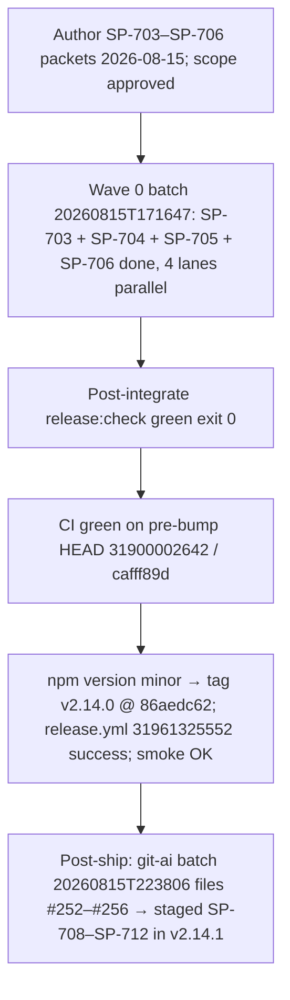

# v2.14.0 Release Post-Mortem

**Document type:** Incident / release post-mortem (Diátaxis: explanation)  
**Audience:** Operator + maintainers  
**Verdict:** Minor scope was sound and **shipped** (`pi-spine@2.14.0`) as the intended *painless-ops* cycle. The stabilization rules encoded after v2.12.1–v2.12.3 **held again**: scope approval was recorded before Phase 4 (F1/[#249](https://github.com/beettlle/pi-spine/issues/249)), the worker pin `kimi-coding/k3` was **never touched mid-release** (F7/[#248](https://github.com/beettlle/pi-spine/issues/248)), and `main` stayed synced to `origin` (F8). The v2.13.0 F-B leftover — CI cancelled = **no signal** undocumented in the publish path — was **closed by SP-704** in this cycle. The one new signal is **post-ship, not in-cycle**: a consumer (git-ai, batch `20260815T223806`) filed five bugs ([#252](https://github.com/beettlle/pi-spine/issues/252)–[#256](https://github.com/beettlle/pi-spine/issues/256)) against v2.13.0/v2.14.0 behavior days after publish. They are **findings, not release blockers**, and are staged as **SP-708–SP-712** in v2.14.1.

---

## 1. Executive summary

| Metric | Value |
|--------|-------|
| Target | **v2.14.0** (minor from 2.13.0) |
| Profile | minor / composition A — painless ops (0 bugs, operator override) |
| Authoring | 2026-08-15 |
| Waves | 2026-08-15 — single Wave 0 batch `20260815T171647` (4 lanes parallel) |
| Publish | 2026-08-16 — tag `v2.14.0` @ `86aedc62`; operator approved bump minor 2026-08-16 |
| Release workflow | [`31961325552`](https://github.com/beettlle/pi-spine/actions/runs/31961325552) success |
| CI on pre-bump HEAD | [`31900002642`](https://github.com/beettlle/pi-spine/actions/runs/31900002642) success on `cafff89d` |
| CI on publish commit | [`31961324705`](https://github.com/beettlle/pi-spine/actions/runs/31961324705) success on `86aedc62` |
| Post-publish smoke | `scripts/post-publish-smoke.sh 2.14.0` OK (attempt 1/6) |
| GitHub Release | https://github.com/beettlle/pi-spine/releases/tag/v2.14.0 |
| Manifest | [`spine-tasks/_authoring/release-v2.14.0/manifest.md`](../../spine-tasks/_authoring/release-v2.14.0/manifest.md) |
| Primary batch | `20260815T171647` (SP-703/SP-704/SP-705/SP-706, one wave) |
| Worker pin | `kimi-coding/k3` (thinking: high) — **held; `Agent pin override: none`** |

**One-line outcome:** Four small packets (two docs, two enhancement) landed in a single four-lane wave with green gates throughout; the CI no-signal docs gap left over from v2.12.3/v2.13.0 was closed by SP-704; and the failure mode that *did* surface — five consumer-reported bugs — arrived **after** publish from an external adopter's batch, validating the release gates but exposing ergonomics gaps in the outer-loop agent surface.

**What was *not* the problem:** In-cycle stability. No 429/403 quota event, no pin thrash, no cancelled-CI ambiguity at publish, no drift between `main` and `origin`. The v2.14.0 batch state later showed diagnosis `human_base_diverged` (historical artifact; `main` was clean and synced by v2.14.1 authoring).

---

## 2. Scope & what shipped

**Manifest:** [`spine-tasks/_authoring/release-v2.14.0/manifest.md`](../../spine-tasks/_authoring/release-v2.14.0/manifest.md)  
**CONTEXT Phase 81:** [`spine-tasks/CONTEXT.md`](../../spine-tasks/CONTEXT.md)

| SP-ID | Issue | Intent | Landed? | Notes |
|-------|-------|--------|---------|-------|
| SP-703 | — | Post-mortem v2.13.0 (painless ops cycle) | Yes | Docs-only; produced [`docs/release/post-mortem-v2.13.0.md`](post-mortem-v2.13.0.md) — the structural model for this document |
| SP-704 | (F-C leftover) | CI cancelled / no-signal publish recovery | Yes | Wrote the "cancelled/absent/in_progress CI = **no signal** → `workflow_dispatch` re-run → wait for `conclusion: success`; do not tag until green" branch into [`docs/release/npm-publish.md`](npm-publish.md) and the release-operator skill Phase 5 gate — **closes the F-B gap from v2.13.0** |
| SP-705 | [#120](https://github.com/beettlle/pi-spine/issues/120) | Journal checksum + append serialize + EBUSY retry | Yes | SHA-256 checksum field on new events (legacy lines skip/warn), in-process append serialization, bounded EBUSY/ENOENT retry; stayed **additive** per the CRITICAL `appendJournalEvent` blast-radius constraint; **partial #120** |
| SP-706 | [#213](https://github.com/beettlle/pi-spine/issues/213) | Audit review/plan JSON parsers vs fences | Yes | Fail-closed fence audit + regression fixtures (fence-wrapped, preamble+JSON, embedded objects); `parseReviewVerdict` fix kept fail-closed (`verdict: null`, no invented verdicts) per the HIGH blast-radius constraint; **closes #213** |

**Composition:** 2 docs tasks + 2 enhancements (#120 partial, #213 closed); 0 open bugs (operator override — same shape as v2.13.0). Profile audit passed with the recorded override.

**Still open / deferred after release:** matrix epic [#225](https://github.com/beettlle/pi-spine/issues/225) and children [#229](https://github.com/beettlle/pi-spine/issues/229)–[#232](https://github.com/beettlle/pi-spine/issues/232); P3 backlog [#209](https://github.com/beettlle/pi-spine/issues/209)–[#212](https://github.com/beettlle/pi-spine/issues/212); larger enhancements (#124, #127, #135, #43); #120 remainder (partial via SP-705). **New:** consumer bugs [#252](https://github.com/beettlle/pi-spine/issues/252)–[#256](https://github.com/beettlle/pi-spine/issues/256) → staged as **SP-708–SP-712** in v2.14.1 (Phase 82).

---

## 3. Chronology

| When | What |
|------|------|
| 2026-08-15 | Phase 81 authoring; operator approved minor / composition A; worker pin `kimi-coding/k3` recorded with "do not change mid-release" ([#248](https://github.com/beettlle/pi-spine/issues/248)); **no agent pin override** |
| 2026-08-15 | Wave 0 batch `20260815T171647` — all four tasks on 4 parallel lanes: SP-703 (`a1292872`), SP-704 (`a54b7683`), SP-705 (`a9774400`), SP-706 (`b989b30f`); lane merges `6432950b`, `81a06a81`, `761eaa2a`, `933caaa0` |
| 2026-08-15 | SP-705 follow-up `cafff89d` — extracted checksum append helper to keep the journal module under 500 LOC |
| 2026-08-15 | Post-integrate `release:check` green — exit 0 verified (`/tmp/pi-spine-post-integrate-wave-0.log`) |
| 2026-08-15 | CI green on pre-bump HEAD — run [`31900002642`](https://github.com/beettlle/pi-spine/actions/runs/31900002642) on `cafff89d` |
| 2026-08-15/16 | Consumer git-ai ran batch `20260815T223806` against v2.13.0/v2.14.0 behavior; filed [#252](https://github.com/beettlle/pi-spine/issues/252)–[#256](https://github.com/beettlle/pi-spine/issues/256) — **post-ship findings** |
| 2026-08-16 | `npm run release:check` green on final HEAD — exit 0 verified, coverage 89.03% (`/tmp/pi-spine-npm-version-2.14.0.log`) |
| 2026-08-16 | Operator approved publish bump **minor**; `npm version minor` → tag `v2.14.0` @ `86aedc62`; `git push && git push --tags` |
| 2026-08-16 | CI green on publish commit [`31961324705`](https://github.com/beettlle/pi-spine/actions/runs/31961324705); `release.yml` success [`31961325552`](https://github.com/beettlle/pi-spine/actions/runs/31961325552); npm `pi-spine@2.14.0`; post-publish smoke OK (attempt 1/6) |
| 2026-08-19/20 | v2.14.1 patch manifest authored — #252–#256 staged as SP-708–SP-712 alongside this post-mortem (SP-707) |

**Observation (honest note):** unlike v2.13.0's ~4-day integrate→publish gap, this cycle integrated and published within ~24 hours. The consumer bugs arrived in that same window — a reminder that "green gates" cover the engine's own contract, not the full outer-loop agent ergonomics surface that external adopters exercise (wait semantics, worker output salvage, evidence command allowlists, lane hygiene, doctor probes).

---

## 4. Failure taxonomy (evidence-backed)

This cycle shipped clean, so the taxonomy is framed as **held vs. open** against the v2.12.3/v2.13.0 findings, plus one new post-ship category.

### F-A (v2.13.0 F-B) — CI cancelled / no-signal recovery undocumented: **CLOSED in v2.14.0**

**Area:** Release outer loop / docs  
**Status:** Resolved by SP-704  
**Tracked:** v2.12.3 F-C; v2.13.0 F-B pointer to SP-704

SP-704 wrote the recovery branch where operators look during Phase 5: pre-tag CI is **no signal** when runs are `cancelled`, absent, or `in_progress`; recovery is a manual `ci.yml` `workflow_dispatch` re-run (shipped in v2.12.3, `edb7919d`) and a wait for `conclusion: success`; do not `npm version` / `git push --tags` until green. Both files the v2.13.0 post-mortem named — [`docs/release/npm-publish.md`](npm-publish.md) and [`skills/spine-release-operator/SKILL.md`](../../skills/spine-release-operator/SKILL.md) — now carry the rule. This cycle never needed the path (CI was green on both pre-bump and publish HEAD), but the docs gap is no longer open.

### F-B — Mid-release agent pin thrash: **HELD in v2.14.0** (second consecutive cycle)

**Area:** Config / release ops  
**Status:** Rule held — no recurrence  
**Tracked:** [#248](https://github.com/beettlle/pi-spine/issues/248); advisory tooling [#251](https://github.com/beettlle/pi-spine/issues/251) (closed, SP-700)

The manifest recorded `Worker model pin: kimi-coding/k3 — do not change mid-release` and `Agent pin override: none`. No 429/403 event materialized; the SP-700 doctor advisory was present but never needed. Three layers (prose rule, manifest risk note, tool advisory) remain in place — keep all three.

### F-C — Push/sync and scope-approval gates: **HELD in v2.14.0**

**Area:** Release ops  
**Status:** Rule held — no recurrence  
**Tracked:** [#249](https://github.com/beettlle/pi-spine/issues/249)

`Operator approved scope: yes` recorded 2026-08-15 before Phase 4 (F1). Post-integrate `release:check` exit 0 verified via `PIPESTATUS[0]` after the wave, and `main` pushed per F8. The later `human_base_diverged` diagnosis on the batch record is a historical artifact of the publish bump landing outside the batch's base; `main` was clean and synced with `origin` by v2.14.1 authoring.

### F-D — Consumer-reported outer-loop ergonomics bugs: **OPEN (post-ship findings)**

**Area:** CLI / worker runner / integrate / doctor  
**Severity:** Medium (consumer-facing; none block publishing itself)  
**Tracked:** [#252](https://github.com/beettlle/pi-spine/issues/252)–[#256](https://github.com/beettlle/pi-spine/issues/256); fixes staged as **SP-708–SP-712** in v2.14.1

A consumer (git-ai) running batch `20260815T223806` on pi-spine v2.13.0 exercised surfaces the engine's own gates do not, and filed five bugs **after** v2.14.0 shipped. They are **not release blockers** — v2.14.0 met its publish contract — but they are real defects in the agent-facing outer loop:

| Issue | Symptom | Consumer impact | Fix task |
|-------|---------|-----------------|----------|
| [#252](https://github.com/beettlle/pi-spine/issues/252) | `spine wait --until failed` never wakes when diagnosis is `worker_done_missing` (only exact-match; no mapping when `phase === "failed"`) | Outer-loop agents hang until `--timeout` on already-failed batches | **SP-709** |
| [#253](https://github.com/beettlle/pi-spine/issues/253) | Worker-runner drops pi stdout/stderr when pi exits 0 without `.DONE` (non-zero path flushes; DONE-missing path does not) | Salvage logs useless; retry/debug slow | **SP-708** |
| [#254](https://github.com/beettlle/pi-spine/issues/254) | Gate evidence rejects `cargo`/`task` executables and any `$` (e.g. `PATH="$HOME/.cargo/bin:$PATH"`) in `testCommand` | Rust/Task consumers cannot produce real test proof in integrate evidence | **SP-710** |
| [#255](https://github.com/beettlle/pi-spine/issues/255) | Lane completion commits `.pi/` and `.pi-smart-router/` runtime state into orch merges | Agent session/router artifacts pollute consumer repos | **SP-711** |
| [#256](https://github.com/beettlle/pi-spine/issues/256) | `spine doctor` treats `spawnSync pi --list-models` ETIMEDOUT (30s) as missing login, suggesting `pi login` | Preflight hard-fails on a slow catalog fetch with the wrong recovery hint | **SP-712** |

**Disposition:** all five staged in the v2.14.1 patch manifest ([`spine-tasks/_authoring/release-v2.14.1/manifest.md`](../../spine-tasks/_authoring/release-v2.14.1/manifest.md)) with LOW GitNexus blast radii. Bug-fix tasks own issue closure; this document only records the findings and the pointers.

**Lesson carried forward:** release gates (`release:check`, CI, smoke) verify the engine against its own test suite. External adopters exercise the *ergonomics* layer — wait-until semantics vs. diagnosis taxonomy, worker output salvage, evidence allowlists, lane ignore paths, doctor probe failure classes. Consider a consumer-simulation smoke (run a small detached batch end-to-end and inspect wait/output/evidence behavior) as a future pre-publish signal; not staged yet.

### F-E — Model/provider instability: no event this cycle (context)

**Area:** Config / ops  
**Status:** Dormant, not resolved  
**Tracked:** [#248](https://github.com/beettlle/pi-spine/issues/248)

No 429/403 or launch-storm event occurred during the v2.14.0 wave. Guidance unchanged: pin one worker per release, escalate only on content/contract failure, let the SP-700 advisory surface quota risk before the first wave.

---

## 5. Engineering backlog

| Pri | Finding | Issue | Owner area | Next action |
|-----|---------|-------|------------|-------------|
| P1 | F-D consumer bugs (post-ship) | [#252](https://github.com/beettlle/pi-spine/issues/252)–[#256](https://github.com/beettlle/pi-spine/issues/256) | CLI / runner / integrate / doctor | **SP-708–SP-712 (v2.14.1):** DONE-missing output flush, wait-failed match, evidence allowlist, lane ignore paths, doctor timeout advisory |
| P1 | Journal hardening remainder | [#120](https://github.com/beettlle/pi-spine/issues/120) (partial via SP-705) | Engine / journal | Remaining #120 scope beyond checksum + serialize + retry |
| P2 | Matrix epic remainder | [#225](https://github.com/beettlle/pi-spine/issues/225), [#229](https://github.com/beettlle/pi-spine/issues/229)–[#232](https://github.com/beettlle/pi-spine/issues/232) | Engine matrix | Deferred children: index env, per-row status/retry/cancel, failure policies, per-row PROMPT substitution |
| P2 | Consumer-simulation pre-publish smoke | — (lesson from F-D) | Release ops | Evaluate running a small detached end-to-end batch as a publish-gate signal |
| P3 | Remaining enhancement backlog | [#209](https://github.com/beettlle/pi-spine/issues/209)–[#212](https://github.com/beettlle/pi-spine/issues/212), #124, #127, #135, #43 | Various | Deferred per v2.14.1 manifest |
| Done | CI no-signal recovery docs | v2.12.3 F-C / v2.13.0 F-B | Release ops / docs | **SP-704 shipped** — `npm-publish.md` + skill Phase 5 gate carry the rule |
| Done | Review/plan parser fence audit | [#213](https://github.com/beettlle/pi-spine/issues/213) | Engine / review pipeline | **SP-706 shipped**; fail-closed fixtures landed; #213 closed |
| Done | Pin override recording + advisory warning | [#248](https://github.com/beettlle/pi-spine/issues/248), [#251](https://github.com/beettlle/pi-spine/issues/251) | Release ops / doctor | Pin held second consecutive cycle; no override recorded |

---

## 6. What not to reintroduce

- Do **not** mid-release-edit `.spine/spine-config.json` agent pins on a quota/403/launch-storm signal — escalate only on content/contract failure (F7, [#248](https://github.com/beettlle/pi-spine/issues/248)). v2.14.0 is the **second consecutive cycle** the pin held with zero overrides; treat the pattern as established, not lucky.
- Do **not** start Phase 4 without recorded `Operator approved scope: yes` in the manifest (F1, [#249](https://github.com/beettlle/pi-spine/issues/249)) — held in v2.14.0.
- Do **not** let `main` drift far ahead of `origin` between waves (F8, [#249](https://github.com/beettlle/pi-spine/issues/249)) — held in v2.14.0; keep pushing after each land loop once the regression gate is green.
- Do **not** treat "CI cancelled" as "CI green" or "CI red" — it is **no signal** and blocks publish until a `workflow_dispatch` re-run produces `conclusion: success` on the publish HEAD (v2.12.3 F-C). **Docs now shipped (SP-704)** — the rule lives in `docs/release/npm-publish.md` and the skill Phase 5 gate, not only in post-mortems.
- Do **not** judge `release:check` from log tails alone — verify exit codes (`PIPESTATUS[0]`; exit 0 recorded for v2.14.0).
- Do **not** re-open the planner virtual matrix row ID design (SP-689/SP-690, SP-696; #226 superseded by #228).
- Do **not** widen SP-705-style CRITICAL blast-radius work beyond the additive contract — the journal checksum/serialize/retry change shipped *because* it stayed additive; whole-file jsonl rewrites remain banned ([#120](https://github.com/beettlle/pi-spine/issues/120) notes).
- Do **not** weaken fail-closed review parsing — SP-706 fixtures pin `verdict: null` on garbage; no invented PASS/REVISE/APPROVE ([#213](https://github.com/beettlle/pi-spine/issues/213)).
- Do **not** treat consumer-reported bugs as release regressions by default — #252–#256 were filed post-ship against published behavior and are handled as the v2.14.1 patch backlog, not as evidence the v2.14.0 gates failed.

---

## 7. Appendix

### Batch IDs

| Batch | Role |
|-------|------|
| `20260815T171647` | Wave 0 — SP-703, SP-704, SP-705, SP-706 complete (4 lanes parallel) |
| `20260815T223806` | **Consumer** git-ai batch (post-ship; source of #252–#256 — not a pi-spine release batch) |

### Key commits / runs

| Artifact | Path / ID |
|----------|-----------|
| SP-703 post-mortem v2.13.0 | `3a17cfc0` (Step 1); completion `a1292872` |
| SP-704 CI no-signal publish recovery | `48aeb575` (Step 1); completion `a54b7683` |
| SP-705 journal checksum + serialize + retry (#120) | `3badf668`; completion `a9774400` |
| SP-705 helper extraction (500 LOC) | `cafff89d` (pre-bump HEAD) |
| SP-706 parser fence audit fixtures (#213) | `d4b16786`; completion `b989b30f` |
| Lane merges | `6432950b` (lane 1), `81a06a81` (lane 2), `761eaa2a` (lane 3), `933caaa0` (lane 4) |
| Green CI on pre-bump HEAD | [`31900002642`](https://github.com/beettlle/pi-spine/actions/runs/31900002642) on `cafff89d` |
| Version bump / publish commit | `86aedc62` (`2.14.0`, tag `v2.14.0`) |
| CI on publish commit | [`31961324705`](https://github.com/beettlle/pi-spine/actions/runs/31961324705) |
| Release workflow | [`31961325552`](https://github.com/beettlle/pi-spine/actions/runs/31961325552) |
| Publish closeout | `e52f3e1e` (`chore(release): mark v2.14.0 published`) |
| `release:check` evidence | `/tmp/pi-spine-npm-version-2.14.0.log` EXIT:0, coverage 89.03%; post-integrate `/tmp/pi-spine-post-integrate-wave-0.log` |
| Post-publish smoke | `scripts/post-publish-smoke.sh 2.14.0` OK (attempt 1/6) |

### Related docs / rules

| Path | Role |
|------|------|
| [`spine-tasks/_authoring/release-v2.14.0/manifest.md`](../../spine-tasks/_authoring/release-v2.14.0/manifest.md) | Release manifest (scope, wave, publish checklist, pin record) |
| [`spine-tasks/_authoring/release-v2.14.1/manifest.md`](../../spine-tasks/_authoring/release-v2.14.1/manifest.md) | **Patch manifest** — stages SP-708–SP-712 for consumer bugs #252–#256 |
| [`spine-tasks/CONTEXT.md`](../../spine-tasks/CONTEXT.md) | Phase 81 (this release) + Phase 82 (v2.14.1: SP-707–SP-712) |
| [`skills/spine-release-operator/SKILL.md`](../../skills/spine-release-operator/SKILL.md) | Hard rules F1/F7/F8 — held in v2.14.0; Phase 5 gate now carries the CI no-signal branch (SP-704) |
| [`docs/release/post-mortem-v2.13.0.md`](post-mortem-v2.13.0.md) | Prior post-mortem — structural model and baseline (F-B pointer discharged by SP-704) |
| [`docs/release/npm-publish.md`](npm-publish.md) | Publish + smoke runbook; **edited by SP-704** to carry the CI cancelled/no-signal recovery branch |

### Issues linked

| # | Relationship |
|---|--------------|
| [#120](https://github.com/beettlle/pi-spine/issues/120) | **Partial** — journal checksum + append serialize + EBUSY retry (SP-705); remainder open |
| [#213](https://github.com/beettlle/pi-spine/issues/213) | **Closed** — review/plan parser fence audit + fail-closed fixtures (SP-706) |
| [#248](https://github.com/beettlle/pi-spine/issues/248) | Model-pin policy — **held** in v2.14.0 (no override; second consecutive cycle) |
| [#249](https://github.com/beettlle/pi-spine/issues/249) | Scope-approval / push-sync gates (F1/F8) — held |
| [#252](https://github.com/beettlle/pi-spine/issues/252) | **Open** — `spine wait --until failed` vs `worker_done_missing`; fix staged as **SP-709** (v2.14.1) |
| [#253](https://github.com/beettlle/pi-spine/issues/253) | **Open** — worker-runner drops pi output on DONE-missing; fix staged as **SP-708** (v2.14.1) |
| [#254](https://github.com/beettlle/pi-spine/issues/254) | **Open** — gate evidence rejects cargo/`$PATH` prefixes; fix staged as **SP-710** (v2.14.1) |
| [#255](https://github.com/beettlle/pi-spine/issues/255) | **Open** — lane commits `.pi/`/`.pi-smart-router/`; fix staged as **SP-711** (v2.14.1) |
| [#256](https://github.com/beettlle/pi-spine/issues/256) | **Open** — doctor ETIMEDOUT mis-hinted as `pi login`; fix staged as **SP-712** (v2.14.1) |
