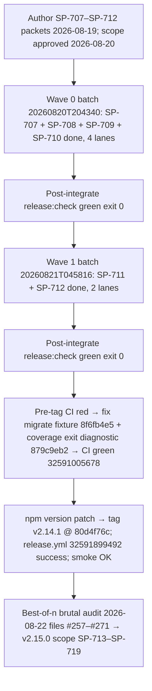

# v2.14.1 Release Post-Mortem

**Document type:** Incident / release post-mortem (Diátaxis: explanation)  
**Audience:** Operator + maintainers  
**Verdict:** The consumer-bugfix patch **shipped** (`pi-spine@2.14.1`) on contract. All five post-ship bugs filed by git-ai batch `20260815T223806` ([#252](https://github.com/beettlle/pi-spine/issues/252)–[#256](https://github.com/beettlle/pi-spine/issues/256)) were fixed and closed via **SP-708–SP-712** in two waves. The stabilization rules held for a third consecutive cycle: scope approval recorded before Phase 4 (F1), worker pin `kimi-coding/k3` untouched (F7), `main` synced to `origin` after each wave (F8), and every `release:check` gate verified by exit code. The one new wrinkle was **pre-publish CI red** — a tracked-fixture bug in the Taskplane migrate tests and an opaque coverage-suite failure on Actions required two diagnostic/fix commits before tagging; the *CI green on HEAD before tag* gate did its job. Context for what follows: a best-of-n **brutal audit** (2026-08-22) filed fifteen issues [#257](https://github.com/beettlle/pi-spine/issues/257)–[#271](https://github.com/beettlle/pi-spine/issues/271); its P0/P1 hardening scope frames **v2.15.0** (SP-713–SP-719).

---

## 1. Executive summary

| Metric | Value |
|--------|-------|
| Target | **v2.14.1** (patch from 2.14.0) |
| Profile | patch / composition A — consumer bugfix (5 bugs, 1 doc) |
| Authoring | 2026-08-19; operator approved scope 2026-08-20 |
| Waves | 2026-08-20/21 — Wave 0 batch `20260820T204340` (4 lanes) → Wave 1 batch `20260821T045816` (2 lanes) |
| Publish | 2026-08-21 — tag `v2.14.1` @ `80d4f76c`; operator approved bump patch |
| Release workflow | [`32591899492`](https://github.com/beettlle/pi-spine/actions/runs/32591899492) success |
| CI on publish HEAD | [`32591005678`](https://github.com/beettlle/pi-spine/actions/runs/32591005678) success on `80d4f76c` |
| `release:check` on publish HEAD | exit 0 verified on `80d4f76c` |
| Post-publish smoke | `scripts/post-publish-smoke.sh 2.14.1` OK |
| Manifest | [`spine-tasks/_authoring/release-v2.14.1/manifest.md`](../../spine-tasks/_authoring/release-v2.14.1/manifest.md) |
| Worker pin | `kimi-coding/k3` (thinking: high) — **held; `Agent pin override: none`** |

**One-line outcome:** Five consumer-facing ergonomics bugs landed as six small packets across two detached waves with green gates throughout; issues #252–#256 all closed; and the same-day v2.15.0 authoring converted a fresh brutal audit into the next hardening scope without disturbing the patch contract.

**What was *not* the problem:** In-cycle batch stability. No 429/403 quota event, no pin thrash, no worker-done-missing recurrence, no `main`/`origin` drift. The friction was at the publish boundary: pre-tag CI surfaced a genuinely broken migrate test fixture and a silent coverage-suite exit on Actions — both fixed before tagging (`8f6fb4e5`, `879c9eb2`).

---

## 2. Scope & what shipped

**Manifest:** [`spine-tasks/_authoring/release-v2.14.1/manifest.md`](../../spine-tasks/_authoring/release-v2.14.1/manifest.md)  
**CONTEXT Phase 82:** [`spine-tasks/CONTEXT.md`](../../spine-tasks/CONTEXT.md)

| SP-ID | Issue | Intent | Landed? | Notes |
|-------|-------|--------|---------|-------|
| SP-707 | — | Post-mortem v2.14.0 (painless ops cycle) | Yes | Docs-only; produced [`docs/release/post-mortem-v2.14.0.md`](post-mortem-v2.14.0.md) — the structural model for this document |
| SP-708 | [#253](https://github.com/beettlle/pi-spine/issues/253) | Worker-runner flush pi output on DONE-missing | Yes | `bin/spine-worker-runner.mjs` now flushes pi stdout/stderr on the exit-0-without-`.DONE` path, matching the non-zero path; salvage logs carry the real worker output; **closes #253** |
| SP-709 | [#252](https://github.com/beettlle/pi-spine/issues/252) | `spine wait --until failed` matches terminal batch failure | Yes | `src/cli/spine-wait.mjs`: `phase === "failed"` wake mapping added alongside exact diagnosis match (e.g. `worker_done_missing`); explicit tokens keep exact-match semantics per the LOW blast-radius note; **closes #252** |
| SP-710 | [#254](https://github.com/beettlle/pi-spine/issues/254) | Gate evidence allow cargo/task + safe PATH prefix | Yes | `src/batch/evidence-command.mjs`: allowlist extended for `cargo`/`task` executables and documented env-prefix assignments (`PATH="$HOME/.cargo/bin:$PATH"`); fail-closed on other `$` / shell metacharacters; helper extraction `fbcaff5f` kept the module under 500 LOC; **closes #254** |
| SP-711 | [#255](https://github.com/beettlle/pi-spine/issues/255) | Lane commit ignore `.pi/` and `.pi-smart-router/` | Yes | `src/config/spine-config-load.mjs`: additive ignore paths (mirrors SP-640 `.venv` pattern); cached gitignored runtime dropped from lane worktrees during the wave; **closes #255** |
| SP-712 | [#256](https://github.com/beettlle/pi-spine/issues/256) | Doctor ETIMEDOUT on `--list-models` is advisory | Yes | `src/doctor/run-doctor-checks.mjs`: ETIMEDOUT on the model-catalog probe now reports `ok: true, warning: true` with a slow-catalog advisory instead of a blocking `pi login` hint; **closes #256** |

**Composition:** 1 docs task + 5 bug fixes (#252–#256 all closed); 0 enhancements — within patch profile limits (audit PASS).

**Adjacent fixes landed pre-publish (not SP-scoped):** `8f6fb4e5` — Taskplane migrate tests used an untracked fixture that broke CI; `879c9eb2` — coverage suite failure on Actions surfaced no exit cause, so diagnostics were added to expose it. Both were required to reach *CI green on HEAD before tag*.

**Still open / deferred after release:** matrix epic [#225](https://github.com/beettlle/pi-spine/issues/225) and children [#229](https://github.com/beettlle/pi-spine/issues/229)–[#232](https://github.com/beettlle/pi-spine/issues/232); P3 backlog [#209](https://github.com/beettlle/pi-spine/issues/209)–[#212](https://github.com/beettlle/pi-spine/issues/212); larger enhancements (#124, #127, #135, #43); #120 remainder (partial via SP-705); SP-696 abort follow-ups. **New:** brutal audit findings [#257](https://github.com/beettlle/pi-spine/issues/257)–[#271](https://github.com/beettlle/pi-spine/issues/271) → P0/P1 subset staged as **SP-714–SP-719** in v2.15.0 (see §4 F-B).

---

## 3. Chronology

| When | What |
|------|------|
| 2026-08-19 | Phase 82 authoring; patch manifest recorded scope approval 2026-08-20, worker pin `kimi-coding/k3`, `Agent pin override: none` |
| 2026-08-20 | Wave 0 batch `20260820T204340` (detached) — SP-707, SP-708, SP-709, SP-710 on 4 lanes; lane merges `e1c74d77`, `2f8cb5ba`, `72c88bf9`, `66ce2c44`; cached gitignored `.pi` runtime dropped from lanes (`a0038b56`, `d19b1f68`, `3d8cfe35`, `da638d15`) |
| 2026-08-20 | Post-integrate `release:check` green — exit 0 verified (`rules-manifest` refresh `157d104d`); SP-710 follow-up `fbcaff5f` kept `evidence-command.mjs` under 500 LOC |
| 2026-08-21 | Wave 1 batch `20260821T045816` (detached) — SP-711 + SP-712 on 2 lanes; merges `e9e44c41`, `eaf4bc70`; post-integrate `release:check` green (`109f9990`) |
| 2026-08-21 | Pre-tag CI red: `8f6fb4e5` fixed the tracked Taskplane migrate fixture; `879c9eb2` added coverage-suite exit-cause diagnostics on Actions; re-run green — [`32591005678`](https://github.com/beettlle/pi-spine/actions/runs/32591005678) on `80d4f76c` |
| 2026-08-21 | `npm run release:check` green on final HEAD — exit 0 verified; operator approved publish bump **patch**; `npm version patch` → tag `v2.14.1` @ `80d4f76c`; `git push && git push --tags` |
| 2026-08-21 | `release.yml` success [`32591899492`](https://github.com/beettlle/pi-spine/actions/runs/32591899492); npm `pi-spine@2.14.1`; post-publish smoke OK |
| 2026-08-22 | Best-of-n **brutal audit** (`9eb77f8e` era) filed [#257](https://github.com/beettlle/pi-spine/issues/257)–[#271](https://github.com/beettlle/pi-spine/issues/271); v2.15.0 minor manifest authored same day with scope approved 2026-08-22 (SP-713–SP-719) |

**Observation (honest note):** the publish checklist caught real breakage this time — the *CI green on HEAD before tag* rule ([#156](https://github.com/beettlle/pi-spine/issues/156)) is what forced the migrate-fixture fix instead of shipping a red main. The fixture bug had been latent (untracked file worked locally; CI checkout did not have it). This is the second consecutive cycle where the remaining friction was at the publish boundary, not inside batches.

---

## 4. Failure taxonomy (evidence-backed)

The patch shipped clean, so the taxonomy is **held vs. open** against the v2.14.0 findings, plus two new categories (pre-publish CI friction; brutal-audit hardening scope).

### F-A — Consumer-reported outer-loop ergonomics bugs (v2.14.0 F-D): **CLOSED in v2.14.1**

**Area:** CLI / worker runner / integrate / doctor  
**Status:** All five resolved  
**Tracked:** [#252](https://github.com/beettlle/pi-spine/issues/252)–[#256](https://github.com/beettlle/pi-spine/issues/256) — closed by SP-709, SP-708, SP-710, SP-711, SP-712

Every bug git-ai filed after v2.14.0 shipped is fixed: wait-failed wakes on terminal diagnoses, DONE-missing worker output is flushed for salvage, gate evidence accepts `cargo`/`task` and documented env prefixes, lane commits no longer stage `.pi/`/`.pi-smart-router/` runtime, and doctor treats a slow model-catalog fetch as advisory instead of a blocking login hint. All five stayed additive and within LOW GitNexus blast radii per the manifest.

**Lesson carried forward (still open):** the consumer-simulation pre-publish smoke proposed in the v2.14.0 post-mortem — run a small detached batch end-to-end and inspect wait/output/evidence behavior — remains unstaged. It is still the best candidate signal for outer-loop ergonomics regressions.

### F-B — Brutal-audit P0/P1 hardening findings: **OPEN (staged for v2.15.0)**

**Area:** Batch state / process liveness / secret handling / salvage / ship gate  
**Severity:** P0–P1 (audit-rated; none were consumer-reported incidents)  
**Tracked:** [#257](https://github.com/beettlle/pi-spine/issues/257)–[#261](https://github.com/beettlle/pi-spine/issues/261), [#263](https://github.com/beettlle/pi-spine/issues/263); fixes staged as **SP-714–SP-719** in v2.15.0

A best-of-n **brutal audit** on 2026-08-22 filed fifteen issues ([#257](https://github.com/beettlle/pi-spine/issues/257)–[#271](https://github.com/beettlle/pi-spine/issues/271)). The v2.15.0 manifest ([`spine-tasks/_authoring/release-v2.15.0/manifest.md`](../../spine-tasks/_authoring/release-v2.15.0/manifest.md)) selects the P0/P1 core plus one P1 enhancement:

| Issue | Pri | Finding | Fix task |
|-------|-----|---------|----------|
| [#258](https://github.com/beettlle/pi-spine/issues/258) | P0 | Batch IDs not validated/uniquified — collision risk across concurrent batches | **SP-714** |
| [#259](https://github.com/beettlle/pi-spine/issues/259) | P0 | Engine liveness keyed on PID alone — PID-reuse false positives | **SP-715** (pair PID with `engineStartedAt`) |
| [#260](https://github.com/beettlle/pi-spine/issues/260) | P0 | Secret redaction inconsistent across output channels | **SP-716** (unify via `src/util/secret-redact.mjs`) |
| [#261](https://github.com/beettlle/pi-spine/issues/261) | P0 | Batch-history append non-atomic; silent wipe possible | **SP-717** |
| [#257](https://github.com/beettlle/pi-spine/issues/257) | P1 | Salvage unavailable after final-review spawn failure | **SP-718** |
| [#263](https://github.com/beettlle/pi-spine/issues/263) | P1 (enh) | `tests/arch` and `tests/fs` not wired into the ship gate | **SP-719** |

**Disposition:** SP-713 (this post-mortem) is the v2.15.0 doc task; the six code tasks run Wave 0 (SP-713–SP-716) → Wave 1 (SP-717–SP-719). Deferred to later releases: [#264](https://github.com/beettlle/pi-spine/issues/264) (global batch-state lock — pairs with #261), [#265](https://github.com/beettlle/pi-spine/issues/265) (review attempt caps), [#262](https://github.com/beettlle/pi-spine/issues/262) (`review.mjs` split, M-sized), and P2 findings [#266](https://github.com/beettlle/pi-spine/issues/266)–[#271](https://github.com/beettlle/pi-spine/issues/271).

**Lesson carried forward:** the brutal audit found P0-class defects (batch-ID collision, PID-reuse liveness, non-atomic history append, split-brain secret redaction) that neither the engine's own test suite nor the consumer bug stream surfaced. Periodic adversarial self-audit is now a proven intake channel — repeat it on a cadence, not only on demand.

### F-C — Pre-publish CI red from latent test fixture + opaque coverage failure: **CLOSED in-cycle**

**Area:** Tests / CI  
**Status:** Resolved before tag  
**Tracked:** in-cycle fixes `8f6fb4e5`, `879c9eb2`

Two problems surfaced only when CI ran on the publish-candidate HEAD: (1) the Taskplane migrate tests depended on an untracked fixture that existed locally but not in a clean CI checkout — fixed by tracking a fixture; (2) when the coverage suite failed on Actions, the output carried no exit cause — diagnostics were added so the next failure is self-explanatory. The *CI green on HEAD before tag* gate ([#156](https://github.com/beettlle/pi-spine/issues/156)) is what converted these from post-publish embarrassment into a same-day fix.

**Lesson carried forward:** any test that passes locally but fails in CI is usually an untracked-file or environment-assumption bug. When authoring test fixtures, verify the file is tracked (`git ls-files`) before relying on it in the ship gate.

### F-D — Mid-release agent pin thrash: **HELD in v2.14.1** (third consecutive cycle)

**Area:** Config / release ops  
**Status:** Rule held — no recurrence  
**Tracked:** [#248](https://github.com/beettlle/pi-spine/issues/248); advisory tooling [#251](https://github.com/beettlle/pi-spine/issues/251) (closed, SP-700)

The manifest recorded `Worker model pin: kimi-coding/k3 — do not change mid-release` and `Agent pin override: none`. No 429/403 event materialized across two waves; the doctor quota-risk advisory was present but never needed. Three cycles without an override — treat the pin-discipline pattern as established.

### F-E — Push/sync, scope-approval, and CI no-signal gates: **HELD in v2.14.1**

**Area:** Release ops  
**Status:** Rule held — no recurrence  
**Tracked:** [#249](https://github.com/beettlle/pi-spine/issues/249); v2.12.3 F-C (docs shipped via SP-704)

Scope approval recorded 2026-08-20 before Phase 4 (F1). Post-integrate `release:check` ran after **each** wave with exit codes verified (`PIPESTATUS[0]`). Both batches ran detached (no `--attached` from agent shells, [#163](https://github.com/beettlle/pi-spine/issues/163)). The CI no-signal branch (SP-704 docs) was not needed — the cancelled-CI ambiguity never arose; CI was red for real reasons, got fixed, and ran green on the publish HEAD.

---

## 5. Engineering backlog

| Pri | Finding | Issue | Owner area | Next action |
|-----|---------|-------|------------|-------------|
| P0 | Batch-ID validation + uniquify | [#258](https://github.com/beettlle/pi-spine/issues/258) | Batch state | **SP-714 (v2.15.0)** |
| P0 | PID + `engineStartedAt` liveness | [#259](https://github.com/beettlle/pi-spine/issues/259) | Process liveness | **SP-715 (v2.15.0)** |
| P0 | Unified secret redaction | [#260](https://github.com/beettlle/pi-spine/issues/260) | Util / all channels | **SP-716 (v2.15.0)** |
| P0 | Atomic batch-history append | [#261](https://github.com/beettlle/pi-spine/issues/261) | Batch state I/O | **SP-717 (v2.15.0)** |
| P1 | Salvage after final-review spawn failure | [#257](https://github.com/beettlle/pi-spine/issues/257) | Salvage / diagnose | **SP-718 (v2.15.0)** |
| P1 | Wire arch/fs tests into ship gate | [#263](https://github.com/beettlle/pi-spine/issues/263) | Coverage policy | **SP-719 (v2.15.0)** |
| P1 | Global batch-state lock | [#264](https://github.com/beettlle/pi-spine/issues/264) | Batch state | Deferred — pairs with #261; v2.15.1/v2.16.0 |
| P1 | Review attempt caps | [#265](https://github.com/beettlle/pi-spine/issues/265) | Review pipeline | Deferred — touches `review.mjs` hot file |
| P1 | `review.mjs` split | [#262](https://github.com/beettlle/pi-spine/issues/262) | Review pipeline | Deferred — M-sized |
| P2 | Type burn-down, import cycles, perf | [#266](https://github.com/beettlle/pi-spine/issues/266)–[#271](https://github.com/beettlle/pi-spine/issues/271) | Various | Follow-on hardening |
| P2 | Consumer-simulation pre-publish smoke | — (v2.14.0 F-D lesson) | Release ops | Still unstaged; evaluate as a publish-gate signal |
| P2 | Matrix epic remainder | [#225](https://github.com/beettlle/pi-spine/issues/225), [#229](https://github.com/beettlle/pi-spine/issues/229)–[#232](https://github.com/beettlle/pi-spine/issues/232) | Engine matrix | Deferred children |
| P3 | Remaining enhancement backlog | [#209](https://github.com/beettlle/pi-spine/issues/209)–[#212](https://github.com/beettlle/pi-spine/issues/212), #124, #127, #135, #43 | Various | Deferred per v2.15.0 manifest |
| Done | Consumer ergonomics bugs | [#252](https://github.com/beettlle/pi-spine/issues/252)–[#256](https://github.com/beettlle/pi-spine/issues/256) | CLI / runner / integrate / doctor | **SP-708–SP-712 shipped; all five issues closed** |
| Done | Pre-publish CI fixture + diagnostics | — | Tests / CI | `8f6fb4e5` + `879c9eb2` landed pre-tag |
| Done | Pin discipline | [#248](https://github.com/beettlle/pi-spine/issues/248) | Release ops | Pin held third consecutive cycle; no override |

---

## 6. What not to reintroduce

- Do **not** mid-release-edit `.spine/spine-config.json` agent pins on a quota/403 signal (F7, [#248](https://github.com/beettlle/pi-spine/issues/248)) — third consecutive cycle held; established pattern.
- Do **not** start Phase 4 without recorded `Operator approved scope: yes` in the manifest (F1, [#249](https://github.com/beettlle/pi-spine/issues/249)) — held.
- Do **not** let `main` drift ahead of `origin` between waves (F8) — held; push after each land loop once the regression gate is green.
- Do **not** treat cancelled/missing CI as green or red — **no signal**; recovery is `workflow_dispatch` + wait for `conclusion: success` (v2.12.3 F-C; docs shipped via SP-704).
- Do **not** publish without CI green on HEAD ([#156](https://github.com/beettlle/pi-spine/issues/156)) — this cycle proved the gate's value: it caught the untracked migrate fixture before the tag.
- Do **not** judge `release:check` from log tails alone — verify exit codes (`PIPESTATUS[0]`; exit 0 recorded for both waves and the publish HEAD).
- Do **not** run `--attached` batches from agent/non-TTY shells ([#163](https://github.com/beettlle/pi-spine/issues/163)) — both v2.14.1 waves ran detached.
- Do **not** trust tests that pass only locally — verify fixtures are tracked (`git ls-files`) before they gate a publish (F-C).
- Do **not** widen LOW blast-radius fixes beyond their additive contract — SP-709 kept exact-match semantics for explicit diagnosis tokens; SP-710 kept evidence commands fail-closed on arbitrary `$`; SP-711 added ignore paths only.
- Do **not** treat brutal-audit P0s as theoretical — batch-ID collision, PID-reuse liveness, non-atomic history append, and split-brain redaction are latent data-integrity defects; v2.15.0 owns them.
- Do **not** mix SP-710/SP-712-style tasks touching the same hot file into one wave — the v2.14.1 wave split (Wave 0 vs Wave 1) plus the prelanded fileScope amendment pattern worked; reuse it.

---

## 7. Appendix

### Batch IDs

| Batch | Role |
|-------|------|
| `20260820T204340` | Wave 0 — SP-707, SP-708, SP-709, SP-710 complete (4 lanes, detached) |
| `20260821T045816` | Wave 1 — SP-711, SP-712 complete (2 lanes, detached) |

### Key commits / runs

| Artifact | Path / ID |
|----------|-----------|
| SP-707 post-mortem v2.14.0 | completion `f71e57ee` (STATUS closeout) |
| SP-708 worker-runner flush (#253) | `aa23c466`; completion `5a4544a5` |
| SP-709 wait-failed match (#252) | completion `7264c4dd`; STATUS `82f21f9c` |
| SP-710 evidence allowlist (#254) | `d73a23b0`; completion `ebdb3e4b`; 500-LOC helper extraction `fbcaff5f` |
| SP-711 lane `.pi` ignore (#255) | `48e4e160`, `4db95c2c`; completion `227fe06f` |
| SP-712 doctor ETIMEDOUT advisory (#256) | `df7894c4`, `c558fc6a`; completion `1b3d76b0` |
| Lane hygiene (cached `.pi` runtime drop) | `a0038b56`, `d19b1f68`, `3d8cfe35`, `da638d15` |
| Wave 0 merges | `e1c74d77`, `2f8cb5ba`, `72c88bf9`, `66ce2c44` |
| Wave 1 merges | `e9e44c41`, `eaf4bc70` |
| Post-integrate rules-manifest refreshes | `157d104d` (Wave 0), `109f9990` (Wave 1) |
| Pre-tag CI fixes | `8f6fb4e5` (tracked migrate fixture), `879c9eb2` (coverage exit-cause diagnostics) |
| Green CI on publish HEAD | [`32591005678`](https://github.com/beettlle/pi-spine/actions/runs/32591005678) on `80d4f76c` |
| Version bump / publish commit | `80d4f76c` (`2.14.1`, tag `v2.14.1`) |
| Release workflow | [`32591899492`](https://github.com/beettlle/pi-spine/actions/runs/32591899492) |
| Publish closeout | `a2da1648` (`docs(spine): record v2.14.1 publish in CONTEXT and manifest`) |
| Post-publish smoke | `scripts/post-publish-smoke.sh 2.14.1` OK |

### Related docs / rules

| Path | Role |
|------|------|
| [`spine-tasks/_authoring/release-v2.14.1/manifest.md`](../../spine-tasks/_authoring/release-v2.14.1/manifest.md) | Patch manifest (scope, waves, publish checklist — all checked) |
| [`spine-tasks/_authoring/release-v2.15.0/manifest.md`](../../spine-tasks/_authoring/release-v2.15.0/manifest.md) | **Minor manifest** — stages SP-713–SP-719 for brutal-audit P0/P1 hardening |
| [`spine-tasks/CONTEXT.md`](../../spine-tasks/CONTEXT.md) | Phase 82 (this release, exit criteria all checked) |
| [`skills/spine-release-operator/SKILL.md`](../../skills/spine-release-operator/SKILL.md) | Hard rules F1/F7/F8 — held in v2.14.1 |
| [`docs/release/post-mortem-v2.14.0.md`](post-mortem-v2.14.0.md) | Prior post-mortem — structural model; its F-D consumer bugs closed here |
| [`docs/release/npm-publish.md`](npm-publish.md) | Publish + smoke runbook with the CI no-signal recovery branch (SP-704) |

### Issues linked

| # | Relationship |
|---|--------------|
| [#252](https://github.com/beettlle/pi-spine/issues/252) | **Closed** — `spine wait --until failed` matches terminal failure (SP-709) |
| [#253](https://github.com/beettlle/pi-spine/issues/253) | **Closed** — worker-runner flushes pi output on DONE-missing (SP-708) |
| [#254](https://github.com/beettlle/pi-spine/issues/254) | **Closed** — gate evidence allows cargo/task + safe PATH prefix (SP-710) |
| [#255](https://github.com/beettlle/pi-spine/issues/255) | **Closed** — lane commit ignores `.pi/`/`.pi-smart-router/` (SP-711) |
| [#256](https://github.com/beettlle/pi-spine/issues/256) | **Closed** — doctor ETIMEDOUT on list-models is advisory (SP-712) |
| [#248](https://github.com/beettlle/pi-spine/issues/248) | Model-pin policy — **held** (third consecutive cycle, no override) |
| [#249](https://github.com/beettlle/pi-spine/issues/249) | Scope-approval / push-sync gates (F1/F8) — held |
| [#163](https://github.com/beettlle/pi-spine/issues/163) | Detached batches from agent shells — held (both waves detached) |
| [#156](https://github.com/beettlle/pi-spine/issues/156) | CI green on HEAD before tag — held; caught the untracked fixture |
| [#257](https://github.com/beettlle/pi-spine/issues/257) | **Open** — salvage after final-review spawn failure; fix staged as **SP-718** (v2.15.0) |
| [#258](https://github.com/beettlle/pi-spine/issues/258) | **Open** — batch-ID validation/uniquify; fix staged as **SP-714** (v2.15.0) |
| [#259](https://github.com/beettlle/pi-spine/issues/259) | **Open** — PID + `engineStartedAt` liveness; fix staged as **SP-715** (v2.15.0) |
| [#260](https://github.com/beettlle/pi-spine/issues/260) | **Open** — unified secret redaction; fix staged as **SP-716** (v2.15.0) |
| [#261](https://github.com/beettlle/pi-spine/issues/261) | **Open** — atomic batch-history append; fix staged as **SP-717** (v2.15.0) |
| [#263](https://github.com/beettlle/pi-spine/issues/263) | **Open** — wire arch/fs tests into ship gate; fix staged as **SP-719** (v2.15.0) |
| [#262](https://github.com/beettlle/pi-spine/issues/262), [#264](https://github.com/beettlle/pi-spine/issues/264)–[#271](https://github.com/beettlle/pi-spine/issues/271) | **Open** — brutal-audit findings deferred past v2.15.0 |
