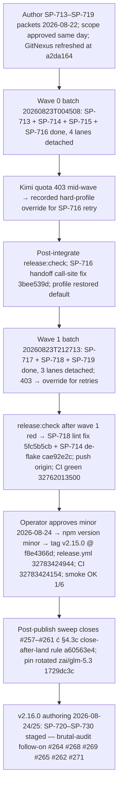

# v2.15.0 Release Post-Mortem

**Document type:** Release post-mortem (Diátaxis: explanation)  
**Audience:** Operator + maintainers  
**Verdict:** The brutal-audit hardening minor **shipped** (`pi-spine@2.15.0`) on contract. All six selected findings from the 2026-08-22 best-of-n audit ([#257](https://github.com/beettlle/pi-spine/issues/257)–[#261](https://github.com/beettlle/pi-spine/issues/261), [#263](https://github.com/beettlle/pi-spine/issues/263)) were fixed and closed via **SP-713–SP-719** in two detached waves. The stabilization rules mostly held: scope approval recorded before Phase 4 (F1), both batches detached ([#163](https://github.com/beettlle/pi-spine/issues/163)), post-integrate `release:check` verified by exit code after each wave and on the publish HEAD (2487/2487; coverage 89.26%), CI green before tag and on the tag HEAD ([#156](https://github.com/beettlle/pi-spine/issues/156)), and post-publish smoke passed on attempt 1. Four new wrinkles, three of them operational: (1) the **first recorded mid-release pin override** — Kimi quota 403 hard-blocked SP-716 and the wave 1 retries, so the operator exercised F7's documented exception path (`agents.activeProfile` → `hard` / `google/gemini-3.1-pro-preview`, reason and date recorded in the manifest, restored `default` after land); (2) **three post-wave misses caught only by the regression gate**, not by workers' scoped contracts — un-migrated `handoff.mjs` redaction call sites (SP-716), a test lint error blocking `release:check` (SP-718), and a birthday-bound flaky uniqueness test (SP-714); (3) **F8 drift** — `main` sat ~11 commits ahead of `origin` across both waves, so CI first validated the integrated waves only hours before the tag; (4) **issue-close hygiene debt** — #257–#261, #263 stayed open until after publish, which produced the new **§4.3c close-after-land rule** ([`a60563e4`](https://github.com/beettlle/pi-spine/commit/a60563e4)). Context for what follows: **v2.16.0** (SP-720–SP-730) takes the brutal-audit follow-on — bugs [#264](https://github.com/beettlle/pi-spine/issues/264), [#268](https://github.com/beettlle/pi-spine/issues/268), [#269](https://github.com/beettlle/pi-spine/issues/269) plus enhancements [#265](https://github.com/beettlle/pi-spine/issues/265), [#262](https://github.com/beettlle/pi-spine/issues/262), [#271](https://github.com/beettlle/pi-spine/issues/271) under an operator enhancement override.

---

## 1. Executive summary

| Metric | Value |
|--------|-------|
| Target | **v2.15.0** (minor from 2.14.1) |
| Profile | minor / composition A — brutal-audit hardening (5 bugs, 1 enhancement, 1 doc) |
| Authoring | 2026-08-22; operator approved scope 2026-08-22 |
| Waves | 2026-08-22/23 — Wave 0 batch `20260823T004508` (4 lanes) → Wave 1 batch `20260823T212713` (3 lanes) |
| Publish | 2026-08-24 — tag `v2.15.0` @ `f8e4366d`; operator approved bump minor |
| Release workflow | [`32783424944`](https://github.com/beettlle/pi-spine/actions/runs/32783424944) success |
| CI on publish HEAD | [`32783424154`](https://github.com/beettlle/pi-spine/actions/runs/32783424154) success on `f8e4366d`; pre-tag run [`32762013500`](https://github.com/beettlle/pi-spine/actions/runs/32762013500) success on `cae92e2c` |
| `release:check` on publish HEAD | exit 0 verified on `f8e4366d` — 2487/2487 tests, coverage 89.26% |
| Post-publish smoke | `scripts/post-publish-smoke.sh 2.15.0` OK (attempt 1/6) |
| Manifest | [`spine-tasks/_authoring/release-v2.15.0/manifest.md`](../../spine-tasks/_authoring/release-v2.15.0/manifest.md) |
| Worker pin | `kimi-coding/k3` → **override: yes** (Kimi quota 403; `hard` / `google/gemini-3.1-pro-preview` for retries; restored `default` after land; rotated to `zai/glm-5.3` for v2.16.0) |

**One-line outcome:** Six latent data-integrity and gate-coverage defects from the brutal audit landed as seven S-sized packets across two detached waves with green gates at every checkpoint; issues #257–#261, #263 all closed (post-publish); and the cycle's operational friction stayed outside the batches — quota hard-block, post-wave fix-ups, push drift, and issue-close timing.

**What was *not* the problem:** Batch execution itself. No worker-done-missing, no stall kills, no 429/403 *inside* a running lane, no `--attached` misuse — both waves ran detached per [#163](https://github.com/beettlle/pi-spine/issues/163). The friction clustered at the boundaries: a quota hard-block between lanes (F7 exception exercised), three worker-output defects that only the whole-repo `release:check` could see (F-C), origin pushes deferred until pre-tag (F-D), and GitHub issues closed only after publish (F-E).

---

## 2. Scope & what shipped

**Manifest:** [`spine-tasks/_authoring/release-v2.15.0/manifest.md`](../../spine-tasks/_authoring/release-v2.15.0/manifest.md)  
**CONTEXT Phase 83:** [`spine-tasks/CONTEXT.md`](../../spine-tasks/CONTEXT.md)

| SP-ID | Issue | Intent | Landed? | Notes |
|-------|-------|--------|---------|-------|
| SP-713 | — | Post-mortem v2.14.1 + brutal-audit release context | Yes | Docs-only; produced [`docs/release/post-mortem-v2.14.1.md`](post-mortem-v2.14.1.md) — the structural model for this document |
| SP-714 | [#258](https://github.com/beettlle/pi-spine/issues/258) | Validate and uniquify batch IDs | Yes | `src/batch/batch-id.mjs`: `validateBatchId` / `isValidBatchId` / `batchIdRejectionReason` reject path traversal and unsafe input while accepting archived ID shapes; uniquified `generateBatchId`; CLI `--batch` paths validate before runtime path joins; **closes #258** |
| SP-715 | [#259](https://github.com/beettlle/pi-spine/issues/259) | Engine liveness pairs PID with `engineStartedAt` | Yes | `src/process/liveness.mjs`: paired-PID helper wired into ownership checks; PID-reuse regression tests + runbook note; **closes #259** |
| SP-716 | [#260](https://github.com/beettlle/pi-spine/issues/260) | Unify secret redaction across channels | Yes | New `src/util/secret-redact.mjs`; journal, worker-output, and metrics callers migrated; `handoff.mjs` call sites caught post-wave and fixed (`3bee539d`); **closes #260** |
| SP-717 | [#261](https://github.com/beettlle/pi-spine/issues/261) | Atomic batch-history append; no silent wipe | Yes | `src/batch/state-io.mjs`: atomic write-rename, corrupt-file quarantine instead of silent wipe, concurrent-append tests, and a batch-history corruption-recovery doc; **closes #261** |
| SP-718 | [#257](https://github.com/beettlle/pi-spine/issues/257) | Salvage eligible after final-review spawn failure | Yes | Salvage path treats final-review spawn failure as salvage-eligible instead of reporting `lane_*` as unworkable; test lint fixed post-wave (`5fc5b5cb`); **closes #257** |
| SP-719 | [#263](https://github.com/beettlle/pi-spine/issues/263) | Wire `tests/arch` + `tests/fs` into the ship gate | Yes | `package.json` test script + `scripts/coverage-policy.mjs` now include arch/fs suites; cycles allowlist reconciled (pre-existing cycle #267 stays allowlisted); **closes #263** |

**Composition:** 1 docs task + 5 bug fixes (#257–#261) + 1 enhancement (#263) = 7 tasks, all S — within minor profile limits (audit PASS).

**Adjacent fixes landed outside SP contracts:** `3bee539d` — SP-716 left `handoff.mjs` redaction call sites un-migrated after the unification; also restored `agents.activeProfile` and recorded the Kimi override in the manifest. `5fc5b5cb` — SP-718's new test carried ESLint `no-unused-vars` that blocked the post-wave-1 `release:check`; also recorded the wave-1 override. `cae92e2c` — SP-714's 200-draw uniqueness test flaked by construction (see F-C). `dd23af3b` — removed stale Taskplane rule templates (post-release cleanup). `a60563e4` — the §4.3c skill rule (see F-E).

**Still open / deferred after release:** global batch-state lock [#264](https://github.com/beettlle/pi-spine/issues/264); review attempt caps [#265](https://github.com/beettlle/pi-spine/issues/265); `review.mjs` split [#262](https://github.com/beettlle/pi-spine/issues/262); type burn-down [#266](https://github.com/beettlle/pi-spine/issues/266); import cycle [#267](https://github.com/beettlle/pi-spine/issues/267); `@ts-nocheck`/fake-async follow-ons [#266](https://github.com/beettlle/pi-spine/issues/266)/[#270](https://github.com/beettlle/pi-spine/issues/270); Set dedup [#271](https://github.com/beettlle/pi-spine/issues/271); matrix epic [#225](https://github.com/beettlle/pi-spine/issues/225) + children [#229](https://github.com/beettlle/pi-spine/issues/229)–[#232](https://github.com/beettlle/pi-spine/issues/232); P3 backlog ([#209](https://github.com/beettlle/pi-spine/issues/209)–[#212](https://github.com/beettlle/pi-spine/issues/212), #124, #127, #135, #43). **All P1/P2 follow-ons are staged for v2.16.0** (see §5.1).

---

## 3. Chronology

| When | What |
|------|------|
| 2026-08-22 | Manifest authored; operator approved scope same day; GitNexus refreshed at `a2da164`; task packets staged (`35c53a1a`) |
| 2026-08-22 | Wave 0 batch `20260823T004508` (detached, 4 lanes) — SP-713 (17:49–17:50), SP-714 (`281954e8`, `d136f65d`; completion `f25b994b`), SP-715 (`3c1da54f`, `3b0129d4`, `dc773999`; completion `5f2bae03`), SP-716 (`c551bbfc`…`974970e7`; completion `37eac459`); lane merges `b7201b01`, `abb36a4b`, `8014cd49`, `d167434f` @ 18:39 |
| 2026-08-22 | **Kimi quota 403** hard-blocked SP-716 mid-wave — first recorded mid-release pin override: `agents.activeProfile` → `hard` / `google/gemini-3.1-pro-preview` for the SP-716 retry only; reason + date recorded in the manifest (F7 exception path) |
| 2026-08-23 | `3bee539d` (11:36) — fixed `handoff.mjs` redaction call sites missed by SP-716; restored `activeProfile: default`; updated manifest override record |
| 2026-08-23 | Wave 1 batch `20260823T212713` (detached, 3 lanes) — SP-717 (`194107b1`, `48b398f1`, `34f541e7`; completion `3a7484c2`), SP-718 (`60310210`; completion `c8743598`), SP-719 (`3015b6f1`…`b724101d`; completion `4e6a3301`); lane merges `cb3026d9`, `c1a3185d`, `59fbe7dc` @ 15:14; Kimi 403 recurred on retries → override re-applied and recorded |
| 2026-08-24 | `5fc5b5cb` (08:37) — cleared ESLint `no-unused-vars` in SP-718's test so `release:check` could pass after wave 1; recorded wave-1 override in the manifest |
| 2026-08-24 | `cae92e2c` (11:13) — de-flaked SP-714's `generateBatchId` uniqueness test (injectable suffix); **first push to `origin` since 2026-08-22** → CI green [`32762013500`](https://github.com/beettlle/pi-spine/actions/runs/32762013500) |
| 2026-08-24 | Operator approved publish bump **minor**; `npm run release:check` green on final HEAD — exit 0 verified (2487/2487; coverage 89.26%); `npm version minor` → tag `v2.15.0` @ `f8e4366d`; `git push && git push --tags` |
| 2026-08-24 | `release.yml` success [`32783424944`](https://github.com/beettlle/pi-spine/actions/runs/32783424944); CI [`32783424154`](https://github.com/beettlle/pi-spine/actions/runs/32783424154) on the tag HEAD; npm `pi-spine@2.15.0`; post-publish smoke OK (attempt 1/6); Phase 83 closeout `2d1e86a8` |
| 2026-08-24 | Post-publish sweep closed #257–#261, #263 (23:08–23:09Z); §4.3c close-after-land rule added (`a60563e4`, 23:10Z); worker pin rotated `kimi-coding/k3` → `zai/glm-5.3` for v2.16.0 (`1729dc3c`) |
| 2026-08-25 | v2.16.0 manifest authored (scope approved 2026-08-25); packets SP-720–SP-730 staged (`a2317f57`) |

**Observation (honest note):** the in-batch gates held — every lane ran detached, every worker finished without salvage (except the deliberate SP-718 spawn-failure coverage), and both post-integrate `release:check` runs converted their catches into same-cycle fixes. But two boundaries regressed versus v2.14.1 discipline: `origin` received **no push between 2026-08-22T19:00Z and 2026-08-24T18:13Z**, so ~11 commits of integrated work existed only locally across both waves and CI (plus the scheduled real-pi adoption E2E, which ran against stale `origin/main` at `a2da1648`) never saw the integrated waves until hours before the tag; and release issues sat open for 1–2 days after their fixes landed. Neither caused damage; both were avoidable.

---

## 4. Failure taxonomy (evidence-backed)

The minor shipped clean, so the taxonomy is **held vs. open**, with the cycle's four new categories called out honestly.

### F-A — Brutal-audit P0/P1 hardening findings: **CLOSED in v2.15.0**

**Area:** Batch state / process liveness / secret handling / salvage / ship gate  
**Status:** All six resolved  
**Tracked:** [#257](https://github.com/beettlle/pi-spine/issues/257)–[#261](https://github.com/beettlle/pi-spine/issues/261), [#263](https://github.com/beettlle/pi-spine/issues/263) — closed by SP-718, SP-714, SP-715, SP-716, SP-717, SP-719

The 2026-08-22 audit's P0 data-integrity defects — batch-ID collision risk (#258), PID-reuse liveness (#259), split-brain secret redaction (#260), non-atomic history append (#261) — plus the P1 salvage gap (#257) and the missing arch/fs ship-gate suites (#263) all landed as planned. All stayed additive with LOW blast radii; the one scope surprise (SP-719 surfacing allowlist noise from arch tests) was pre-declared in the manifest's risk table and resolved inside the packet.

**Lesson carried forward:** the second consecutive cycle validating adversarial self-audit as an intake channel — it found defects that neither the test suite nor the consumer stream surfaced. The audit's own follow-on cohort (#262, #264–#271) now frames v2.16.0.

### F-B — Kimi quota 403 → first recorded mid-release pin override: **OPEN (policy evolved)**

**Area:** Config / release ops  
**Status:** F7 exception path exercised for the first time  
**Tracked:** [#248](https://github.com/beettlle/pi-spine/issues/248); advisory tooling [#251](https://github.com/beettlle/pi-spine/issues/251)

The worker pin (`kimi-coding/k3`) held for three consecutive cycles (v2.12.3–v2.14.1) with zero overrides. This cycle the pool was actually exhausted: a **403 hard-block** mid-wave 0 stopped SP-716, and the same block hit wave 1 retries. The recovery that worked: a **single recorded override** — `agents.activeProfile` → `hard` (`google/gemini-3.1-pro-preview`) scoped to the affected retries, reason and date recorded in the manifest before applying, `default` restored after the wave (`3bee539d`) and re-recorded for wave 1 (`5fc5b5cb`), then a **between-releases pin rotation** to `zai/glm-5.3` for v2.16.0 (`1729dc3c`).

**Lesson carried forward:** F7's invariant is not "never touch pins" — it is **recorded, scoped, restored**. A hard 403 block is different in kind from a quota-*risk* advisory (which remains non-actionable per #251). Pin rotation belongs between releases, never mid-wave; when a mid-release override is unavoidable, scope it to retries, record it in the manifest first, and restore immediately after land.

### F-C — Post-wave misses caught only by `release:check`: **CLOSED in-cycle**

**Area:** Worker contracts / regression gate  
**Status:** Three fixes landed between wave and tag  
**Tracked:** in-cycle fixes `3bee539d`, `5fc5b5cb`, `cae92e2c`

Workers verify their scoped contract `testCommand`, and all three defects sat outside those scopes: (1) SP-716's unification migrated journal/worker-output/metrics redaction but missed `handoff.mjs` call sites — only whole-repo inspection caught it; (2) SP-718's new test passed its assertions but carried ESLint `no-unused-vars`, which blocked the post-wave-1 `release:check` (lint is gate scope, not contract scope); (3) SP-714's uniqueness test drew 200 real random 4-hex suffixes within one UTC second — a ~26% birthday-bound collision chance that flakes under coverage; de-flaked with injectable suffixes.

**Lesson carried forward:** scoped contracts cannot see cross-file call-site completeness, lint, or flake-resistance — the post-integrate `release:check` after **each wave** is the systemic backstop, and it earned its keep twice this cycle. Author probabilistic tests with injectable randomness or collision-tolerant assertions from the start.

### F-D — F8 push drift; CI validated integrated waves only pre-tag: **OPEN (regression vs. v2.14.1)**

**Area:** Release ops / CI  
**Status:** No damage; discipline slipped silently  
**Tracked:** [#249](https://github.com/beettlle/pi-spine/issues/249) (F8); [#156](https://github.com/beettlle/pi-spine/issues/156) (CI pre-tag gate — held)

`ci.yml` runs on every push to `main`, and the run log shows **zero CI runs between 2026-08-22T19:00Z (`a2da1648`, the v2.14.1 closeout) and 2026-08-24T18:22Z (`cae92e2c`)** — both wave merges, the SP-716 handoff fix, and the SP-718 lint fix were never pushed until pre-tag. `main` therefore ran ~11 commits ahead of `origin` for ~2 days. The publish checklist still passed because CI went green on `cae92e2c` before the tag ([`32762013500`](https://github.com/beettlle/pi-spine/actions/runs/32762013500)) and on the tag HEAD ([`32783424154`](https://github.com/beettlle/pi-spine/actions/runs/32783424154)) — but the *Actions-environment* validation of the integrated waves happened only hours before publish, the scheduled real-pi adoption E2E exercised stale `origin/main`, and a local disk failure would have lost the entire release. The manifest recorded no deferral (F8 allows deferred pushes for local-only releases only when recorded).

**Lesson carried forward:** `git push origin main` after each green land loop, or record the deferral explicitly in the manifest. "Green locally" is not "CI validated" — the whole point of the per-wave push is that the Actions environment sees integrated work while there is still time to react.

### F-E — Release issues closed only after publish: **CLOSED post-cycle (rule added)**

**Area:** Release ops / GitHub hygiene  
**Status:** Hygiene debt acknowledged and converted into a rule  
**Tracked:** rule §4.3c ([`a60563e4`](https://github.com/beettlle/pi-spine/commit/a60563e4))

Wave 0 fixes landed on `main` 2026-08-22 and wave 1 fixes 2026-08-23, but #257–#261, #263 were closed only at 2026-08-24T23:08–09Z — after the 22:11Z tag/publish, in a manual sweep. The v2.14.1 cycle behaved the same way (#252–#256 closed the day after publish), so this was an inherited habit, not a one-off. The new §4.3c rule makes closing blocking hygiene: close every `Closes #NNN` whose task is `.DONE` on `main` immediately after that wave's §4.3a gate, leave `Partial #NNN` open, and Phase 6 fails closed if any release-scoped `Closes` link is still open. The v2.16.0 manifest adds it as do-not-reintroduce item #9.

**Lesson carried forward:** an issue tracker that lags `main` by days misleads intake (issues look actionable when their fixes already shipped). Close on land, not on publish.

---

## 5. Engineering backlog

### 5.1 v2.16.0 staged scope — brutal-audit follow-on (SP-720–SP-730)

**Manifest:** [`spine-tasks/_authoring/release-v2.16.0/manifest.md`](../../spine-tasks/_authoring/release-v2.16.0/manifest.md) · **Profile:** minor · **Operator approved scope:** 2026-08-25 · **Worker pin:** `zai/glm-5.3` (no override) · **Operator override:** 3 enhancements > profile 1–2 (explicit)

The deferred brutal-audit items map to v2.16.0 as follows:

| Issue | Pri | Finding | Fix task(s) | Wave |
|-------|-----|---------|-------------|------|
| [#264](https://github.com/beettlle/pi-spine/issues/264) | P1 | Global inter-process lock for batch-state writers (pairs with #261/SP-717) | **SP-722** (M) | 1 |
| [#268](https://github.com/beettlle/pi-spine/issues/268) | P2 | Harden contract `testCommand` execution (metachar reject; distinct from #254) | **SP-723** + docs **SP-721** | 0 |
| [#269](https://github.com/beettlle/pi-spine/issues/269) | P2 | File-scope overlap: brace globs + extension probes | **SP-724** | 1 |
| [#265](https://github.com/beettlle/pi-spine/issues/265) | P1 | Separate `maxCodeReviewAttempts` / `maxPlanReviewAttempts` | **SP-725** — lands **before** the split | 0 |
| [#262](https://github.com/beettlle/pi-spine/issues/262) | P1 | Split `review.mjs` into phase modules (M → 4 S) | **SP-727 → SP-728 → SP-729 → SP-730** (serial) | 2–4 |
| [#271](https://github.com/beettlle/pi-spine/issues/271) | P2 | Replace O(N²) `includes()`-in-loop dedup with `Set` | **SP-726** (after SP-724) | 2 |

Wave plan: Wave 0 (SP-720, SP-721, SP-723, SP-725 — docs + contract harden + caps) → Wave 1 (SP-722, SP-724 — M lock + analyze) → Wave 2 (SP-727, SP-726 — disjoint files) → Wave 3 (SP-728, SP-729 — serial `review.mjs` chain) → Wave 4 (SP-730 — thin coordinator; closes #262). The SP-725 → SP-727 → SP-728 → SP-729 → SP-730 chain on `review.mjs` is **serial — do not parallelize**; SP-726 → SP-724 serialize on `analyze`.

### 5.2 Remaining backlog

| Pri | Finding | Issue | Owner area | Next action |
|-----|---------|-------|------------|-------------|
| P1 | Review attempt caps | [#265](https://github.com/beettlle/pi-spine/issues/265) | Review pipeline | **SP-725 (v2.16.0)** |
| P1 | Global batch-state lock | [#264](https://github.com/beettlle/pi-spine/issues/264) | Batch state | **SP-722 (v2.16.0)** |
| P1 | `review.mjs` split | [#262](https://github.com/beettlle/pi-spine/issues/262) | Review pipeline | **SP-727–SP-730 (v2.16.0)** |
| P2 | Contract testCommand harden | [#268](https://github.com/beettlle/pi-spine/issues/268) | Contract exec | **SP-723 + SP-721 (v2.16.0)** |
| P2 | File-scope overlap probes | [#269](https://github.com/beettlle/pi-spine/issues/269) | Tasks/analyze | **SP-724 (v2.16.0)** |
| P2 | Set dedup | [#271](https://github.com/beettlle/pi-spine/issues/271) | parse/profile/analyze | **SP-726 (v2.16.0)** |
| P2 | `@ts-nocheck` burn-down | [#266](https://github.com/beettlle/pi-spine/issues/266) | Types | Deferred — multi-phase |
| P2 | engine-lanes import cycle | [#267](https://github.com/beettlle/pi-spine/issues/267) | Engine | Deferred — benefits from #262; stays allowlisted |
| P2 | fake-async removal | [#270](https://github.com/beettlle/pi-spine/issues/270) | Various | Deferred — 8 functions across modules |
| P2 | Consumer-simulation pre-publish smoke | — (v2.14.0 F-D lesson) | Release ops | Still unstaged; re-evaluate as a publish-gate signal |
| P2 | Matrix epic remainder | [#225](https://github.com/beettlle/pi-spine/issues/225), [#229](https://github.com/beettlle/pi-spine/issues/229)–[#232](https://github.com/beettlle/pi-spine/issues/232) | Engine matrix | Deferred children |
| P3 | Enhancement backlog | [#209](https://github.com/beettlle/pi-spine/issues/209)–[#212](https://github.com/beettlle/pi-spine/issues/212), #124, #127, #135, #43 | Various | Deferred per v2.16.0 manifest |
| Done | Brutal-audit P0/P1 core | [#257](https://github.com/beettlle/pi-spine/issues/257)–[#261](https://github.com/beettlle/pi-spine/issues/261), [#263](https://github.com/beettlle/pi-spine/issues/263) | Batch state / liveness / redaction / salvage / gate | **SP-714–SP-719 shipped; all six issues closed** |
| Done | Issue-close hygiene | — (§4.3c) | Release ops | Rule added `a60563e4`; fail-closed sweep at Phase 6 |
| Done | Pin-override runbook precedent | [#248](https://github.com/beettlle/pi-spine/issues/248) | Release ops | First recorded override survived the cycle; restored + rotated |

---

## 6. What not to reintroduce

- Do **not** defer closing `Closes #NNN` issues until publish — close after each land (§4.3c); Phase 6 is a fail-closed sweep, not the primary closing step. This cycle left #257–#261, #263 open for 1–2 days after their fixes shipped to `main`.
- Do **not** let `main` drift ahead of `origin` across waves without recording the deferral (F8, [#249](https://github.com/beettlle/pi-spine/issues/249)) — this cycle deferred both wave pushes until pre-tag, so CI and the scheduled real-pi E2E never saw integrated work until hours before the tag.
- Do **not** treat scoped worker contracts as sufficient verification — they cannot see cross-file call-site misses, lint, or flake-resistance. Run post-integrate `release:check` after **each wave** and verify its exit code (`PIPESTATUS[0]`); it caught three defects this cycle that contracts missed.
- Do **not** write probabilistic tests without injectable randomness — 200 random 4-hex draws in one UTC second collide ~26% of the time (birthday bound); that flake cost a same-day de-flake commit before the tag.
- Do **not** edit agent pins on a quota *advisory* (F7, [#248](https://github.com/beettlle/pi-spine/issues/248), #251) — but when a **403 hard-block** stops a lane, use the recorded exception path: one override, scoped to retries, reason + date in the manifest, restored after land, rotated between releases. Unrecorded mid-wave thrash remains banned.
- Do **not** start Phase 4 without recorded `Operator approved scope: yes` (F1, [#249](https://github.com/beettlle/pi-spine/issues/249)) — held.
- Do **not** run `--attached` batches from agent/non-TTY shells ([#163](https://github.com/beettlle/pi-spine/issues/163)) — both waves detached; the doctor's `--attached` orphan warning is advisory noise from an old shell, not a signal to act on.
- Do **not** treat cancelled/missing CI as green or red — **no signal**; recovery is `workflow_dispatch` + wait for `conclusion: success`.
- Do **not** publish without CI green on HEAD ([#156](https://github.com/beettlle/pi-spine/issues/156)) — held; green runs recorded both pre-tag (`32762013500`) and on the tag HEAD (`32783424154`).
- Do **not** judge `release:check` from log tails alone — exit codes were verified after each wave and on the publish HEAD (2487/2487; coverage 89.26%).
- Do **not** widen LOW blast-radius hardening fixes beyond their additive contract — SP-714 kept archived batch-ID shapes resolving; SP-717 quarantined instead of rewriting corrupt history; SP-719 left the pre-existing import cycle (#267) allowlisted.
- Do **not** parallelize the `review.mjs` serial chain in v2.16.0 (SP-725 → SP-727 → SP-728 → SP-729 → SP-730) — caps land first, extractions follow in order; and SP-724 → SP-726 serialize on `analyze`.

---

## 7. Appendix

### Batch IDs

| Batch | Role |
|-------|------|
| `20260823T004508` | Wave 0 — SP-713, SP-714, SP-715, SP-716 complete (4 lanes, detached) |
| `20260823T212713` | Wave 1 — SP-717, SP-718, SP-719 complete (3 lanes, detached) |

### Key commits / runs

| Artifact | Path / ID |
|----------|-----------|
| Task packets staged | `35c53a1a` (`chore(spine): release v2.15.0 task packets`) |
| SP-713 post-mortem v2.14.1 | `b2c6d7d5`, `d0689b46`, `be0b5568` |
| SP-714 batch-ID validation (#258) | `281954e8`, `d136f65d`; completion `f25b994b`; de-flake `cae92e2c` |
| SP-715 PID+starttime liveness (#259) | `3c1da54f`, `3b0129d4`, `dc773999`; completion `5f2bae03` |
| SP-716 unified secret redaction (#260) | `c551bbfc`, `2317c2e9`, `362f8269`, `974970e7`; completion `37eac459`; call-site fix `3bee539d` |
| SP-717 atomic batch-history (#261) | `194107b1`, `48b398f1`, `34f541e7`, `57bc0622`; completion `3a7484c2` |
| SP-718 salvage spawn-failure (#257) | `60310210`; completion `c8743598`; lint fix `5fc5b5cb` |
| SP-719 arch/fs ship gate (#263) | `3015b6f1`, `864d11fb`, `607bf3ab`, `0d27c19d`, `b724101d`; completion `4e6a3301` |
| Wave 0 merges | `b7201b01`, `abb36a4b`, `8014cd49`, `d167434f` |
| Wave 1 merges | `cb3026d9`, `c1a3185d`, `59fbe7dc` |
| Pre-tag CI runs | [`32762013500`](https://github.com/beettlle/pi-spine/actions/runs/32762013500) on `cae92e2c` (first push of integrated waves) |
| Version bump / publish commit | `f8e4366d` (`2.15.0`, tag `v2.15.0`) |
| Release workflow / CI on tag | [`32783424944`](https://github.com/beettlle/pi-spine/actions/runs/32783424944) / [`32783424154`](https://github.com/beettlle/pi-spine/actions/runs/32783424154) |
| Phase 83 closeout | `2d1e86a8` (`docs(spine): record v2.15.0 Phase 83 publish complete`) |
| Post-publish hygiene | `dd23af3b` (stale template cleanup), `a60563e4` (§4.3c), issue sweep 23:08–09Z |
| Worker pin rotation for v2.16.0 | `1729dc3c` (`kimi-coding/k3` → `zai/glm-5.3`) |
| v2.16.0 packets staged | `a2317f57` (SP-720–SP-730), rules-manifest sync `6b39cd3c` |
| Post-publish smoke | `scripts/post-publish-smoke.sh 2.15.0` OK (attempt 1/6) |

### Related docs / rules

| Path | Role |
|------|------|
| [`spine-tasks/_authoring/release-v2.15.0/manifest.md`](../../spine-tasks/_authoring/release-v2.15.0/manifest.md) | Minor manifest — scope, waves, pin override record, publish checklist (all checked) |
| [`spine-tasks/_authoring/release-v2.16.0/manifest.md`](../../spine-tasks/_authoring/release-v2.16.0/manifest.md) | **Next minor manifest** — SP-720–SP-730, enhancement override, 5-wave plan |
| [`spine-tasks/CONTEXT.md`](../../spine-tasks/CONTEXT.md) | Phase 83 (this release, exit criteria all checked) and Phase 84 (v2.16.0, staged) |
| [`skills/spine-release-operator/SKILL.md`](../../skills/spine-release-operator/SKILL.md) | Hard rules F1/F7/F8 + new §4.3c close-after-land (added `a60563e4`) |
| [`docs/release/post-mortem-v2.14.1.md`](post-mortem-v2.14.1.md) | Prior post-mortem — structural model; its F-B brutal-audit staging closed here |
| [`docs/release/npm-publish.md`](npm-publish.md) | Publish + smoke runbook (CI no-signal recovery branch) |

### Issues linked

| # | Relationship |
|---|--------------|
| [#257](https://github.com/beettlle/pi-spine/issues/257) | **Closed** — salvage after final-review spawn failure (SP-718) |
| [#258](https://github.com/beettlle/pi-spine/issues/258) | **Closed** — validate/uniquify batch IDs (SP-714) |
| [#259](https://github.com/beettlle/pi-spine/issues/259) | **Closed** — PID + `engineStartedAt` liveness (SP-715) |
| [#260](https://github.com/beettlle/pi-spine/issues/260) | **Closed** — unified secret redaction (SP-716) |
| [#261](https://github.com/beettlle/pi-spine/issues/261) | **Closed** — atomic batch-history append (SP-717) |
| [#263](https://github.com/beettlle/pi-spine/issues/263) | **Closed** — arch/fs tests wired into ship gate (SP-719) |
| [#248](https://github.com/beettlle/pi-spine/issues/248) | Model-pin policy — **exception path exercised** (recorded override, restored, rotated) |
| [#249](https://github.com/beettlle/pi-spine/issues/249) | Scope-approval gate (F1) held; push-sync gate (F8) **drifted** — see F-D |
| [#163](https://github.com/beettlle/pi-spine/issues/163) | Detached batches from agent shells — held (both waves detached) |
| [#156](https://github.com/beettlle/pi-spine/issues/156) | CI green on HEAD before tag — held (pre-tag + tag runs green) |
| [#264](https://github.com/beettlle/pi-spine/issues/264), [#265](https://github.com/beettlle/pi-spine/issues/265), [#268](https://github.com/beettlle/pi-spine/issues/268), [#269](https://github.com/beettlle/pi-spine/issues/269), [#271](https://github.com/beettlle/pi-spine/issues/271), [#262](https://github.com/beettlle/pi-spine/issues/262) | **Open** — staged as SP-722, SP-725, SP-723+SP-721, SP-724, SP-726, SP-727–SP-730 in **v2.16.0** |
| [#266](https://github.com/beettlle/pi-spine/issues/266), [#267](https://github.com/beettlle/pi-spine/issues/267), [#270](https://github.com/beettlle/pi-spine/issues/270) | **Open** — deferred past v2.16.0 (multi-phase / allowlisted / cross-module) |
