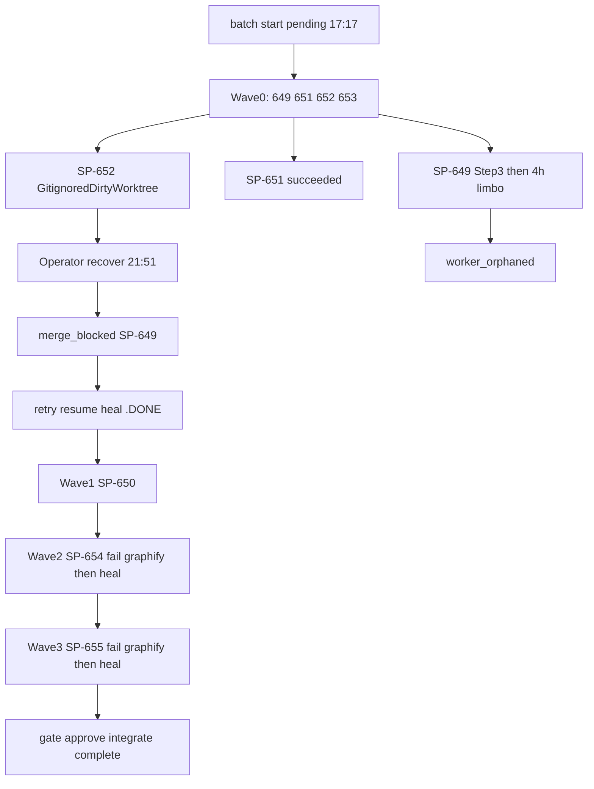

# v2.7.0 Release Post-Mortem — Batch `20260713T171709`

**Document type:** Incident / release post-mortem (Diátaxis: explanation)  
**Audience:** Operator + maintainers  
**Verdict:** Scope was sound and **shipped on `main`** (7/7 `.DONE`, idle, pending 0). Execution was **operator-heavy** because repeated `GitignoredDirtyWorktree` + a multi-hour `worker_orphaned` limbo blocked autonomous land. Product follow-up tracked in [#205](https://github.com/beettlle/pi-spine/issues/205).

---

## 1. Executive summary

| Metric | Value |
|--------|-------|
| Batch | `20260713T171709` |
| Wall clock | **~5.6 hours** (17:17 → 22:51 UTC, 2026-07-13) |
| Scope | SP-649–655 (Phase 71 / SP-REL270), 4 waves |
| Journal events | 197 |
| First-class `task.failed` | **4** (then healed) |
| Manual resume handoffs | **8** (`batch.resume_handoff_started`) — typically paired (detached + attached) |
| Merge blocks | 1 (`failed=[SP-649]`) |
| Final outcome | 7 succeeded → gate approved → integrated → archived |
| Package at land | `2.6.0` (publish completed in a follow-on closeout after this batch) |
| Ahead of origin at land | ~35 commits |

**One-line root cause:** Lane post-done fails closed on regenerating gitignored artifacts (`.pi-smart-router/` missing from auto-clean; `graphify-out/` races even when marked), and a dead engine left SP-649 with `.DONE` but no heal — diagnose headlines stayed on stale gitignored remediation (#195-class).

**What was *not* the problem:** Task packet quality was adequate (S-sized, scoped `testCommand` on code tasks, docs-only contracts). Composition audit passed the minor profile.

---

## 2. Scope & what shipped

**Manifest:** [`spine-tasks/_authoring/release-v2.7.0/manifest.md`](../../spine-tasks/_authoring/release-v2.7.0/manifest.md)  
**PRD:** [`docs/PRD-v2.7.0-operator-ux-evidence-handoff.md`](../PRD-v2.7.0-operator-ux-evidence-handoff.md)

| SP-ID | Intent | Contract style | Landed? | Notes |
|-------|--------|----------------|---------|-------|
| SP-649 | #202 load-path message | scoped `node --test` | Yes (after orphan heal) | ~5h task lifetime |
| SP-650 | #202 CLI surfaces / **Closes #202** | scoped tests | Yes | Needed manual `.DONE` commit once |
| SP-651 | Template/`&&` evidence drift | scoped tests | Yes first-path | Cleanest code task |
| SP-652 | `.gitignore` `.pi/` | docs/gitignore, `true` | Yes after heal | First `GitignoredDirtyWorktree` (`.pi-smart-router`) |
| SP-653 | #160 Phase B `&&` chains | Review L2, scoped | Yes after Wave0 heal | Final reviews during recover |
| SP-654 | Runbook | docs-only + **full suite** in Testing step | Yes after heal | Fail on `graphify-out/` |
| SP-655 | CONTEXT capstone | docs-only + **full suite** | Yes after heal | Fail on `graphify-out/` again |

**Product deltas on main (from integrate diff-stat):** wrong-cwd hint helper, evidence Phase B chains, template parity, `.pi/` gitignore, runbook + CONTEXT Phase 71.

**Still open after release batch:** [#205](https://github.com/beettlle/pi-spine/issues/205) (dogfood of this batch), [#160](https://github.com/beettlle/pi-spine/issues/160) Phase C (Partial only), deferred #135/#127/#124/#120/#43.

---

## 3. Chronology (UTC)

| When | What |
|------|------|
| Preflight blockers | PATH spine **2.4.0** skew; dirty tree until packets committed + `npm link` |
| 17:17 | Detached start `pending` → engine effectively `batch start … --attached --skip-preflight` |
| 17:17–17:19 | Wave 0 workers start; plan reviews often `nested_spawn_blocked` (expected in-worker) |
| 17:35 | **SP-652 failed** `GitignoredDirtyWorktree` (`.pi-smart-router` shm/wal) despite steps/`lane.completed` |
| 17:39 | SP-651 succeeded (contract + final PASS) |
| 17:43 | SP-649 Step 3 done; **no** `task.completed` — engine stall begins |
| 17:43→21:51 | **~4h limbo**; last SP-649 heartbeats ~17:27/17:37; host load reported by operator |
| 21:51 | Recover: SP-649 → `worker_orphaned`; SP-652 heal `skippedDoneOnDisk`; dual resume PIDs |
| 21:51–21:52 | Operator `pause` mid-resume to retry SP-649 while SP-653 final review ran |
| 21:52 | `batch.merge_blocked` `failed=[SP-649]` (Wave 0 mixed outcome) |
| 22:18 | Retry SP-649 → heal → Wave 0 merges ×4 → **SP-650** starts |
| 22:31 | SP-650 completed (with post_done grace / `.DONE` assist) → Wave 1 merge → SP-654 |
| 22:39 | **SP-654 failed** `GitignoredDirtyWorktree` (`graphify-out/*`) after all steps |
| 22:40 | Heal SP-654 → Wave 2 merge → SP-655 |
| 22:47 | **SP-655 failed** same `graphify-out` class after steps |
| 22:47 | Heal SP-655 → Wave 3 merge → **gate.opened** + evidence collecting |
| 22:50–22:51 | Gate approve → integrate → batch complete/archive |

---

## 4. Failure taxonomy (evidence-backed)

### F1 — `GitignoredDirtyWorktree` (dominant, 3 tasks)

| Task | Artifact class | In `GITIGNORED_ARTIFACT_MARKERS`? |
|------|----------------|-----------------------------------|
| SP-652 | `.pi-smart-router/state.db-{shm,wal}` | **No** (gap — same pattern as closed #189 for `.review/`) |
| SP-654 | `graphify-out/**` | **Yes** — still failed → **race / regenerate-after-clean** (closed #113 territory) |
| SP-655 | `graphify-out/**` | Yes — same race |

**Impact:** Worker finished Steps including `.DONE`; engine classified failure at lane commit/dirty gate; Wave progress stopped until `retry` + `resume --force` + `skippedDoneOnDisk`.

### F2 — Post-DONE `worker_orphaned` limbo (SP-649)

- Steps complete at 17:43; `.DONE` existed in lane later; engine/worker finalize never ran until recover ~4h later.
- Reconcile labeled `worker_orphaned`; merge blocked despite terminal-success classification earlier.
- Heal path (`skippedDoneOnDisk`) worked once retried — **should have run automatically** before `merge_blocked`.

### F3 — Stale / wrong diagnose headline (#195 follow-up)

Throughout recovery, `spine status --diagnose` headlined **gitignored merge remediation** (`git rm --cached … .pi-smart-router…`) even when:

- Primary failure was orphan, or
- Phase was `running` / gating with all tasks succeeded.

Auto [`.spine/runtime/20260713T171709/post-mortem.md`](../../.spine/runtime/20260713T171709/post-mortem.md) still shows that misleading headline after land.

### F4 — Concurrent resume engines (#167 / #89 related)

Exactly **paired** `resume_handoff_started` PIDs on each recover/retry (8 starts). Detached `resume --force` from Cursor/agent shells still spawned attached children; leftover PID after `batch complete` needed `kill -9`.

### F5 — Operator / environment friction (pre-batch)

- Preflight failed: stale PATH spine, dirty tree (packets uncommitted).
- Doctor later: Pi-private **v1.9.0** vs npm-global **2.6.0**; 88 stale worktrees; non-TTY `--attached` orphan risk warning.

### F6 — Packet / process amplifiers (not root cause)

- Docs-only SP-654/655 Testing steps run **full** `npm run typecheck && SPINE_WORKER_STUB=1 npm test` (~2.5+ min, 2144 tests) — increases hook churn / load / wall clock.
- In-worker plan reviews often `nested_spawn_blocked` (by design); final reviews out-of-worker usually OK when engine alive.
- Manual `.DONE` / STATUS commits when worker exited without committing markers.

---

## 5. Manual intervention inventory

1. `npm link` + commit task packets to clear preflight  
2. Repeated `git clean -fdX` on lane worktrees  
3. Manual commits of `.DONE` / STATUS (SP-649, SP-650, SP-653 leftovers)  
4. `batch pause` / `retry` / `resume --force` loops (SP-649×2, SP-652, SP-654, SP-655)  
5. Kill orphan/stuck resume engines  
6. Host-side gate approve → integrate → batch complete  
7. Discard accidental staged **reverts** of wrong-cwd test assertions after integrate  

**Autonomous land loop failed** — without an external operator this batch would have stayed failed after Wave 0.

---

## 6. What went well

- Release composition discipline (7 S tasks, budgets PASS, lean authoring)  
- `skippedDoneOnDisk` heal **works** when operator retries  
- Wave merges succeeded once failures cleared (4 wave merges)  
- Evidence suite green at integrate (typecheck OK, 2144 tests pass)  
- #202 closed; Phase B of #160 landed Partial  
- No catastrophic data loss; archive + journal intact  

---

## 7. Recommendations (priority order)

### P0 — Product (track under #205, possibly split)

1. Add `.pi-smart-router/` to auto-clean markers/roots (mirror #189).  
2. Heal `.DONE` + terminal-success **before** `merge_blocked` when worker/engine dead.  
3. Diagnose honesty: headline = **latest primary failure**; drop stale gitignored once orphan/gating.  
4. Harden `graphify-out` auto-clean against post-commit regen (re-clean after hooks, or quarantine hook in lanes — #113 incomplete). Follow-up issue filed from this closeout.  
5. Single resume owner: fail-fast if second `resume --force` while lock/engine alive (strengthen #167). Follow-up issue filed from this closeout.

### P1 — Operator / release process

1. Prefer **true detached** + `spine wait`; never agent-background `--attached`.  
2. Preflight hygiene checklist: PATH/`npm link`, clean tree, `gitnexus analyze`, optional worktree cleanup before start.  
3. For docs-only packets: keep Contract `` `true` `` but avoid full-suite Testing step when possible (scoped/smoke) to cut hook churn — policy tradeoff with SP-075 Testing requirement (use stub suite length awareness).  
4. After each `GitignoredDirtyWorktree`, automate: `git clean -fdX` in lane → `retry` → `resume --force` before human deep-dive.

### P2 — Observability

1. Dashboard/diagnose: show **time since last heartbeat** and dead `enginePid` prominently.  
2. Count resume_handoff pairs in evidence post-mortem.  
3. Soft preflight warn on high system load / low free memory before `maxParallel` 4.

---

## 8. Release closeout status

| Item | Status |
|------|--------|
| Implementation on `main` | Done (integrated) |
| Pending SP-* | 0 |
| Post-mortem artifact | This file |
| #205 | OPEN — track `.pi-smart-router` auto-clean + orphan heal + diagnose honesty |
| Doctor leftover warnings | Duplicate install skew; stale worktrees; non-TTY attached risk |

Publish status for `2.7.0` is recorded in the release operator final report for this closeout (not frozen in this post-mortem).

---

## 9. Related issues

| Issue | Role |
|-------|------|
| [#205](https://github.com/beettlle/pi-spine/issues/205) | Primary dogfood: `.pi-smart-router` + post-DONE orphan limbo |
| [#206](https://github.com/beettlle/pi-spine/issues/206) | `graphify-out` regenerate-after-clean / post-commit race |
| [#207](https://github.com/beettlle/pi-spine/issues/207) | Concurrent dual resume engines (paired handoffs) |

Engine auto post-mortem (stale headline after land): `.spine/runtime/20260713T171709/post-mortem.md`.

---

## 10. Bottom line

v2.7.0 **code landed**; the release **process** was operator-heavy because spine still fail-closes lane land on **regenerating ignored files** and does not auto-heal **post-DONE orphans**, while diagnose **mis-headlines** why. Fix #205 (and the two follow-ups) before the next dogfood wave to avoid replay.
