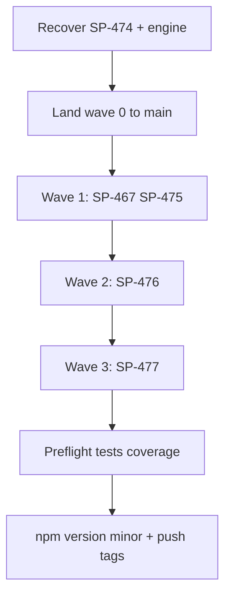

# Complete v1.6.0 Release

**Created:** 2026-07-05  
**Target version:** v1.6.0  
**Profile:** minor

## Overview

Recover batch `20260705T032132` (SP-474 contract verify + engine_orphaned), land wave 0 to main, execute waves 1–3 (4 remaining tasks), run pre-publish gates, and publish v1.6.0 after operator approval. Document repeated `engine_orphaned` on #163.

---

## Current state (as of 2026-07-05)

| Item | Status |
|------|--------|
| Version on `main` | **1.5.0** (`package.json`) |
| Prerequisites | SP-495/SP-496 **landed** on main (`031c5b1`) |
| Active batch | `20260705T032132` — wave 0, **engine_orphaned** |
| Wave 0 lane progress | **8/9 succeeded** in worktrees; **SP-474 stuck** |
| SP-474 | Code review **APPROVE**; `.DONE` committed in lane (`ec536d8`); contract verify **attempt 1 failed**; engine died before retry 2 |
| State drift | SP-474 cached `running` vs journal `terminal-success` |
| Main integration | **None** for release scope — no wave-0 `.DONE` on main yet |
| Gate | No integrate gate open |

**SP-474 contract test passes locally** in lane-2 worktree (`integrate-base-snapshot.test.mjs` — verification pending for full resume path).



---

## Phase A — Recover wave 0 (batch `20260705T032132`)

**Goal:** Finish SP-474 contract verify and reach `needs_integrate`.

1. **Preflight sanity** (readonly checks first):
   - `spine status --diagnose`
   - Confirm no rogue processes: `ps aux | grep 'spine batch'`
   - Kill any conflicting `spine batch start` PIDs before resume

2. **Apply recovery sequence** (from `skills/spine-release-operator/SKILL.md` + SP-496 fix):
   ```bash
   spine batch pause                    # if phase still "running"
   spine batch retry SP-474             # re-run contract verify (test passes in lane)
   spine batch resume --attached --force
   ```
   **Critical:** Keep `resume --attached` in the **foreground** terminal. Do not background — this is the root cause tracked in [#163](https://github.com/beettlle/pi-spine/issues/163).

3. **Monitor from a separate context** (do not interrupt attached engine):
   ```bash
   spine wait --until completed,failed,needs_integrate,needs_retry,aborted,engine_orphaned,worker_orphaned,state_drift --timeout 4h --interval 30
   ```

4. **If `state_drift` on SP-474 reappears:** `spine batch pause && spine batch retry SP-474` then single `resume --attached --force`.

5. **If `engine_orphaned` again:**
   - Retry once: `spine batch retry SP-474 && spine batch resume --attached --force`
   - **File upstream evidence** on [#163](https://github.com/beettlle/pi-spine/issues/163) (already P1) with batch ID, journal tail, and PID/signal — this is the **3rd+ occurrence** during the v1.6.0 release run; do not create a duplicate issue unless a **new distinct failure class** appears (e.g., contract subprocess killing engine — would warrant a separate ticket referencing #163).

6. **Abort only if:** retry+resume fails twice on SP-474, or journal is corrupt. Do **not** abort on first orphan — lane work for 8 tasks would be expensive to redo.

---

## Phase B — Land wave 0

When diagnosis is `needs_integrate` (all 9 tasks terminal-success):

```bash
spine gate status
spine gate approve
spine integrate
npm install
spine batch complete
```

**Verify:**
- `git status` clean on `main`
- `.DONE` present on main for: SP-438, SP-441, SP-454, SP-460, SP-462, SP-463, SP-466, SP-474, SP-483
- `spine plan SP-438,...,SP-483` shows 0 pending

Per `manifest.md`: do **not** start wave 1 until wave 0 is integrated on `main`.

---

## Phase C — Execute waves 1–3 (4 remaining tasks)

Release scope after wave 0: **SP-467, SP-475, SP-476, SP-477**

| Wave | Tasks | Command |
|------|-------|---------|
| 1 | SP-467, SP-475 | `spine batch start SP-467,SP-475 --wave 1 --attached` |
| 2 | SP-476 | `spine batch start SP-476 --wave 2 --attached` |
| 3 | SP-477 | `spine batch start SP-477 --wave 3 --attached` |

For each wave:
1. `spine preflight` (quick check)
2. Start `--attached`, monitor with `spine wait`
3. On failure: `spine status --diagnose` → follow `suggestedCommand`
4. Land loop: `gate approve` → `integrate` → `npm install` → `batch complete`
5. Confirm `.DONE` on main before next wave

**Integrate chain** (SP-474→475→476→477) is serial by design — wave ordering matches `manifest.md`.

**Recovery reference:** `docs/adoption/operator-runbook.md` (state_drift, worker_orphaned, contract verify).

---

## Phase D — Pre-publish verification (STOP gate)

```bash
spine plan SP-438,SP-441,SP-454,SP-460,SP-462,SP-463,SP-466,SP-467,SP-474,SP-475,SP-476,SP-477,SP-483
spine preflight
npm run typecheck && SPINE_WORKER_STUB=1 npm test
npm run coverage:check    # ≥77%
git status                # must be clean
```

Checklist from `manifest.md` publish section and `docs/release/npm-publish.md`.

**Human gate:** Do not bump or push until operator explicitly approves publish.

---

## Phase E — Publish v1.6.0 (after operator approval)

```bash
npm version minor          # 1.5.0 → 1.6.0
git push && git push --tags
gh run list --workflow release.yml --limit 3
```

Post-publish smoke per `docs/release/npm-publish.md`:
```bash
npm install -g pi-spine@1.6.0
spine version && spine doctor
```

Update `spine-tasks/CONTEXT.md` release note.

Close GitHub issues where tasks had `Closes: #NNN` (per manifest: #94, #97, #105, #113, #130, #91 partial via SP-475/476/477, etc.).

---

## Issue filing policy (during execution)

| Condition | Action |
|-----------|--------|
| 2nd+ `engine_orphaned` on same batch or across v1.6.0 run | Comment on [#163](https://github.com/beettlle/pi-spine/issues/163) with reproduction; request priority bump |
| New repeat of #165–#168 patterns | File/link per `skills/spine-release-operator/references/issue-template.md` |
| Release blocked | Only if retry+resume fails twice or scope cannot complete |

**Do not block publish** for upstream engine bugs unless release scope cannot finish.

---

## Success criteria

1. All 13 release-scoped tasks `.DONE` on `main`
2. `spine preflight` + tests + coverage green
3. `npm version minor` → tag `v1.6.0` pushed; `release.yml` succeeded
4. Final report: tasks completed, issues closed/filed, recovery actions, publish URL
5. [#163](https://github.com/beettlle/pi-spine/issues/163) updated with v1.6.0 release run evidence for repeated `engine_orphaned`

---

## Risk notes

- **SP-474** is the only blocker; contract test already passes in lane — low rework risk
- **Attached engine discipline** is the highest operational risk — never background `resume --attached`
- **8 tasks' lane work** is preserved in `.worktrees/spine-20260705T032132/` — avoid abort unless necessary
- Wave 1–3 integrate tasks (SP-475–477) are M/S sized but depend on SP-474 base snapshot being on main first

---

## Task checklist

- [ ] Recover batch 20260705T032132: retry SP-474, resume --attached --force, monitor to needs_integrate
- [ ] Land wave 0: gate approve → integrate → npm install → batch complete; verify 9 .DONE on main
- [ ] Run waves 1–3 (SP-467/475, SP-476, SP-477) with attached batches and land loops
- [ ] Run preflight, typecheck, tests, coverage:check; confirm clean git and all 13 tasks done
- [ ] After operator approval: npm version minor, push tags, monitor release.yml, post-publish smoke
- [ ] Comment on #163 with batch 20260705T032132 repeated engine_orphaned evidence; file new issue only if new failure class
